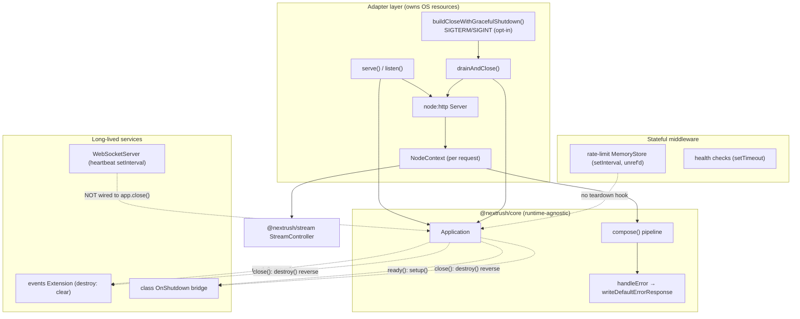

# Reliability — Framework Lifecycle & Resource-Ownership Review

| Field            | Value                                                                                                                                     |
| ---------------- | ----------------------------------------------------------------------------------------------------------------------------------------- |
| **Report type**  | `Reliability`                                                                                                                             |
| **Scope**        | `@nextrush/core`, `@nextrush/adapter-node`, `@nextrush/runtime`, `@nextrush/stream`, `@nextrush/events`, `@nextrush/websocket`, `@nextrush/class`, and `middleware/{rate-limit,health,static}` — request/response/stream lifecycle, cancellation, shutdown, resource ownership |
| **Date**         | `2026-07-22`                                                                                                                              |
| **Reviewer(s)**  | Reliability Engineering audit (distributed-systems / runtime reliability)                                                                  |
| **Commit / ref** | `6ab26e9b5b0b4c5047e89a49778ea875cc7505f2` (branch `docs/v4-rebuild`)                                                                      |
| **Status**       | `Final`                                                                                                                                    |
| **Related**      | Spawns follow-up RFC/OpenSpec work for F-01…F-04 (bounded teardown, streaming drain, WebSocket lifecycle) — not yet filed                  |

---

## Progress Tracker

**Remediation:** `[████████████████████]` 100% — 12 / 12 recommendations resolved

| Rec | Addresses     | Priority | Status |
| --- | ------------- | -------- | ------ |
| 1   | F-01          | P1       | ✅ Resolved — `waitForDrainOrDisconnect()` in `packages/adapters/node/src/context.ts`; see `openspec/changes/harden-framework-reliability` |
| 2   | F-02, F-03    | P1       | ✅ Resolved — `Application.close({ timeout })` + isolated teardown units, `docs/adr/ADR-0012` |
| 3   | F-04          | P1       | ✅ Resolved — `heartbeatTimer.unref()` + `createWebSocketExtension()` |
| 4   | F-05          | P2       | ✅ Resolved — `server.closeIdleConnections()` at drain start + `Connection: close` during drain |
| 5   | F-06          | P2       | ✅ Resolved — already covered by `docs/adr/ADR-0010` (Node 504 handler-timeout parity); `deriveDeadlineSignal()` added |
| 6   | F-07          | P2       | ✅ Resolved — `Application.onClose(hook)`; wired into `@nextrush/rate-limit`'s `MemoryStore` |
| 7   | F-08          | P2       | ✅ Resolved — `CheckFn` now receives an optional `AbortSignal`, aborted on timeout |
| 8   | F-09          | P3       | ✅ Resolved — unhandled-completion fallback always sets `Content-Type` |
| 9   | F-10          | P3       | ✅ Resolved — `RequestAbortedError` (typed) + dropped deprecated `req 'aborted'` |
| 10  | F-11          | P3       | ✅ Resolved — documented in `packages/core/README.md` and `packages/extensions/websocket/README.md` |
| 11  | F-12          | P4       | ✅ Resolved — `Application.isDraining` + logged teardown outcome |
| 12  | F-13          | P4       | ✅ Resolved — `deriveDeadlineSignal()` in `@nextrush/runtime` |

---

## 1. Executive Summary

NextRush's reliability posture is above the Express/Koa baseline and competitive with Fastify on the request hot path, but it carries a cluster of teardown and long-lived-resource defects that surface specifically in multi-week, streaming-heavy production runs — the operating profile this audit targets.

The framework gets the hard, high-frequency things right. The request pipeline's error path is genuinely closed: every throw funnels into one `handleError` that cannot re-throw into the adapter. `ready()`/`close()` are memoized and idempotent against concurrent callers. Body reading has a single-settle guard with explicit listener cleanup and premature-close rejection. The streaming core (`StreamController`) models abort, cooperative backpressure, and idempotent close/error cleanly.

The weaknesses are concentrated at three seams, all on failure/teardown paths rather than the success path — which is why prior functional/perf audits would not have caught them:

1. **The response-drain boundary.** The streaming core is correct, but the Node adapter's byte pump parks on `res.once('drain')` with no abort/close escape. A slow client that disconnects while the server is backpressured leaves the handler's promise permanently unsettled — so any `finally`/cleanup after `await ctx.sse(...)` never runs.
2. **Bounded drain, unbounded teardown.** `shutdownTimeout` guards only the socket drain; the subsequent `await app.close()` (extension `destroy()` + class `onShutdown()` hooks) has no timeout and, in the class bridge, no error isolation. One hung or throwing hook hangs the process past the budget or strands every later service's cleanup.
3. **Unowned long-lived resources.** The WebSocket heartbeat `setInterval` is neither `unref`'d nor wired into `app.close()`; after a graceful shutdown the process will not exit unless the developer manually calls `wss.close()`. Middleware more broadly has no teardown hook.

No P0 (immediate framework-wide instability out of the box) was found.

**Top findings:**
1. F-01 — Streaming backpressure + client disconnect → permanently hung handler & stranded cleanup — Priority P1.
2. F-02 — Graceful shutdown does not bound extension/service teardown → shutdown hangs past `shutdownTimeout` → orchestrator `SIGKILL` — Priority P1.
3. F-03 — Class-runtime `onShutdown` hooks run sequentially with no error isolation → one throwing hook strands all later service teardowns — Priority P1.
4. F-04 — WebSocket heartbeat interval is unowned and not `unref`'d → process will not exit after graceful shutdown — Priority P1.
5. Headline recommendation — introduce a **bounded, cancellation-aware teardown contract** (the mechanism ASP.NET Core, Spring Boot, and NestJS all standardize and NextRush lacks), and unify response streaming on the close/abort pattern the `static` package already contains.

---

## 2. System Understanding

NextRush is a layered, ESM-only, multi-runtime HTTP framework. Reliability-relevant layers, lowest to highest:

- **`@nextrush/core` — `Application`** (`packages/core/src/application.ts`): middleware registry and the extension lifecycle — `extend()` queues extensions; `ready()` → `_boot()` runs each `setup()` in registration order then mounts the app router and freezes config; `start()` flips `isRunning`; `close()` → `_shutdown()` destroys extensions in reverse order. It owns no OS/socket resources, by the framework's runtime-agnostic mandate. Both `ready()` and `close()` are memoized (`_readyPromise`, `_closePromise`) so concurrent callers share one boot/one shutdown.
- **`@nextrush/adapter-node`** (`packages/adapters/node/src/{adapter,context,body-source}.ts`): owns the `node:http` `Server`, the per-request `NodeContext`, socket timeouts, and the connection-drain shutdown (`serve` → `drainAndClose` → `buildCloseWithGracefulShutdown`).
- **`@nextrush/runtime`**: shared primitives — `combineAbortSignal` (an `AbortSignal.any` combinator built to fold a timeout into `ctx.signal`, audit F-08), timeout constants (`DEFAULT_TIMEOUT_MS = 30_000`, `DEFAULT_SHUTDOWN_TIMEOUT_MS = 30_000`, `DEFAULT_KEEP_ALIVE_TIMEOUT_MS = 5_000`), and startup-error normalization.
- **`@nextrush/stream` — `StreamController`**: the single owner of streaming lifecycle. Adapters expose it through `ctx.stream/sse/ndjson` → `ctx.sendStream()`.
- **`@nextrush/extensions/{events,websocket}`**: long-lived services. `events` is a proper Extension whose `destroy()` clears handlers. `websocket` is not an Extension.
- **`@nextrush/class`**: bridges duck-typed `OnInit`/`OnShutdown` service hooks into one internal Extension whose `setup`/`destroy` run the hooks (`packages/class/src/lifecycle/lifecycle.ts`).

Why the current design reasonably made sense: the core deliberately owns no resources (portability/edge-first mandate), so shutdown mechanics live in the Node adapter; opt-in signal wiring avoids global process side effects by default; per-request resources are intentionally lazy and GC-scoped to keep the hot path allocation-free. These are sound decisions. The reliability gaps are not in those decisions but in what the teardown and long-lived-resource paths omit.

---

## 3. Architecture Overview



The dashed edges are the reliability gaps: the WebSocket server and stateful middleware are not connected to the app lifecycle, and the `Drain → App` edge is unbounded.

---

## 4. Data Flow

```mermaid
sequenceDiagram
    autonumber
    participant OS as OS / Orchestrator
    participant Serve as serve()/drainAndClose
    participant App as Application
    participant Ext as Extensions & class onShutdown
    participant Srv as node:http Server
    participant Ctx as NodeContext
    participant Handler

    Note over Serve,App: STARTUP
    Serve->>App: await app.ready() (boot extensions, mount router)
    App-->>Serve: config frozen (assertConfigurable)
    Serve->>Srv: createServer + listen(backlog=1024)
    Serve->>App: app.start() (isRunning=true)

    Note over Srv,Handler: REQUEST (success + failure paths)
    Srv->>Ctx: createNodeContext(req,res)
    Ctx->>Handler: compose(stack)(ctx)
    alt handler throws
        Handler-->>App: rejection → handleError → default 5xx (never re-throws)
    else streaming + client disconnect while backpressured
        Handler->>Ctx: await ctx.sse(...)
        Ctx--xCtx: pump parked on res.once('drain') — never resolves (F-01)
        Note over Ctx,Handler: handler promise hangs; post-await cleanup stranded
    end

    Note over OS,Ext: SHUTDOWN
    OS->>Serve: SIGTERM (opt-in) → runClose()
    Serve->>Srv: server.close() + forceTimer(shutdownTimeout)
    Note over Srv: idle keep-alive sockets delay drain (F-05)
    Srv-->>Serve: drained (or force closeAllConnections)
    Serve->>App: await app.close()  ⟵ NO TIMEOUT (F-02)
    App->>Ext: Promise.allSettled(destroy())  (isolated across extensions)
    Ext--xExt: class onShutdown loop: await, no try/catch (F-03)
    Note over Ext: hung hook → process hang; throwing hook → later teardowns stranded
    Note over Serve: WebSocket heartbeat interval still running → process won't exit (F-04)
```

---

## 5. Backend / Logic

The request-path error contract is a genuine strength and closes cleanly:

- `compose` (`packages/core/src/middleware.ts`) converts synchronous throws and non-`Error` throws into rejected/wrapped promises on both the fast path and the general path; the shared `MULTIPLE_NEXT_MESSAGE` constant prevents the two paths from drifting; per-invocation `called`/`index` guards are declared inside the returned closure and never hoisted, so concurrent requests cannot corrupt each other.
- `Application.callback` wraps `compose` in try/catch; `handleError` tries the custom handler, then the default, and logs-and-swallows if the default itself throws (H-2), so a committed-response error can never escape into the adapter.
- `writeDefaultErrorResponse` (`packages/core/src/error-handler.ts`) yields one framework-wide error contract, never leaks internal messages for ≥500 in production, logs 5xx always / 4xx only outside production.

Correctness gaps are on the teardown/shutdown side, captured as F-02 and F-03 in §12. Lifecycle idempotency (memoized `ready()`/`close()`, reverse-order teardown, full state reset for re-boot) is correct and well-reasoned.

## 6. Database / State

_Not applicable — the framework holds no database or persistent store. In-memory state stores that are reliability-relevant (rate-limit `MemoryStore`) are covered under F-07._

## 7. Frontend / API Surface

All recommendations are additive and preserve the public API: `shutdownTimeout` already exists and would simply also bound `app.close()` (F-02); `requestTimeout` (F-06) and a middleware dispose hook (F-07) are new opt-in surfaces; converting `@nextrush/websocket` to an Extension (F-04) can be done behind the existing `createWebSocket()` factory. No breaking change is required for any P1/P2 fix.

## 8. UX

_Not applicable — the reviewed scope is non-user-facing framework runtime. Operator-facing experience (shutdown observability) is captured as F-12._

## 9. Performance

_Largely covered by existing reports (`report/core/core-hot-path-performance-review.md`, `report/adapters/node-adapter-per-request-work-trim-followup.md`); this review did not re-measure throughput._ The reliability/performance interplay worth noting: F-01 is a slow memory leak (retained hung frames), and F-05 adds avoidable shutdown latency (drain waits to `shutdownTimeout` under idle keep-alive). Both degrade a long-running process rather than per-request throughput, so they are treated as reliability findings, not perf findings.

## 10. Security

Reliability-adjacent, cross-referenced (security was a prior audit's scope): the streaming leak (F-01) and orphaned health checks (F-08) are low-grade resource-exhaustion levers under a hostile slow client. Positive: body-size limits are enforced with `Connection: close` on oversized bodies (BP-K) so an over-limit body is never drained for keep-alive — a deliberate anti-DoS choice. No new injection/authz findings surfaced within this scope.

## 11. Maintainability

The reviewed files are within the project's size ceilings and layering. One architectural maintainability gap: the framework has an Extension teardown hook but **no middleware teardown hook** (F-07), so stateful middleware authors have nowhere to put deterministic cleanup and fall back to `unref()` + GC. This is under-engineering of the lifecycle surface, not code-shape rot. The class lifecycle bridge (F-03) also diverges from the app-level isolation pattern (`Promise.allSettled`) by using a bare sequential `await` loop — an inconsistency worth reconciling so both teardown layers behave identically.

---

## 12. Findings (detailed)

### F-01 — Streaming backpressure + client disconnect → permanently hung handler & stranded cleanup · Priority P1

- **Current situation:** `NodeContext.sendStream` and the Web-`ReadableStream` branch of `NodeContext.send` (`packages/adapters/node/src/context.ts`) pump bytes with `if (!res.write(value)) { await new Promise((r) => res.once('drain', r)); }`. On client disconnect, the registered `res.on('close')` handler calls `reader.cancel()`, but the pump is parked on `res.once('drain')`, and a destroyed socket never emits `'drain'`. Nothing resolves the inner promise.
- **Impact:** the handler's promise never settles; the adapter's `handler(ctx).then(...)` never runs; any `try/finally` after `await ctx.sse(...)` (transaction rollback, releasing a pooled connection, decrementing an in-flight gauge) never executes. The stalled frame retains `res`, `reader`, the `ReadableStream`, and the `StreamController`.
- **Benefits (of today's design):** the straight-line pump is minimal and fast on the success path; the `StreamController` producer side is correctly abort-aware.
- **Drawbacks:** disconnect-while-backpressured — common with mobile/throttled SSE clients — leaks a hung frame + buffers per occurrence and strands user cleanup.
- **Long-term risk:** rising RSS and pending-promise count over days/weeks on streaming (AI/agentic) deployments; eventual GC pressure/OOM. Violates the framework's own "never rely on GC for correctness" principle.
- **Recommendation:** race the drain wait against `res 'close'`/abort and unwind via the existing `StreamAbortedError` pump-reject path (which already cancels the reader and settles `sendStream`). The correct pattern already exists in `packages/middleware/static/src/send-file.ts` `streamToResponse` (a `settled`-guarded `settle()` funneling `drain`/`error`/`end`/`close`); extract and reuse it for both pump sites.
- **Trade-offs:** a few extra listener add/remove calls per backpressure event (negligible); no API change.
- **Priority:** P1.
- **Migration difficulty:** Moderate — localized to two pump sites, but needs a soak test to prove the leak is closed.

### F-02 — Graceful shutdown does not bound extension/service teardown · Priority P1

- **Current situation:** `drainAndClose` (`packages/adapters/node/src/adapter.ts`, ~lines 218-234) bounds only the socket drain with a `setTimeout(shutdownTimeout)` force-timer, then does `await app.close()`. `Application._shutdown` runs extension `destroy()` under `Promise.allSettled` with no timeout.
- **Impact:** a single extension `destroy()` (or class `onShutdown()`, see F-03) that hangs — e.g. awaiting a DB pool drain that never resolves — hangs `app.close()`, which hangs `drainAndClose` past `shutdownTimeout`.
- **Benefits (of today's design):** `Promise.allSettled` correctly isolates extensions from each other so one failing `destroy()` doesn't strand the others; reverse-order teardown is correct.
- **Drawbacks:** the shutdown budget is only half-enforced — sockets are bounded, service teardown is not.
- **Long-term risk:** under an orchestrator (k8s `terminationGracePeriodSeconds`), a hung teardown means the process is `SIGKILL`ed: in-flight connections severed, no clean state flush — the opposite of graceful.
- **Recommendation:** thread `shutdownTimeout` (or a dedicated teardown budget) into `app.close()` and race each `destroy()` against it, reporting which extension timed out. Mirrors ASP.NET `HostOptions.ShutdownTimeout` + `CancellationToken` and Spring `timeout-per-shutdown-phase`.
- **Trade-offs:** a timed-out teardown may leak that one resource, but bounded exit beats an indefinite hang; adds one option to `Application.close`.
- **Priority:** P1.
- **Migration difficulty:** Moderate — touches core `close()` signature (additive) and the adapter call site.

### F-03 — Class-runtime `onShutdown` hooks run sequentially with no error isolation · Priority P1

- **Current situation:** `registerLifecycleExtension` (`packages/class/src/lifecycle/lifecycle.ts`, ~lines 125-131) implements the internal Extension's `destroy()` as `for (const instance of [...instances].reverse()) { if (isOnShutdown(instance)) await instance.onShutdown(); }` — no per-hook try/catch and no timeout.
- **Impact:** a single `onShutdown()` that throws aborts the loop, so every later service's `onShutdown()` is skipped (e.g. the DB connection is never closed because a cache's teardown threw first). The app-level `Promise.allSettled` isolates *extensions* from each other but not the hooks *within* this bridge — where real application services live.
- **Benefits (of today's design):** sequential reverse order gives deterministic, dependency-correct teardown ordering.
- **Drawbacks:** teardown is all-or-nothing at the first failure; also unbounded (reinforces F-02).
- **Long-term risk:** silent resource leaks (connections, file handles) on every shutdown where any one service throws — precisely when cleanup matters most.
- **Recommendation:** wrap each `onShutdown()` in try/catch, collect errors, continue; ideally race each against a per-hook timeout (shared with F-02's budget). Align with the app-level isolation guarantee.
- **Trade-offs:** none meaningful; strictly more resilient.
- **Priority:** P1.
- **Migration difficulty:** Trivial — a localized loop change plus a test.

### F-04 — WebSocket heartbeat interval is unowned and not `unref`'d · Priority P1

- **Current situation:** `createWebSocket()` (`packages/extensions/websocket/src/index.ts`) returns a plain `WebSocketServer`, not an Extension. `WebSocketServer.startHeartbeat` (`packages/extensions/websocket/src/server.ts`, ~lines 413-435) creates a `setInterval` that is neither `unref`'d nor cleared by anything the app lifecycle calls. `wss.close()` (which clears it) is manual, and `wss.upgrade()` is a no-op passthrough.
- **Impact:** after a graceful shutdown (`drainAndClose` → `app.close()`), the heartbeat interval keeps the event loop alive; the process will not exit unless the developer explicitly calls `wss.close()`.
- **Benefits (of today's design):** the factory keeps the WebSocket server decoupled from core and lets advanced users control attach/detach timing.
- **Drawbacks:** the most reliability-critical action (teardown) depends on developer memory; there is no default owner tying `wss` to `app.close()`.
- **Long-term risk:** production processes that hang on shutdown → forced `SIGKILL`; in test/serverless reuse, accumulating live intervals.
- **Recommendation:** offer the WebSocket server as (or wrap it in) a first-class Extension whose `destroy()` calls `wss.close()`, and `unref()` the heartbeat interval as defense-in-depth so a missed teardown never pins the loop.
- **Trade-offs:** keep the factory for advanced/manual use; the Extension form becomes the documented default.
- **Priority:** P1.
- **Migration difficulty:** Moderate — additive API; `unref()` is trivial.

### F-05 — Idle keep-alive connections delay drain; no reject-while-closing · Priority P2

- **Current situation:** `drainAndClose` calls `server.close()` (waits for all connections, including idle keep-alive) and force-closes only at `shutdownTimeout`. There is no `server.closeIdleConnections()`, no `Connection: close` on in-flight responses during drain, and no 503-on-closing.
- **Impact:** a client holding an idle keep-alive socket keeps the drain open until keep-alive expiry or the force-timer, so shutdown routinely takes far longer than the actual in-flight work.
- **Benefits (of today's design):** simple; the force-timer guarantees an upper bound.
- **Drawbacks:** avoidable shutdown latency; slower rolling deploys.
- **Long-term risk:** deploy windows stretch toward `shutdownTimeout` under keep-alive load; higher chance of hitting the orchestrator's grace period.
- **Recommendation:** call `server.closeIdleConnections()` immediately on drain start (and periodically), set `Connection: close` on responses completed during drain, and optionally return 503 for new requests on drained sockets (Fastify `return503OnClosing` / `forceCloseConnections`).
- **Trade-offs:** slightly more shutdown bookkeeping; strictly faster, cleaner drain.
- **Priority:** P2.
- **Migration difficulty:** Trivial — Node APIs exist (`closeIdleConnections`).

### F-06 — No server-enforced request/handler timeout wired to cooperative cancellation · Priority P2

- **Current situation:** `serve` sets `server.timeout` (socket inactivity) and `keepAliveTimeout`, but no per-request deadline aborts `ctx.signal`. `ctx.signal` (`NodeContext.signal`) fires only on client disconnect (`res 'close'`, `req 'aborted'`). The `combineAbortSignal` primitive (`packages/runtime/src/request-signal.ts`) built to fold a timeout into `ctx.signal` is unused by the Node adapter.
- **Impact:** a handler that hangs (deadlocked dependency) is not cooperatively cancelled with a clean 503/504; the only backstop is the coarse socket timeout, which measures inactivity, not handler wall-time, and tears the socket down abruptly.
- **Benefits (of today's design):** zero per-request timer allocation on the hot path.
- **Drawbacks:** stuck handlers hold a request slot and their acquired resources with no clean, observable timeout.
- **Long-term risk:** slow resource creep under dependency incidents; no clean deadline for SLOs.
- **Recommendation:** add an opt-in `requestTimeout` to `ServeOptions`; when set, combine a `setTimeout`-fed controller into `ctx.signal` via `combineAbortSignal`, and emit a 503/504 on expiry if headers aren't sent; clear the timer on completion.
- **Trade-offs:** one timer per request only when the option is enabled; matches Fastify/ASP.NET semantics.
- **Priority:** P2.
- **Migration difficulty:** Moderate — the combinator exists; needs context wiring + response emission.

### F-07 — Middleware has no teardown/dispose hook · Priority P2

- **Current situation:** stateful middleware cannot register deterministic cleanup. `rate-limit`'s `MemoryStore` (`packages/middleware/rate-limit/src/stores/memory.ts`) owns a `setInterval` and exposes `shutdown()`, but nothing in the app lifecycle calls it; it survives only because the interval is `unref`'d and the store is GC'd.
- **Impact:** stateful middleware relies on `unref()` + GC rather than deterministic disposal; new stateful middleware (connection pools, external clients) has nowhere to hook teardown.
- **Benefits (of today's design):** middleware stays a plain function — simple and composable.
- **Drawbacks:** a lifecycle gap; deterministic cleanup is impossible for the middleware layer.
- **Long-term risk:** timer/handle accumulation in hot-reload/serverless-reuse; leaked external clients on shutdown for future middleware.
- **Recommendation:** introduce an optional disposal channel — a `dispose()`/`[Symbol.asyncDispose]` on middleware objects, or a registration API — that `app.close()` invokes, so `MemoryStore.shutdown()` and equivalents run deterministically (and are covered by F-02's budget).
- **Trade-offs:** adds a small optional surface to the middleware contract; keeps plain-function middleware unaffected.
- **Priority:** P2.
- **Migration difficulty:** Moderate — additive lifecycle surface.

### F-08 — Health checks are not cancellable · Priority P2

- **Current situation:** `runCheckWithTimeout` (`packages/middleware/health/src/middleware.ts`, ~lines 34-60) races the check against a `setTimeout` and clears the timer in `finally` (good), but when the timeout wins, the in-flight `check()` keeps running — it is abandoned, not cancelled (no `AbortSignal` is passed).
- **Impact:** a hung check leaks its in-flight operation on every probe; orchestrators probe `/readyz` every few seconds, so orphaned invocations and whatever resources they hold accumulate while the dependency is down.
- **Benefits (of today's design):** the endpoint never hangs — the caller always gets a bounded 503, which is the primary requirement.
- **Drawbacks:** orphaned async work under a sustained dependency outage.
- **Long-term risk:** resource creep during exactly the incidents where the process must stay healthy enough to report readiness.
- **Recommendation:** pass an `AbortSignal` (fired at `checkTimeoutMs`) to `CheckFn` so cooperative checks can cancel their in-flight work; keep the timeout-wins-returns-false behavior.
- **Trade-offs:** `CheckFn` signature gains an optional signal (additive).
- **Priority:** P2.
- **Migration difficulty:** Trivial-to-Moderate.

### F-09 — Default request-completion path sends a bodyless response with no `Content-Type` · Priority P3

- **Current situation:** in `createHandler` (`packages/adapters/node/src/adapter.ts`), when a handler resolves without responding and status is not 404, the fulfilled path does `res.statusCode = ctx.status; res.end();` with no `Content-Type`.
- **Impact:** violates project-rules §3 ("every response sets a `Content-Type`"); a bare status with no content type on an unhandled-completion path.
- **Benefits (of today's design):** minimal fallback for a should-not-happen case.
- **Drawbacks:** minor spec inconsistency; ambiguous response for intermediaries.
- **Long-term risk:** low.
- **Recommendation:** set a `Content-Type` (or a defined empty-response contract) on this fallback branch.
- **Trade-offs:** none.
- **Priority:** P3.
- **Migration difficulty:** Trivial.

### F-10 — Deprecated `req.on('aborted')` and untyped body-close rejection · Priority P3

- **Current situation:** `NodeContext.signal` registers `req.on('aborted')` (deprecated since Node 16 in favor of `req.on('close')` + `req.destroyed`). `NodeBodySource.buffer`'s premature-close path rejects with a plain `new Error('Request stream closed before body was fully read')` rather than an `HttpError`.
- **Impact:** relies on a deprecated event; the body-close rejection surfaces as a generic 500 rather than a typed 4xx client-abort.
- **Benefits (of today's design):** functionally correct today.
- **Drawbacks:** deprecation risk; a client abort is misclassified as a server error in logs/metrics.
- **Long-term risk:** breakage on a future Node major; noisy 5xx metrics from client disconnects.
- **Recommendation:** migrate to `req.on('close')` + `req.destroyed`/`aborted` checks; reject body-close with a typed client-abort error (e.g. a 400/499-class `HttpError`).
- **Trade-offs:** none meaningful.
- **Priority:** P3.
- **Migration difficulty:** Trivial.

### F-11 — No framework guidance or guardrail for detached async work · Priority P3

- **Current situation:** the framework installs no `unhandledRejection`/`uncaughtException` handlers (correct for a runtime-agnostic core), and the `EventEmitter` and WebSocket handler paths isolate handler errors well. But fire-and-forget patterns (an un-awaited `app.events.emit(...)`, a detached WS handler promise) can still reject unhandled.
- **Impact:** an unhandled rejection in user detached work can crash the process depending on the deployment's process policy.
- **Benefits (of today's design):** no hidden global side effects — the app owns its process policy.
- **Drawbacks:** the failure mode is undocumented for users.
- **Long-term risk:** avoidable production crashes from a common user mistake.
- **Recommendation:** document the contract (detached work must be guarded) and consider an optional opt-in supervisor helper; do not install global handlers by default.
- **Trade-offs:** documentation + optional helper only.
- **Priority:** P3.
- **Migration difficulty:** Trivial (docs) / Moderate (optional helper).

### F-12 — No shutdown/lifecycle observability · Priority P4

- **Current situation:** `drainAndClose`/`app.close()` emit no lifecycle signals — no active-request gauge, no "draining" state, no drain-progress or teardown-duration logging.
- **Impact:** operators cannot see why a shutdown is slow (F-05) or which teardown hung (F-02/F-03); shutdown is a black box.
- **Benefits (of today's design):** minimal, silent core.
- **Drawbacks:** hard to diagnose shutdown incidents.
- **Long-term risk:** longer MTTR on shutdown-related incidents.
- **Recommendation:** expose lifecycle hooks/metrics (active-request count, `draining` state transition, per-extension teardown duration) via the existing logger and/or an events surface.
- **Trade-offs:** small observability surface; high operational value.
- **Priority:** P4.
- **Migration difficulty:** Moderate.

### F-13 — Per-request cancellation budget helper · Priority P4

- **Current situation:** cancellation is disconnect-only; there is no ergonomic per-request deadline helper for handler authors beyond F-06's server option.
- **Impact:** handler authors hand-roll timeouts; no standard `AbortSignal.timeout`-based budget folded into `ctx.signal`.
- **Benefits (of today's design):** minimal surface.
- **Drawbacks:** repeated ad-hoc timeout code in applications.
- **Long-term risk:** inconsistent per-operation deadlines across apps.
- **Recommendation:** once F-06 lands, expose a small helper to derive a child deadline signal from `ctx.signal` (built on the existing `combineAbortSignal`).
- **Trade-offs:** additive.
- **Priority:** P4.
- **Migration difficulty:** Trivial once F-06 exists.

---

## 13. Risks

| Risk                                                              | Likelihood | Impact | Mitigation                                                            |
| ----------------------------------------------------------------- | ---------- | ------ | --------------------------------------------------------------------- |
| Streaming leak accrues on flaky SSE/streaming clients             | High       | High   | F-01 — race drain against close/abort                                 |
| Process hangs on shutdown → `SIGKILL`, connections severed        | Medium     | High   | F-02 + F-03 — bounded, isolated, cancellation-aware teardown          |
| Process never exits after graceful shutdown (WebSocket in use)    | High (if WS used) | High | F-04 — WebSocket Extension + `unref()` heartbeat                 |
| Slow rolling deploys under keep-alive load                        | Medium     | Medium | F-05 — close idle connections on drain start                          |
| Stuck handlers hold slots/resources during dependency incidents   | Medium     | Medium | F-06 — opt-in request timeout via `combineAbortSignal`                |
| Timer/handle accumulation in hot-reload / serverless reuse        | Medium     | Medium | F-07 — middleware dispose hook                                        |

---

## 14. Recommendations (prioritised)

| # | Recommendation                                                                                              | Addresses  | Priority | Effort | Status |
| - | ----------------------------------------------------------------------------------------------------------- | ---------- | -------- | ------ | ------ |
| 1 | Race the response-drain wait against `res 'close'`/abort; reuse the `static` `streamToResponse` pattern      | F-01       | P1       | M      | ✅ Resolved |
| 2 | Bounded, cancellation-aware teardown: thread `shutdownTimeout` into `app.close()`; isolate each hook         | F-02, F-03 | P1       | M      | ✅ Resolved — `docs/adr/ADR-0012` |
| 3 | Offer WebSocket server as a self-disposing Extension; `unref()` the heartbeat interval                       | F-04       | P1       | M      | ✅ Resolved |
| 4 | `closeIdleConnections()` on drain start + `Connection: close`/503 while closing                              | F-05       | P2       | S      | ✅ Resolved |
| 5 | Handler-level request timeout wired into `ctx.signal`, returning `504` (Bun/Deno/Edge already had this — Node brought to parity, not a new opt-in) | F-06       | P2       | M      | ✅ Resolved — already covered by `docs/adr/ADR-0010`; `deriveDeadlineSignal()` added |
| 6 | Middleware disposal hook (`dispose()`/`[Symbol.asyncDispose]`) invoked by `app.close()`                      | F-07       | P2       | M      | ✅ Resolved — as `Application.onClose(hook)`, not `dispose()`/`Symbol.asyncDispose` (kept middleware-as-function; see `docs/RFC/class-runtime/022`) |
| 7 | Pass an `AbortSignal` to health `CheckFn` so hung checks are cancelled, not abandoned                        | F-08       | P2       | S      | ✅ Resolved |
| 8 | Set `Content-Type` on the default request-completion fallback                                                | F-09       | P3       | S      | ✅ Resolved |
| 9 | Replace deprecated `req.on('aborted')`; type body-close rejection as a client-abort `HttpError`              | F-10       | P3       | S      | ✅ Resolved — as `RequestAbortedError` (extends `BadRequestError`, not a bare `HttpError`) |
| 10| Document detached-async-work contract; optional opt-in supervisor (no global handlers by default)            | F-11       | P3       | S      | ✅ Resolved — docs only; no supervisor helper was built (deferred, not needed to close the finding) |
| 11| Lifecycle observability (active-request gauge, `draining` state, per-extension teardown duration)            | F-12       | P4       | M      | ✅ Resolved — `isDraining` + logged outcome; a per-unit duration gauge was not added (deferred) |
| 12| Per-request deadline helper derived from `ctx.signal` (after Rec 5)                                          | F-13       | P4       | S      | ✅ Resolved — `deriveDeadlineSignal()` |

All twelve recommendations were implemented, tested, and independently verified as part of the
`harden-framework-reliability` OpenSpec change (`openspec/changes/harden-framework-reliability/`).
See that change's `tasks.md` for the full node-by-node implementation record and evidence.

---

## 15. Migration Strategy

Ship in blast-radius order, low-risk and reversible first:

1. **F-03** (trivial, isolated loop change) and **F-09/F-10** (trivial hardening) — no API change, immediately shippable with tests.
2. **F-01** (localized to two pump sites) with a mandatory soak test proving the leak is closed.
3. **F-02** — additive `app.close({ timeout })`; the adapter passes the existing `shutdownTimeout`. Old callers keep working (timeout optional).
4. **F-04** — keep `createWebSocket()` factory; add the Extension form as the documented default; `unref()` first as a safe standalone step.
5. **F-05** — pure drain-path improvement, no API change.
6. **F-06 → F-13**, **F-07**, **F-08** — new opt-in surfaces; land behind flags/options so they never change default behavior.

Each P1/P2 item is independently revertible and gated by the validation in the finding. Durable decisions (the teardown contract in Rec 2, the WebSocket-as-Extension model in Rec 3) should be ratified as an RFC and their requirements captured as an OpenSpec change before implementation, per the repo's spec-driven workflow.

## 16. Conclusion

NextRush is close to the reliability bar it sets for itself: the request hot path, error funnel, and lifecycle idempotency are strong, and the gaps are narrow, concentrated on teardown/streaming failure paths, and fixable without breaking the public API or touching the hot path. The single most important next step is Recommendation 2 — make every `close()` path bounded and cancellation-aware — because it converts "usually shuts down" into "deterministically shuts down within budget" and resolves the two highest-impact teardown findings at once. Pair it with Recommendation 1 (streaming drain) and Recommendation 3 (WebSocket lifecycle), wire the failure-injection and soak tests into CI, and NextRush's teardown and streaming reliability will match its already-strong request-path story — making it genuinely production-durable for multi-week, streaming-heavy workloads.

---

## Checklist

- [x] Filename is scope-first and in the right `report/<domain>/` folder (not generic).
- [x] System explained (§2) BEFORE any judgement — no opening with an issue list.
- [x] The system was mapped with codebase-memory-mcp, not manual grep/glob.
- [x] Every significant finding uses all nine §12 fields and has an F-ID + priority.
- [x] Every finding cites concrete evidence (file:line / function) — no "feels".
- [x] Performance findings use measured numbers from `apps/benchmark`, not guesses. _(§9 defers to existing perf reports; no new perf claims made.)_
- [x] UX findings name the principle/law and the visible trigger (or §8 is N/A). _(§8 N/A — non-user-facing.)_
- [x] Any dark pattern flagged as a hard, non-negotiable finding. _(None found in scope.)_
- [x] Every recommendation (§14) maps to an F-ID and a real, stated problem.
- [x] Progress Tracker (top) matches §14 recommendation Status column — bar % = resolved/total.
- [x] Sections that don't apply are "Not applicable — reason", not deleted.
- [x] Spawned decisions cross-linked to their ADR/RFC/OpenSpec change (noted as not-yet-filed in front-matter + §15).
- [x] All guidance blocks (HTML comments + "> 📝" lines) deleted.
