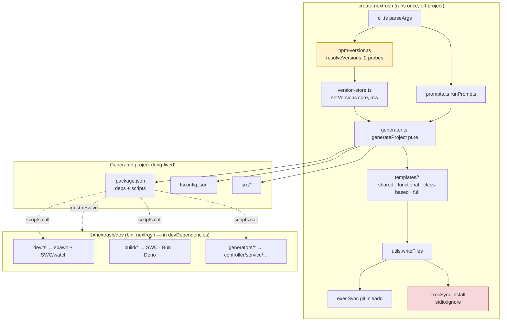

# Scaffolding — CLI & Project Generation Review

| Field           | Value                                                              |
| --------------- | ------------------------------------------------------------------ |
| **Report type** | `Architecture` |
| **Scope**       | `packages/create-nextrush` (scaffolder) + `packages/dev` (`@nextrush/dev`: dev server, build, generators) and every artifact they emit |
| **Date**        | `2026-07-22` |
| **Reviewer(s)** | `Software Engineer Agent — scaffolding/CLI audit` |
| **Commit / ref**| `6ab26e9` (branch `docs/v4-rebuild`) |
| **Status**      | `Final` |
| **Related**     | None yet — F-01 warrants an OpenSpec change (rework version resolution) and an ADR on scaffolder version policy; `.changeset/config.json` `fixed` group is the governing config |

---

## Progress Tracker

**Remediation:** `[░░░░░░░░░░░░░░░░░░░░]` 0% — 0 / 12 recommendations resolved

| Rec | Addresses | Priority | Status  |
| --- | --------- | -------- | ------- |
| 1   | F-01      | P0       | ⬜ Open  |
| 2   | F-01      | P0       | ⬜ Open  |
| 3   | F-03      | P1       | ⬜ Open  |
| 4   | F-02      | P1       | ⬜ Open  |
| 5   | F-04      | P1       | ⬜ Open  |
| 6   | F-08      | P2       | ⬜ Open  |
| 7   | F-06      | P2       | ⬜ Open  |
| 8   | F-07      | P2       | ⬜ Open  |
| 9   | F-09      | P2       | ⬜ Open  |
| 10  | F-05      | P2       | ⬜ Open  |
| 11  | F-10      | P2       | ⬜ Open  |
| 12  | F-11…F-19 | P2       | ⬜ Open  |

---

## 1. Executive Summary

The scaffolding system is architecturally clean and unusually well-tested for its size: pure, testable generator functions; a centralized SWC transform shared by the Node and Deno build paths; a decorator-metadata preflight that fails the build fast; correct cross-platform `file://` URL handling for the SWC loader; and a graceful dev-server shutdown path. The bones are good.

The system fails one test it never runs, though — whether the project it produces can be installed. The version resolver probes exactly two packages (`nextrush`, `@nextrush/cors`) and fans their versions across ~10 independently-versioned packages. The monorepo's own `.changeset/config.json` proves those packages are not version-locked: `@nextrush/dev`, `@nextrush/rate-limit`, `@nextrush/request-id`, `@nextrush/adapter-bun`, and `@nextrush/adapter-deno` sit on the `1.x` line while the probes report `^3.1.0`. Every generated project pins `@nextrush/dev: ^3.1.0` in `devDependencies`, which cannot resolve against a `1.0.0` package — so `npm install` fails for every generated project, on every style, on every runtime. Because the installer runs with `stdio: 'ignore'`, the developer sees only `Dependency installation failed. Run install manually.` with no diagnostic output.

Overall health: **strong design, blocked by a broken version-management layer.** F-01 is a release blocker; until it is fixed the scaffolder cannot deliver a project that installs.

**Top findings:**
1. **F-01 — Version resolver fans two probes across independently-versioned packages → generated `package.json` pins unresolvable ranges (`@nextrush/dev: ^3.1.0` vs actual `1.0.0`).** Priority **P0**.
2. **F-02 — Deno + class-based/full: dev script bypasses the CLI, no `deno.json`, decorator metadata never emitted → DI silently fails.** Priority **P1**.
3. **F-03 — Install/git run with `stdio: 'ignore'` → the root cause of any failure is hidden from the developer.** Priority **P1**.
4. **F-04 — Bun build passes no decorator options to `Bun.build`; the preflight passes anyway → false confidence, possible silent DI break in production.** Priority **P1**.
5. **F-06…F-10 — Missing production defaults (`engines`, `packageManager`), missing `isolatedModules` for an SWC toolchain, drifted/hardcoded toolchain versions, hardcoded registry, and README ↔ generated-project doc drift.** Priority **P2**.

---

## 2. System Understanding

There are **two** distinct CLIs, and the split is the key to the whole system.

- **`create-nextrush`** — the *scaffolder*. Runs once, off-project (`npm create nextrush`). It parses args, resolves framework versions from the registry, runs interactive prompts, generates a file map, writes it, and optionally installs dependencies + initializes git. Its only runtime dependency is `@clack/prompts`. After the project exists, `create-nextrush` never runs again.
- **`@nextrush/dev`** (bin: `nextrush`) — the *project's* dev toolchain, installed into the generated project's `devDependencies`. It owns `nextrush dev`, `nextrush build`, `nextrush generate`, and `nextrush codemod`. It is what the generated `package.json` scripts invoke.

The **generated project is the contract** between the two: `create-nextrush` writes scripts that call `nextrush …`, so `@nextrush/dev` must be installable and version-compatible for the scaffolded project to work. Understanding this contract is what makes F-01's severity clear — it is a break in exactly this contract.

Why the current version design likely made sense: `create-nextrush/src/npm-version.ts` deliberately avoids hardcoding framework versions in templates (a genuinely good instinct — most scaffolders hardcode and go stale). At some earlier point the framework packages plausibly shared a single version, so probing `nextrush` + `@nextrush/cors` and reusing those two ranges was a reasonable shortcut. `packages/create-nextrush/tsup.config.ts` still carries a comment asserting a "*fixed changeset group: nextrush, @nextrush/types, @nextrush/dev*" — evidence the author intended a locked relationship. Changesets later moved newer packages (`dev`, most middleware, the non-Node adapters) onto an independent `1.x` line, and the two-probe heuristic silently went stale.

The build side is well-reasoned: Node dev uses `@swc-node/register` (reads the project `tsconfig` for decorator flags); Node/Deno builds use `@swc/core` with an explicit, centralized transform (`buildSwcTransformOptions`) so the two paths cannot drift; and `nextrush build` runs a decorator-metadata preflight that fails fast when a class-based project's `tsconfig` is misconfigured. These are the parts to preserve through the fixes.

---

## 3. Architecture Overview



The yellow node (`resolveVersions`, two probes) feeding the generated `package.json` is the root of F-01; the red node (`execSync … stdio:ignore`) is F-03. The dotted "must resolve" edge from `package.json` to `@nextrush/dev` is the broken contract.

Layering is consistent with `architecture.instructions.md`: `create-nextrush` sits above the meta package; `@nextrush/dev` is a devtool the generated project consumes. Neither imports framework internals directly.

---

## 4. Data Flow

```mermaid
sequenceDiagram
    actor Dev as Developer
    participant PM as Package manager
    participant CLI as create-nextrush (main)
    participant NPM as registry.npmjs.org
    participant Gen as generator.ts (pure)
    participant FS as Target directory

    Dev->>PM: npm create nextrush my-api
    PM->>CLI: exec bin/create-nextrush.js
    CLI->>CLI: parseArgs(argv)
    CLI->>NPM: GET /nextrush/latest + /@nextrush/cors/latest (5s timeout)
    NPM-->>CLI: {version} | timeout → build-time fallback
    Note over CLI: setVersions(core, mw) — ONLY 2 probes for ~10 packages
    CLI->>Dev: prompts: dir, style, runtime, middleware, install?, git?
    Dev-->>CLI: answers
    CLI->>Gen: generateProject(options)
    Gen-->>CLI: FileMap (tsconfig, package.json, src/*)
    CLI->>FS: writeFiles() — mkdir -p + write
    opt git = true
        CLI->>FS: git init && git add -A  (no commit)
    end
    opt install = true
        CLI->>PM: execSync(install, stdio:'ignore')
        PM->>NPM: resolve deps incl. @nextrush/dev ^3.1.0
        NPM-->>PM: no match (dev is 1.0.0)  ← F-01
        PM-->>CLI: non-zero exit (output swallowed)  ← F-03
        CLI->>Dev: "Dependency installation failed. Run install manually."
    end
    CLI->>Dev: Next steps → cd my-api; nextrush dev
```

### Version fan-out (the mechanism behind F-01)

`resolveVersions()` (`npm-version.ts`) returns `{ core: '^'+nextrushVer, mw: '^'+corsVer }`. `templates/shared.ts::getDependencies` and `constants.ts` then apply those two ranges across every emitted dependency:

| Generated dependency | Range | Probe source | Actual workspace version | Resolves? |
|----------------------|-------|--------------|--------------------------|-----------|
| `nextrush` | `core` | `nextrush` | 3.1.0 | ✅ |
| `@nextrush/types` (dev) | `core` | `nextrush` | 3.1.0 (in `fixed` group) | ✅ |
| **`@nextrush/dev` (dev)** | **`core`** | `nextrush` | **1.0.0** | ❌ |
| `@nextrush/cors` · `body-parser` · `helmet` · `compression` | `mw` | `@nextrush/cors` | 3.1.0 | ✅ today, fragile |
| **`@nextrush/rate-limit`** (full) | **`mw`** | `@nextrush/cors` | **1.0.0** | ❌ |
| **`@nextrush/request-id`** (full) | **`mw`** | `@nextrush/cors` | **1.0.0** | ❌ |
| **`@nextrush/adapter-bun`** (bun) | **`mw`** | `@nextrush/cors` | **1.0.0** | ❌ |
| **`@nextrush/adapter-deno`** (deno) | **`mw`** | `@nextrush/cors` | **1.0.0** | ❌ |

`.changeset/config.json` `fixed` group = `[@nextrush/types, errors, core, router, runtime, stream, di, adapter-node, nextrush]`. `@nextrush/dev`, all middleware, and the bun/deno adapters are absent — independently versioned by design. `@nextrush/types` resolves only because it *is* in the fixed group.

---

## 5. Backend / Logic

The scaffolder's logic is correct and pure except in the version and process-execution layers. Significant findings **F-01** (version fan-out), **F-02** (Deno dev DI), **F-03** (swallowed process output), and **F-04** (Bun build metadata) are detailed in §12; each is grounded in a specific file.

Minor logic observations:
- **Controller-discovery glob (F-11).** class-based/full templates call `registerControllers` with `include: ['**/*.ts']` over `./src`, which imports non-controller files (`routes/health.ts`, `services/*.ts`) and the entry `index.ts` itself. Benign today (module cache prevents re-execution; non-controllers are filtered by decorator metadata), but broad and fragile.
- **`loadConfig` for `.ts` config is silently best-effort.** `utils/config.ts::loadConfig` dynamically imports `nextrush.config.ts`; on Node without the SWC loader active in the parent process, that import throws and is caught → `{}` returned. Generated projects don't emit a `nextrush.config.ts`, so this doesn't affect scaffold output, but a user-authored TS config can be silently ignored. Documented-but-deferred.
- **Positive:** `generateProject` and all `templates/*` functions are I/O-free; `writeFiles` is the only side effect — exactly the testable shape the engineering standards ask for, and what makes F-01's fix straightforward to unit-test.

---

## 6. Database / State

_Not applicable — the scaffolder and dev CLI hold no persistent data store. The only durable state is the build cache (`node_modules/.cache/nextrush/build-cache.json`), which is correctly located outside `outDir` so `--clean` and `--cache` stay orthogonal (`swc-builder.ts`)._

---

## 7. Frontend / API Surface

The scaffolder's "API surface" is its CLI flags, its prompts, and — most importantly — the **generated `package.json` / `tsconfig.json`**, which are the long-lived contract every generated project inherits. Findings here:

- **F-06 — generated `tsconfig` omits `isolatedModules`/`verbatimModuleSyntax`** despite a per-file SWC toolchain (see §12).
- **F-07 — `typescript`/`@types/node` hardcoded and drifted** from the scaffolder's own deps; `@types/node ^26` is ahead of the `engines >=22` floor (see §12).
- **F-08 — generated `package.json` lacks `engines` and `packageManager`** (see §12).
- **F-09 — registry endpoint hardcoded**, ignoring `.npmrc`/private registries (see §12).
- **F-10 — README ↔ generated-project doc drift** (`not-found.ts`, wrong `full` structure) (see §12).
- **CLI flag surface is otherwise clean:** `cli.ts::parseArgs` validates enum values (`--style`/`--runtime`/`--middleware`/`--pm`) against the constant lists and ignores invalid values; `--help`/`--version` short-circuit before any network call. `--flag=value` and space-separated forms are both handled by `@nextrush/dev`'s command parsers.
- **Inconsistent app construction across templates (F-19):** functional uses `createApp()` + a separately-created router mounted at `/`; class-based/full use `createApp({ router })`. Harmless, but two idioms for one concept in sibling templates dilutes the "one obvious way" teaching goal.

---

## 8. UX

Evaluated from a first-time developer's perspective; findings grounded in named laws.

- **Doherty Threshold (F-18, Low).** `resolveVersions()` fires two network calls (each up to a 5s `AbortSignal.timeout`) before prompts even render — and it runs even for `--no-install` offline scaffolds, where the resolved versions are only ever displayed. The visible trigger: a stall on `Checking latest versions…` with no payoff. Skip/shorten the probe when nothing will be installed.
- **Feedback / error visibility (F-03, restated from a UX lens).** The single worst UX moment: install fails (always, today, per F-01) and the developer sees `Dependency installation failed. Run install manually.` with no registry error. This violates the "errors teach" bar (AGENTS.md §12) — the user cannot self-serve a fix from what they're shown.
- **Peak-End Rule (F-14, Low).** The final line is `Happy coding with Nextrush!` — lowercase-`r`, off from the canonical `NextRush` brand (steering terminology). The last thing the user reads is a misspelling of the product.
- **Goal-gradient / first-successful-request (F-15, Low).** Next-steps list `cd`/`dev` but never say *where to send a request* (`/health`; `/api/health` for class-based; `/api/hello` for full). A one-line "then open http://localhost:8080/health" closes the onboarding loop.
- **Jakob's Law (F-05, Medium).** Peers (`create-next-app`, `create-vite`) hard-check the Node version first and print a clear message. This CLI does not, so a developer on Node 18/20 gets a project that fails later with a cryptic error, against expectation set by every other scaffolder.
- **Prompt-flow quirk (F-13, Low).** Passing the affirmative `--install`/`-i` (already the default `true`) still shows the confirm prompt; only `--no-install`/`--no-git` skip it. Explicitly affirming should also skip the question.
- No dark patterns observed.

---

## 9. Performance

_Runtime/HTTP performance is out of scope (excluded by the audit brief), and no `apps/benchmark` numbers apply to scaffold-time behavior, so measured runtime figures are Not applicable here._ Scaffold-time observations only:

- **Version probe latency (F-18):** worst case ~5s of dead wait when offline (the two probes run in parallel, so the ceiling is one 5s timeout, not two). No measured baseline exists because the path isn't benchmarked; recommend not benchmarking runtime but simply gating the probe on `install`.
- **Build concurrency (positive):** `swc-builder.ts` scales transform concurrency to `os.availableParallelism()` capped at 8, with a content-hash incremental cache — a sound design; no numbers required for this review.

---

## 10. Security

The scaffolder's security posture is sound, with one over-permission to flag:

- **No shell-injection surface.** Install/git commands (`index.ts`) are fixed strings, not interpolated from user input; the target directory is passed to `node:path` `resolve()`/`writeFiles` as a value, never concatenated into a shell string. `execSync('npm install', { cwd })` and `git init`/`git add -A` carry no user-controlled tokens.
- **Package-name validation.** `utils.ts::validateProjectName` enforces `PACKAGE_NAME_REGEX`; `toPackageName` sanitizes directory-derived names. No prototype-pollution or path-escape vector in name handling.
- **F-02 sub-issue — over-permissioned Deno scripts.** The generated Deno `build` script is `deno run -A npm:@nextrush/dev@latest build` — `-A` grants *all* permissions for a build step, inconsistent with the CLI's own Deno path, which deliberately grants a minimal `--allow-net --allow-read --allow-env` set and validates any extra permission (`spawn.ts::validateDenoPermissions`). Least-privilege is violated only in the generated script, not the CLI. Folded into F-02.
- **Git ordering (safe):** `git init && git add -A` runs *before* install, so `node_modules` isn't staged even before `.gitignore` takes effect. Good ordering.

---

## 11. Maintainability

Against `code-structure.md` and the package caps in `architecture.instructions.md`:

- **File shape is healthy.** Largest scaffolder source files are `templates/shared.ts` (~215 LOC) and `prompts.ts` (~180 LOC); `@nextrush/dev` split `commands/build.ts` into a `build/` subfolder (swc/bun/deno builders, cache, concurrency, atomic-write) and extracted `dev-helpers.ts` explicitly to stay under the ceiling. No god files.
- **Generation logic is DRY and testable.** Middleware imports/setup, adapter packages, and runtime entrypoints are single-sourced in `constants.ts`/`shared.ts` and composed by the three style templates — minimal duplication.
- **Test coverage gap that let F-01 ship (significant).** `create-nextrush/src/__tests__/generator.test.ts` calls `setVersions('^3.0.5','^3.0.5')` and asserts only on generated *structure* and core-dep presence — it never resolves a generated range against a real published version, and there is no generate-then-`install` smoke test in CI. The suite is disciplined but tests the wrong invariant; the one that matters ("does the generated project install?") has no verifier. This is the maintainability root cause of F-01 (see Rec 2).
- **Generated projects carry no test/lint scaffolding (F-16, Low).** No `test` script, test runner, ESLint/Prettier, `.editorconfig`, or `.nvmrc`. For a framework whose constitution is TDD-first and "ESLint clean," generating zero test scaffolding is a philosophical inconsistency; at minimum a `test` script + one example test would teach the framework's own standard.
- **Library-shaped app tsconfig (F-17, Low).** `declaration: true`/`declarationMap: true` for a `private: true` app, and `nextrush build` defaults `dts` on — emitting `.d.ts` for an app that never publishes types is wasted build work.

---

## 12. Findings (detailed)

### F-01 — Version resolver fans two probes across independently-versioned packages · Priority `P0`

- **Current situation:** `npm-version.ts::resolveVersions` probes only `nextrush` and `@nextrush/cors`; `templates/shared.ts::getDependencies` assigns the `core` range to `nextrush`, `@nextrush/types`, and `@nextrush/dev`, and `constants.ts` assigns the `mw` range to every middleware package and the bun/deno adapters. Verified workspace versions: core group `3.1.0`; `@nextrush/dev`, `@nextrush/rate-limit`, `@nextrush/request-id`, `@nextrush/adapter-bun`, `@nextrush/adapter-deno` all `1.0.0`. `.changeset/config.json` `fixed` group excludes all of these; `packages/create-nextrush/tsup.config.ts` falsely comments that `@nextrush/dev` is in that group.
- **Impact:** Every generated project pins `@nextrush/dev: ^3.1.0` in `devDependencies` → `install` fails (`No matching version found`) for all styles and runtimes. The `full` preset adds `rate-limit`/`request-id` failures; `bun`/`deno` add adapter failures. The scaffolder's core promise ("install, build, start") fails at step one.
- **Benefits (of today's design):** Templates carry no hardcoded framework versions; a single registry probe keeps the common (all-3.x) case current without a template edit — a better instinct than hardcoding.
- **Drawbacks:** The two-probe proxy is only valid while every package shares the probed version. It is invalid now, and even the four middleware packages that resolve today are fragile: they aren't fixed to `cors`, so the next independent bump re-breaks the shared `mw` range.
- **Long-term risk:** As packages version independently (the documented model), the proxy breaks more combinations over time, silently, with each release — and the failure only surfaces at a user's `install`, never in the framework's own CI.
- **Recommendation:** Resolve every dependency the chosen `{style, runtime, middleware}` will emit, per package, from its own `/{pkg}/latest`, in parallel; fall back to a build-time-injected per-package version *map* (read from each workspace `package.json` in `tsup.config.ts`), not two scalars. (Verifier in Rec 2.)
- **Trade-offs:** More network calls at scaffold time (bounded by one `Promise.all` + shared 5s budget) and slightly more build machinery than two `define`s — but it is the only design consistent with independent versioning.
- **Priority:** P0 — release blocker.
- **Migration difficulty:** Moderate — localized to `npm-version.ts`, `version-store.ts`, `constants.ts`, `templates/shared.ts`, `tsup.config.ts`.

### F-02 — Deno + class-based/full generates a project whose DI cannot work in dev · Priority `P1`

- **Current situation:** `templates/shared.ts::getRuntimeScripts` emits, for `deno`, `dev: deno run --watch --allow-net --allow-read --allow-env --unstable-sloppy-imports src/index.ts` — a raw Deno invocation that bypasses `nextrush dev`. No `deno.json` is generated. Deno emits `emitDecoratorMetadata` only when configured via `deno.json`; run this way, metadata is never emitted, and class-based/full depend on it for constructor DI.
- **Impact:** A `deno` + `class-based`/`full` project starts but DI resolution fails at runtime (missing `design:paramtypes`) — a framework-internal error for a user who chose two supported menu options. Secondary: `build: deno run -A npm:@nextrush/dev@latest build` uses `@latest` (contradicts pinning, re-downloads) and `-A` (over-permissioned vs the CLI's minimal Deno set). `--unstable-sloppy-imports` also warns on modern Deno.
- **Benefits (of today's design):** Running Deno directly avoids requiring the CLI process on Deno and keeps the dev command "native."
- **Drawbacks:** Skips the metadata handling and decorator preflight that `nextrush dev` provides; produces a non-working DI graph for a documented combination.
- **Long-term risk:** Deno users conclude class-based NextRush "doesn't work on Deno," eroding the multi-runtime claim (`AGENTS.md §7`).
- **Recommendation:** Route Deno dev through `nextrush dev` (it already has a correct Deno spawn path) *or* generate a `deno.json` with the decorator compiler options + `nodeModulesDir`, and drop `@latest`/`-A`. Prefer routing through the CLI — one dev entry point across runtimes. Add a cross-runtime smoke test (boot deno+class-based, hit `/api/health`, assert a DI-resolved field).
- **Trade-offs:** Routing via the CLI means Deno users run `nextrush` (already Deno-aware); a `deno.json` adds one file but makes the story honest.
- **Priority:** P1 — a documented, selectable combination is broken.
- **Migration difficulty:** Moderate.

### F-03 — Install and git run with output fully suppressed · Priority `P1`

- **Current situation:** `index.ts` runs `execSync(cmd, { cwd, stdio: 'ignore' })` for `git init`/`git add -A` and dependency install, catching failure with a generic message.
- **Impact:** When install fails — always, today, per F-01 — the developer gets no registry error, no unresolvable-version message, nothing actionable. It turns a fixable "wrong range" into an opaque wall and also masks slow networks, private-registry auth errors, and permission problems.
- **Benefits (of today's design):** `stdio: 'ignore'` keeps the clack spinner UI clean on the success path.
- **Drawbacks:** Zero diagnosability on the one path that matters most for a first-run tool — the failure path.
- **Long-term risk:** Support burden and abandonment: users can't self-serve, and every install failure looks identical regardless of cause.
- **Recommendation:** Keep output hidden on success, but on non-zero exit surface captured stderr (`stdio: ['ignore','pipe','pipe']`, buffer, print the tail) plus the exact manual retry command. Prefer `execFileSync`/`spawn` with an argument array over a shell string.
- **Trade-offs:** Marginally more failure-path code; negligible cost.
- **Priority:** P1 — the difference between a self-served fix and an abandoned tool.
- **Migration difficulty:** Trivial.

### F-04 — Bun build emits no explicit decorator config; preflight gives false confidence · Priority `P1`

- **Current situation:** `commands/build/bun-builder.ts::buildWithBun` calls `Bun.build({ entrypoints, outdir, target:'bun', sourcemap, minify })` with no decorator/metadata options, relying on Bun reading `tsconfig`. `nextrush build` runs `validateDecoratorConfig({ throwOnMismatch: true })`, which passes when the tsconfig has both decorator flags (it does for class-based/full). The Node and Deno paths pass `legacyDecorator: true, decoratorMetadata` explicitly (`swc-transform-options.ts`); the Bun path passes nothing.
- **Impact:** The preflight reports the toolchain is correctly configured, then hands off to a bundler whose `emitDecoratorMetadata` support is version-dependent and unasserted. If the installed Bun doesn't emit metadata via `Bun.build`, DI breaks in the *production build* while the preflight said all was well — a silent, post-validation failure.
- **Benefits (of today's design):** Bun's runtime does support decorators natively (`getRuntimeInfo().needsSwc = false`), so trusting Bun for the *runtime* is reasonable.
- **Drawbacks:** `Bun.build` (the bundler) is a separate surface from Bun's runtime; the preflight vouches for a path it does not control.
- **Long-term risk:** Version-sensitive, hard-to-reproduce DI failures in Bun production builds that contradict a green preflight.
- **Recommendation:** Assert Bun metadata emission with a build-time conformance check (compile a decorated class, grep output for `Reflect.metadata`/`__metadata`; fail fast if absent on the detected Bun), or route Bun's class-based output through the shared SWC transform. At minimum, the preflight must not claim success for a path it can't verify.
- **Trade-offs:** A metadata assertion adds a few ms to the Bun build — cheap insurance.
- **Priority:** P1.
- **Migration difficulty:** Moderate.

### F-05 — No Node.js version preflight in the CLI · Priority `P2`

- **Current situation:** `create-nextrush` declares `engines.node >=22` but never checks `process.versions.node` at startup; `engines` is advisory for npm.
- **Impact:** A developer on Node 18/20 can scaffold, then get a project that fails to run, with no early, friendly explanation.
- **Benefits (of today's design):** Fewer startup branches.
- **Drawbacks:** Fails the Jakob's-Law expectation set by peer scaffolders that hard-check the engine first.
- **Long-term risk:** Recurring "it doesn't work" reports from unsupported Node versions.
- **Recommendation:** At `main()` entry, compare `process.versions.node` to a `MIN_NODE` constant; print an actionable message and exit non-zero if below.
- **Trade-offs:** None material.
- **Priority:** P2.
- **Migration difficulty:** Trivial.

### F-06 — Generated tsconfig omits `isolatedModules`/`verbatimModuleSyntax` for an SWC toolchain · Priority `P2`

- **Current situation:** `templates/shared.ts::generateTsconfig` emits `target ES2022`, `NodeNext`, `strict`, decorator flags when needed — but not `isolatedModules` or `verbatimModuleSyntax`. Both `nextrush dev` (`@swc-node/register`) and `nextrush build` (SWC) transpile file-by-file with no cross-file type view.
- **Impact:** SWC can't tell whether a re-export is a type; a user writing `export { SomeType }` (not `export type`) or a `const enum` gets code `tsc` accepts but SWC mistranspiles — the exact class `isolatedModules` is designed to catch. The framework's own `typescript.instructions.md` mandates `verbatimModuleSyntax: true`, so generated projects are held to a weaker bar than the framework generating them.
- **Benefits (of today's design):** A looser tsconfig is friendlier to beginners (fewer `import type` errors).
- **Drawbacks:** Silent mistranspilation risk on an SWC toolchain.
- **Long-term risk:** Hard-to-diagnose runtime import errors that type-check clean.
- **Recommendation:** Add `"isolatedModules": true` (minimum) or `"verbatimModuleSyntax": true`, matching the framework standard.
- **Trade-offs:** `verbatimModuleSyntax` is stricter and may surprise beginners — but that is the correct lesson for ESM+SWC.
- **Priority:** P2.
- **Migration difficulty:** Trivial.

### F-07 — Toolchain versions hardcoded, drifted, and ahead of the engine floor · Priority `P2`

- **Current situation:** `getDependencies` hardcodes `typescript: '^6.0.2'` and `@types/node: '^26.0.0'` while nextrush deps are dynamically resolved. The scaffolder's own `package.json` uses `typescript: ^6.0.3` / `@types/node: ^25.9.5`; `@types/node ^26` is a major ahead of the Node 22 floor.
- **Impact:** Generated toolchain versions drift from what the framework validates against, and `@types/node ^26` implies Node 26 typings on a project declared for Node 22. Being hardcoded, they go stale silently (unlike the dynamic nextrush deps).
- **Benefits (of today's design):** Simpler than resolving toolchain versions at runtime.
- **Drawbacks:** Two independent inconsistencies that only grow with time.
- **Long-term risk:** Type surface referencing APIs the target runtime lacks; divergence from the framework's tested toolchain.
- **Recommendation:** Resolve `typescript`/`@types/node` the same way as nextrush deps (registry `latest` + build-time fallback), align `@types/node`'s major with the Node floor, and single-source with the scaffolder's own devDeps.
- **Trade-offs:** Two more probes; align with F-01's per-package resolver.
- **Priority:** P2.
- **Migration difficulty:** Trivial–Moderate.

### F-08 — Generated `package.json` lacks `engines` and `packageManager` · Priority `P2`

- **Current situation:** The generated `package.json` sets `name/version/private/type/scripts/dependencies/devDependencies` only.
- **Impact:** The app inherits none of the Node ≥22 requirement (no signal to collaborators on older Node), and without `packageManager` a team can silently mix lockfiles. Both are standard production-ready-default fields.
- **Benefits (of today's design):** Leaner manifest.
- **Drawbacks:** Missing guardrails the scaffolder already has the data to emit.
- **Long-term risk:** Environment-drift bugs on teams.
- **Recommendation:** Emit `engines: { node: '>=22.0.0' }` (single-sourced with the framework floor) and `packageManager` from the detected/selected PM.
- **Trade-offs:** `packageManager`+Corepack can trip users without Corepack enabled — emit it only for an explicitly detected non-npm PM, or document it.
- **Priority:** P2.
- **Migration difficulty:** Trivial.

### F-09 — Registry endpoint hardcoded; private registries ignored · Priority `P2`

- **Current situation:** `npm-version.ts` hardcodes `https://registry.npmjs.org` and reads no `npm_config_registry`/`.npmrc`.
- **Impact:** Behind a proxy or private mirror, the probe silently fails and falls back to build-time versions (the broken ones, per F-01); the subsequent `install` runs against the user's real registry, so the tool's version view and install's view can diverge.
- **Benefits (of today's design):** One less config read.
- **Drawbacks:** The "always latest" promise silently no-ops in enterprise environments.
- **Long-term risk:** F-01's eventual fix won't work in the environments that most need reliable resolution.
- **Recommendation:** Read `process.env.npm_config_registry` (set by npm/pnpm/yarn under `npm create`) before defaulting to npmjs.
- **Trade-offs:** None material.
- **Priority:** P2.
- **Migration difficulty:** Trivial.

### F-10 — README ↔ generated-project documentation drift · Priority `P2`

- **Current situation:** (1) `create-nextrush/README.md`'s `full` structure lists `src/middleware/not-found.ts`, but `templates/full.ts::generateFull` emits only `error-handler.ts`. (2) `templates/shared.ts::generateReadme` branches structure only on `functional` vs. else, so a `full` project's README shows `controllers/health.controller.ts` while `full` actually emits `hello.controller.ts` + `routes/health.ts` + `services/hello.service.ts` + `middleware/error-handler.ts`.
- **Impact:** The first document a new developer reads describes files that don't exist and a structure that isn't theirs — against "outdated documentation is a bug" (`AGENTS.md §13/§17`).
- **Benefits (of today's design):** None — this is drift, not a choice.
- **Drawbacks:** Erodes trust at minute one.
- **Long-term risk:** Compounding drift as templates evolve.
- **Recommendation:** Either generate `not-found.ts` (and register it) or remove it from the README; make `generateReadme`'s structure block style-accurate — ideally derive it from the emitted `FileMap` so this class of drift is structurally impossible.
- **Trade-offs:** Deriving from the FileMap is marginally more code but removes the drift permanently.
- **Priority:** P2.
- **Migration difficulty:** Trivial.

### F-11…F-19 — Minor findings (Low) · Priority `P2`

These are polish/consistency items below the "significant finding" bar, listed with stable IDs for tracking rather than full nine-field blocks.

| ID | Finding | Evidence | Suggested action |
|----|---------|----------|------------------|
| F-11 | Controller-discovery glob `**/*.ts` imports non-controllers and the entry file | `templates/class-based.ts`, `full.ts` | Scope to `controllers/**/*.ts` |
| F-12 | `git init && git add -A` with no initial commit → staged-but-uncommitted repo | `index.ts` | Add an initial commit |
| F-13 | Affirmative `--install`/`--git` still prompt; only negatives skip | `prompts.ts` | Skip prompt when flag explicitly set |
| F-14 | Outro branding `Nextrush` vs canonical `NextRush` | `index.ts` `p.outro(...)` | Fix casing |
| F-15 | Next steps omit the reachable URL to test | `index.ts` next-steps | Add `open http://localhost:8080/health` |
| F-16 | No test/lint/`.editorconfig`/`.nvmrc` scaffolding despite TDD-first constitution | generated file set | Emit a `test` script + one example test |
| F-17 | Library-shaped app tsconfig (`declaration`/`declarationMap`); `build --dts` default on for an app | `generateTsconfig`, `build/config.ts` | Default `dts` off for apps |
| F-18 | Version probe always runs (up to 5s) even for `--no-install` offline | `index.ts`, `npm-version.ts` | Gate probe on `install` |
| F-19 | Inconsistent app construction across templates | `functional.ts` vs `class-based.ts`/`full.ts` | Unify the idiom |

---

## 13. Risks

| Risk | Likelihood | Impact | Mitigation |
| ---- | ---------- | ------ | ---------- |
| Every published scaffold produces a non-installable project (F-01) | High (current state) | High | Rec 1 + Rec 2 before next `create-nextrush` publish |
| Version drift recurs after a point-fix because no verifier exists | High | High | Rec 2: generate-then-install CI matrix (the missing verifier) |
| Multi-runtime credibility damaged by broken Deno/Bun DI (F-02/F-04) | Medium | Medium | Rec 4/5 + cross-runtime smoke tests |
| Enterprise users silently get stale/broken versions behind a private registry (F-09) | Medium | Medium | Rec 9 (honor `npm_config_registry`) alongside Rec 1 |
| First-run failures are undiagnosable, driving abandonment (F-03) | High (paired with F-01) | Medium | Rec 3 (surface failure output) |

---

## 14. Recommendations (prioritised)

| # | Recommendation | Addresses | Priority | Effort | Status |
| - | -------------- | --------- | -------- | ------ | ------ |
| 1 | Resolve every emitted dependency per package (parallel `/{pkg}/latest`) with a build-time per-package fallback *map*; stop proxying via `nextrush`+`cors` | F-01 | P0 | M | ⬜ Open |
| 2 | Add a CI gate that scaffolds each `style × runtime × middleware` cell and runs a real (or `--dry-run`) install against publish versions — the missing verifier | F-01 | P0 | M | ⬜ Open |
| 3 | Surface install/git failure output (capture stderr, print tail + manual retry command) | F-03 | P1 | S | ⬜ Open |
| 4 | Fix the Deno dev/build path: route dev through `nextrush dev` or generate `deno.json`; drop `@latest`/`-A` | F-02 | P1 | M | ⬜ Open |
| 5 | Assert or perform Bun decorator-metadata emission; don't let the preflight vouch for `Bun.build` unverified | F-04 | P1 | M | ⬜ Open |
| 6 | Emit `engines` + `packageManager` in generated `package.json` | F-08 | P2 | S | ⬜ Open |
| 7 | Add `isolatedModules`/`verbatimModuleSyntax` to the generated tsconfig | F-06 | P2 | S | ⬜ Open |
| 8 | Resolve + single-source + engine-align `typescript`/`@types/node` | F-07 | P2 | S | ⬜ Open |
| 9 | Honor `npm_config_registry`/`.npmrc` in the version probe | F-09 | P2 | S | ⬜ Open |
| 10 | Add a Node.js version preflight to the CLI | F-05 | P2 | S | ⬜ Open |
| 11 | Kill README ↔ generated-project drift (derive structure from the FileMap) | F-10 | P2 | S | ⬜ Open |
| 12 | Polish batch: controller glob, initial commit, prompt skips, branding, "try this URL", test scaffolding, app tsconfig, probe gating, template idiom | F-11…F-19 | P2 | M | ⬜ Open |

---

## 15. Migration Strategy

Ordered, low-risk path (each step ships independently and is revertible):

1. **Unblock installs first (Rec 3 → Rec 1 → Rec 2).** Ship Rec 3 immediately so any failure is diagnosable even before the version fix lands. Then land Rec 1 (per-package resolution) behind the existing pure-function boundary — `generateProject` is I/O-free, so the change is unit-testable in isolation. Gate the whole thing on Rec 2 (generate-then-install CI) so a green pipeline now *means* "installs," permanently.
2. **Restore multi-runtime credibility (Rec 4, Rec 5)** with accompanying cross-runtime smoke tests; these are independent of the version fix.
3. **Production-default hygiene (Rec 6–11)** in any order; all are additive to the generated output and low-risk.
4. **Polish batch (Rec 12)** last, as capacity allows; F-14/F-15 are near-zero-cost first-impression wins worth pulling forward.

A durable decision on scaffolder version policy (per-package resolution + fallback map) should be recorded as an ADR, and the implementation tracked as an OpenSpec change, before this review is considered closed.

---

## 16. Conclusion

NextRush's scaffolding is well-architected and well-tested in the dimensions its tests cover, and its dynamic-versioning intent is ahead of most scaffolders. But it currently fails the one test it doesn't run: whether the project it produces can be installed. The version resolver assumes a fixed-version relationship the monorepo's own changeset config explicitly denies, so every generated project pins at least one unresolvable range (`@nextrush/dev`), with the `full` preset and the `bun`/`deno` runtimes adding more — and the swallowed installer output makes the failure undiagnosable.

The single most important next step is **Rec 2: add the generate-then-install CI gate.** It both proves F-01's fix and prevents the entire class of drift from recurring — the root cause was never a bad generator, but a missing verifier. Until F-01 is resolved, the scaffolder should be treated as a release blocker.

---

## Checklist

- [x] Filename is scope-first and in the right `report/<domain>/` folder (not generic).
- [x] System explained (§2) BEFORE any judgement — no opening with an issue list.
- [x] The system was mapped with codebase-memory-mcp, not manual grep/glob.
- [x] Every significant finding uses all nine §12 fields and has an F-ID + priority.
- [x] Every finding cites concrete evidence (file:line, metric, trace) — no "feels".
- [x] Performance findings use measured numbers from `apps/benchmark`, not guesses. _(N/A — runtime perf is out of scope; §9 states this.)_
- [x] UX findings name the principle/law and the visible trigger (or §8 is N/A).
- [x] Any dark pattern flagged as a hard, non-negotiable finding. _(None found.)_
- [x] Every recommendation (§14) maps to an F-ID and a real, stated problem.
- [x] Progress Tracker (top) matches §14 recommendation Status column — bar % = resolved/total.
- [x] Sections that don't apply are "Not applicable — reason", not deleted.
- [ ] Spawned decisions cross-linked to their ADR/RFC/OpenSpec change (no duplication). _(Pending: ADR on version policy + OpenSpec change not yet created.)_
- [x] All guidance blocks (HTML comments + "> 📝" lines) deleted.
