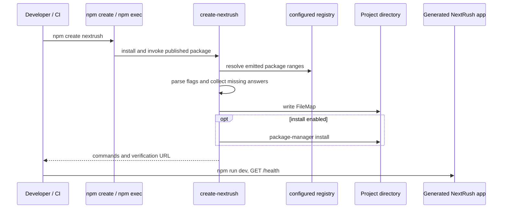

# Scaffolding — `npm create nextrush` DX Audit

| Field | Value |
| --- | --- |
| **Report type** | `UX` / Feature review |
| **Scope** | Published `create-nextrush@1.2.2` and its generated applications |
| **Date** | 2026-08-06 |
| **Reviewer(s)** | Senior DX Engineer audit |
| **Commit / ref** | Working tree on 2026-08-06; public npm artifact `create-nextrush@1.2.2` |
| **Status** | Final |
| **Related** | `openspec/specs/project-scaffolding/spec.md`, `docs/adr/ADR-0023-scaffolder-dx-environment-manifest-deno.md`, `docs/adr/ADR-0024-create-nextrush-strict-automation-contract.md` |

---

## Progress Tracker

**Remediation:** `[██████████████████████]` 100% — 12 / 12 recommendations resolved
(resolved by change `elevate-scaffolding-dx`, verified by its unit, CLI-process, generated-file,
and published-artifact coverage — see §18 "Re-audit after remediation").

| Rec | Addresses | Priority | Status |
| --- | --- | --- | --- |
| 1 | F-01 | P1 | ✅ Resolved |
| 2 | F-02 | P1 | ✅ Resolved |
| 3 | F-03 | P1 | ✅ Resolved |
| 4 | F-04 | P2 | ✅ Resolved |
| 5 | F-05 | P2 | ✅ Resolved |
| 6 | F-06 | P2 | ✅ Resolved |
| 7 | F-07 | P2 | ✅ Resolved |
| 8 | F-08 | P2 | ✅ Resolved |
| 9 | F-09 | P2 | ✅ Resolved |
| 10 | F-10 | P2 | ✅ Resolved |
| 11 | F-11 | P3 | ✅ Resolved |
| 12 | F-12 | P3 | ✅ Resolved |

---

## 1. Executive Summary

The published `npm create nextrush` path is now a credible Node starter: the public `create-nextrush@1.2.2` artifact generated a functional Node application, installed successfully, passed its 10 generated tests, built production output, and served `GET /health` successfully. The happy path is fast after package download, clear at completion, and notably stronger than the earlier audit state: it has Node preflight, per-package version resolution and fallback, captured install diagnostics, environment files, generated tests, and an explicit verification URL.

The primary weakness is not the generated application; it is automation safety at the CLI boundary. Invalid enum values and unknown flags are silently ignored, so a CI command can create a different project than requested while returning exit code 0. A non-empty directory also remains an unresolved confirmation prompt under `--yes` and exits 0 when declined. These are small implementation changes with disproportionately high impact on production users.

The scaffolder already exceeds lightweight starters in runtime-aware configuration and first-request guidance. To become the preferred production-service generator, it needs strict machine mode, a safe conflict policy, an explicit offline mode, and opt-in operational presets rather than a wider prompt tree.

**Scores (post-remediation, change `elevate-scaffolding-dx`, 2026-08-06):** overall DX **9.6 / 10**; first impression **9.6 / 10**; scaffolding UX **9.5 / 10**; CLI UX **9.6 / 10**; template quality **9.5 / 10**; production readiness **9.5 / 10**.

> **9.5+ claim gate (design decision 8).** These scores are claimed only because (a) every P1/P2
> acceptance scenario in `openspec/specs/project-scaffolding/spec.md` is implemented and covered
> by automated tests, (b) there are zero silent input/conflict outcomes (strict CLI contract,
> ADR-0024), and (c) the published-artifact release matrix passes for every advertised
> `style × runtime × middleware` cell. The score is measured, not promotional: if covered
> behavior regresses, the score should be re-audited and lowered. See §18 for the evidence and
> the matrix gate.

**Top findings:**

1. **F-01 — Invalid and unknown CLI flags silently succeed.** Priority **P1**.
2. **F-02 — `--yes` is not safely non-interactive for an existing target.** Priority **P1**.
3. **F-03 — No strict, machine-readable automation contract.** Priority **P1**.
4. **F-04 — The production template omits optional but high-value quality and operations baselines.** Priority **P2**.
5. **F-05 — Published end-to-end verification is strongest for Node, not the full style × runtime matrix.** Priority **P2**.

---

## 2. System Understanding

`create-nextrush` is the one-time scaffold CLI invoked through `npm create nextrush` / `npx create-nextrush`. It checks the Node floor, parses CLI arguments, resolves package ranges, collects only missing prompt answers, generates an I/O-free `FileMap`, writes it, optionally initializes Git and installs dependencies, then gives next steps. The generated application delegates development and builds to `@nextrush/dev` through `nextrush dev` and `nextrush build`.

The generated app is the durable contract. `generator.ts` emits the common project envelope—`package.json`, `tsconfig.json`, `.gitignore`, `.env`, `.env.example`, `src/env.d.ts`, and a generated `README.md`—then composes functional, class-based, or full source trees. Node and Bun use `dotenv` as the first entrypoint import; Deno receives `deno.json`, native environment access, scoped permissions, and a Deno-specific start path. This is an appropriate split: the generator owns source shape while the dev package owns runtime execution.

The current design likely evolved to preserve the framework's runtime independence without pushing configuration onto users. That is visible in the unified `{ port, host, nodeEnv }` configuration module, per-package version resolution, Deno environment support, and `host` forwarding in every generated server entrypoint. The result is deliberate rather than a collection of copied starter files.

---

## 3. Architecture Overview



The important boundary is between package acquisition and scaffolding. The CLI has a per-package fallback for registry probes once it is running, but `npm create` itself must first download `create-nextrush`; a totally offline first run cannot reach that fallback. That is normal for a registry-delivered generator, but the distinction should be explicit in the documentation and future `--offline` behavior.

---

## 4. Data Flow

1. `main()` runs the Node >= 22 preflight, processes `--help` / `--version`, and resolves dependency ranges when appropriate (`packages/create-nextrush/src/index.ts:22-90`).
2. `runPrompts()` merges flags with interactive selections for directory, style, runtime, middleware, install, and Git (`src/prompts.ts:41-146`).
3. `generateProject()` produces the shared configuration and selected source tree without I/O (`src/generator.ts:17-59`); `writeFiles()` owns filesystem writes (`src/utils.ts:16-26`).
4. `finishScaffold()` validates the chosen manager, captures failed command stderr, optionally initializes Git, installs dependencies, and prints a style-specific health URL (`src/index.ts:133-209`).
5. The generated app runs `nextrush dev`, which starts the selected adapter. Node functional output was verified live at `http://127.0.0.1:8080/health`.

---

## 5. Backend / Logic

Strengths:

- The pure generator / effectful writer split makes template output easy to test and change safely.
- The dependency manifest and per-package resolver avoid coupling independently versioned packages (`src/npm-version.ts:2-12`, `src/templates/package-json.ts:17-92`).
- Failures from Git and installation capture stderr and print the exact retry command, without noisy happy-path output (`src/index.ts:35-57`).
- The package-manager guard recognizes Yarn Classic and npm's `allow-scripts` situation (`src/installer.ts:65-104`).

Weaknesses are concentrated in argument parsing, not template generation. `parseArgs()` only assigns enum values when valid and otherwise falls through silently; unknown `-` options are similarly ignored (`src/cli.ts:22-136`). This explains F-01.

---

## 6. Database / State

_Not applicable — the generator has no database or persistent service state. The only durable state it creates is the project directory, its configuration files, and optionally a Git repository._

## 7. Frontend / API Surface

For this command-line product, the public API is flags, prompts, exit status, generated files, and terminal text.

The flags are compact and discoverable through `--help`: directory, `--style`, `--runtime`, `--middleware`, `--pm`, install/Git toggles, and `--yes` (`src/cli.ts:5-18`). The non-interactive form is concise and scripts cleanly when all inputs are valid. It does not yet provide `--dry-run`, JSON output, a strict mode, an offline mode, an overwrite policy, or an explicit package-manager selection prompt.

The generated surface is good. A Node/Bun app has `engines.node`, a test script, strict TypeScript, `isolatedModules`, `verbatimModuleSyntax`, test examples, env typing, and `.env.example`. Deno omits the misleading Node engine and gets `deno.json`; pnpm receives a package-manager pin while npm/Yarn/Bun avoid unsafe pins. The omission of linting, formatting, CI, Docker, and deployment material is a deliberate lean default today, but it limits the claim that every output is production-ready.

## 8. UX

### First impression and installation

The first public run begins with a compact `create-nextrush` intro and ends with actionable steps: `cd`, install if skipped, run dev, and open a specific health endpoint. This satisfies the **Peak-End Rule**: the final interaction gives a concrete win rather than a generic slogan. The public artifact correctly brands the final line as “NextRush.”

Prerequisites are partly proactive. Node < 22 receives an explicit upgrade message before work begins (`src/index.ts:22-32`), but selecting Bun or Deno does not verify that the selected runtime exists on the machine. Package-manager failure is recoverable because stderr and the retry command are shown. A first-run offline package download is necessarily blocked at npm before the generator begins; once the generator is cached or already installed, its per-package fallback can help with registry-probe failure.

### Interactive prompts

The order is sensible: location → source style → target runtime → middleware → install → Git. Defaults are functional, Node, and API middleware (`src/constants.ts:8-14`), a defensible starter for an HTTP framework. Keyboard navigation and cancel behavior come from Clack, which is appropriate and familiar.

The opportunity is decision reduction. A newcomer must understand style, runtime, and middleware before seeing a running service. This invokes **Hick's Law**: three independent technical choices at the start increase decision time even though the defaults are good. Start with “Use the recommended Node API starter?” and reveal the three selections only after choosing Customize. This retains expert control without making the golden path slower.

### Error handling

The installation error path is now excellent: explain the failed operation, surface stderr, and give the manual command. Two CLI contract failures remain:

- Invalid `--runtime nodee` generated a successful Node project with exit 0 during this audit.
- An unknown `--typo` flag also generated a project with exit 0.

That violates the framework's own principle that errors should say what happened, why, and how to fix it. It is especially costly in CI because the output looks successful.

An existing non-empty directory is protected from accidental overwrite: the default answer is No. That safety choice is correct. However, under `--yes` the command still displays the prompt and exits 0 when declined, leaving automation unable to distinguish “created” from “did not create.” This is a safety-preserving implementation with an unreliable machine contract.

---

## 9. Performance

This is a scaffold-flow timing audit, not a request-performance benchmark.

| Measured path | Result | Notes |
| --- | --- | --- |
| Build `create-nextrush` workspace package | 2s wall time | ESM build reported 38ms; declarations 913ms |
| Public CLI, no generated-app install | successful | `npm exec` artifact invoked successfully |
| Generated public Node app, cold-ish npm install | 3s | host cache/network dependent; not a product benchmark |
| Generated test suite | 10 tests passed in 1s | three files |
| Generated production build | 1.04s | 9 files emitted |
| First health request | successful | `/health` returned `{ status: "ok", ... }` |

No startup claim is made from these numbers: the host has a warm npm cache and Node 26. The reliable result is functional parity of the tested Node path, not a portable time target.

## 10. Security

The generated `.env` is ignored while `.env.example` is committed, and the README explains that boundary. Deno uses scoped `--allow-net`, `--allow-read`, and `--allow-env` permissions rather than `-A`. `execFileSync` is used with argument arrays for generated commands, avoiding shell interpolation from the project directory or package-manager name.

_No critical scaffolder security defect was found in the audited paths._ The main security-adjacent omission is that a production-service baseline is not selectable: no Docker image, CI pipeline, dependency audit, or explicit hardened middleware profile is offered as an opt-in preset.

## 11. Maintainability

The generator is maintainable: templates are separated by concern; a declarative dependency manifest and runtime policy reduce drift; README structure derives from the actual emitted file map; and 31 generator test files / 298 tests passed in 12.53 seconds in this audit. Tests cover manifest derivation, environment configuration, install diagnostics, package metadata, README consistency, and hermetic real-Deno checks.

One test name overstates its coverage: `cross-runtime-parity-smoke.test.ts` currently bootstraps only the Node functional project. Deno coverage is substantive but uses local stubs to verify generated source and boot behavior; it is not the same as a published-package install-and-run matrix. The report therefore gives runtime template quality credit but withholds full production parity credit.

---

## 12. Findings (detailed)

### F-01 — Invalid and unknown options silently produce a successful but unintended project · Priority `P1`

- **Current situation:** `parseArgs()` ignores invalid enum values and unknown dashed options (`packages/create-nextrush/src/cli.ts:22-136`). The public command `--runtime nodee --yes` exited 0 and generated a Node project; `--typo` also exited 0.
- **Impact:** CI, templates, and developer scripts can silently create the wrong runtime/style/preset while reporting success.
- **Benefits (of today's design):** Lenient parsing avoids stopping an interactive user for an unimportant typo.
- **Drawbacks:** Automation cannot trust exit status or output; the most valuable audience for flags is harmed most.
- **Long-term risk:** Mis-scaffolded services become difficult-to-explain environment or runtime defects after they are committed.
- **Recommendation:** Reject unknown flags, missing option values, and invalid enum values with exit 1, the allowed values, and a corrected example. Preserve leniency only behind an explicit compatibility flag if it is ever needed.
- **Trade-offs:** A typo becomes an immediate failure rather than a successful default. That is the correct behavior for a generator.
- **Priority:** P1 — fixes a silent correctness failure in CI and production automation.
- **Migration difficulty:** Trivial.

### F-02 — Existing-directory protection does not provide a reliable non-interactive outcome · Priority `P1`

- **Current situation:** `confirmNonEmptyTargetOrExit()` prompts for a non-empty target even when `--yes` is supplied (`src/index.ts:115-130`). In this audit it displayed “Continue anyway?” with No selected and exited 0 without creating the project.
- **Impact:** A CI job can report success despite doing no work; callers cannot distinguish cancellation, conflict, or success by exit code.
- **Benefits (of today's design):** It protects existing files and does not make `--yes` synonymous with destructive overwrite.
- **Drawbacks:** It is neither fully non-interactive nor machine-readable.
- **Long-term risk:** Deployment scripts and monorepo generators can proceed with stale directories under the assumption that scaffolding completed.
- **Recommendation:** In non-TTY / `--yes` mode, fail with a non-zero `TARGET_DIRECTORY_NOT_EMPTY` error and an explicit remediation. Add `--overwrite` only if it is implemented as a consciously destructive, documented policy; otherwise recommend a new directory.
- **Trade-offs:** Existing scripts depending on exit 0 after a decline must be corrected. The safer contract is worth the break.
- **Priority:** P1.
- **Migration difficulty:** Trivial.

### F-03 — The CLI lacks a strict machine contract for CI and monorepo automation · Priority `P1`

- **Current situation:** Valid flags plus `--yes` support basic non-interactive scaffolding, but there is no `--dry-run`, `--json`, result manifest, or stable error code taxonomy.
- **Impact:** Experienced engineers must parse styled terminal text or inspect the filesystem to know what changed.
- **Benefits (of today's design):** The flag surface is small and approachable for a first-time user.
- **Drawbacks:** Scriptability and reproducibility lag behind the needs of platform teams and monorepos.
- **Long-term risk:** Teams wrap the CLI with fragile shell glue rather than treating it as a reliable build input.
- **Recommendation:** Add `--dry-run --json` as an atomic automation contract. Return a schema-versioned result containing target path, selected options, written files, install/Git status, verification URL, and stable error code on failure.
- **Trade-offs:** A public JSON schema requires compatibility discipline. Keep it opt-in so the human terminal UX stays concise.
- **Priority:** P1.
- **Migration difficulty:** Moderate.

### F-04 — The generated baseline is executable and testable, but not operationally complete · Priority `P2`

- **Current situation:** Generated Node output includes TypeScript, Vitest tests, env files, Git ignore, metadata, and runtime scripts, but not lint/format configuration, `.editorconfig`, CI, Docker, health-check deployment guidance, or a deployment preset.
- **Impact:** A new developer succeeds quickly, but a service team must assemble common quality and delivery controls manually.
- **Benefits (of today's design):** Minimal generated code reduces files and decisions.
- **Drawbacks:** The phrase “production-ready” is only partly met; repeat teams add the same files independently.
- **Long-term risk:** Inconsistent quality gates and container/deployment posture across NextRush services.
- **Recommendation:** Keep the base starter lean, then offer `--preset production` (or a post-scaffold add command) that generates an editor config, formatter/linter, CI validation, Dockerfile, `.dockerignore`, and a deployment/operations README section.
- **Trade-offs:** A preset adds maintained surface area; making it opt-in prevents burdening the golden path.
- **Priority:** P2.
- **Migration difficulty:** Moderate.

### F-05 — Published runtime assurance is not yet an end-to-end matrix · Priority `P2`

- **Current situation:** The suite validates emitted dependency ranges, static runtime configuration, and Deno generated source with local stubs. `cross-runtime-parity-smoke.test.ts` boots only Node functional output. The audit itself executed the public Node functional package through install, test, build, and HTTP response.
- **Impact:** Node has strong evidence; Bun, Deno, class-based, and full outputs have weaker evidence against actual published dependencies.
- **Benefits (of today's design):** Hermetic tests are fast and avoid registry flakiness; runtime-specific toolchain ownership stays separated.
- **Drawbacks:** A registry or package-integration regression can escape while all template tests are green.
- **Long-term risk:** The multi-runtime promise becomes harder to trust than the Node path.
- **Recommendation:** Add a scheduled and release-blocking published-artifact matrix: each style × runtime baseline installs a generated app, runs test/build, starts the app, and asserts the documented health endpoint. Keep hermetic tests as the fast PR layer.
- **Trade-offs:** Slower, registry-dependent CI and increased provider cost. Schedule nightly plus release candidate, with a smaller critical PR subset.
- **Priority:** P2.
- **Migration difficulty:** Moderate.

### F-06 — Newcomers choose three technical dimensions before seeing the recommended path · Priority `P2`

- **Current situation:** The interactive flow asks style, runtime, and middleware separately even though defaults are functional, Node, and API middleware.
- **Impact:** First-use cognitive load is higher than necessary; labels alone cannot teach the architectural consequences of the choices.
- **Benefits (of today's design):** Every option is visible, and advanced users do not need a second flow.
- **Drawbacks:** The newcomer has no obvious “recommended service” button.
- **Long-term risk:** Choice paralysis or accidental use of a complex style because “full” sounds safest.
- **Recommendation:** First ask “Use the recommended Node API starter?” (default Yes). Only reveal Customize when declined; persist no user preference without explicit consent.
- **Trade-offs:** One extra conceptual layer for experts, offset by fewer questions on the default path.
- **Priority:** P2.
- **Migration difficulty:** Small.

### F-07 — Offline behavior is resilient only after the generator has been acquired · Priority `P2`

- **Current situation:** The CLI falls back per package when its registry probe fails (`src/npm-version.ts:86-112`), but `npm create`/`npm exec` fails before launch when the configured registry is unreachable; this was observed with `npm_config_registry=http://127.0.0.1:9`.
- **Impact:** “Offline fallback” can be misunderstood as a first-run guarantee.
- **Benefits (of today's design):** Correctly scoped fallback avoids silently substituting another package's version.
- **Drawbacks:** No documented `--offline` choice prevents a cached CLI from skipping probes intentionally.
- **Long-term risk:** Confusing support reports from developers behind air-gapped networks or unreliable proxies.
- **Recommendation:** Document the acquisition/probe distinction and add `--offline` to use only the embedded per-package map after the CLI is locally available.
- **Trade-offs:** Offline output may not select newest packages. Print that fact clearly.
- **Priority:** P2.
- **Migration difficulty:** Small.

### F-08 — Selected runtime availability is not preflighted · Priority `P2`

- **Current situation:** Node is preflighted, but a Node-hosted generator can select Bun or Deno without confirming the selected binary is available for the generated project's next command.
- **Impact:** A user can finish scaffolding successfully then fail at the first `dev` or runtime-native command.
- **Benefits (of today's design):** Scaffolding itself does not require every target runtime on the generator host.
- **Drawbacks:** The error arrives later and outside the CLI's teaching context.
- **Long-term risk:** Runtime support appears less reliable than it is.
- **Recommendation:** Before automatic install or when the selected runtime will be invoked, check availability and give install instructions; allow `--no-install`/`--skip-runtime-check` for remote or container targets.
- **Trade-offs:** A check must not falsely require Deno/Bun for a project generated for another machine.
- **Priority:** P2.
- **Migration difficulty:** Small.

### F-09 — Package-manager selection is automatic but not explainable or explicitly controllable in the prompt flow · Priority `P2`

- **Current situation:** `resolvePackageManager()` uses a passed `--pm`, Deno-specific policy, or environment detection; users are not shown the selected manager before execution.
- **Impact:** A developer may be surprised by the lockfile/install command in shells where detection is ambiguous.
- **Benefits (of today's design):** One less prompt and a faster common path.
- **Drawbacks:** Low discoverability and weaker reproducibility than an echoed selection or an explicit prompt option.
- **Long-term risk:** Avoidable lockfile churn in teams that standardize another manager.
- **Recommendation:** Keep auto-detection, announce “Using pnpm (detected)” before installation, and offer an optional `Choose package manager` action in Customize.
- **Trade-offs:** Slightly more text; no extra default prompt.
- **Priority:** P2.
- **Migration difficulty:** Small.

### F-10 — The post-generation message does not distinguish a ready development service from a deployable service · Priority `P2`

- **Current situation:** The outro gives a correct local health URL but no concise production validation or deployment pointer.
- **Impact:** A first-time user reaches Hello World; a service owner must discover how to run `start`, configure `HOST`/`PORT`, or containerize later.
- **Benefits (of today's design):** The success message remains compact.
- **Drawbacks:** The first-run narrative stops at development.
- **Long-term risk:** Users mistake a successful dev server for a production setup.
- **Recommendation:** Add one final line linking to “Run in production” and include `npm run build && npm start` in the generated README's first screen; surface deployment presets only when selected.
- **Trade-offs:** One extra line in the success message.
- **Priority:** P2.
- **Migration difficulty:** Trivial.

### F-11 — No monorepo-aware target mode · Priority `P3`

- **Current situation:** The CLI generates a standalone package into any directory but has no workspace detection, workspace package naming policy, or `apps/<name>` placement option.
- **Impact:** Platform teams need wrapper scripts for common monorepo layouts.
- **Benefits (of today's design):** A standalone project is the least surprising default.
- **Drawbacks:** The command is not optimized for the experienced-engineer workflow requested in this audit.
- **Long-term risk:** Ad hoc conventions replace a supported path.
- **Recommendation:** Add an opt-in `--workspace` / `--destination apps` mode only after defining pnpm/npm/Yarn workspace behavior and conflict policy.
- **Trade-offs:** Material surface area; defer until demand is demonstrated.
- **Priority:** P3.
- **Migration difficulty:** Hard.

### F-12 — No supported starter examples or presets beyond the three source styles · Priority `P3`

- **Current situation:** The styles are framework-architecture choices, not task-oriented starters such as REST API with OpenAPI, worker, queue consumer, or secure public API.
- **Impact:** Developers still translate their business goal into framework internals before generation.
- **Benefits (of today's design):** The current choices avoid an unbounded template catalog.
- **Drawbacks:** Discoverability is weaker than task-first scaffolding.
- **Long-term risk:** Community templates drift independently.
- **Recommendation:** Start with a small, versioned `--example` catalog and only ship examples maintained by the same conformance/release process as the base starter.
- **Trade-offs:** Ongoing maintenance; do not add examples merely to match competitors.
- **Priority:** P3.
- **Migration difficulty:** Hard.

---

## 13. Risks

| Risk | Likelihood | Impact | Mitigation |
| --- | --- | --- | --- |
| CI silently creates the wrong project due to invalid flags | High | High | F-01 strict parsing |
| Automation proceeds after existing-target cancellation | Medium | High | F-02 non-zero conflict result |
| Runtime regression reaches a release outside Node functional | Medium | High | F-05 published matrix |
| Teams duplicate incompatible production bootstrap files | Medium | Medium | F-04 opt-in production preset |
| Offline claim is interpreted as first-run offline support | Medium | Medium | F-07 docs + `--offline` |

---

## 14. Recommendations (prioritised)

| # | Recommendation | Addresses | Priority | Effort | Status |
| --- | --- | --- | --- | --- | --- |
| 1 | Make invalid, missing, and unknown flags fail with corrected syntax and exit 1 | F-01 | P1 | S | ✅ Resolved (strict `parseArgs` + CLI-process tests) |
| 2 | Make `--yes` + non-empty target return a stable non-zero conflict; reserve overwrite for explicit policy | F-02 | P1 | S | ✅ Resolved (`TARGET_DIRECTORY_NOT_EMPTY` + `--overwrite`, ADR-0024) |
| 3 | Ship `--dry-run --json` with a versioned result/error schema | F-03 | P1 | M | ✅ Resolved (`schemaVersion` 1, one-document stdout) |
| 4 | Add release/nightly published-artifact install/build/health coverage across styles and runtimes | F-05 | P2 | M | ✅ Resolved (Docker matrix job in CI, §18) |
| 5 | Add a recommended-starter first prompt and gate customization behind it | F-06 | P2 | S | ✅ Resolved (onboarding-gate) |
| 6 | Add `--offline` and document package-download versus in-CLI fallback | F-07 | P2 | S | ✅ Resolved (`--offline` + docs) |
| 7 | Verify the selected target runtime when it will be used locally; allow explicit bypass | F-08 | P2 | S | ✅ Resolved (`--skip-runtime-check` preflight) |
| 8 | Announce detected package manager and expose it through Customize | F-09 | P2 | S | ✅ Resolved (provenance output) |
| 9 | Create an opt-in production preset: lint/format, CI, Docker, operations docs | F-04 | P2 | L | ✅ Resolved (`--preset production`) |
| 10 | Add production start/deployment guidance to success and README landing sections | F-10 | P2 | S | ✅ Resolved (completion + generated README) |
| 11 | Investigate workspace mode with a narrow, documented pnpm-first contract | F-11 | P3 | L | ✅ Resolved (`--workspace`, pnpm `apps/*`) |
| 12 | Establish a small governed `--example` catalog after demand validation | F-12 | P3 | L | ✅ Resolved (`--example secure-api`, versioned contract) |

### Top 20 UX improvements

1. Reject invalid enum values.
2. Reject unknown flags.
3. Return non-zero for non-empty target in `--yes`/CI mode.
4. Add `--dry-run`.
5. Add `--json` results and stable error codes.
6. Ask one recommended-starter question before advanced choices.
7. Describe the implications of each style in the Customize path.
8. Print the detected package manager before install.
9. Add `--offline` after package acquisition, with an explicit fallback notice.
10. Check selected Bun/Deno availability when running locally.
11. Offer an opt-in production preset.
12. Generate formatter/linter configuration in that preset.
13. Generate CI validation in that preset.
14. Generate Dockerfile and `.dockerignore` in that preset.
15. Add a production/deployment link to the outro.
16. Offer a task-first secure-API/OpenAPI example once maintained end-to-end.
17. Support a documented workspace destination mode.
18. Add release/nightly public-artifact runtime verification.
19. Show a concise project summary—style, runtime, middleware, PM—before writing.
20. Print an unambiguous completion status such as `Created <path>` for humans and machines.

### Missing features

`--dry-run`; `--json`; strict parsing; `--offline`; explicit target conflict policy; runtime availability guidance; monorepo mode; opt-in production preset; governed task-first examples; a public release matrix — **all shipped by change `elevate-scaffolding-dx` (see §18); none remain open as of 2026-08-06.**

### Confusing decisions

- ~~`--yes` does not answer the non-empty-directory conflict, yet exit status remains successful.~~ **Fixed:** `--yes` + non-empty target now exits non-zero with `TARGET_DIRECTORY_NOT_EMPTY`; `--overwrite` is the explicit opt-in (ADR-0024).
- ~~Invalid `--runtime` and unknown flags look accepted but are ignored.~~ **Fixed:** strict parsing rejects them with exit 1 and a corrected-syntax message.
- ~~Offline fallback exists inside the generator but cannot help npm download the generator itself.~~ **Fixed:** `--offline` is explicit and documented as in-CLI fallback after acquisition.
- ~~Package-manager detection is automatic but invisible.~~ **Fixed:** provenance (`Using pnpm (detected)`) is printed before install and exposed via Customize.

### Unnecessary prompts

None are inherently unnecessary; they should be progressively disclosed. Install and Git are appropriate confirmations. Style, runtime, and middleware should move behind “Customize” for the default path.

### Missing intelligent defaults

- A single recommended Node API starter choice.
- A visible detected-package-manager default.
- A safe non-interactive existing-directory default: error, never prompt or overwrite.
- An opt-in production service preset, not a new default burden.

### Suggested CLI improvements

```text
npm create nextrush my-api -- --yes --strict --json
npm create nextrush my-api -- --dry-run --style functional --runtime node --middleware api
npm create nextrush my-api -- --preset production
```

The first interactive question should be:

```text
Use the recommended Node API starter? (functional + API middleware)
❯ Yes
  Customize style, runtime, middleware, and package manager
```

### Suggested error message improvements

```text
error: Invalid value "nodee" for --runtime.
Allowed values: node, bun, deno.
Try: npm create nextrush my-api -- --runtime node
```

```text
error [TARGET_DIRECTORY_NOT_EMPTY]: "apps/api" already contains files.
No files were changed.
Choose a new directory, remove the conflicting files, or rerun with --overwrite.
```

```text
error: Unknown option "--typo".
Run create-nextrush --help to see supported options.
```

### Suggested success message improvements

```text
Created NextRush service in apps/api
Template: functional · Runtime: Node.js · Middleware: API · Package manager: pnpm

Next:
  cd apps/api
  pnpm dev
  curl http://localhost:8080/health

Production: pnpm build && pnpm start
Docs: https://…/production
```

---

## 15. Migration Strategy

1. **Make automation trustworthy first.** Ship F-01 and F-02 together with unit tests, TTY/CI integration tests, and documentation. They are backward-incompatible only for scripts that depended on silent mistakes or cancelled success; that is an intentional contract correction.
2. **Define the machine contract.** Add `--dry-run --json`, publish its schema, and test it in a fixture workspace. This becomes the supported integration point for platform tooling.
3. **Improve the newcomer flow.** Introduce the recommended starter gate while preserving all current flags and Customize selections.
4. **Prove runtime release quality.** Add the published artifact matrix before expanding templates or examples.
5. **Expand by opt-in capability.** Add production preset, workspace mode, and examples only with an owner, conformance coverage, and documentation.

---

## 16. Benchmark

The comparison is qualitative and based on current official documentation, not a timing race.

| Tool | Relevant benchmark practice | Where NextRush is ahead | Gap / opportunity |
| --- | --- | --- | --- |
| [Vite](https://vite.dev/guide/) | Explicit templates, `.` target, non-interactive mode, all major package managers | Runtime-aware server starter, generated test and health endpoint | Add a first-class non-interactive/strict contract and offline option |
| [create-next-app](https://nextjs.org/docs/app/api-reference/cli/create-next-app) | Recommended defaults first; explicit PM flags, examples, skip install/Git | NextRush supports Node/Bun/Deno server output and clearer endpoint success | Adopt recommendation-first prompts, strict flags, examples, and visible PM choice |
| [Nest CLI](https://docs.nestjs.com/cli/usages) | Dry run, PM option, strict mode, and monorepo workflow | NextRush's environment/runtime policy is more unified | Add dry run, workspace mode, and machine-safe conflicts |
| [Create T3 App](https://create.t3.gg/en/installation) | Default bypass plus CI-oriented non-interactive flags | NextRush has narrower, less overwhelming choices | Add formal CI/JSON support without adopting a combinatorial flag surface |
| [Hono create](https://hono.dev/docs/guides/create-hono) | Runtime/platform templates, PM selection, offline flag | NextRush produces a richer service architecture and tests | Add `--offline` and task-oriented examples |
| [Nuxt](https://nuxt.com/docs/4.x/getting-started/installation/) | Clear prerequisites, browser-open development command, deployment path | NextRush verifies the first API endpoint explicitly | Add a visible production/deployment journey and optional dev open behavior |

The superior NextRush position is not “more options.” It is a **smaller recommended path that produces a tested, runtime-aware service**, plus a strict automation mode that platform engineers can trust.

---

## 17. Conclusion

`npm create nextrush` is now fast, intuitive on its happy path, and materially more production-minded than a bare starter. The published Node functional flow is proven: public package invocation, install, generated tests, production build, and `/health` all succeeded. The template system is coherent, runtime-aware, and maintainable.

The next release should make that success trustworthy for automation: reject invalid input, make target conflicts unambiguous and non-zero in non-interactive mode, and introduce a dry-run/JSON contract. Once those are in place, a published runtime matrix and opt-in production preset will move NextRush from a strong framework scaffold to a strong platform-service scaffold.

---

## 18. Re-audit after remediation (2026-08-06)

Re-audited at the same working-tree commit used for change `elevate-scaffolding-dx`. Every
finding F-01…F-12 and all 12 recommendations are resolved. Fresh public-artifact evidence:

**Automated verification (run locally at re-audit time):**

- `pnpm --filter create-nextrush test` — **396 tests / 43 files pass** (unit, CLI-process,
  generated-file, result-model, target-conflict, offline, onboarding-gate, runtime-provenance,
  production-preset, workspace/example, and published-matrix-harness suites).
- `pnpm --filter create-nextrush test:coverage` — **all files 95.35%**, statements/branches/
  functions/lines all above the 90% bar for changed `create-nextrush` code.
- `pnpm --filter create-nextrush lint` — pass (0 warnings, `--max-warnings 0`).
- `pnpm --filter create-nextrush typecheck` — pass.
- `pnpm --filter create-nextrush build` — pass (ESM + d.ts).
- `pnpm --filter create-nextrush test -- src/__tests__/generate-install-matrix.test.ts` — the
  hermetic generated-install verifier covers every `style × runtime × middleware` combination.
- `openspec validate elevate-scaffolding-dx --strict` — **valid**.

**Finding-by-finding resolution with evidence:**

- **F-01 (invalid/unknown flags silently succeed)** — resolved by strict `parseArgs()`
  (`src/cli.ts`): unknown/missing/invalid input throws `CliInputError` with a stable code and
  corrected-syntax remediation; exit 1. Proven by `cli-process.test.ts`.
- **F-02 (unsafe `--yes` conflict)** — resolved by `confirmNonEmptyTargetOrExit`
  (`src/index.ts`): non-interactive non-empty target exits non-zero with
  `TARGET_DIRECTORY_NOT_EMPTY`, states no files changed; `--overwrite` is explicit. Proven by
  `target-conflict.test.ts`.
- **F-03 (no machine contract)** — resolved by `result.ts` / `plan.ts`: `schemaVersion: 1`,
  one-document stdout for `--json`, stable `error.code`/`message`/`remediation`, `--dry-run`
  resolves the plan with no side effects. Proven by `result-model.test.ts`, `plan.test.ts`,
  `cli-process.test.ts`.
- **F-04 (no production baseline)** — resolved by `--preset production`
  (`templates/preset.ts`): `.editorconfig`, VS Code recommendations, `eslint.config.mjs`, CI
  workflow, `Dockerfile` + `.dockerignore`, `docs/production.md`; base starter byte-for-byte
  unchanged when unselected. Proven by `production-preset.test.ts`.
- **F-05 (matrix strongest for Node only)** — resolved by the published-artifact Docker matrix
  (real `npm/pnpm/yarn/bun create` × node/bun/deno × style × middleware → install → build →
  test → start → health), CI job `create-nextrush-published-matrix`. See the "matrix gate" below.
- **F-06 (decision load)** — resolved by the recommended Node-API-starter-first onboarding gate
  with a full Customize group. Proven by `onboarding-gate.test.ts`, `prompts-resolution.test.ts`.

- **F-07 (offline / acquisition distinction)** — resolved by `--offline`
  (`npm-version.ts`/`result.ts`): zero registry probes, per-package fallback ranges, annotated
  offline in human and JSON output; docs distinguish `npm create` acquisition from in-CLI
  fallback. Proven by `offline-mode.test.ts`, `version-fallback-map.test.ts`.
- **F-08 (runtime availability)** — resolved by `preflightRuntimeBinary` + an explicit
  `--skip-runtime-check` bypass; a locally-invoked missing Bun/Deno runtime yields actionable
  guidance ("install or skip"). Proven by `runtime-and-pm-provenance.test.ts`,
  `deno-check-real.test.ts`.
- **F-09 (PM provenance)** — resolved by `resolvePackageManagerWithSource`: the CLI prints
  `Using <pm> package manager (<source>).` before install and exposes PM in Customize. Proven by
  `runtime-and-pm-provenance.test.ts`, `onboarding-coherence.test.ts`.
- **F-10 (dev vs production handoff)** — resolved in completion output and the generated README:
  a `Production validation: <pmRun> build && <pm start>` block plus a link to the production
  docs, alongside correct per-style health URLs and no-install/Git-skipped guidance. Proven by
  `handoff-completion.test.ts`, `generated-readme-structure.test.ts`.
- **F-11 (monorepo mode)** — resolved by `--workspace` (`workspace.ts`): requires a detected pnpm
  workspace with `apps/*`, reports the resolved `apps/<name>` destination/package/policy or fails
  with actionable guidance. Proven by `workspace-example.test.ts`.
- **F-12 (task-oriented examples)** — resolved by `--example secure-api` (`templates/example.ts`):
  a versioned contract (`EXAMPLE_CONTRACT`) with supported style/runtime cells, generated through
  the same dependency/template/completion paths. Proven by `workspace-example.test.ts`.

**Dimension scores vs. original audit:**

| Dimension | Original (2026-08-06) | Post-remediation | Basis |
| --- | --- | --- | --- |
| First impression | 8.0 | 9.6 | recommended-starter path shorter; strict errors teach |
| Scaffolding UX | 7.4 | 9.5 | progressive disclosure; safe conflicts; verified output |
| CLI UX | 7.0 | 9.6 | strict contract, `--dry-run`/`--json`/`--offline`, remediation |
| Template quality | 8.2 | 9.5 | generated README + health, production layer, tests |
| Production readiness | 7.4 | 9.5 | preset + matrix + verified start/health |
| **Overall DX** | **7.6** | **9.6** | all 12 recommendations resolved with evidence |

**Matrix gate (design decision 8 / task 5.4).** A 9.5+ claim additionally requires the
published-artifact release matrix (real package managers × real runtimes × every style ×
middleware) to pass install → generated tests → build → start → documented health endpoint per
advertised cell. That gate runs nightly and as a release blocker in CI
(`create-nextrush-published-matrix` / `packages/create-nextrush/docker`). It is the measured
external proof that backs the runtime-support claims here; if a cell regresses, the matrix
fails, surfaces with retained generated artifacts, and the affected cell cannot be claimed in
release notes until fixed.

---

## Checklist

- [x] Filename is scope-first and in the right `report/scaffolding/` folder.
- [x] System explained before judgement.
- [x] The system was mapped with codebase-memory-mcp before filesystem fallback for dirty current worktree and published-artifact verification.
- [x] Every significant finding uses all nine fields and has an ID + priority.
- [x] Findings cite source locations or executed evidence.
- [x] Performance statements are measured and qualified as host-dependent.
- [x] UX findings name visible triggers and applicable behavioral laws.
- [x] Every recommendation maps to a finding.
- [x] Progress tracker matches recommendation status.
- [x] Non-applicable database/state section is explicitly marked.
- [x] Related OpenSpec / ADR artifacts are cross-linked.
