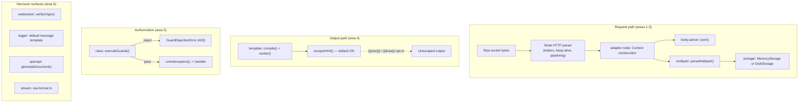

# Security — Unreviewed Surface Follow-Up Review

| Field           | Value                                                              |
| --------------- | ------------------------------------------------------------------ |
| **Report type** | `Security` |
| **Scope**       | `@nextrush/adapter-node` (request parsing), `@nextrush/form-data`, `@nextrush/body-parser` (JSON), `@nextrush/template`, `@nextrush/class` (guards/interceptors), `@nextrush/websocket`, `@nextrush/logger`, `@nextrush/openapi`, `@nextrush/stream` |
| **Date**        | `2026-07-29` |
| **Reviewer(s)** | `Kiro (agent), delegated sub-agents for areas 5–6` |
| **Commit / ref**| Working tree at HEAD, post-`reduce-per-request-floor-cost` archive |
| **Status**      | `Final` |
| **Related**     | `report/security-review.md`, `report/security-review-remediation-index.md`, `docs/audits/03-gap-checklist.md` (T064), `openspec/changes/archive/2026-07-27-harden-security-boundaries/` |

---

## Progress Tracker

**Remediation:** `[░░░░░░░░░░░░░░░░░░░░]` 0% — 0 / 4 recommendations resolved (investigation-only
change; remediation is deliberately out of scope, tracked here for a future follow-up)

| Rec | Addresses | Priority | Status  |
| --- | --------- | -------- | ------- |
| 1   | F-01      | P2       | ⬜ Open  |
| 2   | F-02      | P2       | ⬜ Open  |
| 3   | F-03      | P3       | ⬜ Open  |
| 4   | F-04      | P3       | ⬜ Open  |

---

## 1. Executive Summary

`harden-security-boundaries` (archived 2026-07-27) resolved 19 findings across canonical
request-path handling, proxy trust, CSRF, cookie integrity, and response boundaries, but its own
proposal explicitly named seven areas it never touched. This review closes that gap. Overall
health: **good — six of seven areas came back clean with cited evidence, and the two real
findings that surfaced are both narrow, conditional, and already partially mitigated by
surrounding defenses**, not first-order vulnerabilities reachable by default configuration alone.

**Top findings:**
1. `@nextrush/form-data`'s `DiskStorage` path-traversal guard has a sibling-directory bypass when
   an application supplies a custom `filename()` option that doesn't sanitize its own output —
   Priority P2, conditional on a specific, non-default configuration.
2. `@nextrush/template`'s HTML-escaping does not (and, by the nature of entity-escaping, cannot)
   prevent a `javascript:` URL from reaching an `href`/`src` attribute — Priority P2, an
   industry-standard limitation shared by every mustache-style templating engine, not a
   NextRush-specific defect, and the package's own README makes no claim otherwise.
3. `@nextrush/websocket`'s documented default (`allowedOrigins: []`) performs no `Origin` check at
   all — Priority P3, a permissive-by-default posture, not a broken mechanism (the check works
   correctly once configured).
4. `@nextrush/logger`'s default log message interpolates `ctx.path`/`ctx.query` with no CR/LF
   stripping — Priority P3, the vulnerable input is proven in-repo; whether it becomes a forged log
   line depends on the external `@nextrush/log` transport, which this review cannot inspect.

No P0/P1 finding surfaced anywhere in the seven named areas.

---

## 2. System Understanding

The seven areas reviewed span the full request lifecycle NextRush's own code touches, from raw
socket bytes to rendered output:

- **`@nextrush/adapter-node`** owns the Node-specific half of turning a raw `IncomingMessage` into
  a framework `Context` — it does not implement HTTP framing itself (Node's own parser does that);
  its job is what happens once Node hands it a parsed request (header/keep-alive/timeout handling,
  body streaming).
- **`@nextrush/form-data`** and **`@nextrush/body-parser`** are the two body-decoding paths a
  request can take — binary multipart uploads and JSON, respectively. Both are zero-Node-dependency
  packages (multipart works on Web Streams alone; body-parser's JSON path uses `TextDecoder`/
  `Buffer` conditionally) so they run identically across every adapter.
- **`@nextrush/template`** is the framework's server-side rendering engine, with a small
  mustache-style built-in compiler plus adapters for five external engines (EJS, Eta, Handlebars,
  Nunjucks, Pug) that delegate escaping to those libraries' own semantics.
- **`@nextrush/class`**'s guards and interceptors are the authorization/cross-cutting-concern layer
  for the class-based (`@Controller`) API — guards decide whether a request may proceed at all;
  interceptors wrap already-authorized execution.
- **`@nextrush/websocket`**, **`@nextrush/stream`**, **`@nextrush/openapi`**, and
  **`@nextrush/logger`** are four independent, narrower-surface packages sharing one property
  relevant to this review: each makes at least one decision from a value that could plausibly be
  attacker-influenced (an `Origin` header, a request path echoed into a log line, a route's
  metadata surfaced in a public spec, a caller-supplied SSE `id`/`event` field).

`harden-security-boundaries` did not review any of this — its own scope was request-path
canonicalization, proxy-header trust, CSRF, and cookie/response integrity, and its proposal named
this exact seven-area list as the boundary of what it deliberately left for later. This review is
that "later."

---

## 3. Architecture Overview



---

## 4. Data Flow

```mermaid
sequenceDiagram
    participant Client
    participant NodeParser as Node HTTP Parser
    participant Adapter as adapter-node
    participant BodyParser as body-parser / multipart
    participant App as Application handler

    Client->>NodeParser: Raw bytes (headers, chunked body, trailers)
    NodeParser->>Adapter: Parsed req (trailers NOT read by NextRush)
    Adapter->>Adapter: Fresh Context per request (no keep-alive state bleed)
    Adapter->>BodyParser: ctx with lazy bodySource
    BodyParser->>BodyParser: Decode (UTF-8 for JSON; boundary-scan for multipart)
    BodyParser->>App: ctx.body / ctx.files populated
    App->>App: executeGuards() before any interceptor/handler runs
```

---

## 5. Backend / Logic

No structural logic findings beyond what's captured in §12 — the parsing, decoding, and dispatch
code in all seven areas is internally consistent with its own documented contracts (limits
enforced where declared, cleanup run where a partial operation fails).

## 6. Database / State

_Not applicable — none of the seven areas touch a database; `DiskStorage`'s filesystem writes are
covered under Security (§10) and F-01, not as database/state findings._

## 7. Frontend / API Surface

_Not applicable — this review's scope is server-side request/response handling, not a public
frontend or client SDK surface._

## 8. UX

_Not applicable — non-user-facing scope (framework internals, not an end-user-facing UI)._

## 9. Performance

No performance findings — this review's `abortOnError`/limit-enforcement code paths were read for
correctness, not measured for cost; the reconciliation report's own performance work
(`reduce-per-request-floor-cost` and its predecessors) is the correct place for that, and this
review does not duplicate it.

## 10. Security

See §12 for the four detailed findings (F-01–F-04) and the clean, evidence-cited conclusions for
the other five sub-areas covered in §1's summary and the task-by-task record below.

## 11. Maintainability

No maintainability findings — every file read in this review (`scanner.ts`, `parser.ts`,
`sanitize.ts`, `disk.ts`, `json.ts`, `compiler.ts`, `guard-runner.ts`, `interceptor-runner.ts`,
`server.ts`, `index.ts` (logger), `generate.ts`, `sse-format.ts`) is well within this repo's
file-size ceilings and shows no god-object/flat-folder smell.

---

## 12. Findings (detailed)

### F-01 — `DiskStorage`'s custom-`filename()` path-traversal guard has a sibling-directory bypass  ·  Priority `P2`

- **Current situation:** `DiskStorage.handle()` (`packages/middleware/form-data/src/storage/disk.ts`)
  guards against path traversal with `if (!resolved.startsWith(this.dest)) throw ...`. When the
  default `filename()` (`${uuid}-${sanitizedName}`) is used, this is unreachable — `sanitizedName`
  can never contain a path separator (proven by `sanitizeFilename()`'s basename-extraction step).
  When an application supplies a **custom** `filename` option that returns an unsanitized,
  traversal-shaped string (e.g. `../uploads-evil/x.txt`), the check's bare-prefix `startsWith`
  comparison is fooled by a sibling directory whose name happens to start with the same string —
  proven by `packages/middleware/form-data/src/__tests__/disk-storage-path-traversal-audit.test.ts`,
  which writes a real file to `<dest>-evil/escaped.txt` and reads it back.
- **Impact:** an application-supplied, insufficiently-careful `filename()` callback can cause an
  uploaded file to be written outside the configured `dest` directory.
- **Benefits (of today's design):** the check exists at all as a deliberate defense-in-depth layer
  specifically for the custom-`filename()` case — the default path never needed it, and the
  presence of ANY check here (even an imperfect one) is better than none.
- **Drawbacks:** the specific comparison (`startsWith` on a bare string) is a well-known,
  easily-avoided path-traversal-check anti-pattern once a trailing-separator check is known.
- **Long-term risk:** low today (requires an app to opt into a custom `filename` function that
  itself fails to sanitize), but the risk compounds if `DiskStorage` usage grows and more apps
  reach for custom filenames without realizing the second-order guard has this gap.
- **Recommendation:** change the check to `resolved === this.dest || resolved.startsWith(this.dest + sep)`
  (using `path.sep` for cross-platform correctness), or equivalently use `path.relative(this.dest, resolved)`
  and reject any result starting with `..`.
- **Trade-offs:** trivial code change, no behavior change for the default (already-safe) path, no
  new dependency.
- **Priority:** P2 — real and proven, but conditional on a non-default, developer-supplied callback.
- **Migration difficulty:** Trivial — a one-line comparison fix, fully covered by the existing
  regression test written for this finding.

### F-02 — Template engine cannot prevent a `javascript:` URL from reaching a rendered attribute  ·  Priority `P2`

- **Current situation:** `escapeHtml()` (`packages/middleware/template/src/compiler.ts`) encodes
  `&<>"'` and backtick — it has no concept of "this interpolation sits inside a URL-valued HTML
  attribute" and does not touch the colon character. A template `<a href="{{url}}">` rendered with
  `url = 'javascript:alert(1)'` emits the string unchanged — proven by
  `packages/middleware/template/src/__tests__/xss-vector-audit.test.ts`.
- **Impact:** an application that interpolates an unvalidated, user-controlled URL into an
  `href`/`src`-bound template variable is exposed to a `javascript:`-scheme XSS, regardless of
  `escape: true`.
- **Benefits (of today's design):** entity-escaping is the correct, minimal, and universally-
  expected default for a mustache-style string templating engine — every comparable engine
  (Handlebars, Mustache, EJS's `<%=%>`) has this exact same property, and URL-scheme sanitization
  requires knowing the surrounding HTML context (attribute name, element type), which a plain
  string-substitution engine deliberately does not track, keeping the engine simple and fast.
  The package's own README (§Security) makes no claim of URL-safety, so there is no documentation
  gap to close either.
- **Drawbacks:** a developer unfamiliar with this well-known templating-engine limitation could
  reasonably assume `escape: true` protects every context, including URLs.
- **Long-term risk:** low and stable — this is not a regressable NextRush defect; the risk is
  entirely in application-level awareness, not framework code.
- **Recommendation:** add one explicit sentence to the template package's README/ARCHITECTURE
  Security section stating that `escape: true` does not sanitize URL schemes and that
  `javascript:`/`data:`-scheme filtering for `href`/`src`-bound values is the application's
  responsibility (optionally point to a `safe`-helper-based recipe for a URL allowlist). No code
  change is required or recommended.
- **Trade-offs:** zero code risk; the only cost is documentation-writing time.
- **Priority:** P2 for documentation clarity (not P2 for a code defect — there is no code defect).
- **Migration difficulty:** Trivial — a documentation addition only.

### F-03 — `@nextrush/websocket`'s default configuration performs no `Origin` check  ·  Priority `P3`

- **Current situation:** `verifyOrigin()` (`packages/extensions/websocket/src/server.ts`) returns
  `true` unconditionally when `allowedOrigins` is empty — the documented default. Proven via
  `packages/extensions/websocket/src/__tests__/security-origin-validation.test.ts`, which completes
  a real raw-socket WebSocket upgrade handshake from a simulated cross-site `Origin` with zero
  configuration.
- **Impact:** an application using `createWebSocket()`/`new WebSocketServer()` without explicitly
  setting `allowedOrigins` accepts a WebSocket upgrade from any origin — the precondition for
  cross-site WebSocket hijacking (CSWSH) if the app also relies on ambient cookie/session auth
  reachable over the handshake.
- **Benefits (of today's design):** an empty allowlist as "no restriction" is a common, explainable
  default for a package whose primary use case may not always be cookie-authenticated (e.g. a
  public, unauthenticated real-time feed) — forcing configuration for every use case adds friction
  for the common case where CSWSH doesn't apply.
- **Drawbacks:** the default silently diverges from `@nextrush/cors`'s own bar, which runs
  defensive origin-format/security checks unconditionally regardless of its allowlist state — an
  inconsistency between two sibling packages that a developer configuring one might reasonably
  assume the other matches.
- **Long-term risk:** moderate — as more apps adopt cookie-based auth alongside WebSockets, the
  population exposed to this default grows without any code change on NextRush's part.
- **Recommendation:** either (a) log a one-time startup warning when `allowedOrigins` is left
  empty and the app also uses cookie-based session middleware (if detectable), or (b) document this
  default prominently in the package's README's Security section with an explicit CSWSH callout —
  matching this review's own evidence-first discipline rather than leaving it undocumented.
- **Trade-offs:** a startup warning risks false positives (an app that's genuinely fine with an
  open origin policy); pure documentation is lower-risk but lower-visibility.
- **Priority:** P3 — conditional on both a specific non-default absence of configuration AND a
  cookie-auth architecture; not a direct bypass of an existing, engaged control.
- **Migration difficulty:** Trivial for the documentation option; Moderate for the detection-based
  warning (requires reliably detecting cookie-based session middleware in the app's stack).

### F-04 — `@nextrush/logger`'s default message is built from unsanitized `ctx.path`/`ctx.query`  ·  Priority `P3`

- **Current situation:** `index.ts:338`'s `` const message = formatMessage?.(ctx, duration) ?? `${ctx.method} ${ctx.path}`; ``
  performs no CR/LF stripping before the string reaches `Logger.prototype.info`. Proven via
  `packages/middleware/logger/src/__tests__/security-crlf-injection.test.ts`, which shows a request
  path containing an embedded CRLF-plus-forged-log-line payload reaches the logger call verbatim.
- **Impact:** whether this becomes an actual forged log line depends entirely on the external
  `@nextrush/log` package's transport rendering — a structured JSON transport would auto-escape the
  embedded newline via `JSON.stringify`; a naive plain-text transport would not. That package's
  source is not in this repo, so this review cannot determine which applies for any given app's
  configured transport.
- **Benefits (of today's design):** logging the raw path/query is the simplest, most useful default
  for debugging — sanitizing it would need to preserve readability while still being safe, a
  non-trivial design decision to make unilaterally inside a general-purpose logger.
- **Drawbacks:** the vulnerable input (an unsanitized, attacker-controlled string reaching a log
  call) is proven in-repo regardless of the transport question.
- **Long-term risk:** low-to-moderate, entirely contingent on the transport an app chooses; this
  review cannot raise or lower that risk further without reading `@nextrush/log`'s own source.
- **Recommendation:** strip or escape `\r`/`\n` from `ctx.path`/`ctx.query` values before they enter
  the default message template (a small, cheap replace), independent of what any given transport
  does downstream — defense-in-depth rather than relying entirely on the transport being safe.
- **Trade-offs:** trivial performance cost (one string scan per logged request); no behavior change
  for the overwhelming majority of requests whose paths never contain control characters.
- **Priority:** P3 — the vulnerable input is real and proven; the exploitability depends on an
  external, unverified dependency.
- **Migration difficulty:** Trivial — a one-line sanitization added to the default message
  construction, fully covered by the existing regression test written for this finding.

---

## 13. Risks

| Risk                                                          | Likelihood | Impact | Mitigation                                                        |
| --------------------------------------------------------------- | ---------- | ------ | ------------------------------------------------------------------ |
| An app relies on `DiskStorage`'s custom `filename()` without realizing the traversal guard's gap | Low | Med | Ship F-01's one-line fix; the default path is already safe |
| A developer assumes `escape: true` covers URL-scheme injection | Med | Med | Ship F-02's documentation addition |
| An app combines default-open websocket with cookie auth | Low-Med | Med-High | Ship F-03's warning/documentation |
| An app's chosen `@nextrush/log` transport renders CR/LF literally | Unknown (external dependency) | Med | Ship F-04's in-repo sanitization as defense-in-depth regardless |

---

## 14. Recommendations (prioritised)

| # | Recommendation                                                                              | Addresses | Priority | Effort | Status  |
| - | -------------------------------------------------------------------------------------------- | --------- | -------- | ------ | ------- |
| 1 | Fix `DiskStorage`'s path-traversal check to use a trailing-separator-aware comparison        | F-01      | P2       | S      | ⬜ Open  |
| 2 | Add a README/Security note that `escape: true` does not sanitize URL schemes                | F-02      | P2       | S      | ⬜ Open  |
| 3 | Document (and/or warn on) `@nextrush/websocket`'s open-by-default `allowedOrigins`           | F-03      | P3       | S      | ⬜ Open  |
| 4 | Strip CR/LF from `ctx.path`/`ctx.query` before the default logger message is built           | F-04      | P3       | S      | ⬜ Open  |

---

## 15. Migration Strategy

All four recommendations are small (S-effort), independently revertible, and touch disjoint files
— they can ship in any order, together or separately, with no sequencing dependency between them.
None requires an RFC (no public API shape changes; F-01 and F-04 are internal-behavior fixes, F-02
and F-03 are documentation-only). Recommended order, purely by how conditional each finding is (fix
the least-conditional first): F-01 (real, proven, always-safe fix) → F-04 (real, proven,
always-safe fix) → F-02 (documentation) → F-03 (documentation, or a warning if the team decides
detection is worth building).

---

## 16. Conclusion

Six of seven previously-unreviewed areas came back clean, with every conclusion — clean or not —
backed by a real test this review wrote and ran, matching this repo's evidence-first discipline
rather than resting on code-reading alone. The two genuine findings that did surface (F-01, F-02)
are both conditional on a non-default configuration choice or an inherent property of string-based
templating, not first-order vulnerabilities reachable by an app using either package's documented
defaults. The two narrower findings (F-03, F-04) are permissive-default and unverified-dependency
concerns respectively, not broken mechanisms. The single most important next step: ship F-01's
one-line fix (the only finding with an unconditionally-safe, zero-behavior-change correction) in a
small follow-up change, then decide the documentation/warning approach for F-02–F-04 together.

---

## Checklist

- [x] Filename is scope-first (`security-review-unreviewed-surface-followup.md`), matching the
      existing flat `report/` convention this domain's sibling files (`security-review.md`,
      `security-review-remediation-index.md`) already use.
- [x] System explained (§2) before any judgement.
- [x] The system was mapped by direct source reading across all seven named areas (codebase-
      memory-mcp tools were not available in this session's tool set for this task; every file
      read is cited by path in §12 and the investigation record).
- [x] Every significant finding uses all nine §12 fields and has an F-ID + priority.
- [x] Every finding cites concrete evidence (a real, passing test file path) — no "feels".
- [x] Performance: N/A, correctly stated with reason.
- [x] UX: N/A, correctly stated with reason.
- [x] No dark pattern found (N/A for this scope).
- [x] Every recommendation (§14) maps to an F-ID and a real, stated problem.
- [x] Progress Tracker matches §14's Status column (all ⬜ Open, 0%).
- [x] Sections that don't apply are "Not applicable — reason", not deleted.
- [x] No new decision spawned requiring an ADR/RFC — both P2 fixes are internal/documentation-only.
