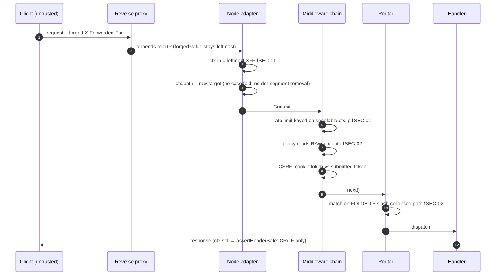

# NextRush Security Engineering Review

**Scope**: security-relevant framework surface — request/response primitives, headers, cookies,
CORS, CSRF, helmet/CSP, static file serving, multipart limits, body parsing, rate limiting,
validation, error handling, cryptographic operations.
**Date**: 2026-07-27 · **Commit**: `5ed6cdc` (branch `docs/quick-start-feedback`)
**Method**: source review of `packages/*/src` via code-graph traversal + direct file reads. Every
finding below cites the file and function it was derived from. Runtime/router/middleware
performance audits were previously completed and are out of scope here.

---

## Executive Summary

NextRush's security middleware is materially better than the Express-ecosystem baseline it competes
with. Deny-by-default CORS, a config-time throw on `credentials + origin:'*'`, prototype-pollution
key blocklists backed by `Object.create(null)` prototypes, `__Host-` as the default CSRF cookie
name with prefix-constraint enforcement, `trustProxy: false` on every adapter, symlinks and dotfiles
disabled by default in static serving, WebCrypto `verify()` instead of hand-rolled comparison, and
non-exposing 5xx error bodies are all correct and non-trivial. The framework is not carrying the
usual crop of beginner mistakes.

The problems are concentrated in three places, and they share one root cause: **a security decision
is made from a value the framework normalized for a different purpose, or from a value an attacker
controls.**

1. **Client IP is attacker-controlled whenever proxying is enabled.** `resolveClientIp()` takes the
   *leftmost* `X-Forwarded-For` entry, and `@nextrush/rate-limit` additionally accepts the first of
   eight proxy headers. Leftmost XFF is the value the client wrote. Every rate limit, IP allowlist,
   and audit log built on `ctx.ip` is bypassable by adding one header. There is no hop count or
   trusted-proxy allowlist available to configure the safe behaviour. **(SEC-01, P1)**
2. **Routing folds case; `ctx.path` does not.** With the default `caseSensitive: false`, `GET
   /ADMIN/users` routes to the handler registered at `/admin/users`, but a middleware that gates on
   `ctx.path.startsWith('/admin')` sees `/ADMIN` and does not fire. That is an authorization bypass
   in the single most common way people write route guards. **(SEC-02, P1)**
3. **The CSRF default configuration cannot work.** `resolveOptions()` coerces an omitted `maxAge` to
   `0` and `serializeCookie()` unconditionally emits `Max-Age=0`, which per RFC 6265 §5.2.2 expires
   the cookie on arrival. The package README documents this default as "session cookie". With the
   documented default config, every state-changing request fails `MISSING_COOKIE` — which pushes
   developers toward `excludePaths` or removing the middleware. **(SEC-03, P2)**

A structural observation independent of any single bug: the audit scope asked about sessions,
authentication, and JWT. **NextRush ships none of them.** There is no session package, no auth
package, no JWT package. Applications hand-roll the highest-risk parts of their security model on
top of `signedCookies`, whose HMAC covers the cookie *value* but not its *name* (SEC-07). The
framework's secure-by-default story is strong for the primitives it owns and absent for the
primitives most applications get wrong.

**Counts**: 2 × P1, 9 × P2, 5 × P3, 2 × P4. No P0 found in the reviewed surface. Areas I did not
read are listed explicitly in *Coverage and Limits* — absence of a finding there is absence of
evidence, not evidence of absence.

---

## Threat Model

**Assets.** Session/authentication cookies and their signing secrets; CSRF secrets; application data
reachable through routed handlers; files under a static root; process availability (CPU, heap, file
descriptors, event loop); audit/log integrity.

**Trust boundaries.** Four, in order of the request path:

| # | Boundary | What crosses it | Who controls it |
| - | -------- | --------------- | --------------- |
| 1 | Internet → reverse proxy | request line, headers, body | attacker fully |
| 2 | Reverse proxy → NextRush | same, plus `X-Forwarded-*` | attacker, **except** what the proxy overwrites |
| 3 | Adapter → Context | `ctx.method/path/query/headers/ip/body` | framework normalization decisions |
| 4 | Context → application policy | whatever middleware reads to make a decision | framework, implicitly |

Boundary 3→4 is where both P1 findings live. The framework normalizes a value for one consumer
(the router) and hands a differently-normalized value to another (policy middleware), without
either side being told they disagree.

**Attackers and goals.** An unauthenticated remote attacker with full framework knowledge, automated
tooling, and high request volume, pursuing: rate-limit and allowlist evasion, authorization bypass
on path-gated routes, CSRF on state-changing endpoints, arbitrary file read under the static root,
and cheap CPU/memory exhaustion.

**Assumptions an attacker will break.** That `ctx.ip` identifies a client. That `ctx.path` is the
path the router matched. That a proxy strips inbound `X-Forwarded-For`. That `Origin` is present on
state-changing browser requests. That a cookie set by the server survives to the next request.

### Where each check actually runs



---

## Attack Surface Inventory

| Surface | Entry point | Untrusted input reaching it | Reviewed |
| ------- | ----------- | --------------------------- | -------- |
| Request line / path | `NodeContext`, `matchRoute()` | method, target, query | yes |
| Client identity | `resolveClientIp()` (`runtime/headers.ts`) | 8 proxy headers | yes |
| Header write path | `NodeContext.set()` → `assertHeaderSafe()` | reflected values | yes |
| Cookie parse | `parseCookies()` (`cookies/parser.ts`) | `Cookie` header | yes |
| Cookie write | `serializeCookie()` (`cookies/serializer.ts`) | app values | yes |
| Cookie signing | `signCookie` / `unsignCookie*` (`cookies/signing.ts`) | signed cookie values | yes |
| CSRF | `csrf().protect` (`csrf/middleware.ts`), `csrf/token.ts` | cookie, header, body, query | yes |
| CORS | `cors()` (`cors/middleware.ts`), `cors/security.ts` | `Origin`, ACRM, ACRH | yes |
| CSP / headers | `helmet/csp.ts`, `helmet/nonce.ts`, `helmet/constants.ts` | app config | yes |
| Static files | `serveStatic()`, `safeJoin()`, `statSafe()`, `sendFile()` | path, `Range`, conditionals | yes |
| Body parsing | `readBody()`, `parseUrlEncoded()`, `setNestedValue()` | body bytes, param names | partial |
| Multipart | `multipart()`, `constants.ts` limits | boundary, part headers, filenames | partial |
| Rate limiting | `rateLimit()`, `key-generator.ts` | proxy headers | yes |
| Validation | `validate()` (`validation/validate.ts`) | body/query/params | yes |
| Errors | `writeDefaultErrorResponse()`, `errorHandler()` | thrown errors | yes |
| Compression | `compression/constants.ts` | `Accept-Encoding` | partial |

---

## Security Architecture Review

**What the architecture gets right.** Security policy is centralized where it matters: one
`resolveClientIp()` for every adapter (so the *policy* is fixed in one place even though the policy
itself is wrong), one `assertHeaderSafe()` for header writes, one error contract shared between
`core`'s `writeDefaultErrorResponse()` and `errors`' `errorHandler()`. Cookie prefix semantics
(`__Secure-`, `__Host-`) are enforced at serialization time rather than documented and hoped for —
`validateCookiePrefix()` will throw if a `__Host-` cookie carries a `Domain`. CSRF defaults its
cookie name to `__Host-csrf` and re-validates the prefix constraints in `resolveOptions()`. That is
the right shape: make the insecure configuration unrepresentable rather than warned about.

**Where the architecture is weak.**

*Normalization has no single owner.* `matchRoute()` folds case and collapses slashes for its own
lookup and deliberately keeps the result private ("the case-fold decision and the structural pass
are separable"). Nothing produces a canonical path for *policy* consumers. Middleware, CSRF
`excludePaths`, and static's prefix check each re-derive their own view from raw `ctx.path`. Four
consumers, four normalizations, no contract between them. SEC-02 and SEC-09 are both instances of
this one architectural gap, and further instances will keep appearing as long as the gap exists.

*Trust in proxy headers is a boolean.* `app.options.proxy` is on or off. Express learned years ago
that this needs to express *how many hops to skip* or *which peers to trust*; a boolean forces the
developer to choose between "broken behind a load balancer" and "spoofable IP". There is no third
option in the current API, so SEC-01 is not a bug to patch in `resolveClientIp()` — it is a missing
configuration type.

*Defense-in-depth in CSRF is opt-in and self-defeating.* `originCheck` defaults to `false`, and
when enabled its fallback comparison is `new URL(origin).host === ctx.get('host')` — both sides
attacker-controlled for a non-browser client. A layer that an attacker can satisfy trivially is not
a layer.

---

## Trust Boundary Analysis

| Boundary | Should be enforced by | Actually enforced by | Verdict |
| -------- | --------------------- | -------------------- | ------- |
| Proxy → app: is this IP real? | trusted-peer or hop-count check | nothing; leftmost header wins | **broken** (SEC-01) |
| Adapter → policy: what path is this? | one canonical path | per-consumer ad-hoc derivation | **broken** (SEC-02, SEC-09) |
| Client → CSRF: is this same-site? | token + origin | token only by default | weak (SEC-04, SEC-05) |
| Client → cookie jar: is this cookie mine? | HMAC over name + value | HMAC over value only | weak (SEC-07) |
| App → response: can a value split headers? | full RFC 9110 field validation | CR/LF only, per-adapter backstop | acceptable, thin (SEC-12) |
| Static root → filesystem | canonicalized containment | `safeJoin()` + `lstat` gate | sound, with a TOCTOU window (SEC-13) |
| Body → object graph | key blocklist + null prototype | both present | **sound** |

---

## Vulnerability Findings

### SEC-01 — `ctx.ip` derives from the attacker-controlled leftmost `X-Forwarded-For` (P1)

- **Component / Package**: client-IP policy — `@nextrush/runtime`, `@nextrush/rate-limit`
- **File / Function**: `packages/runtime/src/headers.ts` → `resolveClientIp()`;
  `packages/middleware/rate-limit/src/utils/key-generator.ts` → `extractClientIp()`,
  `parseProxyHeader()`
- **Security boundary**: reverse proxy → application (identity assertion)
- **Class**: IP spoofing / rate-limit bypass · **CWE-348** (Use of Less Trusted Source), **CWE-290**
  (Authentication Bypass by Spoofing), **CWE-807** · **OWASP A01:2021**, **A07:2021**
- **Root cause**: `resolveClientIp()` does `forwarded.split(',')[0]` — the leftmost entry. A
  conforming proxy *appends* its view of the peer to the right of whatever the client sent, so the
  leftmost element is always client-authored. `@nextrush/rate-limit` widens this further: it iterates
  `PROXY_HEADERS` (`cf-connecting-ip`, `x-real-ip`, `x-forwarded-for`, `x-client-ip`,
  `true-client-ip`, `x-cluster-client-ip`, `forwarded-for`, `forwarded`) and returns the first that
  parses, so the attacker picks whichever header their proxy does not overwrite.
- **Attack scenario**: app behind nginx with `proxy: true` and `rateLimit({ max: 5 })` on
  `POST /login`. Attacker sends 5 requests with `X-Forwarded-For: 1.1.1.1`, then 5 with `1.1.1.2`,
  and so on. nginx appends the real IP each time, but the leftmost value is the attacker's. The
  limiter sees a fresh key per request. Brute-force throttling is gone. The same header defeats
  `whitelist`/`blacklist` (`isIpInList()` receives the spoofed value) and poisons every log line and
  audit record keyed on `ctx.ip`.
- **Preconditions**: `proxy: true` (required for correct client IPs behind any load balancer) and a
  proxy that appends rather than replaces — the normal configuration.
- **Impact**: C: low. I: high (log/audit forgery, allowlist bypass). A: high (throttle bypass →
  credential stuffing at full speed).
- **Likelihood**: high — one header, no tooling.
- **Risk**: **High**
- **Fix**: replace the boolean with a trust specification. `proxy: number` = hops to skip from the
  right; `proxy: string[]` = CIDR list of trusted peers, walking XFF right-to-left and stopping at
  the first address not in the list. Keep `false` as the default. Parse `cf-connecting-ip` only when
  the peer is a Cloudflare range. Reject the whole header set when the direct peer is untrusted
  instead of falling through to it.
- **Secure alternative**: `resolveClientIp(get, { trustedPeers: ['10.0.0.0/8'], directIp })`
  returning `directIp` unless the peer is trusted. Model on Express `trust proxy` / ASP.NET Core
  `ForwardedHeadersOptions.KnownProxies`.
- **Validation**: unit tests asserting `XFF: '1.1.1.1, 10.0.0.5'` with `proxy: 1` resolves
  `10.0.0.5`; a conformance case (`packages/adapters/conformance`) pinning identical resolution on
  Node/Bun/Deno/Edge; a rate-limit regression test proving a rotating XFF does **not** mint new keys.

### SEC-02 — Case-insensitive routing plus raw `ctx.path` allows path-prefix authorization bypass (P1)

- **Component / Package**: path normalization — `@nextrush/router`, adapters
- **File / Function**: `packages/router/src/state.ts` → `resolveRouterOptions()`
  (`caseSensitive: options.caseSensitive ?? false`);
  `packages/router/src/matching.ts` → `normalizePathForMatch()`, `collapseAndStrip()`;
  `packages/router/src/match-route.ts` → `matchRoute()`
- **Security boundary**: Context → application policy
- **Class**: broken access control via normalization mismatch · **CWE-178** (Improper Handling of
  Case Sensitivity), **CWE-863**, **CWE-289** · **OWASP A01:2021**
- **Root cause**: `matchRoute()` computes `folded = path.toLowerCase()` and matches on that, keeping
  the folded path local. `ctx.path` remains the raw request target. Nothing exposes the path the
  router actually matched, so any middleware performing a path comparison is comparing a different
  string than the router used to select the handler.
- **Attack scenario**:
  ```ts
  app.use(async (ctx, next) => {
    if (ctx.path.startsWith('/admin')) await requireAdmin(ctx);  // never fires
    await next();
  });
  admin.get('/admin/users', listAllUsers);                        // still dispatched
  ```
  `GET /ADMIN/users` — guard sees `/ADMIN`, no match, no auth check; router folds to `/admin/users`
  and dispatches. Variants: `/admin/users/` and `//admin//users` also match the route
  (`strict: false` strips the trailing slash, `collapseAndStrip` collapses duplicates) while failing
  a naive prefix or equality test.
- **Preconditions**: default router options; any path-based policy middleware. No authentication
  required.
- **Impact**: C: high. I: high. A: none. Scope: every route behind a path-prefix guard.
- **Likelihood**: high — prefix guards are the idiomatic way to protect a route group, and the
  framework's own docs show `app.use()` mounted middleware.
- **Fix**: two parts. (1) Publish the canonical matched path — `ctx.routePath` or make `ctx.path`
  itself the normalized value the router matched, with the raw target available as
  `ctx.originalPath`. (2) Have the framework compare policy paths itself:
  `app.use('/admin', guard)` must apply the router's own normalization, so developers never
  hand-roll `startsWith`. Consider defaulting `caseSensitive: true` (Fastify's default) — folding is
  a routing convenience with a security cost, and RFC 3986 §6.2.2.1 makes the path case-sensitive.
- **Secure alternative**: a single `canonicalizePath()` in `@nextrush/router`, exported and used by
  the adapter, CSRF `excludePaths`, static's prefix test, and mounted-middleware matching.
- **Validation**: security regression tests for `/ADMIN/users`, `/admin/users/`, `//admin//users`
  against a prefix guard, asserting the guard runs for all of them; a documented invariant test that
  `ctx.path` equals what the router matched.

### SEC-03 — CSRF default configuration emits `Max-Age=0`, deleting the token cookie on arrival (P2)

- **Component / Package**: CSRF — `@nextrush/csrf`
- **File / Function**: `packages/middleware/csrf/src/middleware.ts` → `resolveOptions()`
  (`maxAge: options.cookie?.maxAge ?? 0`), `serializeCookie()`
  (`cookie += '; Max-Age=' + String(options.maxAge)` — unconditional)
- **Security boundary**: server → browser cookie jar
- **Class**: insecure/incorrect default; fail-closed denial that induces an insecure workaround ·
  **CWE-1188**, **CWE-628** · **OWASP A05:2021**
- **Root cause**: an omitted `maxAge` is coerced to `0` rather than left absent, and the serializer
  has no "omit when unset" branch. RFC 6265 §5.2.2: a `Max-Age` ≤ 0 sets expiry to the earliest
  representable date, i.e. immediate deletion. This contradicts the package's own contract —
  `csrf/src/types.ts` says "If omitted, the cookie is a session cookie" and `README.md` documents the
  default as `undefined` (session cookie).
- **Attack scenario**: no attacker needed; this is a self-inflicted outage that degrades security.
  With the documented default config, `generateToken()` sets `__Host-csrf=…; Max-Age=0`, the browser
  discards it, and the next `POST` fails `MISSING_COOKIE` → 403. The realistic developer response to
  "CSRF blocks all my forms" is `excludePaths: ['/api/**']` or removing `protect` — which is the
  actual vulnerability this defect causes.
- **Preconditions**: default options. The existing test suite only asserts the explicit
  `maxAge: 3600` case (`csrf.test.ts:1120`), so CI does not catch it.
- **Impact**: A: high (all state-changing requests rejected). I: high *indirectly*, via the
  workaround it provokes.
- **Likelihood**: certain on the default path.
- **Risk**: **High** (as a driver of CSRF removal), Medium as a pure availability defect.
- **Fix**: `maxAge?: number | undefined` with no `?? 0`; emit the attribute only when
  `maxAge !== undefined`. Reject a negative value at config time rather than serializing it.
- **Validation**: a test asserting the default `Set-Cookie` contains **no** `Max-Age`; an end-to-end
  test that issues a token on `GET` and successfully validates it on a subsequent `POST` with the
  default config — the missing integration test that would have caught this.

### SEC-04 — CSRF origin check is off by default and, when on, compares two attacker-controlled headers (P2)

- **Component / Package**: `@nextrush/csrf`
- **File / Function**: `csrf/src/middleware.ts` → `checkOrigin()`, `resolveOptions()`
  (`originCheck: options.originCheck ?? false`)
- **Class**: origin validation flaw · **CWE-346** (Origin Validation Error), **CWE-350** (Reliance on
  Reverse DNS / untrusted host) · **OWASP A01:2021**
- **Root cause**: three fail-open branches. (1) `if (!origin) return true` — treats a missing
  `Origin` as same-origin; browsers send `Origin` on all `POST`s, so absence means a non-browser
  client, which is precisely when you should not trust it. (2) `Sec-Fetch-Site: none` returns `true`;
  a client that is not a browser simply sets it. (3) The fallback compares
  `new URL(origin).host === ctx.get('host')` — an attacker controls both sides, so
  `Host: evil.com` + `Origin: https://evil.com` passes.
- **Attack scenario**: the layer contributes nothing against a non-browser attacker and is disabled
  by default against a browser one. It only ever stops an attack the token check already stops.
- **Preconditions**: `originCheck: true` for it to run at all.
- **Impact**: no new exposure by itself; it is a defense-in-depth layer that does not defend, so the
  token path (SEC-05) carries the entire weight.
- **Likelihood**: medium (developers reasonably assume enabling it adds protection).
- **Fix**: default `originCheck: true`. Validate `Origin` against a configured allowlist of the
  app's own origins — never against `Host`. Treat a missing `Origin` on an unsafe method as a
  **failure** unless the request is explicitly non-browser (no `Sec-Fetch-*`, no `Cookie`). Trust
  `Sec-Fetch-Site` only in the negative direction (`cross-site` → reject); never as an allow signal.
- **Validation**: unit tests for missing `Origin`, forged `Host`+`Origin` pair, and
  `Sec-Fetch-Site: none` — each expecting rejection on an unsafe method.

### SEC-05 — CSRF tokens are not session-bound by default (P2)

- **Component / Package**: `@nextrush/csrf`
- **File / Function**: `csrf/src/middleware.ts` → `resolveOptions()`
  (`getSessionIdentifier: options.getSessionIdentifier` — undefined unless supplied);
  `csrf/src/token.ts` → `buildMessage()` (omits the session leg when no `sessionId`)
- **Class**: CSRF · **CWE-352**, **CWE-565** (reliance on cookie without integrity/scope) ·
  **OWASP A01:2021**
- **Root cause**: with no `getSessionIdentifier`, the HMAC covers only the random value, so any token
  the server ever issued is valid for any session. Signed double-submit without session binding is
  explicitly the weaker OWASP variant, vulnerable to cookie injection from a sibling subdomain
  (`Domain=.example.com` set by a compromised `blog.example.com` overwrites the victim's token with
  one the attacker also knows).
- **Attack scenario**: attacker registers, obtains a valid token, then delivers a cross-site form
  POST after overwriting the victim's `csrf` cookie via a subdomain XSS or a cookie-tossing
  vector. Both cookie and submitted token are attacker-known and HMAC-valid. `__Host-` (the default
  name) blocks the subdomain overwrite specifically — but only while the developer keeps the default
  name and `secure: true`.
- **Preconditions**: `getSessionIdentifier` not supplied (the zero-config path), plus a
  cookie-injection vector, or a non-`__Host-` cookie name.
- **Impact**: I: high on state-changing endpoints.
- **Likelihood**: medium.
- **Fix**: make session binding mandatory when the app has a session concept: require either
  `getSessionIdentifier` or an explicit `sessionBinding: 'none'` acknowledgement, so the weaker mode
  is a deliberate, visible choice. Document that `__Host-` must not be relaxed.
- **Validation**: test that a token minted under session A fails validation under session B; test
  that constructing `csrf()` without either option throws.

### SEC-06 — `constantTimeEqual()` blinds with a hardcoded public key and re-imports it per request (P2)

- **Component / Package**: `@nextrush/csrf`
- **File / Function**: `csrf/src/token.ts` → `constantTimeEqual()`
- **Class**: timing side channel / hardcoded cryptographic key / CPU amplification · **CWE-208**,
  **CWE-321** (Hard-coded Cryptographic Key), **CWE-400** · **OWASP A02:2021**
- **Root cause**: the HMAC-blinding comparison technique (hash both inputs under a key, compare
  digests) depends on the key being **secret and unpredictable** — that is what stops an attacker
  from computing candidate digests offline and probing the comparison. Here the key is the literal
  string `'csrf-compare'`, so the blinding provides no secrecy at all; the construction's safety
  reduces entirely to `crypto.subtle.verify()` being constant-time, making the HMAC wrapper pure
  overhead. Separately, unlike `importKey()` elsewhere in the same file, this path has **no key
  cache**: every call performs `importKey` + `sign` + `verify`.
- **Attack scenario**: an unauthenticated attacker sends `POST` floods carrying any cookie token and
  a garbage submitted token. Each request costs three WebCrypto operations including a fresh key
  import, before any application work and before the HMAC validation that would reject it. Cheap
  asymmetric CPU load, and it runs *before* the real signature check.
- **Preconditions**: `csrf().protect` mounted; an arbitrary cookie value (attacker sets their own).
- **Impact**: A: medium. C: low (no practical timing leak given `verify()`).
- **Likelihood**: medium.
- **Fix**: generate the blinding key once per process from `crypto.getRandomValues()` and cache the
  `CryptoKey` — or drop the HMAC wrapper and compare the two hex strings with the existing
  length-folded XOR loop (`cookies/signing.ts` → `timingSafeEqual()`), which is honest about its
  guarantees and allocation-free. Reorder `protect` to reject on cheap checks (hex shape, length)
  before any crypto.
- **Validation**: benchmark WebCrypto ops per rejected request (expect 1, not 3); assert the
  blinding key is not a compile-time constant.

### SEC-07 — Signed cookies bind the signature to the value, not the cookie name (P2)

- **Component / Package**: `@nextrush/cookies`
- **File / Function**: `cookies/src/signing.ts` → `signCookie()` (`data = encoder.encode(value)`),
  `unsignCookie()`
- **Class**: insufficient signature scope · **CWE-345** (Insufficient Verification of Data
  Authenticity), **CWE-565** · **OWASP A08:2021**
- **Root cause**: the HMAC message is the bare value. Nothing ties a signature to the cookie it was
  issued for, so any signed value is interchangeable between cookie names.
- **Attack scenario**: an app sets `signedCookies.set('tier', 'premium')` for paying users and
  `signedCookies.set('user', name)` for everyone. A free user copies the `tier` value they obtained
  during a trial into any cookie the app reads with a fallback, or — more realistically — the app has
  a low-privilege signed cookie whose value collides with a high-privilege one's expected format.
  `get()` verifies and returns it. Also unbounded in time: there is no expiry inside the signed
  payload, so an old signed value stays valid forever while the secret lives.
- **Preconditions**: an app using more than one signed cookie, or reusing values across names.
- **Impact**: I: medium-high, depending on what the app signs.
- **Likelihood**: medium.
- **Fix**: HMAC over a length-prefixed tuple of `(name, value, issuedAt)` — the same
  `len!field!len!field` construction `csrf/token.ts` already uses correctly for session binding.
  Reject on name mismatch. Add an optional `maxAge` verified inside the signature.
- **Validation**: test that a value signed as `a` fails `get('b')`; test that an expired signed
  payload is rejected.

### SEC-08 — Cookie defaults omit `Secure` (P2)

- **Component / Package**: `@nextrush/cookies`
- **File / Function**: `cookies/src/constants.ts` → `DEFAULT_COOKIE_OPTIONS`
  (`{ httpOnly: true, sameSite: 'lax', path: '/' }`)
- **Class**: sensitive cookie without `Secure` · **CWE-614**, **CWE-311** · **OWASP A02:2021**,
  **A05:2021**
- **Root cause**: `httpOnly: true` and `SameSite=Lax` are correct defaults; `secure` is simply
  absent, presumably so local HTTP development works. `SECURE_DEFAULTS` and `secureOptions()` exist
  but must be opted into, and the JSDoc on `cookies()` says "add `secure: true` in production" — a
  documented footgun rather than a safe default.
- **Attack scenario**: a network attacker who can induce one plaintext request to the origin
  (`http://` link, downgraded redirect, captive portal, absent HSTS) receives the session cookie in
  cleartext.
- **Preconditions**: any request reaching the origin over HTTP.
- **Impact**: C: high for session cookies.
- **Likelihood**: medium (HSTS mitigates; not all deployments preload).
- **Fix**: `secure: 'auto'` as the default — emit `Secure` unless the request is demonstrably
  plaintext loopback. The middleware has the Context and can decide per request; the developer
  cannot forget. Keep `secure: false` available as an explicit override.
- **Validation**: tests asserting `Secure` is present over HTTPS and over a proxied HTTPS request,
  and absent only for `http://localhost`.

### SEC-09 — No dot-segment normalization of the request path (P2)

- **Component / Package**: `@nextrush/router`, adapters
- **File / Function**: `router/src/matching.ts` → `collapseAndStrip()` (collapses `//`, strips a
  trailing `/`, folds case — no RFC 3986 §5.2.4 `remove_dot_segments`)
- **Class**: path normalization inconsistency / proxy desync · **CWE-22**, **CWE-41** (Improper
  Resolution of Path Equivalence) · **OWASP A01:2021**
- **Root cause**: the framework's normalization is a strict subset of what RFC 3986 requires and of
  what every front-end proxy performs. A request for `/api/webhooks/../admin` keeps its `..` segment
  in `ctx.path`.
- **Attack scenario**: two directions, both real. (1) *Exemption widening*: CSRF
  `excludePaths: ['/api/webhooks/*']` matches `/api/webhooks/../admin` by prefix, skipping CSRF; the
  router will not resolve that target to the admin route, so this is currently a near-miss rather
  than a bypass — but the exemption logic is already wrong and only the router's own strictness saves
  it. (2) *Proxy desync*: nginx resolves dot segments before `proxy_pass`, so the path the proxy
  authorized (`/admin`) is not the path a NextRush ACL inspected (`/api/webhooks/../admin`), or vice
  versa depending on which side holds the ACL. Any WAF or proxy-level path rule can be desynced from
  the application's view.
- **Preconditions**: path-based policy anywhere in the stack — extremely common.
- **Impact**: I: medium, escalating to high in a proxy-authorized deployment.
- **Likelihood**: medium.
- **Fix**: implement `remove_dot_segments` in the canonical path function proposed in SEC-02, and
  **reject** (400) rather than silently resolve a path containing `..` or `.` segments — rejecting
  invalid input beats attempting recovery, and no legitimate client sends them.
- **Validation**: tests that `/a/../b`, `/a/./b`, `/a/%2e%2e/b` are rejected with 400; a test that
  CSRF exemptions match only fully-canonical paths.

### SEC-10 — CORS reflects `Access-Control-Request-Headers` when `allowedHeaders` is unset (P2)

- **Component / Package**: `@nextrush/cors`
- **File / Function**: `cors/src/middleware.ts` →
  `const headersToAllow = normalizedAllowedHeaders || requestHeaders`
- **Class**: overly permissive cross-domain policy · **CWE-942**, **CWE-183** (permissive allowlist) ·
  **OWASP A05:2021**
- **Root cause**: with no configured `allowedHeaders`, the preflight response echoes whatever the
  client asked for, so the preflight stops being an allowlist.
- **Attack scenario**: an allowlisted-but-lower-trust origin (a partner frontend, a subdomain, a
  reflected-origin config) can send any request header — `Authorization`, `X-Admin-Override`,
  internal routing headers — because the framework pre-approves them. It does not grant new origins,
  but it removes the header-level restriction that CORS exists to provide.
- **Preconditions**: `origin` allows at least one origin the attacker can influence, and
  `allowedHeaders` unset.
- **Impact**: C/I: medium, scaling with what the app trusts in request headers.
- **Likelihood**: medium (this is the zero-config path).
- **Fix**: default to a conservative literal set (`Content-Type`, `Accept`,
  `X-Requested-With`, plus `Authorization` only when `credentials` is enabled) and intersect the
  requested headers against it rather than echoing. Warn once when a preflight requests a header
  outside the set.
- **Validation**: a test that a preflight requesting `X-Anything` does not receive it in
  `Access-Control-Allow-Headers` under default options.

### SEC-11 — Static serving delivers SVG and HTML inline, enabling stored XSS on user-content roots (P2)

- **Component / Package**: `@nextrush/static`
- **File / Function**: `static/src/utils.ts` → `MIME_TYPES` (`.svg` → `image/svg+xml`, `.html` →
  `text/html`); `static/src/send-file.ts` → `setFileHeaders()`
- **Class**: stored XSS via content type · **CWE-79**, **CWE-434** (unrestricted upload of file with
  dangerous type) · **OWASP A03:2021**
- **Root cause**: `X-Content-Type-Options: nosniff` is set by default (good, and better than most
  static middleware), but `nosniff` does not help when the declared type is itself
  script-capable. There is no `Content-Disposition` and no way to serve a directory as
  non-renderable content short of a `setHeaders` hook.
- **Attack scenario**: an app uses `@nextrush/multipart` to accept avatars into `./uploads` and
  `serveStatic({ root: './uploads' })` to serve them. Attacker uploads `avatar.svg` containing
  `<script>fetch('/api/me').then(...)</script>`; any victim who opens the image URL executes it on
  the application's origin, with cookies.
- **Preconditions**: a static root containing attacker-influenced files — the standard
  upload-then-serve pattern the two packages invite together.
- **Impact**: C: high (session theft on-origin). I: high.
- **Likelihood**: high in apps that serve uploads.
- **Fix**: add `serveStatic({ untrusted: true })` (or make it the default for any root also used as
  an upload destination) which forces `Content-Disposition: attachment`,
  `Content-Security-Policy: sandbox; default-src 'none'`, and downgrades `image/svg+xml` and
  `text/html` to `application/octet-stream`. Document serving user content from a separate origin as
  the primary recommendation.
- **Validation**: a test asserting an `.svg` under `untrusted: true` is served as
  `application/octet-stream` with `Content-Disposition: attachment` and a `sandbox` CSP.

### SEC-12 — `assertHeaderSafe()` validates only CR/LF (P3)

- **Component / Package**: `@nextrush/runtime`, adapters
- **File / Function**: `runtime/src/response-builder.ts` → `assertHeaderSafe()`
- **Class**: header injection · **CWE-113** (CRLF Injection in HTTP Headers), **CWE-93** ·
  **OWASP A03:2021**
- **Root cause**: the check tests `includes('\r') || includes('\n')` on the field and value only. It
  does not validate that the field name is an RFC 9110 token, does not reject NUL or other control
  characters, and does not reject leading/trailing whitespace (obs-fold precursor). Node's
  `res.setHeader()` backstops all of these, and the Web `Headers` API backstops most — so this is
  currently defense-in-depth that is thinner than the layer beneath it, and the *advertised* guard
  (per its own comment: "Guard against CRLF injection … via the shared helper") is weaker than
  developers will assume when writing a custom adapter.
- **Impact**: none today via Node/Web adapters. The risk is a future adapter or a raw response path
  that lacks the backstop.
- **Likelihood**: low.
- **Fix**: validate the field against `/^[!#$%&'*+\-.^_`|~0-9A-Za-z]+$/` and the value against
  `/^[\t\x20-\x7E\x80-\xFF]*$/` with no leading/trailing whitespace. Throw a typed error, not a bare
  `Error`.
- **Validation**: a table-driven test over `\0`, `\x7F`, ` X-Foo`, `X Foo`, and an obs-fold value.

### SEC-13 — Static file TOCTOU between `lstat` and open (P3)

- **Component / Package**: `@nextrush/static`
- **File / Function**: `static/src/utils.ts` → `statSafe()`; `static/src/send-file.ts` → `sendFile()`
  (`fsp.readFile(absolutePath)` / `createReadStream(absolutePath)`)
- **Class**: race condition on file access · **CWE-367** (TOCTOU), **CWE-59** (link following) ·
  **OWASP A01:2021**
- **Root cause**: `statSafe()` correctly refuses symlinks by default via `lstat`, but the subsequent
  read re-resolves the path by name. A symlink created in the window is followed by the read.
- **Attack scenario**: requires local write access inside the static root — e.g. an upload directory
  that also allows the attacker to control the filename. Attacker uploads `x`, then races a
  `GET /x` against replacing `x` with a symlink to `/etc/passwd` or `../.env`.
- **Preconditions**: attacker-writable static root. Narrow, but exactly the upload-serving pattern
  that SEC-11 also targets.
- **Impact**: C: high (arbitrary read as the server user) when preconditions hold.
- **Likelihood**: low.
- **Fix**: open by handle first (`fsp.open`), then `fstat` and stream from the same descriptor, so
  the file examined and the file sent are the same inode.
- **Validation**: a race test that swaps the path for a symlink between the two operations and
  asserts a 404, not the linked content.

### SEC-14 — `includeStack` has no production guard (P3)

- **Component / Package**: `@nextrush/errors`
- **File / Function**: `errors/src/middleware.ts` → `errorHandler()`
- **Class**: information exposure through an error message · **CWE-209**, **CWE-497** ·
  **OWASP A05:2021**
- **Root cause**: the default is correctly `false`, and `core`'s `writeDefaultErrorResponse()` never
  exposes a non-`HttpError` message. But `includeStack: true` is honoured unconditionally, and the
  function's own JSDoc hands developers `includeStack: process.env.NODE_ENV !== 'production'` —
  one misconfigured environment variable away from publishing absolute paths, package layout, and
  dependency versions.
- **Impact**: C: medium (reconnaissance).
- **Likelihood**: low-medium.
- **Fix**: ignore `includeStack` when `app.isProduction` (the flag already exists and is threaded
  through the adapters), logging a warning once. Fail safe rather than obey.
- **Validation**: a test asserting no `stack` key in the body when `isProduction` is true even with
  `includeStack: true`.

### SEC-15 — CSRF `excludePaths` `/*` matches unlimited depth (P3)

- **Component / Package**: `@nextrush/csrf`
- **File / Function**: `csrf/src/middleware.ts` → `isPathExcluded()`
- **Class**: overly broad allowlist pattern · **CWE-183**, **CWE-625** · **OWASP A01:2021**
- **Root cause**: the single-star branch checks only `path.startsWith(prefix)` and
  `path[prefix.length] === '/'` — the same test as the double-star branch. A developer writing
  `/api/webhooks/*` to exempt one level also exempts `/api/webhooks/a/b/c/admin-action`.
- **Impact**: I: medium — a wider CSRF exemption than intended.
- **Likelihood**: medium (the code comment itself distinguishes the two forms, so the divergence is
  unintentional).
- **Fix**: `/*` must match exactly one remaining segment (reject if the remainder contains `/`);
  `/**` keeps the any-depth behaviour. Combine with the canonical-path fix from SEC-09.
- **Validation**: a test that `/api/webhooks/*` excludes `/api/webhooks/stripe` but **not**
  `/api/webhooks/stripe/deep`.

### SEC-16 — No session, authentication, or JWT primitive in the framework (P3, architectural)

- **Component**: framework surface as a whole
- **Evidence**: the package inventory (`packages/middleware/*`, `packages/extensions/*`) contains no
  session, auth, or JWT package; `@nextrush/cookies`' `signedCookies` is the closest primitive and
  has SEC-07.
- **Class**: missing security control · **CWE-1059** · **OWASP A07:2021** (Identification and
  Authentication Failures)
- **Why it matters here**: the framework's stated philosophy is that it absorbs complexity so
  applications do not implement infrastructure. Session management, token verification, and
  algorithm/`kid` handling are the highest-density source of real-world authentication CVEs, and
  they are currently 100% application responsibility with no framework-blessed path. Every NextRush
  app reinvents session rotation, fixation prevention, and revocation.
- **Fix**: ship `@nextrush/session` (signed, name-bound, rotating-on-privilege-change, with a
  pluggable store) and either `@nextrush/jwt` with an algorithm allowlist and mandatory
  `aud`/`iss`/`exp` verification, or an explicit documented recommendation of a vetted library. If
  the answer is deliberately "not our scope", say so in the docs so developers stop looking.
- **Validation**: for a session package — fixation test (session ID must change on login),
  revocation test, and an idle/absolute-timeout test.

### SEC-17 — Compression covers script-capable text types with no BREACH guidance (P3)

- **Component / Package**: `@nextrush/compression`
- **File / Function**: `compression/src/constants.ts` → `DEFAULT_COMPRESSIBLE_TYPES` (includes
  `text/html`, `application/json`, `image/svg+xml`), `DEFAULT_OPTIONS`
- **Class**: compression side channel · **CWE-208** (BREACH class) · **OWASP A02:2021**
- **Root cause**: compressing an HTML/JSON response that contains both a secret (CSRF token, session
  identifier) and attacker-reflected input leaks the secret through response length. This is
  inherent to HTTP compression, not a NextRush defect — but the framework both enables compression
  for those types and ships the CSRF middleware whose token is exactly the secret at risk, and
  offers no mitigation hook. I reviewed the constants only, not `middleware.ts`'s
  `Cache-Control: no-transform` handling.
- **Impact**: C: medium under the standard BREACH preconditions (secret + reflection + many
  requests).
- **Likelihood**: low.
- **Fix**: document the interaction; expose a `skip` predicate so a response carrying a CSRF token
  can opt out; consider length randomization for `text/html`. Verify `no-transform` is honoured.
- **Validation**: a test that `Cache-Control: no-transform` suppresses compression; a documented
  recipe pairing CSRF with compression safely.

### SEC-18 — Partial public-suffix list for cookie `Domain` validation (P4)

`cookies/src/constants.ts` → `COMMON_PUBLIC_SUFFIXES` is a curated heuristic (explicitly documented
as not the full PSL). A cookie scoped to an unlisted shared suffix passes validation and becomes
visible to every tenant of that platform (**CWE-1275**-adjacent, **CWE-565**). The current list
covers the common shared-hosting cases, which is a good cost/benefit trade. Recommendation: keep the
heuristic, but expose a `publicSuffixList` injection point so an app can supply the real PSL, and
warn (not throw) on an unrecognized multi-label suffix.

### SEC-19 — CSRF token accepted from the query string (P4)

`csrf/src/middleware.ts` → `defaultTokenExtractor()` falls back to `ctx.query._csrf`. Tokens in URLs
land in access logs, `Referer` headers, and browser history (**CWE-598**). It is last in the
precedence chain and labelled "rare, last resort", so exposure is limited to apps that use it —
but the framework should not offer it by default. Recommendation: remove the query fallback from the
default extractor; developers who need it can supply `getTokenFromRequest`.

---

## Abuse Case Analysis

| Abuse question | Answer from the code | Verdict |
| -------------- | -------------------- | ------- |
| Bypass a rate limit? | Rotate `X-Forwarded-For` when `proxy: true` | **yes** — SEC-01 |
| Bypass a route guard? | Uppercase the path prefix | **yes** — SEC-02 |
| Burn CPU cheaply? | `POST` flood → 3 uncached WebCrypto ops per rejected CSRF request | partly — SEC-06 |
| Exhaust memory via body? | No: `readBody()` pre-checks `Content-Length`, passes the limit into `bodySource.buffer(limit)` for incremental enforcement, and re-checks post-read for chunked bodies | **no** |
| Exhaust memory via params? | No: 1000-param cap, depth 20, array index capped at 1000, JSON depth 64 | **no** |
| Exhaust memory via cookies? | No: 50-cookie cap in `parseCookies()`, 4096-byte serialization cap | **no** |
| Pollute `Object.prototype`? | No: `FORBIDDEN_KEYS` checked on every segment in `setNestedValue()` *and* on flat keys, containers built with `Object.create(null)` | **no** |
| Exhaust the rate-limit store? | Bounded at `DEFAULT_MAX_ENTRIES = 100_000` plus `INFO_CACHE_MAX = 10_000` | **no** |
| Escape the static root? | Not by path: decode → reject `..`/NUL/`//` → `safeJoin()` containment → `lstat` symlink refusal. Yes by inode race under narrow conditions | mostly no — SEC-13 |
| Read arbitrary files via `Range`? | No: single range only, bounds-validated, clamped | **no** |
| Split a response header? | No: CR/LF rejected, plus the Node/Web backstop | **no** |
| Read a stack trace? | Not by default; only via explicit `includeStack` | **no** — SEC-14 is the guard gap |
| Steal a session cookie over HTTP? | Yes, if the app relies on defaults | **yes** — SEC-08 |
| Run script on the app origin? | Yes, via an uploaded SVG on a served root | **yes** — SEC-11 |
| Forge an audit trail? | Yes, via spoofed `ctx.ip` | **yes** — SEC-01 |

---

## OWASP & CWE Mapping

| Finding | Severity | CWE | OWASP Top 10 (2021) | ASVS 4.0 |
| ------- | -------- | --- | ------------------- | -------- |
| SEC-01 IP spoofing | P1 | 348, 290, 807 | A01, A07 | 1.9.1, 13.1.4 |
| SEC-02 case-fold bypass | P1 | 178, 863, 289 | A01 | 4.1.1, 4.1.3 |
| SEC-03 CSRF `Max-Age=0` | P2 | 1188, 628 | A05 | 3.4.x, 14.1.1 |
| SEC-04 origin check | P2 | 346, 350 | A01 | 4.2.2, 13.2.3 |
| SEC-05 no session binding | P2 | 352, 565 | A01 | 4.2.2 |
| SEC-06 hardcoded blinding key | P2 | 208, 321, 400 | A02 | 6.2.3, 2.9.3 |
| SEC-07 signature scope | P2 | 345, 565 | A08 | 3.5.2, 6.2.1 |
| SEC-08 no `Secure` | P2 | 614, 311 | A02, A05 | 3.4.1 |
| SEC-09 dot segments | P2 | 22, 41 | A01 | 5.1.4, 12.3.1 |
| SEC-10 CORS header echo | P2 | 942, 183 | A05 | 14.5.3 |
| SEC-11 inline SVG/HTML | P2 | 79, 434 | A03 | 5.3.3, 12.5.2 |
| SEC-12 thin header guard | P3 | 113, 93 | A03 | 5.3.1 |
| SEC-13 static TOCTOU | P3 | 367, 59 | A01 | 12.3.4 |
| SEC-14 `includeStack` | P3 | 209, 497 | A05 | 7.4.1 |
| SEC-15 `/*` depth | P3 | 183, 625 | A01 | 4.1.3 |
| SEC-16 no session/auth/JWT | P3 | 1059 | A07 | 3.x, 2.x |
| SEC-17 BREACH surface | P3 | 208 | A02 | 9.1.x |
| SEC-18 partial PSL | P4 | 565 | A05 | 3.4.x |
| SEC-19 token in query | P4 | 598 | A01 | 3.1.1 |

---

## Framework Comparison

Compared on *default posture* — what a developer gets without reading security docs.

| Dimension | NextRush | Express 4/5 | Fastify | Hono | NestJS | ASP.NET Core | Spring Boot |
| --------- | -------- | ----------- | ------- | ---- | ------ | ------------ | ----------- |
| CORS default | **deny** (`origin: false`) | n/a (middleware; `cors()` = `*`) | deny | deny | deny | deny | deny |
| `credentials`+`*` | **throws at config time** | silently allowed | allowed | allowed | allowed | throws | rejected |
| Trust-proxy model | **boolean only** ⚠ | hops / subnets / fn | hops / list | manual | inherits Express | KnownProxies/Networks | list |
| Path case default | **insensitive** ⚠ | insensitive | **sensitive** | sensitive | insensitive | insensitive (routing) but ACLs unified | sensitive |
| Dot-segment normalization | **none** ⚠ | none | rejects some | none | none | **normalizes** | **normalizes** |
| Cookie `Secure` default | off (httpOnly on) | off | off | off | off | **on for auth cookies** | **on** |
| CSRF built in | yes, opt-in package | no | plugin | no | no | **yes, integrated** | **yes, on by default** |
| Session built in | **no** ⚠ | no | plugin | no | no | **yes** | **yes** |
| Body limits by default | **yes** (1 MB JSON) | 100 KB | 1 MB | none | inherits | yes | yes |
| Prototype-pollution guards | **yes, explicit** | qs-dependent | yes | n/a | inherits | n/a | n/a |
| 5xx body leaks internals | **no** | **yes in dev default** | no | no | no | no | no |
| Static: symlinks / dotfiles | **off / ignored** | serve-static: on / ignored | off | n/a | inherits | n/a | n/a |

**Strengths worth keeping.** The config-time throw on `credentials + '*'` is better than every
Node peer — that class of misconfiguration is the single most common CORS finding in the wild, and
NextRush makes it unrepresentable. Deny-by-default CORS, explicit prototype-pollution blocklists,
`__Host-` as the CSRF cookie default with enforced prefix constraints, and non-exposing 5xx bodies
are all ahead of the Express ecosystem.

**Gaps worth closing, adapted rather than copied.**
- **Trust-proxy expressiveness** from ASP.NET Core (`KnownProxies`/`KnownNetworks`) — the model to
  adopt, because it makes the safe configuration *expressible*, which a boolean does not. Do not
  copy Express's string-DSL (`'loopback, 10.0.0.1'`); a typed `number | string[]` fits NextRush's
  type-first API better.
- **Case-sensitive routing** from Fastify/Spring. This is a behaviour change and belongs in a major
  release with a migration note; the interim fix is publishing the canonical matched path (SEC-02),
  which is additive.
- **Path canonicalization before dispatch** from ASP.NET Core / Spring. NextRush should go further
  than either and *reject* dot segments rather than resolve them — consistent with the framework's
  own stated preference for rejecting invalid input over recovering from it.
- **Framework-owned session** from Spring/ASP.NET Core. Not a plugin ecosystem punt: SEC-16 argues
  this follows directly from NextRush's own "framework owns complexity" principle.

Deliberately **not** recommended: Spring's on-by-default CSRF. NextRush's middleware-explicit model
is a legitimate design choice, and forcing CSRF on would break API-only apps. Fixing SEC-03/04/05
so the opt-in path is correct is the better move.

---

## Secure-by-Default Evaluation

| Question | Answer |
| -------- | ------ |
| Are dangerous features opt-in? | Mostly. `followSymlinks`, `dotfiles: 'allow'`, `includeStack`, `privateNetworkAccess`, `proxy` all default off. `proxy: true` is opt-in but has no safe setting (SEC-01). |
| Are defaults conservative? | Body/param/cookie/store limits: yes. Cookie `Secure`: no (SEC-08). CORS `allowedHeaders`: no (SEC-10). Router case: no (SEC-02). |
| Can a developer accidentally build something insecure? | Yes, in four documented ways: a prefix guard (SEC-02), an upload directory served statically (SEC-11), a session cookie on defaults (SEC-08), and disabling CSRF because the default config does not work (SEC-03). |
| Are common mistakes prevented? | `credentials + '*'` — prevented by a throw. `__Host-` misuse — prevented by a throw. Prototype pollution — prevented. Weak CSRF secret — prevented (`< 32` chars throws). This is genuinely strong. |
| Are error messages safe? | Yes. 5xx never exposes the internal message; 4xx exposes only `expose`-flagged errors; stacks are off by default. |
| Are sensitive values protected? | Signing secrets never appear in output. `sanitizeForLogging()` exists in `cookies/validation.ts`. Key caches are bounded, keyed by the secret in memory only. |
| Are security features easy to enable? | Yes for helmet/CORS/rate-limit. CSRF is currently *not* — SEC-03 makes the documented default fail. |
| Does the framework fail safely? | Almost always. Fail-open exceptions: `checkOrigin()`'s missing-`Origin` and `Sec-Fetch-Site: none` branches (SEC-04); `safeDecodeURIComponent()` and `decodeParam()` returning raw input on malformed encoding (acceptable, since the raw value then fails to match anything). |

Net: the framework is secure-by-default for the attacks it explicitly models, and silently insecure
where a security decision depends on a value the framework normalized for a different consumer.

---

## Defense-in-Depth Opportunities

1. **One canonical path, one owner.** Export `canonicalizePath()` from `@nextrush/router` and route
   every consumer through it — adapters, mounted middleware, CSRF exemptions, static prefixes. Fixes
   SEC-02, SEC-09, SEC-15 structurally instead of individually, and prevents the next instance.
2. **Typed trust boundary for proxies.** `proxy: false | number | string[]`. Makes SEC-01
   unrepresentable rather than documented.
3. **A `security()` preset.** One call composing helmet + strict cookies + CSRF + rate limit +
   canonical-path enforcement with production defaults, so the secure path is the shortest path.
4. **Production assertions at boot.** When `isProduction`, throw or loudly warn on: cookies without
   `Secure`, `cors({ origin: true, credentials: true })`, `includeStack: true`, `dotfiles: 'allow'`,
   `proxy: true` without a trust specification. `cors` already has `securityWarning()` — generalize
   it to a framework-level startup audit.
5. **Bind every signature to its context.** The length-prefixed
   `len!field!len!field` construction in `csrf/token.ts` is correct; reuse it in `cookies/signing.ts`
   (SEC-07) so no signed artifact is portable across names.
6. **Untrusted-content mode for static.** One flag that forces attachment disposition, a `sandbox`
   CSP, and a neutral content type (SEC-11).
7. **Fuzz the parsers.** `parseCookies`, `parseUrlEncoded`/`setNestedValue`, `parseRange`,
   `extractBoundary`, and the multipart scanner are the highest-value fuzz targets. Property tests
   should assert: never throws an unhandled error, never writes to `Object.prototype`, never returns
   a path outside root, always terminates.

---

## Prioritized Remediation Roadmap

**Now — before any release positioned as production-ready**

| # | Action | Blast radius |
| - | ------ | ------------ |
| 1 | SEC-03: stop emitting `Max-Age=0`; add the missing issue→validate integration test | low, contained to `csrf` |
| 2 | SEC-01: typed `proxy` trust spec; XFF right-to-left with trusted peers | medium, cross-adapter + conformance suite |
| 3 | SEC-02: publish the canonical matched path; make `app.use(prefix, …)` use router normalization | medium, router + adapters |
| 4 | SEC-11: `untrusted: true` mode for `serveStatic` | low |

**Next — same minor cycle**

| # | Action |
| - | ------ |
| 5 | SEC-04/05: `originCheck: true` by default, allowlist-based; require an explicit session-binding decision |
| 6 | SEC-07: HMAC over `(name, value, issuedAt)` — breaking change for existing signed cookies, needs a migration note and a rotation window |
| 7 | SEC-08: `secure: 'auto'` default |
| 8 | SEC-10: conservative default `allowedHeaders` with intersection |
| 9 | SEC-06: per-process random blinding key + cached `CryptoKey`, or drop the wrapper |
| 10 | SEC-09/15: reject dot segments; correct `/*` depth |

**Then**

| # | Action |
| - | ------ |
| 11 | SEC-12: full field-name/value validation in `assertHeaderSafe()` |
| 12 | SEC-13: open-by-handle in `sendFile()` |
| 13 | SEC-14: ignore `includeStack` in production |
| 14 | SEC-16: `@nextrush/session` (RFC-gated), and a documented JWT position |
| 15 | SEC-17/18/19: BREACH documentation + `skip` hook; PSL injection point; drop the query-token fallback |

**Architectural, RFC-gated**

- `caseSensitive: true` as the default (major release).
- Framework-level production security audit at boot (item 4 in Defense-in-Depth).
- A `security()` composite preset.

---

## Validation Plan

**Security regression suite** (new, per-package, must fail before each fix and pass after):

| Target | Cases |
| ------ | ----- |
| Client IP | rotating XFF does not mint new rate-limit keys; `proxy: 1` returns the second-from-right entry; untrusted peer → `directIp`; identical resolution on all four adapters (conformance) |
| Path | `/ADMIN/users`, `/admin/users/`, `//admin//users` all hit a `/admin` prefix guard; `/a/../b` → 400; `/api/webhooks/*` does not exempt `/api/webhooks/a/b` |
| CSRF | default `Set-Cookie` has no `Max-Age`; issue-on-GET then validate-on-POST with default options; token from session A fails under session B; forged `Host`+`Origin` rejected; missing `Origin` on POST rejected |
| Cookies | value signed as `a` fails `get('b')`; `Secure` present over HTTPS by default; expired signed payload rejected |
| CORS | default preflight does not echo `X-Anything`; `credentials + '*'` throws |
| Static | `.svg` under `untrusted: true` served as octet-stream + attachment + sandbox CSP; symlink swap race returns 404 |
| Headers | NUL, `\x7F`, leading space, invalid token name all rejected by `assertHeaderSafe()` |
| Errors | no `stack` in the body when `isProduction`, even with `includeStack: true` |

**Fuzz / property testing** — `parseCookies`, `parseUrlEncoded`, `setNestedValue`, `parseRange`,
`extractBoundary`, multipart scanner. Invariants: no unhandled throw; `Object.prototype` untouched;
`safeJoin` never escapes root; bounded time and allocation on all inputs.

**Malformed-request testing** — raw-socket suite against the Node adapter: duplicate
`Content-Length`, `Content-Length` + `Transfer-Encoding` together, oversized header blocks, slow
headers/body (Slowloris), absent `Host`, multiple `Host`. **This suite does not exist yet and the
request-parsing surface was not reviewed here** — see Coverage and Limits.

**Static analysis / supply chain** — CI gate on `pnpm audit`; a lint rule banning `String` →
`ctx.set()` of unvalidated request values; a check that no security default regresses (snapshot the
resolved defaults of `cors`, `csrf`, `cookies`, `static`, `rateLimit` and diff on change).

**RFC compliance** — assert RFC 6265 §5.2.2 (`Max-Age` omission), §4.1.2 (prefixes), RFC 3986
§5.2.4/§6.2.2.1 (dot segments, path case), RFC 9110 §5.1/§5.5 (field name and value grammar).

---

## Coverage and Limits

Read and analyzed: `csrf/{token,middleware,constants,types}.ts`; `cookies/{signing,parser,serializer,middleware,constants}.ts`;
`cors/{middleware,security}.ts`; `helmet/{csp,nonce,constants}.ts`;
`static/{index,utils,send-file}.ts`; `body-parser/{constants,utils/url-decode,parsers/reader}.ts`;
`multipart/{middleware,constants}.ts`; `rate-limit/{constants,utils/key-generator}.ts` + middleware
call sites; `validation/validate.ts`; `core/error-handler.ts`; `errors/middleware.ts`;
`runtime/{headers,response-builder}.ts` (relevant functions); `router/{matching,state}.ts` +
`match-route`/`registration` call sites; `adapters/node/context.ts` (`set`, `getClientIp`).

**Not reviewed — no findings should be inferred as absence of risk:**

- **Node adapter request parsing** — `Content-Length` vs `Transfer-Encoding` conflict handling,
  duplicate/absent `Host`, header count and size limits, `Expect: 100-continue`, trailers, upgrade
  handling, socket and header timeouts (Slowloris). This is where request smuggling and HTTP
  desynchronization would live; it is the **highest-priority follow-up**, and the framework's
  reliance on Node's own parser means the risk is mostly inherited, not eliminated.
- **`multipart/parser.ts` and `scanner.ts`** — boundary scanning, part-header parsing, filename
  sanitization application, `allowedTypes` enforcement (in particular whether the client-supplied
  `Content-Type` is trusted without magic-byte verification), and `storage/` temp-file creation,
  permissions, and cleanup-on-abort. The *limits* are conservative and were verified; the *parser*
  was not.
- **`body-parser/parsers/json.ts`** — depth-limit enforcement mechanism, reviver usage, charset
  handling (`SUPPORTED_CHARSETS` includes `base64`/`hex`, which is unusual for text parsing and
  warrants a look).
- **`compression/middleware.ts`** — `no-transform` handling, streaming path, `Vary` correctness.
- **`@nextrush/class` guards, interceptors, and filters** — authorization enforcement ordering,
  whether a guard can be bypassed by a thrown filter, request-scope isolation between requests.
- **`@nextrush/template`** — auto-escaping behaviour in `compiler.ts`/`helpers.ts`. This is a
  first-order XSS surface (`resolveValue` is the highest fan-in function in the middleware tree) and
  should be the second follow-up after request parsing.
- **`@nextrush/websocket`, `@nextrush/stream`, `@nextrush/openapi`** (docs-UI HTML generation),
  `@nextrush/health` (information disclosure via probe payloads), `@nextrush/logger` (sensitive-value
  redaction).
- **Dependency supply chain** — `tsyringe` and `reflect-metadata` (the only runtime dependencies,
  confined to the DI/class path) were not CVE-checked; no `pnpm audit` was run.

---

## Final Security Recommendations

1. **Fix the CSRF default before anything else.** A security middleware whose documented default
   configuration cannot complete a request is worse than no middleware, because the fix developers
   reach for is removal. It is also the cheapest fix on the list.
2. **Make the safe proxy configuration expressible.** SEC-01 is not a coding error in
   `resolveClientIp()` — the function faithfully implements a policy that a boolean flag cannot
   state safely. Change the type, not just the parsing.
3. **Give the framework one canonical path.** Both P1s and three P2s reduce to different consumers
   normalizing the request path differently. One `canonicalizePath()` with one owner closes the
   present instances and prevents the next ones. This is the single highest-leverage change in the
   report.
4. **Keep making misconfiguration unrepresentable.** The `credentials + '*'` throw and the `__Host-`
   prefix validation are the best things in this codebase's security posture. Extend the pattern:
   throw on `proxy: true` without a trust spec; throw on `includeStack: true` in production; throw
   on a `__Secure-` cookie without `Secure`. A throw at boot beats a warning in a doc.
5. **Bind every signature to its context.** `csrf/token.ts` already does this correctly with
   length-prefixed session binding. `cookies/signing.ts` does not. Same repo, same primitive, two
   standards — unify on the stronger one.
6. **Close the session/auth gap or state the position.** Per the framework's own constitution,
   complexity belongs in the framework, not the application. Session management is the largest
   remaining pocket of security complexity NextRush pushes onto its users.
7. **Audit request parsing next.** Everything in this report sits *above* the HTTP parser. Request
   smuggling and desynchronization — the two P0-capable classes in the threat model — live in a layer
   that has not been reviewed. Schedule it as the immediate follow-up, with a raw-socket
   malformed-request suite as its deliverable.
