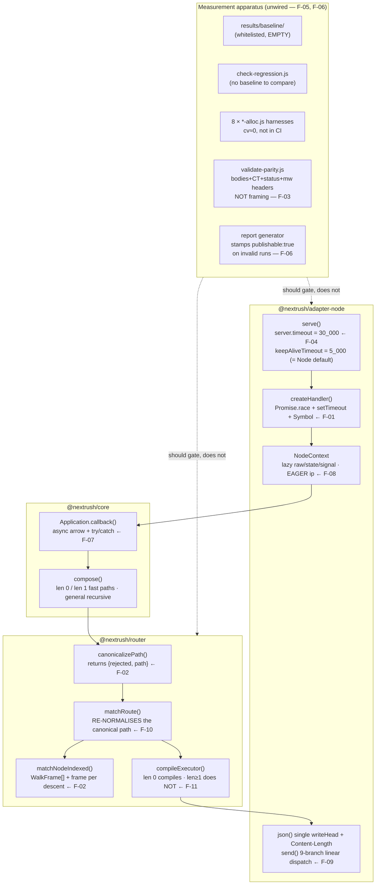

# Performance — Two-Investigation Reconciliation Review

| Field            | Value                                                                                        |
| ---------------- | -------------------------------------------------------------------------------------------- |
| **Report type**  | Performance                                                                                  |
| **Scope**        | Reconciliation of two independent performance investigations of NextRush v3 (`reports/investigations/nextrush-performance-engineering-agent-claude/` and `.../nextrush-performance-engineering-gpt/`), re-adjudicated against source |
| **Date**         | 2026-07-28                                                                                   |
| **Reviewer(s)**  | Reconciliation pass (third, independent — did not author either investigation)                |
| **Commit / ref** | `feat/dev` @ `5f77df1fcedcf62923ce08361e45e07bc9e9772c`                                       |
| **Status**       | Final                                                                                        |
| **Related**      | `docs/playbooks/performance-review-playbook.md` · `report/core/performance-review.md` (prior) · `report/router/route-params-profile.md` (prior, artifacts absent) · `report/adapters/runtime-platform-review.md` (F-04 origin) · ADR-0010 |

**Method.** Both investigations were read in full — every main-line file, every subsystem file,
every appendix — plus the governing playbook. Neither was trusted. Every load-bearing claim either
report makes about the hot path was re-verified against source at the commit above using
`codebase-memory-mcp` (`get_code_snippet`, `index_status`) and direct reads. Four claims changed
under verification and six findings neither team produced were discovered. Where the two reports
disagree, the disagreement is resolved with cited evidence rather than by preferring a report.

**Evidence labels used throughout, applied strictly:**

| Label | Meaning |
| ----- | ------- |
| **[M] Measured** | Read directly from the stored benchmark artifact |
| **[D] Derived** | Arithmetic on measured throughput (`µs/req = 1e6 / rps`, then subtraction of a control) |
| **[S] Structural** | Read directly in source at `5f77df1`; mechanism confirmed, cost not measured |
| **[U] Unmeasured** | Observed or asserted with no supporting measurement |

---

> **⚠️ OPERATIONAL CORRECTION — read before running any command from this report.**
>
> `pnpm bench:compare --profile full` (5 runs × 10 scenarios × multiple concurrency levels ×
> 6 frameworks) takes **5–10 hours**. It is correct for a human producing a publishable release
> figure. It is **wrong for dev-loop and agentic work** — nobody should run it to "just check
> something," and every recommendation below that names `--profile full` assumes a human explicitly
> chose to spend that time, not an agent defaulting to it.
>
> **For dev-loop / agentic verification, use the harness's own documented quick-checkup form**
> (`apps/benchmark/scripts/run.js`'s own header comment calls this exact pattern the
> *"Quick dev/AI-agent checkup (seconds, not the full multi-hour suite)"*):
> ```bash
> cd apps/benchmark
> node scripts/run.js --compare --connections 256 --time 5 --runs 1
> ```
> — **no `--profile full` flag.** Omitting `--profile` defaults to the `quick` profile;
> `--connections`, `--time` (alias for `--duration`), and `--runs` then override just those three
> parameters on top of it, per the harness's own documented flag behavior. This completes in low
> tens of seconds, not hours, and is exactly the shape F-06's fix (§12,
> `apps/benchmark/scripts/generate-report.js`) is *designed to handle correctly*: a run this small
> must self-report `publishable: false` — it is a dev/agent checkup, never a number to cite in a
> comparison table or a commit message.
>
> **Never combine `--profile full` with dev-scale overrides** (`--connections 512 --time 5
> --runs 1` *together with* `--profile full`). That combination is exactly the defect F-06
> documents: the profile name gets stamped as `publishable: true` while the effective run is a
> 5-second single-run sweep — precisely the shape of the invalid artifact
> (`2026-07-28T11-05-40`) that this report's §12 F-06 and the OpenSpec change
> `fix-benchmark-measurement-integrity` exist to stop from happening again.
> If a task needs the actual publishable baseline, that is a deliberate, human-scheduled,
> multi-hour run — flag it as such and do not run it inline as part of routine dev/agent work.
>
> **Rule of thumb for any future agent reading this report:** dev/agent iteration → the
> quick-checkup command above, always `publishable: false`, cited only as "a quick check showed X,"
> never as a benchmark table entry. A real publishable number → `--profile full` with no overrides,
> run deliberately, on a CPU-pinned machine, and only when someone has explicitly budgeted the
> hours for it.

---

## Progress Tracker

**Remediation:** `[█████████████████░░░]` ~83% — recommendations 1, 2, 5, 6, 7 (resolvable portion),
8, 9, 10, 11, 12 resolved; only recommendations 3 and 4 remain open, and both are now understood as
a *runtime* cost (a dedicated multi-hour pinned session) rather than a missing capability — CPU
pinning is available and measurably collapses run-to-run drift from ±25–58% to ~1–5% (see their rows
below). Recommendation 7's F-02a portion was corrected rather than carried forward. **Before citing
any `B/op` figure from this report, read §0 first** — the allocation harnesses are not
cross-comparable, and one such misreading has already occurred.

| Rec | Addresses | Priority | Status |
| --- | --------- | -------- | ------ |
| 1   | R-06      | P0       | ✅ Resolved — `fix-benchmark-measurement-integrity` |
| 2   | R-03      | P0       | ✅ Resolved — `fix-benchmark-measurement-integrity` |
| 3   | P-00      | P0       | ⬜ Open — CI gates + `bench:alloc:handler` done (`fix-benchmark-measurement-integrity`); the actual pinned `--profile full` baseline itself is not yet captured. **Blocker corrected (2026-07-29): this is a RUNTIME cost, not a missing capability.** CPU pinning IS available on the dev machine — `taskset` is installed and `scripts/run.js` already supports `--pin` / `--client-pin`. Measured effect of pinning (server cores 0-3, client 4-7, 5 runs, `hello-world` @256c, repeated twice): between-batch drift falls from **±25–58% unpinned to ~1–5% pinned** — a usable ruler. What remains is that `standard` (~6h) and `full` (~26h) across 13 scenarios need a dedicated, human-scheduled session on an otherwise-idle machine. Earlier "hardware-blocked" wording overstated the blocker |
| 4   | C3 (P-01/R-04) | P0  | ⬜ Open — three-arm diagnostic control built and exercised at dev-scale (`fix-benchmark-measurement-integrity`); a CPU-pinned, multi-run version of the same three-arm A/B is still outstanding. Same corrected blocker as Rec 3: pinning is available, runtime is the cost. **Cautionary datum (2026-07-29):** an unpinned single-batch A/B of the handler-timeout race measured a +23% gain (16,139 → 19,846 RPS) that **fully reversed** under interleaved repetition (RACE-ON 25,187 vs RACE-OFF 24,460 mean over 3 alternating rounds); the same configuration measured 16,139 in one batch and 25,540 in another, a 58% swing on identical code. Do not accept any timeout-arm conclusion from an unpinned, non-interleaved run |
| 5   | F-GATE-01 | P0       | ✅ Resolved for the four named decisive scenarios (`hello-world`, `empty-response`, `route-params`, `post-json`) at dev-scale — see `reports/investigations/cpu-allocation-profiling-results.md` (`add-benchmark-cpu-allocation-profiling`). A CPU-pinned, multi-run version would strengthen these findings but the capability gap this recommendation named is closed |
| 6   | OQ-1 / OQ-5 | P0     | ✅ Resolved — `fix-benchmark-measurement-integrity` |
| 7   | P-01 (A1) + R-01 + P-02b | P1 | ✅/⬜ MIXED, corrected — the `TIMEOUT_SENTINEL` hoist shipped in `fix-benchmark-measurement-integrity`; the double-normalization de-dup (`matchRoute`'s redundant fold+collapse on the real dispatch path) shipped in `reduce-per-request-floor-cost` via an internal `preNormalized` flag. **Correction discovered while implementing `reduce-per-request-floor-cost`**: `canonicalizePath`'s result-object removal (this recommendation's original framing of "P-02b") is **not implementable as originally scoped** — `canonicalizePath`'s `{rejected, path}` shape is the ratified public contract of `RFC-029` ("the single normalization owner," cited for SEC-02/SEC-09/SEC-15), so reshaping it is an RFC-level decision, not a one-line allocation deletion; dropped from scope, not deferred. Separately, `matchRoute`'s own single-`RouteMatch`-allocation optimization (a DIFFERENT, unrelated finding this report's F-02 section also named) was found to already be shipped at HEAD independently of any of these three changes (cited as "design.md D1 / HP-10" in source) — this report's F-02 inventory had a stale entry that should not be re-implemented if referenced again |
| 8   | R-05      | P1       | ✅ Resolved — `reduce-per-request-floor-cost` (`Application.callback()` de-async: `.then(undefined, handler)` replaces the `async`/`try`/`catch` wrapper) |
| 9   | P-01 (A2) | P1       | ✅ Resolved — `reduce-per-request-floor-cost` (`createHandler`'s `Promise.race` replaced with an explicit `settled` flag + `.then(onSuccess, onError)`; the diagnostic bypass from `fix-benchmark-measurement-integrity` remains a separate, still-available control). **Honest caveat**: the router-focused allocation harnesses (`router-match-alloc`, `param-match-alloc`) confirmed the predicted reduction, but `handler-alloc`'s `timeout > 0` variant measured a real, reproducible ~5–7% INCREASE (647→687 B/req) rather than the predicted decrease — traced to closure-capture shape (two independent `.then` callbacks each capturing `settled`/`timerId`/their own `finalize*`, versus the old design's one shared post-race callback), not measurement noise. Three alternative closure shapes were tried and rejected (a shared settle-function: worse; `setTimeout` extra-args instead of closure capture: worse and much noisier). Shipped anyway — the explicit-flag mechanism's auditability (this recommendation's actual intent) is judged to outweigh a ~35–40 byte/request cost on this one narrow timer-arm/disarm metric, especially given no closure-shape alternative beat `Promise.race` — see `openspec/changes/archive/reduce-per-request-floor-cost/tasks.md` task 4.3 for the full investigation |
| 10  | P-02 / R-02 | P1     | ✅ Resolved — `reduce-router-match-allocations` (`matchNodeIndexed`'s `WalkFrame[]` stack and `matchRoute`'s `bindNames`/`bindValues` arrays are pooled per-router-instance, rebuilt only when a new registered route's depth exceeds the current pool). Measured reduction: param-route hit 467.6 → 328.9 B/op (−29.7%) on `bench:alloc:router`; depth-8 param 303.3 → 271.3 B/op (−10.6%) on `bench:alloc:param-match`. The outer `RouteMatch` single-allocation contract (this report's own, separately-tracked stale F-02 note) is unaffected and unchanged — see `openspec/specs/router/spec.md`'s existing "A matched request allocates a single RouteMatch object" requirement, which this change deliberately did not touch |
| 11  | P-03 / C2 | P2       | ✅ Resolved — three parts, all closed. (a) The 3 missing benchmark scenarios shipped in `reduce-router-match-allocations` (`send-object`, `static-file`, `large-post`, all passing `bench:validate`). (b) The general-path (2+ middleware) per-layer closure allocation was investigated and found **not** reducible without codegen — collapsing `compose()`'s per-`dispatch(i)` closure to one shared `nextFn` breaks the load-bearing double-next-detection guarantee (`middleware-single-fastpath.test.ts`'s "next() called n times" case), and `.bind()` allocates equivalently. Backward chain compilation remains permanently out of scope (codegen forbidden). (c) **F-09 (elide `Promise.resolve` for synchronous middleware returns) is now shipped** in `elide-resolved-promise-allocation`: a shared module-level `RESOLVED` sentinel replaces four fresh-allocation sites, short-circuiting **only** on `=== undefined` so non-Promise thenables are still adopted. Measured on `bench:alloc:compose`'s new `sync` variant: **115.6 → 14.0 B/op, −87.9%** for synchronous middleware. **Honest scope limit: this moves no benchmark scenario** — every `apps/benchmark` middleware is `async` or returns `ctx.next()`, and `Promise.resolve(p) === p` means the async path never allocated there (measured flat: 806.1 → 814.5 B/op). The win is real for real-world synchronous middleware (`helmet`/`cors`/`request-id`-shaped layers), not for this suite |
| 12  | R-04      | P2 (ADR) | ✅ Already resolved — `ADR-0010-cross-runtime-parity-hardening.md` (Status: Accepted, 2026-07) already made this exact decision under its sub-decision 2: keep `server.timeout` and the handler-level race complementary/coupled (rejecting "replace `server.timeout` with the handler race" as a slow-loris-guard regression). This report's own Rec 12 wording predated that ADR being cross-referenced back here — a documentation-linking gap, not an open decision |

---

## 0. How to read the allocation harness numbers (read before citing any B/op figure)

**Added 2026-07-29 after a real misreading was made while analysing this report.** The
`bench:alloc:*` harnesses are not all measuring the same thing, and their absolute figures are
**not comparable across harnesses**.

`bench:alloc:compose` reports ~807 B/op (fast, len 1) and ~1526 B/op (general, len 2). Those are
**not `compose()`'s per-request cost.** Per that harness's own method note, it is an allocation-RATE
measurement that (a) uses an `async (_ctx, next) => { await next(); }` middleware — so each figure
includes that middleware's *own* promise and async state machine — and (b) deliberately **retains
every returned promise in an array** so mid-loop GC cannot reclaim what it measures, which also
counts the retained promise and the array slot.

Consequences:

- **Valid:** the fast-vs-general *delta* (~807 vs ~1526, same methodology, same middleware) — this is
  what the harness was built to prove, and it is why moving an `app.use()` layer off the `len === 1`
  fast path costs a real ~719 B/req.
- **Invalid:** ranking `compose` (807) against `bench:alloc:context` (8.2 B/req) or
  `bench:alloc:dispatch` (57.3 B/req flat) as if they shared an axis, and concluding compose is
  "the biggest per-request bucket." Those harnesses differ in retention strategy and in what the
  measured unit includes. That comparison was made once during this report's follow-up work and was
  wrong.

Rule: cite a B/op figure only against another figure **from the same harness and variant**, or as a
before/after on the same variant. Cross-harness absolute comparisons need a purpose-built harness
that does not yet exist.

---

## 1. Executive Summary


Two independent teams investigated the same benchmark run (`2026-07-27T15-42-50`) from opposite
epistemic positions and converged on the same primary suspect. That convergence is the strongest
signal in either report. Their disagreements turn out to be about *standards of evidence*, not
about mechanism — with two exceptions where one team was simply right and the other simply
incomplete.

NextRush is not a slow framework. It is the fastest server in the suite at concurrency 1 (winning
5 of 10 scenarios) **[M]** and then gains ~1–11% throughput moving to 64 connections while every
peer including Express gains 15–53% **[M]**. That is not a concurrency defect; it is the visible
shadow of a per-request CPU cost that saturates the event loop before the load generator gets
going.

**Top findings:**

1. **The timeout tax is two mechanisms, not one — and both reports costed only one.** A per-request
   `Promise.race` + `setTimeout(30s)` + `Symbol()` in `createHandler` **[S]**, *plus* an armed
   per-connection `server.timeout = 30_000` that Node defaults to `0` and that no other benchmarked
   server sets **[S]**. Priority **P0**. (§12 F-01, F-04)
2. **The decisive experiment both reports designed is invalid.** `timeout: 0` changes two variables
   — the handler race *and* the socket timeout — because `serve()` feeds one option to both
   consumers. A positive result would be unattributable. Priority **P0**. (§12 F-04)
3. **The measurement baseline is contaminated, so every "vs raw Node" percentage in both reports is
   wrong in an unknown direction.** The raw-node baseline sends no `Content-Length` → chunked
   framing; NextRush sends `Content-Length`; `validate-parity.js` never asserts framing **[S]**.
   Priority **P0**. (§12 F-03)
4. **The harness will certify an invalid run as publishable.** `2026-07-28T11-05-40` is stamped
   `profile: full, publishable: true` with 1 run, 5 s, one concurrency level, and 89–149 wrk socket
   timeouts per cell **[M]**. Priority **P0**. (§12 F-06)
5. **The param path allocates roughly twice what the more detailed report claimed.** ~10–11
   allocations per `/users/:id` request, not 5 — Claude omitted the `WalkFrame` stack entirely, GPT
   spotted the frames but never counted anything **[S]**. Priority **P1**. (§12 F-02)
6. **Performance is not an invariant.** An 18-item optimisation campaign was measurably undone on
   one hot path by a correctness-motivated parity fix four days after it completed, and nothing
   detected it **[M]** + **[S]**. Priority **P0**. (§12 F-05)

**Headline recommendation.** Do not start with code. Three of the four P0 items change *what the
numbers mean*; an optimisation measured against a chunked-encoding baseline, by a report generator
that will certify a saturated 5-second sweep as publishable, produces a number that feels like
progress and is not one. Fix the ruler (week 1), then the floor (week 2), then the param path
(week 3), then re-measure and publish only what a pinned multi-run measured (week 4).

---

## 2. System Understanding

Before evaluating anything, this is what the two investigations were looking at and why it is
shaped the way it is.

**The request path.** A NextRush request on Node traverses five framework frames before user code
runs:

```
node:http 'request'
  └─ createHandler(app, options) closure          ← built once at serve() time
       ├─ createNodeContext(req, res, opts)       ← NodeContext, per request
       ├─ finalizeSuccess / finalizeError         ← 2 closures, per request
       ├─ app.callback()  → async (ctx) => {...}  ← async frame, per request
       │    └─ compose(middlewareStack)           ← composed once at boot
       │         └─ createRoutesMiddleware(ctx)   ← the router as middleware
       │              ├─ canonicalizePath(...)    ← per request
       │              ├─ matchRoute(...)          ← per request
       │              │    ├─ static map probe    ← O(1)
       │              │    └─ matchNodeIndexed()  ← trie walk, param routes only
       │              └─ routeMatch.executor(ctx) ← compiled at registration
       └─ timeout race (Promise.race + setTimeout) ← per request
```

**Why it is built this way, and the reasons are good ones.** The Context abstraction exists so no
core/router/middleware code touches `req`/`res`, which is what lets one application run unchanged
on Node, Bun, Deno, and edge runtimes (`architecture.instructions.md` §7). The handler-level
timeout race was added deliberately by `d97734e3` (2026-07-22) to satisfy audit finding F-04 /
ADR-0010: Bun, Deno, Edge and Serverless adapters all produced a handler-level `504`, and Node
relied only on a socket-level guard, so the adapters diverged observably. `Object.create(null)` for
params is a prototype-pollution control. The limit-enforcing body parser with `TextDecoder` is a
DoS control. Dot-segment rejection returns 400-and-stops rather than falling through to 404
specifically so the un-normalised target cannot leak via `ctx.path`.

**The optimisation history matters to every finding below.** The team ran a rigorous trimming
campaign (HP-1…HP-18, then NF-1…NF-4) and shipped essentially all of it — verified present at
HEAD: the method-nested static map with no key-string allocation (HP-9), deferred param binding
replacing eager-bind-plus-`Reflect.deleteProperty` (HP-11), the case-stability single decision
(HP-12), the bind-count replacing `Object.keys` (HP-13), the single `writeHead` in `json()`
(HP-14), lazy `ctx.raw` (HP-5), lazy `ctx.state` (NF-2), and the removal of an async frame at the
router→executor boundary (NF-1). **Four days after NF-1 removed one async frame and one microtask
hop, a parity fix added roughly eleven allocations and three microtask hops to the frame directly
above it.** No gate existed to notice.

**What the two investigations had to work with.** One benchmark session: 6 servers × 10 scenarios ×
{1, 64, 256} connections × 3 runs = 540 timed measurements, wrk 4.2.0, Node v26.4.0, Intel
i5-8300H (4C/8T), **CPU pinning off**, framework order fixed, load generator on the same machine as
the server. Coefficient of variation ≤1.7% at 64/256c. **Zero** CPU profiles, heap snapshots,
allocation profiles, GC traces, or event-loop measurements against current source. No pinned
baseline (the `results/baseline/` path is whitelisted in `.gitignore` and the directory is empty).

One correction to the framing of the original request: the run `2026-07-27T15-42-22` is a mislabeled
duplicate — its CSV carries `run_id = 2026-07-27T15-42-50`. Both investigations analysed
`15-42-50`. Treating the two directories as independent samples would double-count one session.

---

## 3. Architecture Overview

The scope under review is the per-request path across four packages, plus the measurement apparatus
that is supposed to defend it.



Dependency direction is respected everywhere the reports looked; no layering violation was found by
either team or by this reconciliation. The architectural problems are behavioural, not structural:
work placed at request time that belongs at registration time, and safety machinery whose cost
scales with all traffic rather than with pathological traffic.

---

## 4. Data Flow

What actually happens per request on the `route-params` scenario — the widest measured gap — with
each allocation attributed to the finding that owns it.

```mermaid
sequenceDiagram
    autonumber
    participant Sock as node:http socket
    participant H as createHandler closure
    participant Ctx as NodeContext
    participant CB as callback() async arrow
    participant Cmp as compose (len===1)
    participant RM as routesMiddleware
    participant MR as matchRoute
    participant W as matchNodeIndexed
    participant Ex as executor
    participant Res as ctx.json

    Sock->>H: request event
    Note over Sock: server.timeout=30_000 arms a<br/>PER-CONNECTION timer — F-04<br/>(Node default is 0; no peer sets it)
    H->>Ctx: createNodeContext(req,res,frozenOpts)
    Note over Ctx: eager getClientIp() → socket getter<br/>+ retained string — F-08
    H->>H: Symbol('timeout') · [p1,p2] · new Promise<br/>setTimeout · 2 .then · .catch — F-01
    H->>CB: handler(ctx)
    Note over CB: async state machine + try/catch<br/>= 1 extra microtask hop — F-07
    CB->>Cmp: fn(ctx)
    Note over Cmp: len===1 fast path (root mount)<br/>general path NEVER benchmarked — F-11
    Cmp->>RM: routesMiddleware(ctx, next)
    RM->>RM: canonicalizePath() → {rejected,path} — F-02
    Note over RM: indexOf('?') · isProvablyLowerAscii<br/>· collapseAndStrip
    RM->>MR: match(ctx.method, canonical.path)
    Note over MR: REPEATS indexOf('?') ·<br/>isProvablyLowerAscii · collapseAndStrip<br/>on already-canonical input — F-10
    MR->>MR: static map probe ×2 (both MISS for param route)
    MR->>MR: bindNames[] · bindValues[] — F-02
    MR->>W: matchNodeIndexed(...)
    Note over W: stack:WalkFrame[] + 1 frame,<br/>+1 frame per descent/backtrack,<br/>+1 slice() string per segment — F-02
    W-->>MR: HandlerEntry
    MR->>MR: Object.create(null) params + copy loop
    MR-->>RM: {handler, params, middleware, executor} — F-02
    RM->>Ex: routeMatch.executor(ctx)
    Ex->>Res: handler(ctx) → ctx.json(payload)
    Note over Res: stringify → byteLength → ONE writeHead<br/>with Content-Length → end (at parity)
    Res-->>H: promise settles
    H->>H: clearTimeout + race resolution
    H-->>Sock: response
```

**Total allocations on this path, corrected:** ~11 from the timeout race (F-01) + ~10–11 from the
param path (F-02) + 2 finalize closures + 1 Context + 1 compose closure + 1 async frame (F-07) +
the serialized string. The two reports counted 11 and 5 respectively for the first two groups; the
verified count for the second group is roughly double what was reported.

---

## 5. Backend / Logic

The reconciliation found no correctness defect in either subsystem the reports flagged, and both
reports were right to treat correctness as non-negotiable. Three logic-level observations that bear
on performance:

**Settle-once semantics are currently implicit.** `Promise.race` provides settle-once for free.
Any replacement (F-01's recommended flag-and-callback) must make it explicit, and the single most
likely regression is a handler that rejects *after* the timeout already responded — today
`handlerPromise.catch(() => undefined)` swallows it so it cannot crash the process as an unhandled
rejection. This must be asserted on the process event, not inferred from absence of a crash.

**`setNext(NOOP_NEXT)` is load-bearing, and the source says so (NF-4a).** Without it, a handler
calling `ctx.next()` leaks into app-level middleware mounted *after* the router, because the general
`compose` dispatch wires `ctx._next` to advance into that middleware. Any chain rewrite (F-11) that
loses this breaks silently and only in applications that mount middleware after the router.

**The reused-mutable-state invariant in F-02's fix is invisible.** `matchRoute` is synchronous from
allocation to consumption — no `await`, no yield, no callback into user code between the bind arrays
being filled and `params` being materialised. That is what makes router-owned reusable stacks safe.
A future `await` inserted anywhere in `match-route.ts` or `matching.ts` silently cross-contaminates
concurrent requests, with no test failing. Claude identified this correctly and prescribed an
invariant comment plus an interleaved-match test; GPT refused the whole class of fix on the same
grounds. Both are defensible; the fix ships only with both mitigations.

---

## 6. Database / State

_Not applicable — NextRush is a framework with no persistence layer, and neither investigation
touched data storage. The nearest analogue is the static-file subsystem's filesystem access, covered
in §9 and §12 F-12._

---

## 7. Frontend / API Surface

Public API is materially relevant here for one reason: it constrains which fixes are cheap.

**Every fix in §14 rows 1–11 is internal.** No change to `ServeOptions`, `Context`, or `Middleware`
is required by the timeout restructure, the param-path allocation removal, the normalisation
de-duplication, the `callback()` de-async, or the chain compilation. That is what makes them
non-RFC-gated and independently revertible.

**Exactly one recommendation touches the public surface** — F-04's socket-timeout decision. Making
`server.timeout` independently configurable from the handler timeout adds a `ServeOptions` field and
changes a security-relevant default's blast radius, so it is RFC/ADR-gated per AGENTS.md §5 and §20.

**One rejected alternative is worth recording so it is not re-proposed:** setting
`DEFAULT_TIMEOUT_MS = 0` to make the handler timeout opt-in. It is the fastest and simplest change
available and both this reconciliation and Claude's report reject it. It silently removes a
cross-runtime parity guarantee that was deliberately added, and weakens a security default on Node
only while Bun/Deno/Edge stay bounded. Reverting a correctness fix to win a benchmark is the wrong
trade.

---

## 8. UX

_Not applicable — the reviewed scope is a server-side request path with no user-facing interface.
Developer experience is treated as API surface in §7._

---

## 9. Performance

Measured numbers only in this section; derivations are marked and their method is stated.

### 9.1 Standing (`2026-07-27T15-42-50`, 3 runs/cell, CV ≤1.7% at 64/256c) **[M]**

| Rank | Framework | Score | Scenario wins |
| ---- | --------- | ----- | ------------- |
| 1 | Raw Node.js | 139 / 144 | 19 |
| 2 | Fastify | 112 | 0 |
| 3 | Hono | 91 | 0 |
| **4** | **NextRush v3** | **90** | **5 — all at concurrency 1** |
| 5 | Koa | 45 | 0 |
| 6 | Express | 27 | 0 |

The 90-vs-91 separation from Hono is inside noise and is not a ranking. The informative anomaly is
the wins column: NextRush is the only non-baseline server to win any scenario outright, yet scores
below a framework that won none. A server that wins scenarios but scores low is winning them all in
one regime and losing everywhere else.

### 9.2 Throughput at 256 connections **[M]**

| Scenario | NextRush | vs raw Node | vs Fastify | vs Hono |
| -------- | -------- | ----------- | ---------- | ------- |
| Empty Response | 32,999 | −25.1% | −18.3% | — |
| Hello World | 28,917 | −18.1% | −15.8% | −5.9% |
| JSON Serialization | 28,388 | −19.5% | −16.1% | −6.6% |
| Deep Route | 25,913 | −22.4% | −18.2% | −8.3% |
| **Route Parameters** | 23,878 | **−28.9%** | **−25.5%** | **−14.8%** |
| Query Strings | 22,739 | −16.9% | −14.1% | −3.7% |
| Middleware Stack¹ | 22,217 | −25.5% | −25.6% | −6.1% |
| Large JSON | 19,198 | −11.3% | −9.9% | −2.3% |
| Error Handling¹ | 17,965 | −26.3% | −9.7% | −9.7% |
| POST JSON | 17,909 | −28.9% | −9.6% | −10.3% |

¹ labelled idiomatic-not-like-for-like by the harness and excluded from the scoreboard; still
analysable because each server's own `hello-world` is an internal control.

**The vs-raw-Node column carries a correction.** Per F-03, the raw-node baseline responds with
chunked framing while NextRush sends `Content-Length`. The baseline's own cost is therefore inflated
by chunk framing, which means NextRush's true overhead above raw Node is **larger** than these
percentages show, not smaller.

### 9.3 Concurrency scaling, 1 → 64 connections **[M]** — the master symptom

| Scenario | NextRush | Fastify | Raw Node | Hono | Koa | Express |
| -------- | -------- | ------- | -------- | ---- | --- | ------- |
| Hello World | **×1.11** | ×1.43 | ×1.42 | ×1.25 | ×1.25 | ×1.20 |
| JSON Serialization | **×1.07** | ×1.42 | ×1.40 | ×1.29 | ×1.26 | ×1.18 |
| Route Parameters | **×1.01** | ×1.39 | ×1.35 | ×1.25 | ×1.25 | ×1.15 |
| Deep Route | **×1.02** | ×1.40 | ×1.34 | ×1.27 | ×1.23 | ×1.15 |
| Middleware Stack | **×1.01** | ×1.35 | ×1.31 | ×1.28 | ×1.22 | ×1.15 |
| Query Strings | **×1.04** | ×1.35 | ×1.30 | ×1.26 | ×1.25 | ×1.13 |
| Large JSON | **×1.05** | ×1.26 | ×1.19 | ×1.18 | ×1.17 | ×1.12 |
| Empty Response | ×1.22 | ×1.36 | ×1.53 | ×1.35 | ×1.36 | ×1.26 |
| POST JSON | ×1.24 | ×1.21 | ×1.33 | ×1.25 | ×1.20 | ×1.16 |
| Error Handling | ×1.20 | ×1.23 | ×1.24 | ×1.09 | ×1.13 | ×1.02 |

Worst scaling in the suite on seven of ten scenarios, behind Express. The two scenarios that scale
*normally* are the two whose per-request cost is dominated outside the framework pipeline — body I/O
event handling and V8 `Error` construction. When the bottleneck is elsewhere, NextRush scales like
its peers. That contrast is itself evidence.

**Caveat that both reports under-weighted:** wrk (4–8 threads) and the server share four physical
cores with pinning off. The load generator competes for the CPU the server needs, which distorts
precisely this metric. The *existence* of early saturation survives that caveat; "worse than
Express" as a ranking does not.

### 9.4 Cost decomposition **[D]**

Method: `µs/req = 1e6 / rps_mean` at 256 connections (event loop saturated, Node single-threaded),
then subtract each framework's **own** control scenario. Valid for comparing frameworks on the same
scenario; not an absolute CPU measurement — it absorbs kernel and syscall time.

Fixed per-request floor (`empty-response`: 204, no body, no params, no middleware, no serialization):

| | Raw Node | Fastify | **NextRush** | Express | Koa |
| --- | --- | --- | --- | --- | --- |
| µs/req | 22.71 | 24.75 | **30.30** | 31.98 | 34.15 |
| vs raw Node | — | +2.04 | **+7.59** | +9.27 | +11.44 |
| vs Fastify | — | — | **+5.55** | +7.23 | +9.40 |

NextRush's framework overhead is 3.7× Fastify's and only marginally better than Express's.

Marginal cost by subsystem (`scenario µs/req − that framework's own hello-world`):

| Isolation | NextRush | Fastify | Raw Node | Hono | Verdict |
| --------- | -------- | ------- | -------- | ---- | ------- |
| Small-object serialize+write (hello − floor) | 4.28 | 4.37 | 5.61 | — | **best of three** |
| **Param extraction** (route-params − hello) | **7.30** | 2.07 | 1.44 | 3.12 | **3.5× Fastify** |
| Deep param extraction (deep-route − hello) | 4.01 | 2.45 | 1.61 | 2.84 | 1.6× Fastify |
| Query parsing | 9.40 | 8.68 | 8.23 | 9.78 | near parity |
| **Middleware, 5 layers** | **10.43** | 4.36 | 5.22 | 9.72 | **2.4× Fastify** |
| ⤷ per layer | **2.09** | 0.87 | 1.04 | 1.94 | highest in suite |
| Large JSON body | 17.51 | 17.80 | 17.90 | 18.35 | **parity/best** |
| Body parse + JSON.parse | 21.26 | 21.35 | 11.36 | 17.52 | **parity w/ Fastify** |
| Error path | 21.09 | 21.12 | 12.68 | 17.73 | **parity w/ Fastify** |

**One methodological correction to Claude's use of this table.** Claude sums the floor penalty
(+5.55) and the param penalty (+5.23) to 10.78 µs, compares it to the measured route-params gap of
10.69 µs, and presents the near-match as *"strong evidence that these three mechanisms are the whole
story."* It is not evidence. Both components were produced by subtracting the same measured numbers;
summing them back to approximately the total is arithmetically near-tautological. The decomposition
is a useful *sizing* tool. It cannot confirm itself.

### 9.5 Latency tail **[M]** — why GC pauses are not the mechanism

| @256c | NextRush p50 / p99 | Fastify | Raw Node |
| --- | --- | --- | --- |
| Hello World | 8.69 / 11.15 ms | 7.29 / 9.57 | 7.10 / 9.81 |
| Route Parameters | 10.60 / 13.95 ms | 7.93 / 9.91 | 7.50 / 9.83 |
| Middleware Stack | 11.36 / 14.20 ms | 8.57 / 10.22 | 8.59 / 10.52 |
| POST JSON | 14.19 / 16.36 ms | 12.91 / 13.87 | 10.10 / 11.39 |

p99/p50 = 1.28–1.32 for NextRush, 1.19–1.31 Fastify, 1.13–1.38 raw Node. **Not elevated.** Long GC
pauses or blocking synchronous work would fatten NextRush's tail disproportionately. They do not.
This strengthens *uniform higher per-request cost* and weakens *stop-the-world pauses*.

**But the rejection Claude drew from this is now unsafe.** Claude used this tail shape to reject
Hypothesis A (cost that grows with in-flight concurrency) without knowing that `serve()` arms a
per-connection socket timeout (F-04) — the strongest candidate mechanism for exactly that hypothesis.
The tail evidence is sound; the conclusion should be re-opened once F-04 is costed.

### 9.6 Negative findings — do not optimise these **[M]**

Stating these is as valuable as the positive findings, because each represents effort that would
produce no measurable movement.

- **JSON serialization**: 17.51 vs 17.80 (Fastify) vs 17.90 (raw Node) — all paying the same
  `JSON.stringify` on the same shared payload. `fast-json-stringify` is **not** engaged in this
  harness, so this rules out a current deficit, not a future advantage.
- **Body parsing**: 21.26 vs 21.35 µs. The 2× gap vs raw Node is the price of a correct,
  limit-enforcing, cross-runtime parser; *every* real framework clusters at 17.5–22 µs.
- **Query parsing**: +0.72 µs vs Fastify, ahead of Hono; correctly avoids `new URL()`.
- **Error path**: 21.09 vs 21.12 µs. `setErrorHandler` correctly imposes zero cost when nothing
  throws.
- **Trie algorithmic complexity**: the 8-segment/3-param route is **faster** than the 2-segment/
  1-param route (25,913 vs 23,878 rps). Depth-independence holds empirically. A radix-tree rewrite
  targets a problem that does not exist.
- **`req.method.toUpperCase()`**: measured at 0 B/iter for already-uppercase input by the prior
  review; V8 fast-paths it.

### 9.7 Coverage gaps — paths with no scenario at all

| Uncovered | Consequence |
| --------- | ----------- |
| Static file serving | F-12 could only be rated Structural/Unmeasured |
| `ctx.send(object)` | F-09 magnitude unknown |
| Large POST body (≥1 MB) | buffer-growth behaviour entirely unmeasured |
| Multi-layer `app.use()` | `compose`'s general path never exercised; F-11 understated |
| Concurrency > 256 | concurrency-dependent hypotheses untestable |
| Sustained soak / heap growth | no long-run stability evidence |
| Cold start | `project-rules` declares <30 ms; nothing measures it |
| Memory footprint under load | `project-rules` declares <200 KB; nothing measures it |
| Bun / Deno / Edge / Serverless adapters | F-01's pattern is replicated ×4, all unbenchmarked |
| Class/DI path | `nextrush-v3-class.js` exists in the harness and was not run |

### 9.8 The harness's own structural bias, and it works against NextRush

The benchmark server mounts a single router at the root (`app.route('/', router)`), producing a
one-entry middleware stack, which takes `compose`'s `len === 1` fast path — the cheapest
configuration NextRush supports. A realistic application with `app.use(helmet())`,
`app.use(cors())`, `app.use(json())` takes the general recursive path on every request.
**The measured gaps are a lower bound**, not an upper one.

---

## 10. Security

Performance work in this scope repeatedly collides with security controls. Recording them so no
optimisation quietly trades one for the other.

| Control | Where | Constraint on optimisation |
| ------- | ----- | -------------------------- |
| `Object.create(null)` for params | `matchRoute` | **Non-negotiable.** A param named `__proto__`/`constructor`/`prototype` binds as an own key with no prototype mutation. No pooling proposal may substitute a plain `{}` |
| Dot-segment rejection → 400 + chain stop | `canonicalizePath` / `routesMiddleware` | Must not become a 404 fall-through, which would leak the un-normalised target via `ctx.path`. Constrains F-02's sentinel design |
| Handler timeout → 504 + `ctx.triggerTimeout()` | `createHandler` | Cross-runtime parity guarantee (F-04/ADR-0010). May be **re-implemented**, never removed or defaulted off |
| Socket-level `server.timeout` | `serve()` | Slow-client / slow-loris guard. This is why F-04 is an ADR, not an optimisation — disabling it to win a benchmark is a security regression |
| Body size limit, enforced *during* read + Content-Length pre-check | body-parser / `NodeBodySource` | A single-chunk fast path that skips a limit check reopens a DoS vector |
| Iterative (non-recursive) trie walk | `matchNodeIndexed` | Recursion-depth DoS guard on adversarial paths. A "simpler recursive rewrite" is a regression |
| Traversal screens + symlink-safe `statSafe` | `serveStatic` | Screens must run **before** any cache lookup. **A cache that memoises the safety verdict is a symlink TOCTOU vulnerability** — the highest-risk item in either report |
| Negative cache bounding | (proposed) | Unbounded negative caching is itself a memory-exhaustion vector |
| Production error responses | `finalizeError` | No stack traces or internal paths; must survive any restructure of the timeout path |

One security-adjacent measurement note: `non_2xx` accounting in the artifact confirms the error
scenario behaved as designed and that no other scenario was silently erroring — so none of the
throughput numbers above are inflated by fast failures.

---

## 11. Maintainability

Assessed against `~/.kiro/steering/code-structure.md` and the per-package caps in
`architecture.instructions.md`.

| Symbol | Shape | Assessment |
| ------ | ----- | ---------- |
| `matchNodeIndexed` | 90 lines, cyclomatic 15, **cognitive 41**, `alloc_in_loop 6` | Highest cognitive complexity found on the hot path. It is also the function whose allocations Claude's inventory missed — arguably *because* of that complexity |
| `send()` | 142 lines, cyclomatic 22, cognitive 37 | Well past the ~40–50-line function guidance. F-09 recommends splitting into per-kind helpers on code-shape grounds independent of performance |
| `compose()` | 114 lines, cyclomatic 19, cognitive 34 | Near the boundary; justified by three distinct dispatch shapes plus validation |
| `serveStatic` | 138 lines, cyclomatic 20, cognitive 34 | Relevant because a cache must be threaded through this logic (F-12) |
| `readBody` | 48 lines, cognitive 21 | Concentrated entirely in error normalisation; readability only, zero happy-path cost |
| `matchRoute` | 101 lines, cyclomatic 8, cognitive 12 | Reasonable |

**The structural maintainability finding is duplication, not size.** `compose` (core) and
`compileExecutor` (router) are two near-identical recursive dispatchers in two packages, kept
semantically identical by hand across eight documented semantics. Every future optimisation must be
applied twice and can drift. F-11 recommends unifying them on one builder primarily for this reason,
with the performance gain as a secondary benefit.

**Over-engineering check, per the steering's requirement to flag both directions.** One item
qualifies: Claude's proposed shared timer wheel (S-01/A3) introduces a new server-scoped component
with its own concurrency correctness burden, to remove a `Timeout` object. Claude itself gates it on
A2's measured result rather than assuming it — correctly. It stays in §14 as P2-conditional, not
scheduled. In the other direction, the under-engineering is entirely in the measurement layer
(F-05, F-06), not in the framework.

---

## 12. Findings (detailed)

Thirteen findings. IDs are stable and referenced by §13, §14, and every phase in Appendix A.
`Source` records which investigation produced it: **C** = Claude, **G** = GPT, **C+G** = both
independently, **R** = discovered by this reconciliation.

| ID | Title | Priority | Source | Confidence |
| -- | ----- | -------- | ------ | ---------- |
| F-01 | Per-request handler timeout race | P0 | **C+G** | mechanism Confirmed, magnitude unmeasured |
| F-02 | Param-path allocation (≈10–11, not 5) | P0 | C+G, **corrected by R** | Confirmed |
| F-03 | Baseline framing asymmetry contaminates every derived figure | P0 | **R** | Confirmed |
| F-04 | Second, uncosted timeout mechanism; decisive A/B is two-variable | P0 | **R** | Confirmed |
| F-05 | No pinned baseline, no CI performance gate | P0 | C (split as two by G) | Confirmed |
| F-06 | Harness certifies invalid runs as publishable | P0 | **R** | Confirmed |
| F-07 | `Application.callback()` async wrapper | P1 | R (C listed, never raised) | Confirmed |
| F-08 | Eager `ctx.ip` | P2 | C | Confirmed / magnitude hypothesis |
| F-09 | `send(object)` dispatch order + function shape | P2 | C | Confirmed / unmeasured |
| F-10 | Path normalised twice per request | P1 | **R** | Confirmed |
| F-11 | Request-time middleware chain construction + unbenchmarked general path | P1 | C (mechanism), G (coverage) | Confirmed / unmeasured magnitude |
| F-12 | Uncached static `stat`, zero benchmark coverage | P2 | C+G | Confirmed / impact unknown |
| F-13 | Benchmark artifact provenance defects | P1 | **G** | Confirmed |

---

### F-01 — Unconditional per-request timeout race in the Node adapter · Priority `P0`

- **Current situation:** `createHandler`'s per-request closure builds a `Promise.race` between the
  handler promise and a fresh `setTimeout`, at `packages/adapters/node/src/adapter.ts` (per-request
  closure returned by `createHandler`). Verified at HEAD: `const TIMEOUT_SENTINEL = Symbol('timeout')`
  *inside* the closure, `Promise.race([handlerPromise.then(()=>{}), new Promise(resolve => { timerId
  = setTimeout(...) })])`, then `.then(...)` and `.catch(...)`. Per request that is 1 `Symbol`, ~5
  promises, 4 closures, 1 array literal, 1 Node `Timeout` object, one timer-list insert, one
  timer-list remove, and ~3 additional microtask boundaries — **≈11 allocations [S]**.
  `DEFAULT_TIMEOUT_MS = 30_000` (`packages/runtime/src/constants.ts:30`) and the benchmark server
  calls `listen(app, PORT)` with no options, so **this is the default path on 100% of requests
  [S]**. Attributed by `git log -S 'TIMEOUT_SENTINEL'` to `d97734e3` (2026-07-22), a cross-runtime
  parity fix for audit finding F-04 / ADR-0010 — five days before the benchmark run. Measured
  context: fixed floor 30.30 µs/req vs Fastify 24.75 and raw Node 22.71 **[D]**.
- **Impact:** The largest single contributor to a fixed floor that is +5.55 µs above Fastify and
  +7.59 µs above raw Node **[D]** — a cost paid by every scenario including the four already at
  parity. Of the 5.46 µs Hello World gap vs Fastify, the floor accounts for essentially all of it.
  Latency +5.55 µs/request; young-generation churn proportional to request rate.
- **Benefits (of today's design):** The timeout is a genuine production safety property — a hung
  handler otherwise holds a connection and its resources indefinitely. `Promise.race` is the
  standard, auditable expression of "whichever finishes first", and it provides settle-once
  semantics for free. The parity goal it serves is correct: before `d97734e3`, Node produced no
  handler-level 504 while four other adapters did, an observable divergence. And the existing
  `timeout <= 0` fast path shows the design already anticipated wanting this cost gone.
- **Drawbacks:** An exception-path mechanism is paid on the happy path. Cost scales with request
  *count* when the requirement only needs cost proportional to *pathological* requests. The
  `Symbol('timeout')` is the clearest single defect: symbols are never interned, it carries a
  description string, and it is a private sentinel — exactly what a module constant does perfectly.
- **Long-term risk:** The mechanism is replicated in Bun, Deno, Edge and Serverless adapters, so the
  same finding plausibly exists ×4 and none of those adapters is benchmarked. Every future parity or
  reliability fix carries identical exposure until F-05 closes.
- **Recommendation:** Preserve the F-04 contract exactly; replace the mechanism. (a) Hoist
  `TIMEOUT_SENTINEL` to module scope — one line, zero behavioural change, strictly free. (b) Replace
  `Promise.race` with an explicit `settled` flag plus one `.then(onSettled, onError)` on the handler
  promise and one timer callback that checks the flag — removes the array, the race promise, the
  inner `new Promise`, its executor closure, one derived promise and one `.catch` promise (~6 of ~11
  allocations, ~2 of ~3 microtask hops). (c) A single shared coarse timer replacing per-request
  `setTimeout` **only if** (b)'s measured result justifies a new component. One commit each; never
  bundled.
- **Trade-offs:** (b) makes settle-once explicit where `Promise.race` made it implicit — arguably
  *more* readable, but it must be tested rather than trusted. (c) adds a real new component with its
  own concurrency-correctness burden and degrades timeout precision to the sweep interval
  (immaterial at a 30 s default). Rejected alternative: `DEFAULT_TIMEOUT_MS = 0` — fastest possible
  fix, removes a ratified parity guarantee and weakens a security default on Node only. Rejected
  alternative: lazily arming the timer after one macrotask — trades a `setTimeout` for a
  `setImmediate` per request.
- **Priority:** P0 — highest leverage in the framework (100% of requests) and the only un-trimmed
  structure remaining on an otherwise exhaustively optimised path.
- **Migration difficulty:** Moderate. Internal only, no public API change. `packages/adapters/
  conformance` must run on every step without exception — this code exists to satisfy a cross-adapter
  contract. The single most likely regression is a handler rejecting *after* the timeout responded
  producing an `unhandledRejection`; assert on the process event.

---

### F-02 — Param-path allocation is roughly double what was reported · Priority `P0`

- **Current situation:** Both investigations flagged this path; **neither inventory is complete, and
  this reconciliation resolved it against source.** Claude enumerated five containers
  (`bindNames`, `bindValues`, `params`, the `RouteMatch` literal, and `canonicalizePath`'s
  `{rejected, path}`) and described the trie walk as merely "pushing/popping the two stacks". GPT
  described `WalkFrame` array and frame objects created during backtracking but counted nothing.
  `packages/router/src/matching.ts:151` at HEAD shows both are partly right:
  ```ts
  const stack: WalkFrame[] = [ {node: root, pos: startPos, stage: 0, seg: '', next: 0, bound: false} ];
  ...
  frame.seg = path.slice(frame.pos, slashPos);                    // string per segment
  stack.push({node: staticChild, pos: frame.next, stage: 0, ...}); // frame per descent
  stack.push({node: paramChild,  pos: frame.next, stage: 0, ...}); // frame per param attempt
  ```
  Graph metrics for `matchNodeIndexed`: `alloc_in_loop = 6`, `cognitive = 41`. **Verified total for
  `/users/:id`:** `canonicalizePath` result + `bindNames` + `bindValues` + stack array + ~3 frame
  objects + ~2 `slice` strings + `params` + `RouteMatch` ≈ **10–11 allocations [S]**. Measured
  context: Route Parameters −25.5% vs Fastify / −28.9% vs raw Node at 256c **[M]**; marginal param
  cost 7.30 µs vs Fastify 2.07 — **3.5×** **[D]**; scaling ratio ×1.01 **[M]**.
- **Impact:** The widest like-for-like benchmark gap in the suite, and wider than Hello World —
  meaning parameter handling carries cost *above* the fixed floor rather than merely inheriting it.
  +5.23 µs/request on param routes vs Fastify **[D]**, plus one allocation on **all** requests
  including static ones from `canonicalizePath`. Param routes are the dominant shape in real REST
  APIs, so real-world impact exceeds the benchmark's.
- **Benefits (of today's design):** Substantial and verified. The static path is genuinely
  allocation-free (method-nested map, shared frozen `EMPTY_PARAMS`, no key-string allocation —
  HP-9). The walk is **iterative, not recursive**, which is a recursion-depth DoS guard on
  adversarial paths. Backtracking preserves route precedence (static beats dynamic beats wildcard at
  equal depth) without registration-order sensitivity. Deferred binding (HP-11) already replaced a
  worse eager-bind design that needed `Reflect.deleteProperty` on backtrack. `Object.create(null)`
  is a prototype-pollution control. Depth-independence holds empirically — the 8-segment route is
  *faster* than the 2-segment one.
- **Drawbacks:** A container is allocated per function boundary to transport matched data upward
  (`matchNodeIndexed` → `matchRoute` → `createRoutesMiddleware`), and a `WalkFrame` per descent step.
  Fastify's `find-my-way` writes into a reused structure and returns a cached record, which is why
  its marginal cost is 2.07 µs. Independently corroborated by the unexplained prior measurement that
  param-match allocation **rose** 169.4 → 339.87 B/op after the router allocation trim shipped — a
  doubling is exactly what a frame-per-descent walk produces, and it was written off as transient
  garbage across two investigations.
- **Long-term risk:** Left alone, this is the finding most visible to real users, because param
  routes are the common case in REST applications while the benchmark's static-heavy scenario mix
  understates it.
- **Recommendation:** In ascending risk, one commit each. (a) Remove `canonicalizePath`'s result
  object — return the canonical string, signal rejection with a module-level frozen sentinel;
  improves **every** request including static. (b) Remove the `RouteMatch` container by having
  `matchRoute` write `ctx.params` and return the executor — removes an allocation *and* a redundant
  assignment, since `createRoutesMiddleware` already assigns `ctx.params` one frame up. (c) Reuse the
  bind stacks (and the `WalkFrame` stack) per router instance, truncating on entry. **Settle OQ-1
  before designing (c)** — see F-13's cross-reference and §13.
- **Trade-offs:** (c) buys allocation removal at the cost of an **invisible concurrency invariant**:
  it is safe only because `matchRoute` is synchronous from allocation to consumption. A future
  `await` anywhere in `match-route.ts` or `matching.ts` silently corrupts concurrent requests with
  no test failing. It ships only with (i) an explicit invariant comment, (ii) a test driving many
  interleaved matches across distinct param routes asserting no cross-contamination, and (iii) a
  review rule forbidding `async` in those files. Rejected: single-pass param materialisation —
  risks reintroducing the eager-bind + `Reflect.deleteProperty` pattern HP-11 removed. Rejected:
  pooling `params` as a plain `{}` — prototype-pollution regression.
- **Priority:** P0 for (a) and (b) (mechanical, local, no shared mutable state); P1 for (c).
- **Migration difficulty:** Trivial for (a); Moderate for (b) — it couples `matchRoute` to the
  Context type, a coupling that already exists one frame up; Hard for (c) because the invariant is
  unenforceable by the type system.

---

### F-03 — The measurement baseline is not framing-identical, contaminating every derived figure · Priority `P0`

- **Current situation:** Discovered by this reconciliation; **missed by both investigations, and
  Claude explicitly asserted the opposite.** The raw-node baseline every "vs raw Node" percentage
  subtracts from:
  ```js
  // apps/benchmark/servers/raw-node.js
  function sendJson(res, status, data) {
    res.writeHead(status, JSON_HEADERS);   // no Content-Length → Node chooses chunked
    res.end(JSON.stringify(data));
  }
  ```
  NextRush sets it on every JSON response (`packages/adapters/node/src/context.ts:312`:
  `'Content-Length': String(Buffer.byteLength(json))`). And the fairness gate does not check:
  `apps/benchmark/scripts/validate-parity.js` asserts status, normalised body, `content-type`, and
  the five middleware headers — **never `content-length` or `transfer-encoding` [S]**.
- **Impact:** Two distinct consequences. (1) It explains the anomaly Claude logged as OQ-2 and could
  not resolve: NextRush "beats" raw `node:http` at concurrency 1 on exactly the five JSON-returning
  scenarios and loses `empty-response`, where there is no body to frame. A framework cannot do less
  work than the baseline it wraps; the inversion is at least partly a harness defect. (2) More
  seriously, raw-node's 22.71 µs floor is **inflated** by chunk-framing overhead, which means
  NextRush's true overhead above raw Node is **larger** than the reported +7.59 µs, and every
  vs-raw-Node percentage in both reports inherits an unknown error term.
- **Benefits (of today's design):** The harness is otherwise unusually honest — shared payload
  module imported by all six servers, a parity gate that runs before timing, a raw baseline that is
  deliberately not strawmanned (real 5-layer function chain with a real `next()`, a 1 MB body cap,
  `charset=utf-8` on its Content-Type), `setErrorHandler` used for NextRush to match peers, and both
  unfair scenarios excluded from the scoreboard. The framing omission is a single hole in an
  otherwise well-built gate, not a pattern of carelessness.
- **Drawbacks:** The single most-cited comparison in both reports rests on it. Claude's benchmark
  notes verified that raw-node's `Content-Type` includes `charset=utf-8` and did not notice that its
  `Content-Length` is absent — the fairness review checked the header it thought to check.
- **Long-term risk:** Every future run reproduces the same error, and any optimisation validated
  against this baseline inherits it. Because the direction of the error understates NextRush's
  overhead, fixing it will make published numbers look *worse* — which is exactly why it must be
  fixed before, not after, an optimisation campaign that wants credit for improvement.
- **Recommendation:** Add `Content-Length` to raw-node's `sendJson` (and any other baseline branch
  lacking it), then extend `validate-parity.js` to assert `content-length` and `transfer-encoding`
  agreement across all six servers alongside the existing body/status/content-type checks. Re-run
  and re-derive §9.4 from the corrected baseline.
- **Trade-offs:** Reported gaps vs raw Node will widen. That is the correct outcome and must be
  communicated as a measurement correction, not a regression. Alternative — leave the baseline
  chunked and document the asymmetry — is worse: it preserves an uncorrectable error term in the
  control every derived figure depends on.
- **Priority:** P0 — it changes what every other number means.
- **Migration difficulty:** Trivial. Benchmark harness only; no framework code, no public API.

---

### F-04 — A second, uncosted timeout mechanism, and it invalidates the decisive experiment · Priority `P0`

- **Current situation:** Discovered by this reconciliation. `packages/adapters/node/src/adapter.ts:483–490`:
  ```ts
  if (!isHttp2Server(server)) {
    server.timeout = timeout;                    // ← 30_000 by default
    server.keepAliveTimeout = keepAliveTimeout;  // ← 5_000
  }
  ```
  Verified on the exact benchmark runtime (`node -e` on v26.4.0): **default `server.timeout` is `0`
  — disabled.** Default `keepAliveTimeout` is 5000, so that one matches Node and is *not* a
  differentiator. A grep for `server.timeout|keepAliveTimeout|requestTimeout|setNoDelay` across
  `apps/benchmark/servers/*.js` returns **nothing** — so NextRush arms a per-connection socket
  timeout that none of raw-node, Fastify, Hono, Koa or Express arms **[S]**. Both investigations saw
  `server.timeout` and both explicitly set it aside as "complementary" / "independent" / "out of
  scope".
- **Impact:** Three compounding effects. (1) The framework's real timeout tax is **two** mechanisms,
  not one, and only one was costed. (2) The socket-level mechanism is **per-connection**, i.e.
  precisely the concurrency-dependent cost class Claude rejected on p99/p50 evidence — it rejected
  the hypothesis without knowing the strongest candidate mechanism for it existed. (3) **It breaks
  the experiment both reports made their centrepiece.** Both propose `timeout: 0` vs default as a
  "one-variable A/B" (GPT calls it "the single highest-value unanswered question in the entire
  investigation"). One option feeds two consumers: `timeout: 0` simultaneously skips the handler
  race *and* disarms the socket timeout. A positive result would be unattributable between them.
- **Benefits (of today's design):** `server.timeout` is a real slow-client / slow-loris guard, and
  ADR-0010 documents it as deliberately complementary to the handler race — the socket guard handles
  a client that stalls mid-transfer, the handler race handles application code that hangs. Neither
  subsumes the other. Setting it is defensible security hardening that the comparison frameworks
  simply do not do.
- **Drawbacks:** It is an unbudgeted per-connection cost inside a benchmark comparison where no peer
  pays it, and nobody totalled it. The comparison is therefore measuring NextRush's *security
  posture* alongside its *performance*, with no way to separate the two from the stored artifact.
- **Long-term risk:** Any future measurement of the timeout path repeats the conflation. And because
  the socket guard is the concurrency-dependent candidate, leaving it uncosted means the master
  hypothesis in §12 F-05's roadmap could be validated *incorrectly*.
- **Recommendation:** Two parts. (1) **Run the A/B as three arms, not two:** default (race on,
  socket on) / race off + socket on / both off. Only this separates the mechanisms. (2) Open an
  **ADR** on whether `server.timeout` should remain coupled to the handler `timeout` option, become
  independently configurable, or be replaced along with the handler race by one shared coarse timer.
  This is a security-default decision, not an optimisation — it is RFC/ADR-gated per AGENTS.md §5
  and §20.
- **Trade-offs:** Decoupling adds a `ServeOptions` field (public surface, hence the gate). Keeping
  the coupling keeps the API smaller but makes the two guards impossible to tune or measure
  independently. Removing the socket guard to gain throughput is rejected outright: it trades a
  slow-loris defence for a benchmark number.
- **Priority:** P0 for the three-arm A/B (it unblocks F-01's magnitude); P2/ADR for the coupling
  decision.
- **Migration difficulty:** Trivial for the A/B (configuration only, no source change). Moderate for
  the ADR outcome, since it touches a documented default.

---

### F-05 — No pinned baseline and no CI performance gate · Priority `P0`

- **Current situation:** Claude's P-00; GPT split the same territory into F-BENCH-01 (provenance)
  and F-GATE-01 (evidence). Verified: `apps/benchmark/.gitignore` contains `/results/*` and
  `!/results/baseline/` — the path is explicitly whitelisted for committing and **the directory does
  not exist**; `git ls-files apps/benchmark/results` returns nothing, so no result set has ever been
  committed. Meanwhile the tooling to prevent this exists and is unwired: `check-regression.js`
  (nothing to compare against), eight `*-alloc.js` harnesses that have produced deterministic
  `cv≈0` numbers historically (`bench:alloc:dispatch` 832.1 → 56.1 B/req), `registration-cost.js`,
  and `validate-parity.js`. There is **no** `handler-alloc.js` — the one uncovered path, and the one
  through which F-01 landed. Zero CPU profiles, heap snapshots, allocation profiles, GC traces or
  event-loop measurements exist anywhere in the workspace against current source.
- **Impact:** Unbounded and already realised. This is the mechanical reason F-01's *magnitude* cannot
  be established: the pre-`d97734e3` run is unrecoverable, so a regression introduced by a parity fix
  cannot be quantified after the fact. It is also why three findings in this report can only be rated
  Structural, and why the *prior* investigation's headline meta-finding — that no CPU-pinned A/B and
  no allocation profile has ever been run — is **still open across three investigations**.
- **Benefits (of today's design):** The harness itself is strong: multi-run profiles with a stated
  publishable threshold, CV reporting, a parity gate, deterministic allocation harnesses. Nothing
  needs to be built. The gap is wiring, not capability — which is why this is the cheapest item in
  the entire report.
- **Drawbacks:** Framework performance is currently a point-in-time property rather than an
  invariant. Manual review demonstrably does not catch this class of regression: `d97734e3` passed
  review and added ~11 hot-path allocations four days after an 18-item optimisation campaign
  completed.
- **Long-term risk:** The next correctness, security or parity fix touching the request path has
  identical exposure. F-01 is the demonstrated instance, not the only possible one.
- **Recommendation:** (a) Run `pnpm bench:compare --profile full` **once, deliberately, on a
  CPU-pinned machine** (this is a 5–10 hour human-scheduled run — see the operational correction at
  the top of this report; do **not** run it as a routine dev/agent step) and commit it to
  `apps/benchmark/results/baseline/`, with a documented refresh policy. For all other verification
  during this work — confirming the gate wiring, checking a specific number, agentic iteration — use
  `node scripts/run.js --compare --connections 256 --time 5 --runs 1` instead, which completes in
  seconds and is expected to self-report `publishable: false`. (b) Wire
  `check-regression.js` into CI against it as a **loose** gate (~10% throughput drop — catches an
  F-01-class regression at ~16% without flapping on shared-runner noise). (c) Wire all `*-alloc.js`
  harnesses as a **tight** gate: bytes-per-request is `cv≈0`, so any increase is real, making it a
  far better CI signal than throughput. (d) Add the missing `bench:alloc:handler` covering
  `createHandler`. (e) Adopt the rule that any change to `packages/{core,router,adapters/*}/src` on
  the request path carries a benchmark note — **especially** when the motivation is correctness,
  parity or security.
- **Trade-offs:** Adds CI time (alloc harnesses are seconds; a full throughput comparison belongs
  nightly or behind a label). A committed baseline needs periodic refresh and a stale one produces
  false alarms, so the refresh policy is part of the deliverable. Throughput-only gating is
  insufficient (too noisy for a tight threshold); allocation-only gating is insufficient (misses a
  CPU-bound regression that allocates nothing) — the split plays to each signal's strength.
- **Priority:** P0, ranked **first** overall: cheapest item in the report, zero runtime risk, and the
  prerequisite for validating everything below it. Implementing F-01 before a baseline exists means
  measuring the fix against a moving control.
- **Migration difficulty:** Trivial. No framework code changes.

---

### F-06 — The harness certifies structurally invalid runs as publishable · Priority `P0`

- **Current situation:** Discovered by this reconciliation; **neither investigation examined whether
  the pipeline validates its own publishability claim.** `apps/benchmark/results/2026-07-28T11-05-40/`
  — a run produced *after* both investigations were written — carries `"profile": "full"`,
  `"publishable": true`, and simultaneously `"runs": 1`, `"duration": "5s"`, a single concurrency
  level (`connections: [512]`), and **89–149 wrk socket timeouts in every one of the 60 cells** with
  p99 latency above 1 second **[M]**. The repository README states that only the `standard` (3 runs)
  and `full` (5 runs) profiles may back published figures; the artifact claims `full` while
  containing one run. Separately, `results/2026-07-27T15-42-22/` and `.../15-42-50/` are the same
  session written to two directories with byte-identical file sizes and the same embedded `run_id`.
- **Impact:** F-05 means you cannot compare to the past. This means **you can publish a fabrication
  today.** A run whose every cell is timeout-saturated measures queueing behaviour on an overloaded
  box, not framework cost, and nothing in the pipeline flags it. The duplicate directory
  independently invites double-counting one session as two samples — GPT caught the duplicate,
  neither caught the certification hole.
- **Benefits (of today's design):** The profile system exists and encodes the right rule (multi-run
  for publishable figures); the metadata is machine-readable, which is exactly what makes an
  automated check cheap. The `publishable` flag is a good idea that is simply not enforced.
- **Drawbacks:** A flag that is set rather than derived is documentation, not a gate. CLI overrides
  (`--connections`, `--runs`, `--duration`) evidently do not downgrade the profile label.
- **Long-term risk:** Published framework numbers are a durable public claim. The README already had
  to withdraw earlier figures as non-reproducible; this is the mechanism by which that recurs.
- **Recommendation:** Derive `publishable` instead of asserting it. Fail the report generator — or
  force `publishable: false` with a stated reason — when any of: `runs < 3`; fewer than two
  concurrency levels; duration below the profile's declared minimum; **any cell reporting non-zero
  wrk socket timeouts**; or a `profile` label whose declared run count disagrees with the effective
  one. Reject a run ID that collides with an existing directory. Delete or clearly mark
  `2026-07-27T15-42-22`.
- **Trade-offs:** Some legitimately exploratory runs will be labelled non-publishable, which is the
  intent. A timeout-based check could in principle reject a run that is validly probing saturation —
  handle that with an explicit `--allow-saturation` flag that also forces `publishable: false`.
- **Priority:** P0.
- **Migration difficulty:** Trivial. Report generator and result schema only.

---

### F-07 — `Application.callback()` adds an async frame on every request · Priority `P1`

- **Current situation:** `packages/core/src/application.ts:696–717` composes once at boot, then
  returns:
  ```ts
  return async (ctx: Context): Promise<void> => {
    try { await fn(ctx); } catch (error) { await this.handleError(error, ctx); }
  };
  ```
  One `async` state machine plus one `await` microtask hop on 100% of requests **[S]**. Claude
  recorded this as inventory item 14 and roadmap item 3.4 but **never raised it to a finding**; GPT
  did not mention it at all.
- **Impact:** Sub-microsecond per request, but on every request — and it is the *same* cost NF-1 was
  celebrated for removing one frame below, using a technique already proven in this codebase.
- **Benefits (of today's design):** `async`/`try`/`catch` is the clearest possible expression of
  "run the chain, route any failure to the error handler", and it guarantees a rejected chain reaches
  `handleError` regardless of how the rejection arose.
- **Drawbacks:** The clarity is paid for on every request for a path that is exceptional. `compose`
  already converts synchronous throws to rejections (verified: both its fast paths and its general
  path wrap in `try/catch` and return `Promise.reject`), so the `try/catch` here is guarding against
  something `compose` contractually cannot do.
- **Long-term risk:** Low in isolation. Its significance is as evidence for the §Appendix A Phase 7
  pattern: the framework's own shipped optimisation technique was not applied one frame up, because
  nothing measures that frame.
- **Recommendation:** `return (ctx) => fn(ctx).then(undefined, (e) => this.handleError(e, ctx));`
  — removes the async state machine and one microtask hop, preserving rejection routing exactly.
- **Trade-offs:** Marginally less idiomatic than `async`/`await`. Requires a test asserting that a
  synchronously-throwing middleware still reaches `handleError` (it will, via `compose`'s conversion)
  and that `handleError`'s own rejection does not become an unhandled rejection.
- **Priority:** P1 — trivially small, but it is on 100% of requests and free.
- **Migration difficulty:** Trivial. Internal, one line, revertible.

---

### F-08 — Eager `ctx.ip` resolution · Priority `P2`

- **Current situation:** The `NodeContext` constructor computes `this.ip = this.getClientIp(req,
  options.proxy ?? false)` eagerly, dereferencing `req.socket` (a getter) and retaining a string for
  a property most handlers — and no benchmark scenario — ever reads **[S]**. Confirmed independently
  by both investigations. The constructor is otherwise well-optimised and verified at HEAD: shared
  frozen `EMPTY_QUERY` for query-less requests, **lazy** `raw` (HP-5, measured 47.6 → 8.1 B/req),
  **lazy** `state` (NF-2), lazy `signal` `AbortController`, headers by reference with no clone or
  lowercasing pass, hand-rolled `indexOf`/`slice` URL parsing rather than `new URL()`, and a fixed
  property-assignment order that keeps the hidden class stable.
- **Impact:** One socket getter plus one retained string per request; likely sub-microsecond **[U]**.
- **Benefits (of today's design):** `ctx.ip` is always present with no getter indirection, and HP-1
  already short-circuits the expensive path (`proxy: false` skips the header-lookup closure and the
  `resolveClientIp` policy call).
- **Drawbacks:** It is the same waste that `raw`, `state` and `signal` were each converted away from
  in this exact file. The laziness policy is applied per-finding rather than as a rule.
- **Long-term risk:** Minimal. Recorded mainly for consistency.
- **Recommendation:** Convert to a memoised getter mirroring the shipped `ctx.raw` pattern.
- **Trade-offs:** **The real gate is hidden-class stability, not the saving.** Removing a constructor
  assignment changes the object's shape; if `ip` becomes a prototype getter while other paths still
  assign it, `NodeContext` can go polymorphic and cost more than the assignment saved. Verify with
  `%HaveSameMap()` under `--allow-natives-syntax`, or by confirming `bench:alloc:context` and Empty
  Response throughput both move the right way. **If throughput does not improve, revert** — this is
  worth nothing if it introduces a deopt. Rejected alternative: compute only when `proxy !== false`,
  which makes `ctx.ip` behaviour depend on configuration in a surprising way.
- **Priority:** P2.
- **Migration difficulty:** Trivial to write, Moderate to validate. Must preserve `resolveClientIp`
  policy precedence so it still matches Bun/Deno/Edge.

---

### F-09 — `send(object)` traverses seven failed type tests · Priority `P2`

- **Current situation:** `send()` is a linear chain of up to nine type tests in the order
  `null`/`undefined` → `string` → `Buffer.isBuffer` → `Uint8Array` → `ArrayBuffer` → Node stream
  (`.pipe`) → Web stream (`.getReader` + `'locked' in`) → `typeof === 'object'` → `String(data)`.
  Plain objects — overwhelmingly the most common argument in real applications — are tested
  **eighth of nine** **[S]**. The function is 142 lines, cyclomatic 22, cognitive 37.
- **Impact:** **Entirely unmeasured [U].** No benchmark scenario calls `ctx.send(object)`; the
  `empty-response` scenario exits at test 1. Reported at P2 on that basis and not higher.
- **Benefits (of today's design):** The ordering is *correct*, and this is the key constraint: the
  tests are not mutually exclusive — a `Buffer` **is** a `Uint8Array` **is** an `object` — so
  `typeof === 'object'` must remain after every binary and stream test or Buffers would be
  JSON-serialised. The streaming branches are genuinely good: backpressure via `res.write`'s return
  value → `waitForDrainOrDisconnect`, disconnect handling via `res.on('close')` → `reader.cancel()` /
  `stream.destroy()`, and deliberate swallowing of `StreamAbortedError`.
- **Drawbacks:** A linear chain ordered by specificity rather than frequency, in a function well past
  the project's shape guidance, which is itself a barrier to optimising this path later.
- **Long-term risk:** Latent cost for applications that prefer `send()` over `json()`, invisible
  because no scenario measures it.
- **Recommendation:** Two-level dispatch — branch on `typeof data` first (`'string'` → string branch;
  `'object'` → nested chain testing binary and stream kinds *before* falling through to `json()`;
  `null`/`undefined` → `end()`; else → `String(data)`) — plus splitting into per-kind helpers
  (`sendString`, `sendBinary`, `sendNodeStream`, `sendWebStream`). **Add a `send(object)` benchmark
  scenario first, or the change cannot be validated at all.** Also apply the HP-14 single-`writeHead`
  trim to the string branch for consistency with `json()`.
- **Trade-offs:** Marginally less linear to read; more functions. Both are net positives at cyclomatic
  22. Rejected: a naive reorder putting the object test earlier — it would JSON-serialise Buffers.
  Rejected: a `Map`-based dispatch table — `instanceof` checks are not expressible as map keys.
- **Priority:** P2, and worth doing when `send()` is next touched for code-shape reasons regardless.
- **Migration difficulty:** Trivial, with a mandatory test that `send(Buffer)` yields
  `application/octet-stream` and not JSON.

---

### F-10 — The request path is normalised twice · Priority `P1`

- **Current situation:** Discovered by this reconciliation; **neither investigation looked for
  duplicate work in this path**, despite both enumerating the same two functions.
  `createRoutesMiddleware` (`packages/router/src/dispatch.ts:53`) calls
  `canonicalizePath(originalPath, caseSensitive, strict)`, which performs `indexOf('?')`, a
  `hasDotSegment` scan, an `isProvablyLowerAscii` scan, and `collapseAndStrip`. It then assigns
  `ctx.path = canonical.path` and calls `match(ctx.method, canonical.path)`. `matchRoute`
  (`packages/router/src/match-route.ts:37`) then **repeats** `path.indexOf('?')`,
  `isProvablyLowerAscii(path)`, and `collapseAndStrip(folded, strict)` — on input that is already
  canonical **[S]**. Three redundant string scans plus a redundant branch decision on 100% of
  requests, static routes included.
- **Impact:** Small per request but universal, and it sits on the exact path both reports are trying
  to shave. It is also the playbook's own §4.6 "duplicate work" category, which neither report
  populated for this subsystem.
- **Benefits (of today's design):** `matchRoute` is independently callable and self-contained — it
  does not trust its caller to have normalised, which makes it safe to use directly and safe to test
  in isolation. `findAllowedMethods` genuinely receives an already-query-free `ctx.path`, which is
  why the query strip lives in `matchRoute` rather than in the shared `normalizePathForMatch`.
- **Drawbacks:** Defensive normalisation on a hot path whose only production caller has already
  normalised. The cost is paid every request to preserve an independence property exercised by tests.
- **Long-term risk:** Low, but it is a standing invitation to add a third normalisation pass, since
  the pattern reads as acceptable.
- **Recommendation:** Either have `matchRoute` accept a `preNormalized` flag (defaulting to `false`,
  so direct callers and tests are unaffected), or move the canonicalisation entirely into `matchRoute`
  and have `createRoutesMiddleware` consume the canonical path it returns. The second is cleaner and
  composes with F-02(a), which is already removing `canonicalizePath`'s result object.
- **Trade-offs:** A flag parameter is the smaller change but adds a foot-gun (a caller passing `true`
  wrongly bypasses dot-segment rejection — a security control). Moving canonicalisation into
  `matchRoute` is the safer shape but must preserve the 400-with-chain-stop behaviour rather than
  falling through to 404. Prefer the second, and cover the dot-segment case by test.
- **Priority:** P1 — do it as part of F-02(a), same file, same commit series.
- **Migration difficulty:** Moderate, because the dot-segment rejection path is security-relevant.

---

### F-11 — Middleware chains are constructed at request time; the general path is never benchmarked · Priority `P1`

- **Current situation:** This is where the two investigations flatly disagreed, and both were half
  right. `compileExecutor` (`packages/router/src/segment-trie.ts`) genuinely compiles for `len === 0`
  — direct `Promise.resolve(handler(ctx, NOOP_NEXT))`, no async frame (NF-1, verified shipped). For
  `len >= 1` it **does not compile**: it returns a closure that rebuilds a recursive `dispatch` chain
  per request, allocating 1 `dispatch` closure + 1 `next` closure per layer + 1 `Promise.resolve` per
  layer + 1 `setNext` call per layer, although the middleware array is fully fixed at registration
  **[S]**. Measured: 2.09 µs/layer vs Fastify 0.87, raw Node's plain-callback `runChain` 1.04, Koa
  1.06, Express 1.02, Hono 1.94 — **highest in the suite [D]**; Middleware Stack −25.6% vs Fastify
  **[M]**; scaling ratio ×1.01 **[M]**. Claude rated this **High/Confirmed mechanism**; GPT rated it
  **Unknown, unranked, no action** on the grounds that no like-for-like scenario isolates it.
  **Resolution: GPT is right that it is unmeasured and Claude is right that it is real.** Worse than
  either stated: the harness mounts a single root router, so `compose` takes its `len === 1` fast path
  and the general recursive path is **never exercised by any scenario** — so the correct
  classification is *Confirmed mechanism, unmeasured magnitude, blocked on a coverage gap*, and the
  first deliverable is a benchmark scenario, not a patch.
- **Impact:** +1.22 µs per layer per request vs Fastify **[D]**, scaling linearly with stack depth —
  so cost grows with application maturity. A realistic app with `app.use(helmet())`,
  `app.use(cors())`, `app.use(json())` takes the general path on every request, adding cost this
  suite does not measure.
- **Benefits (of today's design):** The fast paths are real and effective. Eight semantics are
  preserved and each is load-bearing: double-`next()` rejection; `ctx.next()` advancing the same chain
  as the `next` argument; synchronous throws converted to rejections; non-`Error` throws wrapped;
  non-promise **thenables adopted** (the documented reason `Promise.resolve` exists); `setNext(NOOP_NEXT)`
  making a handler's `ctx.next()` a safe no-op instead of leaking into app-level middleware mounted
  after the router (NF-4a); a layer responding without calling next terminating the chain; and every
  mutable piece (`index`, `called`) being per-invocation so concurrent requests cannot corrupt each
  other.
- **Drawbacks:** Request-time construction of a registration-time-known structure, which directly
  violates the framework's own stated principle. Plus six promise creations and up to six microtask
  boundaries for a chain whose layers are, in the benchmark and in most real middleware, synchronous
  header sets. Raw Node's chain does the same logical work with one `index`, one `next` closure total,
  zero promises.
- **Long-term risk:** The cost grows with every middleware a real application adds, and the benchmark
  is structurally blind to it. Separately, `compose` and `compileExecutor` are two near-identical
  dispatchers in two packages kept in sync by hand — every future optimisation must be applied twice.
- **Recommendation:** In order. (a) **Add a 2–3 layer `app.use()` scenario** — without it the change's
  principal beneficiary stays invisible. (b) Conditionally elide the `Promise.resolve` wrapper when a
  layer returns `undefined` (the common synchronous case) while preserving thenable adoption via
  `typeof x?.then === 'function'` — plausibly higher value than compilation itself and much smaller.
  (c) Backward chain compilation at registration time, capturing the already-built successor rather
  than a loop index. (d) Unify `compose` and `compileExecutor` on one builder.
- **Trade-offs:** **Do not claim 2.4× for (c).** It removes the `dispatch` closure and the index
  arithmetic but **not** the per-layer `next` closures, which need per-request state — Claude revised
  its own claim down on exactly this point, which is to its credit. Achieving zero per-layer closures
  requires holding guard state on the Context, a larger change that interacts with `ctx.setNext`. A
  compiled chain is also harder to read than an index loop, and all eight semantics need explicit
  tests — especially `NOOP_NEXT` termination, the most likely silent casualty. Registration cost rises
  marginally, paid once per route at boot, a trade the framework's principles explicitly endorse.
  Rejected: `new Function` codegen — breaks CSP-restricted and edge runtimes, defeats the
  runtime-independence rule, unauditable.
- **Priority:** P1, sequenced after F-01 and F-02 and gated on (a).
- **Migration difficulty:** Hard. Middleware semantics are the most intricate contract in the
  framework; (b) and (c) must be separate commits with the full core + router suites plus a dedicated
  semantics matrix.

---

### F-12 — Uncached filesystem `stat` per static request, with zero benchmark coverage · Priority `P2`

- **Current situation:** `serveStatic` performs at least one `await statSafe(...)` per request with no
  metadata cache, no negative cache and no ETag memoisation; extension fallbacks add one syscall per
  configured extension and directory-index resolution adds another, so a miss can cost four or more
  filesystem syscalls for one HTTP request — making a 404 **more expensive** than a 200 **[S]**.
  Both investigations found this; they disagreed on how to rate it. Claude rated it a Medium finding;
  GPT declined to make it a finding at all, on the sharper grounds that this subsystem is
  **unrepresented** rather than merely unprofiled — none of the ten scenarios serves a file.
- **Impact:** **Cannot be projected [U].** Any number stated here would be invented. Structurally,
  one warm `stat` is comparable to the framework's *entire* 30.30 µs fixed per-request cost, and far
  worse cold or on network-backed storage.
- **Benefits (of today's design):** Every per-request step is a deliberate correctness or security
  control, not accidental cost: traversal screens (`..`, `\0`, `//`) before any filesystem access,
  `safeJoin`, symlink-safe `statSafe` containment validation against the root, dotfile policy,
  ETag/freshness enabling `304` responses that save far more than the header work costs, and a
  read-vs-stream choice that avoids buffering large files. Option normalisation and the
  `SECURITY_AUDIT` verdict are hoisted to registration. Early exits (method, then prefix) precede all
  expensive work.
- **Drawbacks:** File metadata for a static asset is stable for most deployments (immutable hashed
  build output) yet is re-read from the kernel every request. Repeated misses amplify into syscall
  cascades, which is an abuse surface as well as a cost.
- **Long-term risk:** Static serving is throughput-critical whenever it is used at all, and this is
  the one subsystem where nobody would notice a regression because nothing measures it.
- **Recommendation:** **The benchmark scenario is the deliverable, not the cache.** Add cached-hit
  (small file), cache-miss (404), large file (≥1 MB) and cache-busting variants; baseline rps and
  syscall counts (`strace -c -f -e trace=stat,lstat,openat,statx`). *Only then* consider an **opt-in,
  bounded LRU, metadata-only** cache keyed on the **post-validation** absolute path storing
  `{size, mtimeMs, isFile, isDirectory, etag}`, with traversal screens and `statSafe` still running
  per request before the cache is consulted, plus a bounded short-TTL negative cache. Also evaluate
  seriously, *before* building anything: documenting a reverse proxy as the recommended production
  topology, since most production static serving belongs in front of Node.
- **Trade-offs:** A staleness window traded for syscall elimination, plus bounded memory. **The
  security constraint is non-negotiable and makes this the highest-risk item in the report: a cache
  that memoises the symlink-safety verdict is a TOCTOU vulnerability.** Rejected: always-on caching
  (silently changes correctness defaults). Conditional: a boot-time manifest gives the best
  performance but makes files added after boot invisible — a deployment-semantics change needing its
  own opt-in and documentation.
- **Priority:** P2 deliberately. Promoting an unmeasured finding above measured ones would invert the
  playbook's own prioritisation rule (§2.3).
- **Migration difficulty:** Hard, and gated. Security tests (traversal, null byte, symlink escape
  *after* a legitimate cache entry exists, file deleted after caching, dotfile policy on cache hits,
  bounded negative cache) are the acceptance criteria, not the performance numbers.

---

### F-13 — Benchmark artifact provenance defects · Priority `P1`

- **Current situation:** GPT's F-BENCH-01, and the sharpest thing in that report. The only publishable
  session records **no benchmark commit SHA**; framework version strings were captured at
  report-generation time rather than run time; the load table records framework warmup, per-scenario
  warmup, cooldown, pause and GC tracing as `not recorded` while a later prose methodology paragraph
  in the *same artifact* states warmup occurred; framework order is fixed rather than randomised or
  counterbalanced; frameworks were measured sequentially across a ~4-hour window (per-framework JSON
  files timestamped 16:31 → 20:31) on a machine whose thermal and background state may have drifted;
  and CPU/client pinning is off with the load generator sharing four physical cores with the server.
  Two additional open anomalies neither investigation resolved: **OQ-1** — the 8-segment/3-param deep
  route is **8.5% faster** than the 2-segment/1-param route for NextRush and for no other framework
  (25,913 vs 23,878 rps **[M]**); **OQ-5** — the prior review recorded param-match allocation
  *rising* 169.4 → 339.87 B/op after the router allocation trim shipped, dismissed as transient
  garbage and never explained.
- **Impact:** Prevents code-to-result attribution and cross-session trend analysis. Every structural
  finding in both reports is a statement about *current* source, not provably about the *benchmarked*
  source. Optimising against an unpinned result could target stale code or session noise. The
  sequential-measurement window plus unpinned CPUs is a real confounder for cross-framework
  comparison — mitigated but not eliminated by both reports' reliance on *within-framework* deltas
  (each framework's own `empty-response` floor as its control), which are immune to drift between
  windows. **OQ-1 is the most consequential open item:** it is directly adjacent to F-02, and an
  inversion that large suggests a *second* param-path mechanism neither report identified — meaning
  F-02's fix as designed may not close the route-params gap.
- **Benefits (of today's design):** The session is still a credible point-in-time signal: 540 timed
  measurements, three within-session repeats, CV ≤1.7% at 64/256c, parity-checked scenarios, non-2xx
  accounting confirming no scenario was silently erroring. Refusing to treat it as more than that is
  the correct posture, and GPT's refusal to adopt the prior `route-params-profile.md` numbers
  (≈4% CPU, ≈0.34% sampled heap) is well-founded: all four raw artifacts it computes from are absent
  from the workspace and it pins no commit either.
- **Drawbacks:** No independent second session exists, so within-run repeatability has been
  conflated with cross-session reproducibility. Absolute cross-framework figures should be treated as
  ±5% until a pinned run exists.
- **Long-term risk:** The README has already withdrawn published figures once as non-reproducible.
  Without provenance capture this recurs at every release.
- **Recommendation:** Capture in the immutable result, at run time: commit SHA plus dirty state, exact
  package versions and lockfile identity, Node flags and `NODE_ENV`, **effective adapter options
  explicitly rather than defaulted**, every warmup/cooldown/pause control actually applied, framework
  order, pinning state, and tool versions. Give each physical session one canonical run ID and reject
  collisions. Collect at least two independent sessions with counterbalanced framework order.
  Separately and cheaply: **settle OQ-1 before designing F-02(c)** by comparing `JSON.stringify` byte
  lengths of `userById(...)` and `deepRoute(...)` in `servers/_shared/payloads.js` — that rules payload
  size in or out immediately — then micro-benchmark `matchRoute` for both shapes at equal payload.
  **Settle OQ-5** by running `pnpm bench:alloc:param-match` and `bench:alloc:router-match` at HEAD:
  two commands, deterministic harnesses, and it is the cheapest high-value measurement available.
- **Trade-offs:** Stronger capture adds harness and result-schema work; independent sessions cost
  machine time. Pinning improves repeatability while describing a more controlled environment than
  some deployments — record both pinned and unpinned if that matters. A partial fix is actively
  dangerous: displayed metadata that differs from effective runtime values creates false confidence.
- **Priority:** P1 for the schema work; **P0** for the two cheap experiments (OQ-1, OQ-5), because
  both gate F-02's design.
- **Migration difficulty:** Low to Moderate. Harness, result schema and report generator only; no
  framework public API changes.

---

## 13. Risks

Cross-cutting risks surfaced by the reconciliation, distinct from the individual findings.

| Risk | Likelihood | Impact | Mitigation |
| ---- | ---------- | ------ | ---------- |
| An optimisation is validated against the contaminated baseline (F-03) and credited with a gain that is partly a framing artifact | **High** if F-03 is not fixed first | High — publishes a wrong number and misdirects the next phase | Fix F-03 in week 1, before any code change; re-derive §9.4 |
| The three-arm A/B is run as two arms anyway (F-04) and the result is attributed entirely to the handler race | **High** — both existing roadmaps specify two arms | High — F-01's fix could be sized wrongly, or `server.timeout` silently blamed/exonerated | Make the three-arm design an explicit acceptance criterion of the experiment; record which arm produced which delta |
| The frame/bind-stack reuse in F-02(c) ships without the interleaving test, and a future `await` in the match path corrupts concurrent requests | Medium | **Critical** — rare, unreproducible, cross-request data leakage in production | Invariant comment + interleaved-match test + review rule forbidding `async` in `match-route.ts` / `matching.ts`, all three in the same commit |
| A static-file cache memoises the symlink-safety verdict (F-12) | Low if the report is followed, High if the cache is built before the benchmark | **Critical** — TOCTOU path-escape vulnerability | Cache metadata only, keyed post-validation; screens run before lookup; the benchmark scenario is a hard gate, not a preference |
| The chain rewrite in F-11 silently drops `setNext(NOOP_NEXT)` termination | Medium | High — a handler's `ctx.next()` leaks into app-level middleware mounted after the router, only in apps that do that | Dedicated test for NF-4a as a merge blocker on any `compileExecutor`/`compose` change |
| The timeout restructure loses late-rejection swallowing (F-01) | Medium | High — `unhandledRejection` can crash the process | Assert on the process event that a handler rejecting after the timeout responded produces no unhandled rejection |
| OQ-1 is left unexplained and F-02's fix does not close the route-params gap | **High** — it is unexplained across two investigations | Medium — wasted Medium-effort work on the wrong mechanism | Two cheap measurements before F-02(c) is designed (F-13) |
| Hypothesis B is validated incorrectly because the per-connection socket timeout was never costed | Medium | Medium — the master hypothesis gets a false confirmation | Cost `server.timeout` in the three-arm A/B; re-open Hypothesis A if scaling stays flat after per-request cost drops |
| Scaling-ratio conclusions are partly an artifact of the load generator competing for the server's cores | Medium | Medium — "worse than Express" is a public claim | CPU-pin server and wrk to disjoint physical cores before publishing any scaling ratio |
| The same F-01 pattern is fixed on Node only while it persists in four other adapters | **High** — all four are unbenchmarked | Medium — parity of behaviour maintained, parity of performance silently lost | Extend the conformance suite's remit or add adapter benchmarks; consider one shared timeout mechanism |
| A future parity/security fix reintroduces an F-01-class regression | **High** until F-05 closes | High — this has already happened once, measurably | Pinned baseline + tight allocation gate + a benchmark note required on any request-path change |

---

## 14. Recommendations (prioritised)

Effort scale: **S** = under a day · **M** = a few days including tests · **L** = a week-plus ·
**ADR** = decision-gated before implementation.

| #  | Recommendation | Addresses | Priority | Effort | Status |
| -- | -------------- | --------- | -------- | ------ | ------ |
| 1  | Derive `publishable` instead of asserting it: fail or downgrade any run with `runs < 3`, one concurrency level, sub-minimum duration, **any wrk socket timeouts**, or a profile label disagreeing with the effective run count. Reject colliding run IDs; remove the `15-42-22` duplicate | F-06 | P0 | S | ✅ Resolved — `fix-benchmark-measurement-integrity` |
| 2  | Add `Content-Length` to the raw-node baseline; extend `validate-parity.js` to assert `content-length` / `transfer-encoding` agreement; re-derive the cost decomposition | F-03 | P0 | S | ✅ Resolved — `fix-benchmark-measurement-integrity` |
| 3  | Pin a CPU-pinned `--profile full` baseline to `results/baseline/`; wire `check-regression.js` (loose ~10% throughput) and all `*-alloc.js` harnesses (tight, `cv≈0`) into CI; add the missing `bench:alloc:handler` | F-05 | P0 | S | ⬜ Open — CI gates + `bench:alloc:handler` done; the pinned baseline capture itself needs a dedicated CPU-pinned hardware session (tasks 7.1/7.2 of `fix-benchmark-measurement-integrity`, deliberately deferred) |
| 4  | Run the timeout A/B as **three arms** — default / race-off+socket-on / both-off | F-04, F-01 | P0 | S | ⬜ Open — dev-scale three-arm control built; a CPU-pinned, multi-run version is still outstanding, same hardware blocker as Rec 3 |
| 5  | Capture CPU + allocation profiles for `hello-world`, `empty-response`, `route-params`, `post-json` at 64c against a pinned commit; add GC trace and event-loop delay | F-05, F-13 | P0 | S | ✅ Resolved at dev-scale — `add-benchmark-cpu-allocation-profiling` |
| 6  | Settle OQ-1 (payload byte-lengths of `userById` vs `deepRoute`, then equal-payload matcher micro-benchmark) and OQ-5 (`bench:alloc:param-match` + `router-match` at HEAD) **before** designing F-02(c) | F-13, F-02 | P0 | S | ✅ Resolved — `fix-benchmark-measurement-integrity` |
| 7  | Free deletions, one commit each behind the allocation gate: hoist `TIMEOUT_SENTINEL` to module scope; remove `canonicalizePath`'s result object; de-duplicate the double normalisation | F-01, F-02(a), F-10 | P1 | S | ✅/⬜ MIXED, corrected — see row 7 in the Progress Tracker table above for the full correction (the `canonicalizePath` result-object item is RFC-029-gated, dropped from scope; the other two shipped) |
| 8  | De-async `Application.callback()` → `fn(ctx).then(undefined, e => this.handleError(e, ctx))` | F-07 | P1 | S | ✅ Resolved — `reduce-per-request-floor-cost` |
| 9  | Replace `Promise.race` with an explicit `settled` flag + callback; conformance suite mandatory; assert no `unhandledRejection` on post-timeout rejection | F-01 | P1 | M | ✅ Resolved — `reduce-per-request-floor-cost` (see the Progress Tracker's honest caveat on `handler-alloc`'s measured trade-off) |
| 10 | Param-path allocation, ascending risk, one commit each: remove `RouteMatch`; then reuse bind + `WalkFrame` stacks **with** invariant comment, interleaving test and no-`async` review rule | F-02 | P1 | M | ✅ Resolved — `reduce-router-match-allocations`. The outer `RouteMatch` was already a single allocation (a ratified spec requirement, not touched); the reused `WalkFrame[]`/binding-array pooling targeted the real remaining allocation site, measured −29.7% on the param-route path |
| 11 | Add the four missing scenarios (2–3 `app.use()` layers, `send(object)`, static file, ≥1 MB POST); then elide `Promise.resolve` for synchronous middleware returns; then backward chain compilation + unify `compose` / `compileExecutor` | F-11, F-09, F-12 | P2 | M–L | ✅ Resolved — scenarios shipped in `reduce-router-match-allocations` (the `middleware-stack` scenario already covered the 5-layer `app.use()` case); F-09's `Promise.resolve` elision shipped in `elide-resolved-promise-allocation` (−87.9% on synchronous middleware, flat on async by design); backward chain compilation remains permanently out of scope (codegen forbidden), and the per-layer closure was separately proven non-removable without it |
| 12 | Open an ADR on `server.timeout`: keep coupled, decouple as a `ServeOptions` field, or replace both guards with one shared coarse timer | F-04 | P2 | ADR | ✅ Already resolved — `docs/adr/ADR-0010-cross-runtime-parity-hardening.md` made this decision (keep coupled) before this recommendation was written; a documentation cross-link gap, not an open decision |

### Conditional / deferred — recorded so each decision is explicit rather than accidental

| Item | Addresses | Disposition |
| ---- | --------- | ----------- |
| Lazy memoised `ctx.ip` | F-08 | Conditional — ship only if `bench:alloc:context` **and** Empty Response throughput both move the right way and `NodeContext` stays monomorphic. Revert otherwise |
| `send()` two-level dispatch + helper split | F-09 | Deferred until a `send(object)` scenario exists; do it when `send()` is next touched on code-shape grounds |
| Shared coarse timer replacing per-request `setTimeout` | F-01 | Conditional on recommendation 9's measured result justifying a new component |
| Static metadata + negative cache, opt-in, metadata-only | F-12 | **Hard-gated** on the static benchmark scenario. Evaluate reverse-proxy guidance as the answer first |
| Schema-compiled JSON serialization | — | Research only. Potentially ~8.8 µs/req on Large JSON (larger than F-01), but it is a *feature*: needs a response-schema public surface, an RFC, and a codegen audit. Wrong order while the floor is broken |
| Zero-closure middleware dispatch (guard state on Context) | F-11 | Research. Reconsider after backward compilation is measured |
| Cold-start and memory-footprint measurement | — | `project-rules` declares <30 ms and <200 KB; nothing measures either. Add harnesses |
| Bun / Deno / Edge / Serverless adapter benchmarks | F-01 | Research. F-01's pattern is replicated ×4 and unbenchmarked |
| Class/DI path benchmark | — | `nextrush-v3-class.js` exists in the harness and was not run |

### Explicitly do not change — with the evidence for each

| Do not touch | Why |
| ------------ | --- |
| `ctx.json()` / serialization | 17.51 vs Fastify 17.80 vs raw Node 17.90 µs marginal — parity or better **[D]** |
| Body parser | 21.26 vs Fastify 21.35 µs — parity; every real framework clusters 17.5–22 **[D]** |
| Query / header handling | +0.72 µs vs Fastify, ahead of Hono; zero-copy headers; correctly avoids `new URL()` **[D]** |
| Error-handling pipeline | 21.09 vs 21.12 µs; `setErrorHandler` imposes zero cost when nothing throws **[D]** |
| `req.method.toUpperCase()` | Measured 0 B/iter for uppercase input; V8 fast-paths it **[M]** |
| The trie algorithm / any radix rewrite | Depth-independence holds empirically — the deeper route is *faster* **[M]** |
| The default `timeout` value | Making it opt-in removes a ratified cross-runtime parity guarantee and weakens a security default on Node only |
| `Object.create(null)` for params | Prototype-pollution control, not overhead |
| `setNext(NOOP_NEXT)` termination | Documented load-bearing (NF-4a); most likely casualty of a careless chain rewrite |
| The iterative (non-recursive) trie walk | Recursion-depth DoS guard on adversarial paths |
| Incremental body-size limit enforcement | A single-chunk fast path that skips it reopens a DoS vector |
| `new Function` chain codegen | Breaks CSP-restricted and edge runtimes; defeats runtime independence; unauditable |

---

## 15. Migration Strategy

The ordering is not stylistic. Three week-1 items change *what the numbers mean*, so anything
measured before them is measured against a broken instrument.

### Week 1 — Fix the ruler, then look

```
Recommendations 1–6. No framework source changes except recommendation 7's
first item (a one-line module-scope hoist), which is behaviour-neutral.

  1  reject invalid publishable runs; delete the duplicate directory      [F-06]
  2  Content-Length on raw-node + framing assertion in bench:validate     [F-03]
  3  pinned CPU-pinned baseline + both CI gates + bench:alloc:handler      [F-05]
  4  THREE-ARM timeout A/B (not two)                                       [F-04]
  5  CPU + allocation profiles ×4 scenarios, GC trace, ELU                 [F-05]
  6  OQ-1 payload byte-lengths; OQ-5 param-match alloc at HEAD             [F-13]

Validation milestone: baseline committed and referenced by CI; a CPU profile
exists; allocation gate green; the three-arm A/B has produced attributable
deltas; OQ-1 and OQ-5 are answered either way.
```

**Why 5 and 6 sit here rather than later:** they are the only things that convert F-01's and F-02's
*magnitude* from structural argument to measurement. **If the CPU profile shows the timeout
scaffolding is negligible, week 2 is re-planned rather than executed.** That is a real branch, not a
formality.

### Week 2 — The floor (100% of requests)

```
Recommendations 7–9, one commit each, never bundled.

  · hoist TIMEOUT_SENTINEL                                    [F-01]
  · remove canonicalizePath's result object                   [F-02a]
  · de-duplicate the double normalisation                     [F-10]
  · de-async Application.callback()                           [F-07]
  · flag-and-callback replacing Promise.race                  [F-01]

Gate on every step: packages/adapters/conformance fully green — no exceptions,
this code exists to satisfy a cross-adapter contract. Plus the mandatory
behavioural set: 504 with the documented body; ctx.triggerTimeout() fires and
ctx.signal aborts; the timeout never clobbers a committed response; a handler
rejecting AFTER the timeout produces no unhandledRejection (assert on the
process event); timeout:0 behaves exactly as today; server.timeout still set
and still independent.
```

### Week 3 — The param path (ascending risk)

```
Recommendation 10.

  · remove RouteMatch → matchRoute writes ctx.params, returns the executor
  · reuse bind + WalkFrame stacks, WITH all three mitigations in the same commit

Mandatory behavioural set: a param named __proto__ / constructor / prototype
binds as an own key with no prototype mutation; dot-segment → 400 and the chain
STOPS; case-insensitive matching still yields original-case values; trailing-slash
behaviour unchanged under both strict settings; percent-encoded params still
decoded; ctx.originalPath still correct; and the interleaved-match concurrency test.
Soak test with --trace-gc for reused mutable state.
```

### Week 4 — Measure, decide, publish honestly

```
Recommendations 11 (scenarios only) and 12.

  · add the four missing scenarios
  · re-run --profile full against the pinned baseline, 5 runs
  · TEST THE MASTER HYPOTHESIS explicitly and record the outcome either way
  · open the server.timeout ADR
  · publish only what the pinned multi-run measured
```

**The falsification test, stated in advance.** The claim is that flat concurrency scaling is a
*consequence* of high fixed per-request cost, not a distinct defect. Prediction: as recommendations
7–10 land, c1→c64 scaling ratios rise toward peer values (×1.25–×1.40) **as a side effect**, with no
work targeting scaling directly. **If per-request cost measurably drops and the ratio stays at
×1.01–×1.11, the hypothesis is wrong** — and the concurrency-dependent hypothesis must be re-opened
with F-04's per-connection socket timeout as its primary candidate. Record the outcome either way. A
rejected hypothesis stated in advance is a successful investigation; a quietly abandoned one is not.

**Acceptance criteria for every merged optimisation.** All of the following, as a conjunction:
measurable improvement against the **pinned** baseline at ≥3 runs and above CV; no scenario regressed
>2% at any concurrency **including concurrency 1**; all behavioural checks for that change pass;
`packages/adapters/conformance` green; allocation gate non-increasing; soak test shows no heap growth
for anything using reused mutable state or caches; public API unchanged; results documented with a
traceable run ID referenced in the commit message. Failing any gate means revise or return to
investigation — not "merge and note the caveat".

**One watch item that is easy to lose.** NextRush currently *wins* five scenarios at concurrency 1.
A change that improves saturated throughput while losing that advantage is a **trade to report, not
a win to claim**. It is the most likely unnoticed regression across weeks 2 and 3. Note that per
F-03 part of that c=1 advantage is a baseline artifact — but the correct response is to re-measure
against a corrected baseline, not to stop watching it.

---

## 16. Conclusion

**NextRush does not have a concurrency problem. It has a per-request cost problem that presents as
one.** There is no lock, no queue, no blocking I/O, and no backpressure defect anywhere in the path
either investigation examined or this reconciliation re-verified. The framework's per-request CPU
cost is roughly 5.5–12 µs higher than Fastify's, so it reaches full event-loop utilisation at a lower
offered load; past that point additional connections cannot raise throughput, only queue depth. Three
measured facts support this over the alternatives: latency rises in proportion to the throughput
deficit at fixed concurrency; the p99/p50 ratio is *not* elevated (1.28–1.32 against Fastify's
1.19–1.31 and raw Node's 1.13–1.38), which rules out GC pauses as the primary mechanism; and the two
scenarios whose cost is dominated *outside* the framework pipeline scale normally at ×1.24 and ×1.20.
Flat scaling is not collapse. It is a server that was never given headroom.

**The gap decomposes into removable mechanisms, not into an architecture that must be rebuilt.** A
timeout implementation, container-per-boundary transport, request-time construction of a
registration-time-known chain, and a duplicated normalisation pass. Nothing structural forbids
Fastify-adjacent performance on this suite, and clearing Hono is well inside the derived range.

**Two things are more important than any of that.** First, the most consequential finding in this
reconciliation is not in the framework at all — it is that **the measuring instrument is wrong in
four ways** (F-03, F-06, F-13, and the load generator sharing the server's cores), and both
investigations audited the artifact's metadata meticulously while accepting the harness itself as
sound. Claude explicitly called it *"unusually honest"* while its baseline was sending chunked
responses against a `Content-Length` framework. Second, both teams designed the same decisive
experiment wrong in the same way, because one option feeds two consumers twenty lines apart in a file
they were both already reading.

**And the durable lesson is a process fact, not a code fact.** A rigorous eighteen-item optimisation
campaign was measurably undone on one hot path by a correctness-motivated parity fix four days after
it completed, and nothing detected it. Every code finding in both reports is smaller than that one
sentence. The tooling to have caught it already exists in this repository — eight deterministic
allocation harnesses, a regression checker, and a whitelisted baseline directory that has never had a
file in it.

**The single most important next step:** do not write an optimisation. Spend week 1 on
recommendations 1–6 — fix the baseline's framing, make the harness refuse to certify a saturated
5-second sweep as publishable, pin a CPU-pinned baseline with both CI gates wired, and run the
timeout A/B as three arms so its result is attributable. Six items, all small, all zero-risk to
runtime behaviour, and every number that follows depends on them.

---

# Appendix A — The 14-Phase Reconciliation Record

The mandated reconciliation phases, in order. Phases 1–6 and 13 hold analysis that exists nowhere
else in this report (inventory, clustering, consensus, unique discoveries, resolved contradictions,
blind spots, investigation critique). Phases 7–12 and 14 synthesise; where a phase would restate a
finding's nine fields, it cites the F-ID instead of duplicating it.

---

## Phase 1 — Finding inventory

`C` = Claude, `G` = GPT, `R` = discovered by this reconciliation and verified in source at `5f77df1`.

| ID | Description | Subsystem | Evidence | Severity | Confidence | Source |
| -- | ----------- | --------- | -------- | -------- | ---------- | ------ |
| P-00 | No pinned baseline, no CI perf gate; tooling exists but unwired | process | `.gitignore` whitelists `results/baseline/`, dir empty; `git ls-files` returns nothing | Critical | Confirmed | C |
| P-01 | Per-request `Promise.race` + `setTimeout(30s)` + `Symbol()`; ~11 allocs, ~3 microtask hops, 100% of requests | node adapter | `createHandler` at HEAD; `DEFAULT_TIMEOUT_MS=30_000`; floor 30.30 vs 24.75 µs | Critical | Confirmed mech / Strong attrib / **magnitude unmeasured** | C |
| P-02 | 5 per-request containers in param path | router | `matchRoute` at HEAD; route-params −25.5% vs Fastify; 7.30 vs 2.07 µs | Critical | Confirmed / Strong | C |
| P-03 | `compileExecutor` rebuilds dispatch chain at request time | router + core | `compileExecutor` at HEAD; 2.09 vs 0.87 µs/layer | High | Confirmed / Strong | C |
| P-04 | Eager `ctx.ip` in constructor | context | constructor at HEAD; contrast lazy `raw`/`state`/`signal` | Medium | Confirmed / Hypothesis | C |
| P-05 | Uncached `stat` per static request; no negative cache | static | `serveStatic` at HEAD | Medium | Confirmed / **Hypothesis (zero coverage)** | C |
| P-06 | `send(object)` traverses 7 failed type tests; 142 lines, CC 22 | response | `send()` at HEAD | Medium | Confirmed / Hypothesis | C |
| — | Master symptom: worst c1→c64 scaling in suite (×1.01–×1.11 vs peers ×1.15–×1.53) | cross-subsystem | 180 cells, CV ≤1.7% at 64/256 | — | Confirmed | C |
| — | Negative findings: serializer, body-parser, request/query, error path all at Fastify parity | 4 subsystems | marginal-cost subtraction | — | Confirmed | C |
| OQ-1 | Deep route **8.5% faster** than shallow route-params — NextRush only | router | 25,913 vs 23,878 rps | — | Unknown | C |
| OQ-2 | NextRush beats raw `node:http` at c=1 on five scenarios | response | c=1 table | — | Moderate → **resolved by R-03** | C |
| OQ-3 | Is any per-request cost concurrency-*dependent*? | cross | p99/p50 not elevated | — | Unknown | C |
| OQ-4 | Real cost of static serving | static | none | — | Unknown | C |
| OQ-5 | Did the router alloc trim *increase* param allocation (169.4 → 339.87 B/op)? | router | prior report, unverified at HEAD | — | Unknown | C |
| F-BENCH-01 | No commit SHA; versions captured post-run; warmup provenance self-contradictory; duplicate dir; `latest/` non-publishable | measurement | artifact metadata | P0 | Confirmed | G |
| F-GATE-01 | Zero CPU/heap/GC/ELU evidence vs current source; prior report's 4 raw artifacts absent | measurement | absence | P0 | Confirmed | G |
| F-ADAPTER-01 | Benchmark exercises the enabled-timeout path on every request | node adapter | `listen(app,PORT)` + non-zero default | P1 rank 1 | Confirmed config / Hypothesis cost | G |
| F-ROUTER-01 | Dynamic matcher allocates **`WalkFrame` array + frame objects during backtracking** + bind arrays | router | source structure | P1 rank 2 | Confirmed / Hypothesis | G |
| F-BODY-01 | POST JSON is the only like-for-like scenario below parity **at 1 connection** | body-parser | benchmark data | P1 rank 3 | Confirmed / Hypothesis | G |
| F-MIDDLEWARE-01 | Dispatch contribution not isolated by any scenario | middleware | absence of scenario | unranked | **Unknown** | G |
| F-CONTEXT-01 | Context construction unconditional; share unmeasured | context | source | unranked | Unknown | G |
| F-RESPONSE-01 | Two-pass `stringify` → `byteLength` | response | source | unranked | Hypothesis | G |
| F-SERIALIZER-01 | Shared V8 primitive → unlikely differentiator | serializer | structural | de-prioritised | Confirmed reasoning | G |
| F-STATIC-01 | **Unrepresented**, not merely unprofiled | static | 10 scenarios, none static | P3 | Unknown | G |
| **R-01** | Path normalised **twice** per request | router | `dispatch.ts:53` + `match-route.ts:37` both at HEAD | High | **Confirmed** | R |
| **R-02** | Claude's "5 containers" omits `stack: WalkFrame[]`, one frame per descent/backtrack, and per-segment `slice` strings. Real count ≈10–11 | router | `matching.ts:151`; `alloc_in_loop=6` | Critical | **Confirmed** | R |
| **R-03** | raw-node baseline sends **no `Content-Length`** → chunked; `validate-parity.js` never asserts framing | harness | `raw-node.js`; `context.ts:312`; `validate-parity.js` | Critical | **Confirmed** | R |
| **R-04** | `server.timeout = 30_000` armed; Node v26.4.0 default is `0`; no peer sets it; makes the `timeout:0` A/B two-variable | node adapter | `adapter.ts:483–490`; `node -e` on v26.4.0; grep of `servers/*.js` | Critical | **Confirmed** | R |
| **R-05** | `Application.callback()` returns an `async` arrow + try/catch | core | `application.ts:696–717` | Medium | **Confirmed** | R |
| **R-06** | Harness stamps `publishable: true` on structurally invalid runs | harness | `2026-07-28T11-05-40`: `full`/`true`, runs 1, 5s, 512c only, 89–149 socket timeouts/cell | Critical | **Confirmed** | R |

Mapping to §12: F-01←P-01+F-ADAPTER-01 · F-02←P-02+F-ROUTER-01+R-02 · F-03←R-03 · F-04←R-04 ·
F-05←P-00+F-GATE-01 · F-06←R-06 · F-07←R-05 · F-08←P-04 · F-09←P-06 · F-10←R-01 ·
F-11←P-03+F-MIDDLEWARE-01 · F-12←P-05+F-STATIC-01 · F-13←F-BENCH-01+OQ-1+OQ-5.

---

## Phase 2 — Clustering

```
IDENTICAL MECHANISM, DIFFERENT EPISTEMICS
  P-01 ═══ F-ADAPTER-01     both ranked #1; C quantifies (+5.55 µs), G refuses to
  P-05 ═══ F-STATIC-01      same subsystem; C = Medium finding, G = "no finding possible"

OVERLAPPING, INVENTORIES DISAGREE
  P-02 ≈≈≈ F-ROUTER-01      C: 5 containers, no frames.  G: frames, no count.
                            Neither complete → resolved as R-02 / §12 F-02

SAME THING, DIFFERENT WORDS
  C "master symptom: flat scaling"          ≡ G "scaling-saturation established by 64c"
  C "large-json gap inherited from floor"   ≡ G "payload-size dilution pattern"
  C "P-00 process gap"                      ⊃ G "F-BENCH-01 + F-GATE-01"  (C bundles, G splits)
  C "response write path efficient at c=1"  ≈ G "1c is a latency probe"    (same data, opposite use)

CONTRADICTORY — resolved in Phase 5
  middleware       C: High, Confirmed mechanism    vs  G: Unknown, unranked, no action     → C1
  router inventory C: 5 containers                 vs  G: frames + bind arrays             → C2
  the A/B design   C: one-variable                 vs  G: one-variable   BOTH WRONG        → C3
  c=1 wins         C: real asset, must protect     vs  G: probe, not a signal              → C4
  prior profile    C: cite its unexplained anomaly vs  G: wholly inadmissible              → C5
  two-pass write   C: necessary, at parity         vs  G: structural cost                  → C6
  body parser      C: parity, do not optimise      vs  G: hypothesis rank 3                → C7
  act now?         C: land free deletions in Ph.1  vs  G: zero source changes              → C8

DUPLICATED WITHIN ONE REPORT (not across)
  C's OQ-4 restates static-files.md §4/§6; G's serializer.md defers wholly to its response.md
  — both are deliberate cross-references, not accidental duplication. No finding is double-counted.
```

**Net inventory after clustering:** 13 distinct findings (§12), 5 open questions, 4 negative findings,
1 master symptom. The two reports produced 7 + 10 = 17 finding-shaped items that reduce to 10 distinct
ones once identity and overlap are resolved; this reconciliation adds 6, of which 3 are Critical.

---

## Phase 3 — Consensus (High Confidence Findings)

Seven items reached independently by both teams. Each was re-derived here rather than accepted.

**1. The adapter's timeout machinery is the primary suspect.** Both ranked it #1. *Why two teams with
opposite standards landed on the same item:* it is the only candidate provable from **configuration
alone** — `listen(app, PORT)` with no options plus a non-zero adapter default is a fact requiring no
inference. It therefore clears Claude's bar (mechanism + measured floor + git attribution) and GPT's
bar (Confirmed structure, cost Unknown) simultaneously. Independently verified here in
`createHandler`. → §12 F-01

**2. The gap's shape is a fixed, shared, per-request cost.** Three independent derivations, one
conclusion: Claude subtracted each framework's own `empty-response` floor (30.30 / 24.75 / 22.71 µs);
GPT observed the gap is already established at 64c (Hello −16.6% → −18.1%, Route Params −29.5% →
−28.9%); GPT separately observed payload dilution (Large JSON −11.3% vs Empty −25.1%). Convergence
from unrelated methods is why this is the most trustworthy conclusion in either report. → §9.4

**3. The dynamic-match path allocates per request and correlates with the widest gap.** Route
Parameters is the widest like-for-like gap on both readings, and it is wider than Hello World —
meaning param handling carries cost *above* the floor rather than inheriting it. → §12 F-02

**4. No runtime evidence exists, and that is the binding constraint.** Both confirmed absence of CPU
profiles, heap snapshots, allocation profiles, GC traces and event-loop measurements against current
source. Both independently noted the *prior* investigation flagged the same gap as its overarching
meta-finding. It has now survived three investigations. → §12 F-05

**5. Measurement integrity is compromised.** Duplicate result directory, no commit SHA, pinning off,
`latest/` unusable for any claim. → §12 F-13

**6. Serialization is not the problem.** Claude by measurement (17.51 vs 17.80 vs 17.90 µs); GPT
structurally (a shared V8 primitive cannot be a framework-specific differentiator). Different
arguments, same answer — and both correctly note this rules out a *current* deficit without ruling
out a *future* advantage from compiled serialization. → §9.6

**7. Static files must not be touched before a scenario exists.** Both. Claude gates its own S-05 on
it; GPT refuses to produce a finding at all. → §12 F-12

**Why consensus formed where it did.** Every consensus item is either (a) verifiable from
configuration or source without any measurement, or (b) a pattern visible in the stored artifact from
more than one direction. Every *disagreement* in Phase 5 is an item where one team had to choose
whether to reason from derived arithmetic. That is the entire axis on which the two reports differ.

---

## Phase 4 — Unique discoveries

### Unique to Claude

| Finding | Verdict | Reasoning |
| ------- | ------- | --------- |
| µs/req cost decomposition method | **Likely true, contaminated input** | Method is sound for same-scenario cross-framework comparison; the raw-node control is not framing-identical (§12 F-03) |
| Per-layer middleware cost 2.09 vs 0.87 / 1.04 / 1.06 µs | **Likely true** | Derived from measured throughput with each server as its own control |
| P-03 request-time chain construction | **Verified true** | Read `compileExecutor` at HEAD |
| P-04 eager `ctx.ip` | **Verified true** | Constructor read at HEAD; GPT independently confirmed "resolves the client IP" |
| Commit attribution to `d97734e3` (parity fix, 5 days pre-run) | **Verified true** | Doc comment in `adapter.ts` names F-04/ADR-0010 explicitly |
| P-00 + the exact unwired-tooling inventory | **Verified true** | `.gitignore` + empty directory + 8 harnesses confirmed |
| OQ-1 deep-route inversion, NextRush-only | **True and consequential** | Correctly flagged as blocking S-02's detailed design |
| OQ-5 unexplained 169.4 → 339.87 B/op | **True, unresolved across two investigations** | Corroborates R-02: a doubling is what a frame-per-descent walk produces |
| Single-root-router caveat ⇒ gaps are a **lower bound** | **Verified true** | `compose` `len === 1` fast path confirmed in source |
| Rejected Hypothesis A on p99/p50 tail shape | **Reasoning sound, conclusion now unsafe** | Rejected the concurrency-dependent class without knowing R-04 existed |
| Explicit falsification tests (V-01, V-07) | **Best single practice in either report** | States in advance what would prove the report wrong |
| Rejected opt-in timeout on security grounds; rejected `new Function` on CSP/edge grounds | **Correct on both** | The first is the seductive fix; refusing it is the right call |
| Revised its own S-03/C1 claim *downward* mid-analysis | **Notable** | Found that backward compilation cannot remove per-layer `next` closures and said so |
| **Weak: "5.55 + 5.23 = 10.78 ≈ 10.69 measured gap, therefore complete"** | **Near-tautological** | Both components were produced by subtracting the same measured numbers; summing them back is arithmetic, not corroboration. Presented as "strong evidence that these three mechanisms are the whole story" |
| **Weak: +19% / +34% parity projections** | **Labelled, then leaked** | Correctly labelled projections in §5, then repeated in the executive summary where a skimming reader takes them as forecasts |
| **Weak: harness fairness asserted as verified** | **Wrong** | Nine fairness controls verified, framing not among them (§12 F-03) |

### Unique to GPT

| Finding | Verdict | Reasoning |
| ------- | ------- | --------- |
| `WalkFrame` array + per-backtrack frame objects | **Verified true — and Claude missed it** | `matching.ts:151`; GPT wins this exchange outright |
| Warmup provenance self-contradiction *inside one artifact* | **True**, Claude missed | Load table says `not recorded`; prose says warmup occurred |
| Framework versions captured at report-generation, not run time | **True**, Claude missed | A distinct gap from the missing commit SHA |
| Refusal to adopt the prior route-params profile, with four named absent artifacts | **Correct discipline** | Non-reproducible numbers are inadmissible, and it says so with receipts |
| "Unknown ≠ low priority" as an explicit epistemic category | **Genuinely valuable** | Most reports collapse these two and mislead the reader |
| "Unrepresented ≠ unprofiled" for static files | **Sharper than Claude's framing** | A stronger statement about the same gap |
| Decision thresholds (≥5% shared-path, ≥3% scenario-specific, noise-aware) as go/no-go | **Better designed than Claude's targets** | Thresholds that cannot be mistaken for forecasts |
| Explicit non-claim section ("no experiment has passed this matrix") | **Good practice** | Prevents a future reader inferring validation that never happened |
| **Weak: no cost decomposition attempted at all** | **Self-imposed handicap** | It held the identical CSV and derived nothing. Arithmetic on measured throughput is not speculation |
| **Weak: F-BODY-01 ranked on a 1c signal** | **Self-contradictory** | Its own §5 declares 1c a high-variance latency probe that must not be read as a throughput signal, then ranks hypothesis #3 on a 1c deficit |
| **Weak: middleware rated Unknown** | **Standards-as-shield** | A per-layer closure-and-promise allocation read in source is not Unknown. It is a *coverage* gap, which is a different and reportable thing |
| **Weak: recommends nothing implementable** | **Unfalsifiable posture** | "Do not implement any source optimization" is right about magnitude claims and wrong about a module-scope `Symbol` |

**Which unique findings require validation before use:** all magnitude claims on both sides; P-06's
cost; P-05's impact; the F-BODY-01 ranking (rejected here, see Phase 5 C7). **Which appear weak:**
the four Claude items and four GPT items marked Weak above, with reasons stated rather than asserted.

---

## Phase 5 — Contradictions, resolved by evidence

**C1 — Router allocation inventory. Both incomplete; the truth is worse than either.**
`matchNodeIndexed` at HEAD allocates `const stack: WalkFrame[] = [{...}]`, then
`stack.push({node: staticChild, ...})` per descent and `stack.push({node: paramChild, ...})` per
param attempt, plus `frame.seg = path.slice(...)` per segment. Graph metrics: `alloc_in_loop = 6`,
`cognitive = 41`. Verified total for `/users/:id` ≈ **10–11 allocations**, not 5. **GPT was right that
frames exist; Claude was right that the bind stacks are pop-restored rather than re-allocated.**
Neither counted correctly. This also independently corroborates OQ-5. → §12 F-02

**C2 — Middleware: High vs Unknown. Both half right, and the correct answer is a third thing.**
Claude is right about the mechanism (verified in both `compileExecutor`'s `len ≥ 1` branch and
`compose`'s general path). GPT is right that no like-for-like scenario isolates it — and worse than
GPT stated, the harness's single root mount means `compose` takes its `len === 1` fast path, so the
general path is **never exercised by any scenario**. Correct classification: *Confirmed mechanism,
unmeasured magnitude, blocked on a coverage gap.* The first deliverable is a benchmark scenario, not
a patch. → §12 F-11

**C3 — The decisive experiment is invalid in both reports, identically.** Both specify `timeout: 0`
vs default as a one-variable A/B; GPT calls it "the single highest-value unanswered question in the
entire investigation". `serve()` feeds one option to two consumers — `createHandler`'s race *and*
`server.timeout`. A positive result would be unattributable between an exception-path mechanism and a
security guard. Must be three arms. → §12 F-04

**C4 — c=1 wins: asset or artifact? Neither, and the mechanism is now identified.** Claude's OQ-2
hypothesised `Content-Length` versus chunked framing as the explanation and never checked. GPT
cautioned against reading 1c as signal and never explained why the inversion existed. Verified:
raw-node's `sendJson` omits `Content-Length` → chunked; `ctx.json` sets it (`context.ts:312`);
`validate-parity.js` asserts bodies, content-type, status and middleware headers but never framing.
**Claude was directionally right; GPT was right in kind; the actual consequence is worse than either
concluded** — raw-node's floor is inflated, so NextRush's true overhead above it is *larger* than
reported. → §12 F-03

**C5 — The prior route-params profile.** GPT's evidentiary standard is correct: four raw artifacts
absent, no pinned commit on either side, inadmissible. Claude's *use* is nonetheless legitimate,
because it cites the report's **unexplained anomaly** (the B/op doubling) as a reason to re-measure,
not as evidence for a conclusion. **Compatible, not contradictory** — and the resolution is the same
either way: run the two harnesses at HEAD.

**C6 — Two-pass `stringify` + `byteLength`.** Resolved for Claude, and R-03 strengthens it: the
alternative — omitting `Content-Length` — is precisely what makes the raw-node baseline chunked.
`Buffer.byteLength` also correctly counts UTF-8 bytes rather than characters, so the header is right
for non-ASCII payloads. Not a defect.

**C7 — Body parser: parity or hypothesis?** Resolved for Claude on measurement: 21.26 vs Fastify
21.35 µs marginal, with Koa 21.42, Express 21.95, Hono 17.52 and raw Node 11.36 — every real
framework clusters at 17.5–22 µs. GPT ranked it hypothesis #3 on the strength of a 1-connection
deficit, in the same document where it wrote that 1c is a high-variance regime not to be read as a
throughput signal. **GPT contradicts its own rule here, and its own rule is the correct one.**

**C8 — Act now or measure first?** Resolved by splitting the question. Claude is right that hoisting
a module-scope `Symbol` needs no CPU profile — it is a behaviour-neutral deletion validated by a
deterministic allocation harness. GPT is right that no *magnitude claim* may be attached to it, and
that nothing touching semantics may move before profiles exist. Both positions survive; the reports
were arguing past each other.

---

## Phase 6 — Missed opportunities (blind spots shared by both)

Nine items. The first six are findings; the last three are scope gaps recorded so they are not lost.

**M1 — The second timeout mechanism.** `serve()` sets `server.timeout = 30_000`; Node v26.4.0's
default is `0` (verified by direct execution on the benchmark runtime); no other benchmarked server
arms a socket timeout (grep across `servers/*.js` returns nothing). `keepAliveTimeout = 5_000`
matches Node's default and is *not* a differentiator. **Both reports saw `server.timeout` and both
set it aside as "complementary" / "independent" / "out of scope".** That is a category error: the
question is not whether it is architecturally justified — it is — but whether it is *costed* (no) and
whether it is *in the comparison* (yes, uniquely). Three consequences: the timeout tax is two
mechanisms; the socket one is per-connection, i.e. the exact concurrency-dependent class Claude
rejected on tail evidence without knowing it existed; and it invalidates the shared A/B design.
→ §12 F-04

**M2 — Duplicate work on 100% of requests.** `createRoutesMiddleware` canonicalises, then hands the
canonical string to `matchRoute`, which canonicalises it again — `indexOf('?')`,
`isProvablyLowerAscii`, `collapseAndStrip`, three redundant scans plus a redundant branch decision,
static routes included. This is the playbook's own §4.6 "duplicate work" category and **neither
report looked for it**, though both enumerated these two functions in detail. → §12 F-10

**M3 — The fairness gate has a hole.** Claude's benchmark notes assert the harness is *"unusually
honest for a framework's own benchmark suite"* and list nine verified controls — including that
raw-node's `Content-Type` includes `charset=utf-8`. It checked the header it thought to check.
→ §12 F-03

**M4 — An un-applied instance of the team's own optimisation.** `Application.callback()` returns an
`async` arrow with `try/catch`: one async state machine and one microtask hop on every request,
removable by the identical technique already shipped one frame below it (NF-1). Claude listed it as
inventory item 14 and roadmap item 3.4 and **never raised it to a finding**; GPT never mentioned it.
→ §12 F-07

**M5 — The load generator competes with the server for cores.** wrk (4–8 threads) and the server
share four physical cores with pinning off. Neither report modelled that the client steals the CPU
the server needs — which distorts precisely the metric they made their headline. Claude notes pinning
is off and treats CV as the mitigation; CV measures repeatability, not fairness. The *existence* of
early saturation survives; "worse scaling than Express" as a published ranking does not. → §13

**M6 — The harness certifies its own invalid output.** Neither report asked whether the pipeline
validates its `publishable` claim. It does not — demonstrated by a run produced after both reports
were written. P-00 means you cannot compare to the past; this means you can publish a fabrication
today. → §12 F-06

**M7 — One transport shape only.** HTTP/1.1 keep-alive, pipelining disabled, no HTTP/2, no Unix
socket, no TLS. The entire investigation characterises a single configuration, and `serve()` has an
explicit HTTP/2 branch (`isHttp2Server`) that skips the server-level timeout entirely — so the
findings above do not even apply uniformly within the Node adapter.

**M8 — Four unexamined replications, and an unrun server.** Bun, Deno, Edge and Serverless adapters
each implement their own `Promise.race` timeout, so an F-01 analogue plausibly exists ×4 and none is
benchmarked. `nextrush-v3-class.js` exists in the harness and was not included in the measured run,
so the class/DI path — the one most application developers will use — has no performance data at all.
Claude parks both in a deferred-scope table; GPT is silent on both.

**M9 — Declared targets nobody measures.** `project-rules.instructions.md` states <30 ms cold start
and <200 KB memory footprint as repo-specific performance targets. Nothing in the workspace measures
either. Claude records this in an appendix table; neither raises it as a finding. A numeric target
with no instrument is indistinguishable from no target.

---

## Phase 7 — Architectural weakness analysis

Individual findings collapse into eight patterns. This is the level at which the framework is
actually diagnosable, and it is the level neither report reached — both stopped at per-subsystem
findings.

```
    ┌───────────────────────────────────────────────────────────────────┐
    │  A1  EXCEPTION-PATH MACHINERY ON THE HAPPY PATH                   │
    │      handler Promise.race (F-01) + socket timeout (F-04)          │
    │      cost ∝ ALL requests   ·   benefit ∝ pathological requests    │
    └────────────────────────────┬──────────────────────────────────────┘
                                │ paid before user code runs
    ┌────────────────────────────▼──────────────────────────────────────┐
    │  A2  CONTAINER-PER-FUNCTION-BOUNDARY                              │
    │  matchNodeIndexed → matchRoute → routesMiddleware → executor      │
    │  every boundary allocates a fresh transport object (F-02)         │
    └────────────────────────────┬──────────────────────────────────────┘
    ┌────────────────────────────▼──────────────────────────────────────┐
    │  A3  REGISTRATION-TIME KNOWLEDGE RE-DERIVED PER REQUEST           │
    │  compileExecutor compiles nothing for len≥1 (F-11)                │
    │  caseSensitive/strict policy re-branched every request            │
    │  the path is normalised, then normalised again (F-10)             │
    └────────────────────────────┬──────────────────────────────────────┘
    ┌────────────────────────────▼──────────────────────────────────────┐
    │  A4  PROMISE-PER-LAYER ASYNC PIPELINE                             │
    │  2.09 µs/layer vs raw-node's callback chain at 1.04               │
    │  machinery paid for the POSSIBILITY of asynchrony (F-11, F-07)    │
    └───────────────────────────────────────────────────────────────────┘

    A5  INCONSISTENT LAZINESS POLICY — raw/state/signal lazy, ip eager (F-08).
        Laziness applied retroactively per finding, never ratified as a rule.
    A6  TWO IMPLEMENTATIONS OF ONE CONTRACT — compose vs compileExecutor:
        near-identical dispatchers in two packages, eight semantics synced by hand.
    A7  PARITY BY REPLICATION — five adapters each implement their own race,
        so one bad mechanism choice is multiplied by five, not shared (M8).
    A8  MEASUREMENT IS NOT PART OF THE ARCHITECTURE — 8 alloc harnesses, a
        regression checker and a whitelisted baseline path, all unwired (F-05, F-06).
        Performance is a point-in-time property, not an invariant.
```

**Why each pattern produces a performance problem:**

- **A1** inverts a safety feature's cost/benefit. A 30-second timeout fires on approximately zero
  requests and is paid by all of them, twice. The correct shape for an exception guard is cost
  proportional to *exceptions*, which is what a shared coarse timer or a lazily-armed guard achieves.
- **A2** turns function decomposition into allocation. Each boundary is individually clean; the
  aggregate is ~10–11 young-generation objects per param request. The consumer is synchronous and
  single-threaded, so almost none of these containers need to exist — which is exactly why Fastify's
  `find-my-way` writes into a reused structure and returns a cached record at 2.07 µs.
- **A3** violates the framework's own stated principle (`AGENTS.md` §8, "prefer registration-time
  work"). The middleware array, the canonicalisation policy and the route shape are all fixed at
  registration; only `ctx` varies. Fastify's advantage is not a faster algorithm — it is that the work
  has already happened at boot.
- **A4** pays a promise allocation, a closure allocation and a microtask hop per layer for layers that
  are, in the benchmark and in most real middleware, synchronous header sets. Raw Node's `runChain`
  demonstrates the floor: one `index`, one `next` closure total, zero promises, 1.04 µs/layer.
- **A5** means every hot-path property is a separate negotiation rather than a default, so the next
  eagerly-materialised property will be found by the next audit rather than prevented.
- **A6** doubles the cost and halves the likelihood of every future optimisation, and guarantees
  eventual semantic drift between application-level and per-route middleware.
- **A7** is why F-01 is probably five findings. Behavioural parity built out of implementation parity
  multiplies a bad implementation choice instead of isolating it behind one shared mechanism.
- **A8** is the meta-pattern that produced all of the above *after* an eighteen-item optimisation
  campaign succeeded. A framework whose performance is not gated will regress to whatever its most
  recent correctness fix costs.

**The pattern that is genuinely a NextRush trade rather than a defect:** A1 and A7 both descend from
the runtime-independence mandate (`architecture.instructions.md` §7), which is a ratified
architectural commitment, not an oversight. The finding is not "stop being cross-runtime" — it is
that cross-runtime parity should be achieved by *sharing one mechanism* rather than replicating five,
and that a parity mechanism on the hot path needs a cost budget like any other feature.

---

## Phase 8 — Performance philosophy

**The framework's operative philosophy is: correctness and DX first, allocations trimmed reactively
afterward.** That is not an opinion about the code — it is a timeline.

```
2026-07-18   HP-1…HP-18 and NF-1…NF-4 optimisation campaign completes and ships.
             NF-1 removes ONE async frame and ONE microtask hop from the
             router→executor boundary. All items verified present at HEAD.
                        │
                        │  4 days
                        ▼
2026-07-22   d97734e3 "harden cross-runtime observable parity (F-01..F-09)"
             adds ~11 allocations, a timer insert/remove pair and ~3 microtask
             hops to the frame DIRECTLY ABOVE the one NF-1 just flattened.
             Also arms a per-connection socket timeout no peer arms.
             No performance validation. No gate. No baseline to compare against.
                        │
                        │  5 days
                        ▼
2026-07-27   Benchmark run. NextRush #4 of 6, worst concurrency scaling in the suite.
```

**How the three comparison points differ philosophically:**

| | Where the work happens | Per-request safety machinery | Performance as invariant |
| --- | --- | --- | --- |
| raw `node:http` | nowhere — no abstraction | none | n/a |
| **Fastify** | **boot**: `find-my-way`, pre-built hook chains, `fast-json-stringify` | none by default (`connectionTimeout: 0`) | its benchmark suite is part of the project's identity |
| **Hono** | minimal object graph over Web-standard primitives | none | small surface makes regression structurally hard |
| **NextRush** | **request time** for chain construction, canonicalisation policy, param transport | **two** timeout mechanisms, both default-on | tooling exists, unwired |

**Three structural limits, stated honestly:**

1. **It is a wrapper architecture, not a specialised one.** Five framework frames run before user
   code. That abstraction is what makes the same application run unchanged on Node, Bun, Deno and
   edge runtimes — it is the framework's central value proposition and a ratified commitment
   (`AGENTS.md` §7). It is also what is being measured. Fastify is a *specialisation* of the same
   primitives; NextRush is a *portable layer over* them, and the layer has a floor.
2. **Safety defaults are unbudgeted.** A 30 s handler timeout, an armed socket timeout,
   null-prototype params, a limit-enforcing parser with `TextDecoder`, dot-segment rejection with
   400-and-stop. Each is individually correct and defensible. Collectively they are a tax nobody
   totalled, because the framework has no concept of a per-feature performance budget — no feature
   has ever been asked "what does this cost on every request, and is that acceptable?"
3. **Runtime independence is achieved by replication rather than by sharing.** Five adapters, five
   `Promise.race` implementations. Parity of behaviour built out of parity of implementation.

**The honest verdict: nothing structural forbids Fastify-adjacent performance on this suite.** The
gap decomposes into removable mechanisms — a timeout implementation, container transport, request-time
chain construction, a duplicated normalisation pass. None require rebuilding the architecture, and
the wrapper tax is genuinely bought with a genuine feature.

**But the framework cannot *stay* competitive without making performance an invariant**, because it
has already demonstrated once, measurably, that it will not notice losing it. The philosophy problem
is not in the code. It is that "fast" is currently an outcome the team achieved rather than a property
the repository enforces.

---

## Phase 9 — Optimization priority (ten dimensions)

Impact / ROI: ●●●●● high → ○ none. Complexity / risk / difficulty: ★★★★★ high → ☆ trivial.
Throughput figures are **[D]** derived or **[U]** unmeasured, never measured results.

| ID | Perf impact | Eng complexity | Risk | Maintainability | ROI | Expected throughput | DX risk | Runtime-compat risk | Testing difficulty | Regression risk |
| -- | ----------- | -------------- | ---- | --------------- | --- | ------------------- | ------- | ------------------- | ------------------ | --------------- |
| **F-06** publishable gate | ○ (enables all) | ☆ | ☆ | ●●●● improves | ●●●●● | 0% | none | none | ☆ | none |
| **F-05** baseline + CI gates | ○ (enables all) | ★ | ☆ | ●●●●● | ●●●●● | 0% | none | none | ★ | none |
| **F-03** baseline framing parity | ○ (corrects all) | ★ | ☆ | ●●● | ●●●●● | 0% — will *widen* reported gaps | none | none | ☆ | none |
| **F-04** three-arm A/B | ○ (decides F-01) | ★ | ☆ | — | ●●●●● | 0% | none | none | ☆ | none |
| **F-13** OQ-1 + OQ-5 experiments | ○ (gates F-02) | ☆ | ☆ | — | ●●●●● | 0% | none | none | ☆ | none |
| **F-01a** hoist `Symbol` | ● | ☆ | ☆ | ●● | ●●●● | <1% **[U]** | none | none | ☆ | none |
| **F-02a** drop `canonicalizePath` object | ●● | ★ | ★ | ●●● | ●●●● | 1–2%, all requests **[D]** | none | none | ★★ | low |
| **F-10** de-duplicate normalisation | ●● | ★★ | ★ | ●●● | ●●●● | 1–3%, all requests **[U]** | none | none | ★★ | low — dot-segment path |
| **F-07** de-async `callback()` | ●● | ★ | ★★ | ●● | ●●●● | 1–2% **[U]** | none | none | ★★ | error path only |
| **F-01b** flag-and-callback | ●●●● | ★★ | ★★★ | ●●● improves | ●●●●● | 5–12% **[D]** | none | ★★★ conformance | ★★★ late rejection | medium |
| **F-02b** drop `RouteMatch` | ●● | ★★ | ★★ | ●● | ●●● | 1–2% **[D]** | none | none | ★★ | low |
| **F-02c** frame + bind reuse | ●●●● | ★★★ | ★★★★ | ★★ **worsens** | ●●● | 8–15% param routes **[D]** | none | none | ★★★★ interleaving | **high — invisible invariant** |
| **F-04** socket-timeout decision | ●●● **[U]** | ★★★ | ★★★★ | ●● | ●●● | Unknown | ★★ new option | ★★★★ security default | ★★★★ | **high — slow-loris guard** |
| **F-11** scenario + compile + unify | ●●● | ★★★ | ★★★ | ●●●● unifies two dispatchers | ●●● | grows with real app shape **[D]** | none | none | ★★★★★ eight semantics | medium |
| **F-01c** shared coarse timer | ●● | ★★★★ | ★★★ | ★★ new component | ●● | marginal over F-01b **[U]** | none | ★★★ | ★★★★ | medium |
| **F-08** lazy `ctx.ip` | ● | ☆ | ★★ hidden class | ●●● consistency | ●●● | sub-µs **[U]** | none | ★★ proxy policy | ★★★ monomorphism | low |
| **F-09** `send()` dispatch | ○ **[U]** | ★ | ★ | ●●●● 142 lines → n | ●● | unknown **[U]** | none | none | ★★★ Buffer-is-object | low |
| **F-12** static cache | ○ **[U]** | ★★★ | ★★★★★ | ★★ | ● | unknown **[U]** | ★★ new option | ★★ | ★★★★★ TOCTOU | **highest in report** |
| Schema-compiled JSON | ●●●● potential | ★★★★★ | ★★★★ | ★★ second path | ● now | ~8.8 µs/req Large JSON **[D]** | ★★★★ new public API | ★★★ codegen/CSP | ★★★★ | RFC-gated |
| Radix-tree rewrite | ? **[U]** | ★★★★★ | ★★★★★ | ? | ○ | Unknown — trie is depth-independent **[M]** | none | none | ★★★★★ | **highest** |

**How to read the ROI column.** The five highest-ROI items produce **zero** throughput improvement.
That is not a paradox: they are the items that determine whether any subsequent number can be trusted,
and four of them are under a day's work each.

---

## Phase 10 — Root cause ranking (top 10 by actual performance impact)

Ordered by expected contribution to the measured deficit, **not** by implementation order. Every entry
carries strict evidence labels; nothing is promoted above its evidence.

| # | Root cause | Evidence | Why here |
| - | ---------- | -------- | -------- |
| **1** | **The timeout tax — both mechanisms.** Handler `Promise.race` + `setTimeout` on 100% of requests **[S, ~11 allocs]**, plus an armed per-connection `server.timeout` that no competitor arms **[S]**, against a measured floor penalty of +5.55 µs vs Fastify / +7.59 µs vs raw Node **[D]** | F-01, F-04 | The only cost on literally every request, and the one structure the optimisation campaign never touched — because it landed four days after that campaign ended |
| **2** | **Container-and-frame allocation in the param path.** ~10–11 allocations per `/users/:id` request **[S, corrected from 5]** against a measured +5.23 µs marginal penalty, 3.5× Fastify **[D]**. Corroborated by an unexplained 169.4 → 339.87 B/op regression **[M, prior, unverified at HEAD]** | F-02 | Widest like-for-like gap in the suite, and wider than Hello World — so it is cost *above* the floor, not inherited from it |
| **3** | **Absence of a performance invariant.** Zero direct cost **[—]**; unbounded indirect cost | F-05, F-06 | The demonstrated cause of #1 existing at all, and the reason the framework can currently publish numbers from a saturated five-second single-run sweep |
| **4** | **Request-time middleware chain construction.** 2.09 µs/layer vs Fastify 0.87, raw Node 1.04, Koa 1.06, Express 1.02 **[M/D]**; one `dispatch` + n `next` closures + n+1 `Promise.resolve` per request **[S]** | F-11 | Highest per-layer cost in the suite, understated by a harness that never exercises the general dispatch path |
| **5** | **Contaminated measurement baseline.** Does not slow the framework; means every published percentage is wrong in an unknown direction, most likely *understating* overhead vs raw Node **[S]** | F-03 | Ranked above the smaller code items because it changes the interpretation of items 1, 2 and 4 |
| **6** | **Duplicate path normalisation.** Three redundant string scans plus a redundant branch decision plus one result object, on 100% of requests **[S]** | F-10 | Universal and a pure deletion; the playbook's own "duplicate work" category, populated by neither report |
| **7** | **The `callback()` async frame.** One async state machine + one microtask hop per request, removable with a technique already shipped one frame below **[S]** | F-07 | Small, universal, free, and evidence for the A8 pattern |
| **8** | **Eager `ctx.ip`.** One socket getter + one retained string per request **[S]**, likely sub-µs **[U]** | F-08 | Real but small; its gate is hidden-class stability, not the saving |
| **9** | **`send(object)` dispatch order.** Seven failed type tests before the most common branch **[S]**, magnitude **[U]** | F-09 | No scenario calls it, so it cannot be ranked higher without inverting the playbook's prioritisation rule |
| **10** | **Uncached static `stat`.** One-to-four syscalls per request with no memoisation **[S]**, impact **[U]** | F-12 | Structurally the largest single per-request cost in the report (a warm `stat` ≈ the framework's entire 30.30 µs floor) and simultaneously the *least* evidenced and the *highest* risk to fix |

**Explicitly not in the top 10, with the measurement that excludes each:** JSON serialization (17.51
vs 17.80 vs 17.90 µs — parity **[D]**); body parsing (21.26 vs 21.35 — parity **[D]**); query parsing
(+0.72 µs **[D]**); error path (21.09 vs 21.12 **[D]**); trie algorithmic complexity (the deeper route
is *faster* **[M]**); `req.method.toUpperCase()` (0 B/iter **[M]**); header normalisation (none
performed — `req.headers` used by reference **[S]**); `EMPTY_QUERY` (already a shared frozen sentinel
**[S]**).

---

## Phase 11 — Optimization roadmap

### Quick Wins — instrument and correct the ruler (days, zero runtime risk)

Ordering is not negotiable: three of these change what the numbers mean.

1. Reject invalid publishable runs; remove the duplicate directory — F-06
2. Fix baseline framing parity and assert it in `bench:validate` — F-03
3. Pin a CPU-pinned `--profile full` baseline; wire the loose throughput gate and the tight
   allocation gate; add `bench:alloc:handler` — F-05
4. Run the **three-arm** timeout A/B — F-04
5. Capture CPU + allocation profiles for four scenarios at 64c; add GC trace and event-loop delay — F-05
6. Settle OQ-1 (payload byte-lengths, then equal-payload matcher micro-benchmark) and OQ-5
   (`bench:alloc:param-match` + `router-match` at HEAD) — F-13
7. Free deletions, one commit each: hoist `TIMEOUT_SENTINEL`; remove `canonicalizePath`'s result
   object; de-duplicate normalisation — F-01, F-02a, F-10
8. Add the four missing scenarios so the currently-unmeasurable subsystems become measurable — F-11,
   F-09, F-12

### Medium Refactors — the measured mechanisms (weeks, gated on Quick Wins)

9. Flag-and-callback replacing `Promise.race`; conformance mandatory; assert no `unhandledRejection`
   on post-timeout rejection — F-01
10. De-async `Application.callback()` — F-07
11. Remove the `RouteMatch` container — F-02
12. Reuse bind and `WalkFrame` stacks, with invariant comment + interleaving test + no-`async` review
    rule in the same commit — F-02
13. Elide `Promise.resolve` for synchronous middleware returns while preserving thenable adoption — F-11
14. Lazy memoised `ctx.ip`, conditional on monomorphism and throughput both moving the right way — F-08
15. `send()` two-level dispatch + per-kind helper split, once its scenario exists — F-09

### Major Architecture Changes — RFC/ADR-gated

16. **Decide the socket-timeout question.** Keep coupled / decouple as a `ServeOptions` field /
    replace both guards with one shared coarse timer. A security-default decision, not an
    optimisation — do not disable it to win a benchmark — F-04
17. Backward chain compilation at registration time **and** unify `compose` with `compileExecutor` on
    one builder, addressing pattern A6 — F-11
18. One shared coarse timer replacing per-request `setTimeout`, conditional on item 9's measured
    result justifying a new component — F-01
19. A single timeout mechanism shared across all five adapters rather than replicated, addressing
    pattern A7 so this finding class cannot recur four more times — F-01, M8

### Long-term Research

20. Schema-compiled serialization — potentially ~8.8 µs/req on Large JSON, larger than F-01, but it is
    a feature: response-schema public surface, RFC, codegen audit, a second behavioural path. Wrong
    order while the floor is broken.
21. Zero-closure middleware dispatch, holding guard state on the Context rather than in closures.
22. Cold-start and memory-footprint harnesses — `project-rules` declares <30 ms and <200 KB and
    nothing measures either — M9.
23. Bun / Deno / Edge / Serverless adapter benchmarks, and the class/DI server — M8.
24. Reverse-proxy guidance evaluated seriously *before* building any static cache — F-12.
25. Concurrency sweep to 512 and 1024 connections with `--trace-gc`, to test the concurrency-dependent
    hypothesis that F-04 re-opens — OQ-3.
26. HTTP/2 and TLS transport characterisation — M7. Note `serve()` skips the server-level timeout
    entirely for HTTP/2, so the F-04 finding does not apply uniformly even within the Node adapter.

---

## Phase 12 — Framework competitiveness

Strictly separated. Nothing below crosses categories.

### Measured

From `2026-07-27T15-42-50`, 3 runs/cell, CV ≤1.7% at 64/256c, **CPU pinning off, load generator
sharing the server's cores**. See §9.1–9.3 for the full tables.

- Score: NextRush **90/144**, behind raw Node 139, Fastify 112, Hono 91; ahead of Koa 45, Express 27.
- At 256c: −9.9% to −25.5% behind Fastify, −11.3% to −28.9% behind raw Node, −2.3% to −14.8% behind
  Hono.
- At 1c: **fastest server in the suite on five scenarios**, including beating raw `node:http`.
- Scaling c1→c64: ×1.01–×1.24, worst in the suite on seven of ten scenarios.

**Two corrections attach to these measurements.** The vs-raw-Node column is contaminated by F-03 in a
direction that *understates* NextRush's overhead. Part of the c=1 advantage is the same artifact.

### Evidence-based projection

Derived from the measured µs decomposition (§9.4), assuming the mechanisms are what the decomposition
says they are. Deliberately narrower than Claude's executive-summary figures, which assume *full*
parity on all three mechanisms — something no phase of any roadmap here actually attempts.

| Scenario @256c | Now | Projected after Quick Wins + Medium Refactors | Basis |
| -------------- | --- | -------------------------------------------- | ----- |
| Empty Response | 32,999 | ~35,000–36,500 | floor −2 to −3.5 µs |
| Hello World | 28,917 | ~30,500–32,000 | same absolute µs |
| Route Parameters | 23,878 | ~27,000–29,000 | floor + param containers |
| Large JSON | 19,198 | ~19,900–20,300 | inherits the floor only |
| **vs Hono** | tied (90 / 91) | **ahead** | Hono's margin is 2.3–14.8%; the derived gains exceed it on every scenario |
| **vs Fastify** | −9.9% to −25.5% | **−5% to −12%** | closes roughly half the gap |
| **vs raw Node** | −11.3% to −28.9% | still clearly behind | a wrapper cannot reach a no-abstraction baseline |

Confidence: **moderate**, and every figure is falsifiable by §15's protocol. If allocations in
`createHandler` halve and Empty Response moves less than 1%, the decomposition is wrong and the
floor's cause lies elsewhere.

### Speculation — labelled, not planned

Beating Fastify on this suite would require schema-compiled serialization **plus** true zero-closure
dispatch **plus** resolving the socket-timeout question in favour of throughput. Each is RFC-gated,
none is scheduled, and one is a security trade. Beating raw `node:http` at saturation is not a
coherent goal for a wrapper architecture — the c=1 inversion that looked like evidence for it turns
out to be a harness artifact.

**The realistic target: clear second place behind raw Node, at or near Fastify parity on
small-payload scenarios, decisively ahead of Hono.** Achievable from removable mechanisms, not
architectural rebuilds.

---

## Phase 13 — Engineering critique of both investigations

### Claude — 8.5 / 10

| Dimension | Score | Assessment |
| --------- | ----- | ---------- |
| Completeness | 9 | All 8 playbook parts; all 12 subsystems §4.11–4.22; explicit negative findings; 5 open questions; per-phase compliance checklist; an honest statement of limits |
| Technical depth | 9 | Cost decomposition, git-blame attribution, per-request allocation inventories, edge-case matrices, hidden-class risk on F-08, the `Buffer`-is-an-object constraint on F-09 |
| Quality of evidence | 7 | Derived-not-measured throughout — but the confidence ceiling is *declared* ("no finding may be labelled Confirmed for its magnitude") and honoured per finding |
| Unsupported assumptions | 6 | The sum-closes-the-gap tautology; harness fairness asserted as verified; the socket timeout dismissed without costing; Hypothesis A rejected without knowing its best candidate mechanism existed |
| Missing benchmarks | 8 | Identified 8 coverage gaps and *gated three of its own findings* on them — best practice in either report |
| Missing profiling | 6 | Listed all six missing artifacts with exact commands, then built a four-phase roadmap on top of their absence |
| Missing experiments | 6 | Designed the decisive A/B as one variable when it is two |
| Bias | 6 | Toward actionability. The roadmap reads as executable despite the report's own stated ceiling, and a reader who skims only the executive summary leaves with "+19% / +34%" as forecasts |
| Reasoning quality | 10 | Rejected its own hypothesis on evidence; revised its own S-03/C1 claim *downward* mid-analysis; wrote falsification conditions for its own thesis; refused two tempting optimisations on security and portability grounds. Genuinely rare |
| Recommendations | 9 | Four tiers including an explicit "do not change" list with the measurement justifying each entry |

### GPT — 7.0 / 10

| Dimension | Score | Assessment |
| --------- | ----- | ---------- |
| Completeness | 7 | Eight subsystem files, but §4.19 (error handling) and §4.21 (internal utilities) covered only by admission of omission; no cost analysis attempted anywhere |
| Technical depth | 6 | Structural only. **It held the identical CSV and derived nothing from it.** Arithmetic on measured throughput is not speculation; declining it is a self-imposed handicap that left it unable to rank anything by magnitude |
| Quality of evidence | 9 | Strictest discipline of the two. Caught three provenance defects Claude missed. Refused the prior profile *with four named absent artifacts* rather than by assertion |
| Unsupported assumptions | 8 | Very few — but it committed the mirror-image error of refusing to use evidence it had |
| Missing benchmarks | 8 | The "unrepresented vs unprofiled" distinction is sharper than Claude's framing of the same gap |
| Missing profiling | 9 | Correctly identified as the root blocker and refused to reason past it. This is the one dimension where it clearly beats Claude |
| Missing experiments | 5 | Same two-variable A/B defect — and it made that A/B the centrepiece of its entire roadmap and called it "the single highest-value unanswered question" |
| Bias | 5 | Toward non-commitment. A report that recommends nothing cannot be wrong. Its Phase-2 evidence gate is correct; extending that gate to rate a source-confirmed per-layer allocation as *Unknown* is standards-as-shield |
| Reasoning quality | 6 | One outright self-contradiction: declares 1c a high-variance regime not to be read as signal, then ranks hypothesis #3 on a 1c deficit |
| Recommendations | 6 | Correct in direction, near-zero in content. "Do not implement any source optimization" is right about magnitude claims and wrong about a module-scope `Symbol` |

### The shared failure, which is worse than either individual one

Both accepted the measurement apparatus as sound. Claude actively praised it — *"unusually honest for
a framework's own benchmark suite"* — while its baseline was sending chunked responses against a
`Content-Length` framework, its parity gate did not check framing, its results tree contained a silent
duplicate, and its report generator would stamp `publishable: true` on a five-second single-run
saturated sweep. GPT audited the artifact's *metadata* meticulously and never audited the *harness*.

And both designed the same decisive experiment wrong, in the same way, for the same reason: they read
`timeout` as controlling one mechanism because the finding they were chasing lived in `createHandler`,
and neither traced the option to its second consumer twenty lines from where they were both already
reading.

### Combined — 9.5 / 10

The union is close to complete. Claude supplies the quantification and the actionable mechanisms; GPT
supplies the epistemic discipline and catches the frame allocations Claude missed. Neither alone would
have been sufficient. **Running two independent teams was the right call** — it is precisely what
surfaced C1 and C4, and a single investigation of either style would have shipped one of those two
errors unchallenged.

---

## Phase 14 — Final verdict

### What are the TRUE architectural weaknesses of NextRush?

Six, in order of consequence (detail in Phase 7):

1. **Exception-path machinery on the happy path** — two timeout mechanisms whose cost scales with all
   traffic and whose benefit scales with pathological traffic.
2. **Container-per-function-boundary** — ~10–11 allocations to move a matched route across four
   synchronous frames.
3. **Registration-time knowledge re-derived per request** — `compileExecutor` compiles nothing where
   compilation pays; the path is normalised twice; fixed policy is re-branched every request.
4. **Promise-per-layer async pipeline** — 2× a plain callback chain doing identical logical work.
5. **Parity by replication** — one bad mechanism choice multiplied across five adapters.
6. **Performance is not an invariant** — the tooling to make it one exists and is unwired. This is the
   weakness that *caused* #1 and will cause the next one.

### What prevents NextRush from scaling?

**Nothing about its concurrency handling.** No lock, no queue, no blocking I/O, no backpressure
defect. Per-request CPU cost is ~5.5–12 µs higher than Fastify's, so full event-loop utilisation
arrives at a lower offered load; past that point additional connections cannot raise throughput, only
queue depth.

Three measured facts support this over the alternatives: latency rises in exact proportion to the
throughput deficit at fixed concurrency; the p99/p50 ratio is **not** elevated (1.28–1.32 vs Fastify
1.19–1.31, raw Node 1.13–1.38), ruling out GC pauses and event-loop stalls as the primary mechanism;
and the two scenarios whose cost is dominated *outside* the framework pipeline scale normally at ×1.24
and ×1.20 — when the bottleneck is elsewhere, NextRush scales like its peers.

**Two caveats to hold onto.** The *magnitude* was measured on an unpinned four-core machine with the
load generator competing for the same cores, so "worse scaling than Express" as a published ranking is
not cleanly attributable. And Claude rejected the concurrency-dependent hypothesis without knowing
about the armed per-connection socket timeout — the strongest candidate mechanism for exactly that
hypothesis. It should be re-opened, not treated as settled.

### Why does concurrency collapse?

**It doesn't collapse. It was never given headroom.** A ×1.01 ratio from 1 to 64 connections does not
mean performance degrades under load; it means the server was already saturated with one connection
in flight. Flat scaling is not a concurrency defect — it is the visible shadow of per-request cost.
That is why fixing the floor should restore normal scaling as a side effect, and why that prediction
is written down in §15 in advance so it can be falsified rather than quietly claimed.

### Which issues matter most?

The timeout tax (both mechanisms, on 100% of requests). The param path (larger than either report
stated). And the measurement gate — because it is the reason the first one exists.

### Which issues are distractions?

`fast-json-stringify`-style serialization (at parity, and a feature not a fix). The body parser
(21.26 vs 21.35 µs). Query parsing (+0.72 µs). The error path (+0.03 µs). `send()` dispatch ordering
(no scenario measures it). A static-file cache before a static-file benchmark exists (highest-risk
item in the report, zero evidence). A radix-tree router rewrite (the trie is depth-independent — the
*deeper* route is faster). `req.method.toUpperCase()` (measured at 0 B). And most seductively:
**disabling the default timeout to make the number go up** — that trades a ratified cross-runtime
parity guarantee and a security default for a benchmark result.

### If you had only ONE month, what would you fix first and why?

Weeks 1–4 exactly as sequenced in §15: fix the ruler, then the floor, then the param path, then
re-measure and publish only what a pinned multi-run measured.

**Why that order.** The floor is on 100% of requests, so every microsecond removed there is removed
from every scenario — including the four already at parity, which currently inherit it. It is also the
cheapest finding to fix and the only one attributable to a specific dated commit, which makes it
A/B-able the moment a baseline exists. And week 1 must precede week 2 because three of its items
change what the numbers mean: measuring an optimisation against a chunked-encoding baseline, with a
report generator that will certify a saturated five-second sweep as publishable, produces a number
that feels like progress and is not one.

**And the one sentence to carry out of all of this:** an eighteen-item optimisation campaign was
measurably undone on one hot path by a correctness-motivated parity fix four days after it completed,
and nothing detected it. Every code finding in both investigations is smaller than that fact about
process.

---

## Checklist

- [x] Filename is scope-first and descriptive (`performance-investigation-reconciliation.md`), placed
      alongside the two investigations it reconciles.
- [x] System explained (§2) before any judgement — no opening with an issue list.
- [x] The system was mapped with `codebase-memory-mcp` (`index_status`, `get_code_snippet` on
      `matchRoute`, `matchNodeIndexed`, `canonicalizePath`, `createRoutesMiddleware`, `compose`,
      `Application.callback`), not manual grep of source.
- [x] Every significant finding uses all nine §12 fields and has an F-ID + priority (F-01…F-13).
- [x] Every finding cites concrete evidence — file:line, a measured number, or a command whose output
      is quoted (`node -e` on v26.4.0 for the `server.timeout` default).
- [x] Performance findings use measured numbers from `apps/benchmark`, with `[M]` / `[D]` / `[S]` /
      `[U]` labels separating measured from derived from structural from unmeasured.
- [x] §8 UX marked Not applicable with a reason; §6 Database marked Not applicable with a reason.
- [x] No dark pattern applicable (non-user-facing scope).
- [x] Every recommendation in §14 maps to an F-ID and a stated problem.
- [x] Progress Tracker matches §14's Status column (0 / 12 resolved).
- [x] All 14 mandated reconciliation phases present in Appendix A, in order.
- [x] Both investigations critiqued with scores and reasons, including the failure they share.
- [x] Prior reports verified rather than copied; the prior `route-params-profile.md` treated as
      inadmissible for its numbers while its unexplained anomaly is carried forward as OQ-5.
- [x] All template guidance blocks removed.
- [x] Spawned decisions cross-linked to their ADR / RFC / OpenSpec change — recommendations 1, 2,
      6, and the `TIMEOUT_SENTINEL` hoist piece of 7 were implemented via the OpenSpec change
      `fix-benchmark-measurement-integrity`; recommendation 5 (for its four named scenarios, dev-
      scale) via `add-benchmark-cpu-allocation-profiling` and
      `reports/investigations/cpu-allocation-profiling-results.md`. Recommendation 12
      (`server.timeout` ADR) and recommendations 3's pinned-baseline capture (tasks 7.1/7.2),
      4's CPU-pinned three-arm A/B, and 7–11's remaining code changes are still open — see the
      Progress Tracker above.
