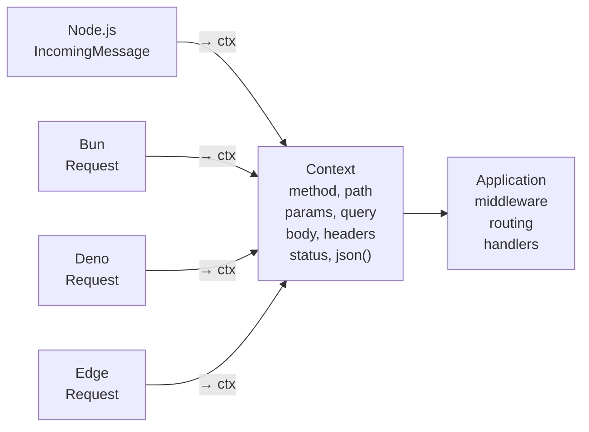

# Adapters

The **adapter** is the platform entry point. It translates HTTP (Node.js, Bun, Deno, or Worker-style fetch) into NextRush's `Context`, runs the application, and sends the response back.

Same code runs on any adapter; you choose at startup.

---

## Adapter overview

| Adapter | Platform | Entry | Install |
|---------|----------|-------|---------|
| `@nextrush/adapter-node` | Node.js ≥22 | `listen(app, port)` | `nextrush` (included) |
| `@nextrush/adapter-bun` | Bun | `listen(app, port)` or `serve(app, {…})` | `pnpm add @nextrush/adapter-bun` |
| `@nextrush/adapter-deno` | Deno | `listen(app, port)` | `pnpm add @nextrush/adapter-deno` |
| `@nextrush/adapter-edge` | Cloudflare Workers, Vercel Edge | `toFetchHandler(app)` | `pnpm add @nextrush/adapter-edge` |

---

## Node.js

```typescript
import { createApp, createRouter, listen } from 'nextrush';

const app = createApp();
const router = createRouter();

router.get('/', (ctx) => {
  ctx.json({ message: 'Hello' });
});

app.route('/', router);
listen(app, 3000);
```

`listen` starts an HTTP server on port 3000. Graceful shutdown: `await app.close()`.

---

## Bun

```typescript
import { createApp, listen } from '@nextrush/adapter-bun';

const app = createApp();
// …routes…

listen(app, 3000);
```

Or use `serve()` for more control:

```typescript
import { serve } from '@nextrush/adapter-bun';

const handler = serve(app, {
  port: 3000,
  hostname: '0.0.0.0',
  trustProxy: true,
});
```

---

## Deno

```typescript
import { createApp, listen } from '@nextrush/adapter-deno';

const app = createApp();
// …routes…

listen(app, 3000);
```

Runs under Deno's HTTP server (requires `--allow-net` permission).

---

## Edge (Workers / Vercel)

Returns a `fetch` handler for serverless deployment:

```typescript
import { createApp } from 'nextrush';
import { toFetchHandler } from '@nextrush/adapter-edge';

const app = createApp();
// …routes…

const handler = toFetchHandler(app);

export default {
  fetch: handler,
};
```

---

## Context normalization

All adapters produce the same `Context` object:



Code in middleware and handlers never checks what platform it's on; it just uses `ctx`.

---

## Proxy and X-Forwarded headers

Behind a reverse proxy (load balancer, nginx), set `proxy: true` on the app:

```typescript
const app = createApp({ proxy: true });
```

Then adapters trust `X-Forwarded-*` headers for client IP and protocol. Without `proxy: true`, those headers are ignored (safe default).

---

## Development vs production

Choose the adapter that matches your deployment target:

- **Local dev**: Node, Bun, Deno (all start fast)
- **Production on servers**: Bun or Node
- **Serverless**: Edge adapter

Code is identical across all targets; only the entry file changes.

---

## Adapter API reference

- [Node adapter](https://0xtanzim.github.io/nextRush/docs/api-reference/adapters/node)
- [Bun adapter](https://0xtanzim.github.io/nextRush/docs/api-reference/adapters/bun)
- [Deno adapter](https://0xtanzim.github.io/nextRush/docs/api-reference/adapters/deno)
- [Edge adapter](https://0xtanzim.github.io/nextRush/docs/api-reference/adapters/edge)
