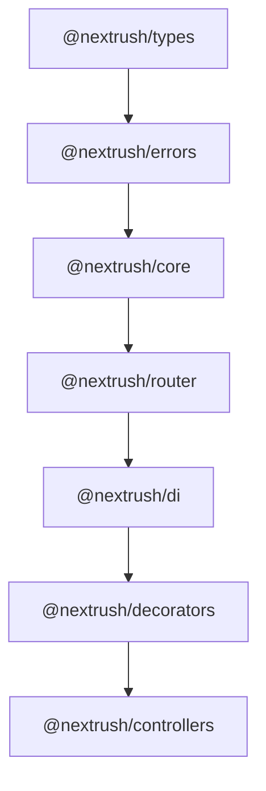
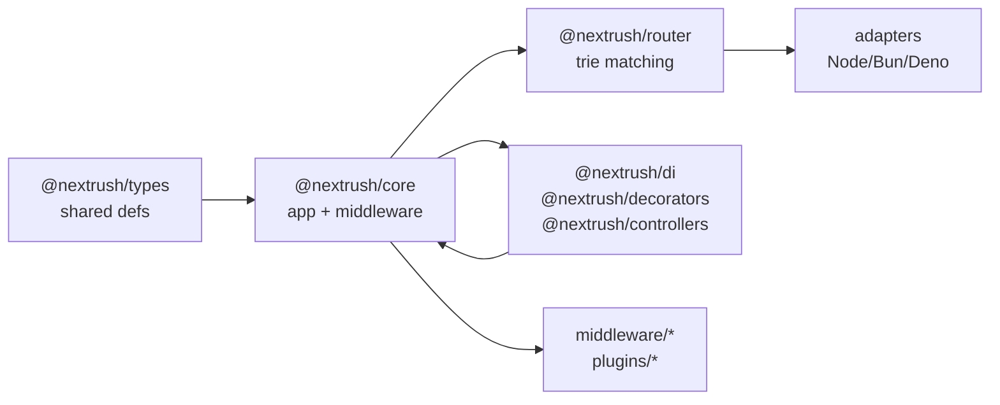

# Architecture

NextRush ships as one repo with many publishable packages. The **`nextrush`** meta package bundles what most Node apps need; everything else stays optional.

---

## Repository layout

```
nextrush/
├── packages/
│   ├── types/           @nextrush/types
│   ├── errors/          @nextrush/errors
│   ├── core/            @nextrush/core
│   ├── router/          @nextrush/router
│   ├── di/              @nextrush/di
│   ├── decorators/      @nextrush/decorators
│   ├── runtime/         @nextrush/runtime
│   ├── nextrush/        nextrush (meta)
│   ├── adapters/        node, bun, deno, edge
│   ├── middleware/      body-parser, cors, helmet, …
│   └── plugins/         controllers, logger, static, …
├── apps/
│   ├── docs/            Fumadocs site (GitHub Pages)
│   ├── benchmark/
│   └── playground/
└── draft/               Design notes / RFCs
```

---

## Dependency direction

Imports flow **down** only. No cycles.



**Rule:** No package below may import from any package above. All cross-package imports use published barrel exports. **Exception:** `import type` allows type-only imports across any boundary.

---

## Package summary

| Package | Role |
|---------|------|
| `@nextrush/types` | HTTP types, interfaces, constants |
| `@nextrush/errors` | Error hierarchy, factory functions |
| `@nextrush/core` | Application, middleware composition, plugin system |
| `@nextrush/router` | High-performance segment-trie routing |
| `@nextrush/runtime` | Multi-runtime detection and abstractions |
| `@nextrush/di` | Dependency injection (tsyringe wrapper) |
| `@nextrush/decorators` | Controller, route, param, guard decorators |
| `@nextrush/controllers` | Auto-discovery, handler building |
| `@nextrush/adapter-node` | Node.js HTTP adapter |
| `@nextrush/adapter-bun` | Bun HTTP adapter |
| `@nextrush/adapter-deno` | Deno HTTP adapter |
| `@nextrush/adapter-edge` | Edge/Workers (fetch) adapter |
| `@nextrush/middleware/*` | CORS, auth, compression, rate-limit, etc. |
| `@nextrush/plugins/*` | Logging, static files, WebSocket, etc. |
| `nextrush` | Meta package (re-exports core + Node adapter) |

---

## Package size budgets

| Package | Max LOC |
|---------|---------|
| `@nextrush/types` | 500 |
| `@nextrush/errors` | 600 |
| `@nextrush/core` | 1,500 |
| `@nextrush/router` | 1,000 |
| `@nextrush/di` | 400 |
| `@nextrush/decorators` | 800 |
| `@nextrush/controllers` | 800 |
| `@nextrush/adapter-*` | 500 |
| `@nextrush/middleware/*` | 300 |

---

## Design constraints

**Small core** — Application bootstrap, middleware composition, plugins, and route mounting live in `@nextrush/core`. No business logic, no extras.

**Zero external deps** — types, errors, core, router, adapters, and middleware stay slim. Approved exceptions: `reflect-metadata` (decorators), `tsyringe` (`@nextrush/di` only), `@clack/prompts` (`create-nextrush` only).

**Strict TypeScript** — No `any`; use `unknown` at system boundaries. Full strict mode in CI.

**Two paradigms** — Functional routing (`createRouter`) for services; class-based with DI for larger codebases. Both are first-class.

**Platform agnostic** — `@nextrush/core` has no `process`, `Deno`, or `Bun` calls. Adapters isolate platform specifics.

**Plugin architecture** — Logging, static files, WebSockets, controller discovery all ship as plugins implementing the `Plugin` interface, not core features.

---

## Integration flow



App wires together **router** + **middleware** + **plugins**. Adapters and DI are optional layers on top.

---

## Tooling

| Tool | Role |
|------|------|
| Turborepo | Build orchestration, caching |
| pnpm workspaces | Package linking |
| TypeScript 5.x | Strict compilation |
| tsup | Bundle packages |
| Vitest | Unit + integration tests (90%+ coverage target) |
| ESLint + Prettier | Style enforcement |
| Changesets | Version management, changelogs |

---

## For deeper dives

- [Core Concepts](Core-Concepts) — how Application, Context, and Middleware work
- [Request Lifecycle](Request-Lifecycle) — complete flow from HTTP to response
- [Plugins](Plugins) — extension system and lifecycle hooks
- [Performance](Performance) — optimization strategies and benchmarks
- [Contributing](Contributing) — development setup and conventions
