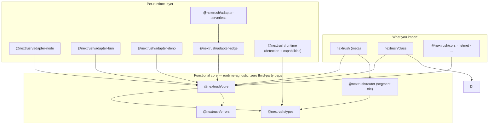

# Architecture

NextRush is a pnpm monorepo built around one invariant: **the core never touches a runtime
API.** Everything else — the layers that sit on top, the packages that wrap it, the tooling that
serves it — exists to protect and exploit that fact.

## Repository layout

```
nextrush/
├── packages/            # the framework itself (pnpm workspace)
│   ├── nextrush/        # meta-package — the import surface users see
│   ├── core/            # Application + middleware composition
│   ├── router/          # segment-trie router
│   ├── types/ errors/   # shared types, HTTP errors
│   ├── class/ di/       # optional class runtime + DI container
│   ├── adapters/        # node, bun, deno, edge, serverless, nextjs, conformance
│   ├── middleware/      # cors, helmet, body-parser, validation, …
│   ├── extensions/      # events, websocket
│   ├── runtime/ stream/ # runtime detection, response streaming
│   ├── testing/         # createTestModule().override().compile()
│   ├── dev/             # CLI: dev server, build, generators
│   └── create-nextrush/ # project scaffolder
├── apps/
│   ├── website/         # documentation site (Fumadocs)
│   ├── benchmark/       # parity-validated HTTP benchmark suite
│   └── playground/      # local experiments
└── docs/                # RFCs, ADRs, audits, migration guides
    └── openspec/        # spec-driven change governance (see below)
```

The dependency direction is strict and enforced by the package graph: **tooling depends on the
runtime, which depends on the core — never the other way around.**


```mermaid
flowchart TD
    subgraph User["What you import"]
        NEXT["nextrush (meta)"]
        CLASS["nextrush/class"]
        MID["@nextrush/cors · helmet · ..."]
    end

    subgraph Core["Functional core — runtime-agnostic, zero third-party deps"]
        CORE["@nextrush/core"]
        ROUTER["@nextrush/router (segment trie)"]
        TYPES["@nextrush/types"]
        ERR["@nextrush/errors"]
    end

    subgraph Runtime["Per-runtime layer"]
        NODE["@nextrush/adapter-node"]
        BUN["@nextrush/adapter-bun"]
        DENO["@nextrush/adapter-deno"]
        EDGE["@nextrush/adapter-edge"]
        SRV["@nextrush/adapter-serverless"]
        RT["@nextrush/runtime (detection + capabilities)"]
    end

    NEXT --> CORE
    NEXT --> ROUTER
    CLASS --> CORE
    CLASS --> DI
    MID --> CORE

    NODE --> CORE
    BUN --> CORE
    DENO --> CORE
    EDGE --> CORE
    SRV --> EDGE
    RT --> TYPES
    CORE --> TYPES
    CORE --> ERR
    ROUTER --> TYPES
```

## The layers

### Functional core (platform-agnostic)

`@nextrush/core`, `@nextrush/router`, `@nextrush/types`, and `@nextrush/errors` are pure Web
Platform code: they import **no** `node:*`, `process`, `Buffer`, `Deno`, or `Bun`. The request
path speaks only Web-standard `Request` / `Response` / `ReadableStream` / `AbortSignal` / `URL` /
`crypto.subtle`. This is what lets one application run on every runtime — see
[Adapters](Adapters). The functional core also has **zero third-party runtime dependencies**; see
[Packages](Packages).

`createApp()` composes a middleware stack into one `Application`; `createRouter()` builds a
segment-trie of routes; `app.callback()` returns the composed pipeline as a single handler. The
whole lifecycle — request in, `ctx` built, middleware run, route matched, response out — is
covered in [Request Lifecycle](Request-Lifecycle).

### The adapter seam

Each runtime gets its own package behind a typed interface (`ServerAdapter` / `FetchAdapter` in
`@nextrush/types`, enforced with `satisfies` guards). An adapter's job is narrow: build the
standard `Context` and hand it to the same `app.callback()` every other adapter uses. It never
reimplements routing or middleware. For event-driven platforms (`serverless`) a pure
`EventMapper` (`toRequest` / `fromResponse`) bridges the platform event to a Web `Request`.
`@nextrush/runtime` owns runtime detection and **capability negotiation** — behavior is decided
by what the runtime exposes, not by `if (runtime === 'node')` branches.

Cross-adapter parity is **proven**, not asserted: the conformance suite runs identical real
requests through every adapter on the real Bun, real Deno, and real `workerd` binaries.

### Class runtime (optional, on top)

`nextrush/class` is a **registrar on top of the functional core**, not a rewrite. It reads
`app.router` and `app.container` and mounts routes declared by `@Controller` classes. It exists
because declarative controllers + DI are worth it for large apps — but it stays a thin layer
that delegates every request to the same core pipeline. See
[Controllers and Decorators](Controllers-and-Decorators) and
[Dependency Injection](Dependency-Injection).

### Tooling (outside the request path)

`@nextrush/dev` (CLI: dev server, build, generators), `create-nextrush` (scaffolder), and
`apps/benchmark` all consume the framework; none of them are imported by it. The scaffolders and
CLI are deliberately decoupled so an app doesn't inherit dev tooling as a runtime dependency.

## Why this shape

- **Edge-first baseline.** Node is the "extra capabilities" case, not the reference. Because the
  core assumes only Web standards, Cloudflare Workers and Deno get first-class behavior with
  zero fork.
- **Capabilities over identity.** `capabilitiesFor()` answers "does this runtime support
  shutdown / transport abort / streams" with a flag your code can read. New runtimes adapt by
  filling the interface, not by special-casing the core.
- **The two public layers map to the two installs.** Functional-only (`pnpm add nextrush`) and
  class-based (`+ @nextrush/class`) share one core, so mixing them in one app, or upgrading from
  one to the other, changes nothing about the request path.

## Governance: RFCs, ADRs, and OpenSpec

Durable decisions are layered records, not scattered notes:

- **`docs/RFC/`** — design proposals for anything architectural (new package, public-API break,
  routing/middleware/DI/adapter changes). The RFC **precedes** implementation.
- **`docs/adr/`** — one page per ratified decision (e.g. ADR-0007 serverless adapter contract,
  ADR-0010 cross-runtime parity hardening, ADR-0021 fast-property request containers), the
  "why" behind the code.
- **`openspec/`** — spec-driven development: `openspec/specs/` holds the stable capability specs
  that describe what the framework does *now*; completed changes archive in git history.

Docs and examples stay synchronized with code by rule, and the runtime-certification matrix is
regenerated from test results so claims can't drift.

## Next steps

- [Core Concepts](Core-Concepts) — the functional API in practice
- [Adapters](Adapters) — the runtime seam in detail, per-runtime caveats
- [Packages](Packages) — the package graph as an install guide
- [Request Lifecycle](Request-Lifecycle) — what `app.callback()` runs per request
- [Middleware](Middleware) — how the composed stack is ordered and run
- Docs-site internals: https://0xtanzim.github.io/nextRush/docs/internals