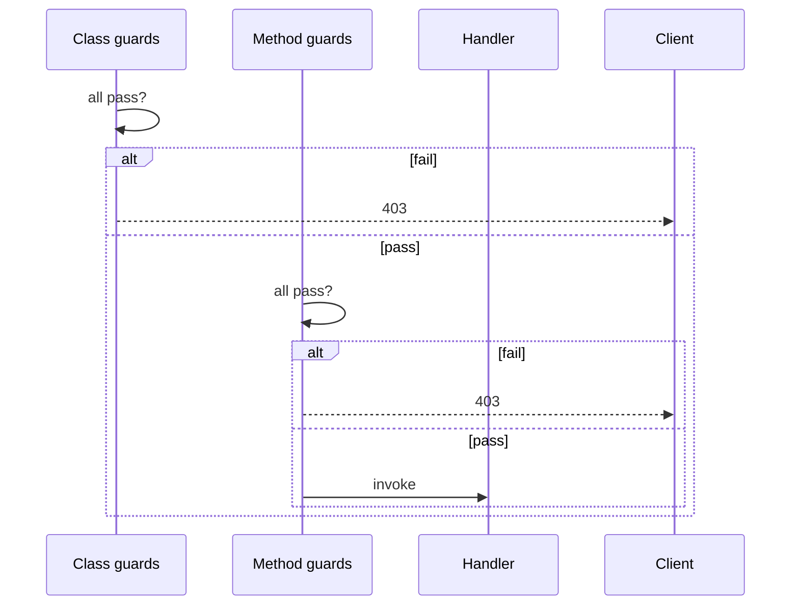

# Controllers and decorators

Class routes live across **`@nextrush/decorators`** (metadata), **`@nextrush/di`** (construction), and **`@nextrush/controllers`** (discovery + HTTP binding). `@nextrush/controllers` re-exports the pieces you typically import together.

Docs: [Class-based guide](https://0xtanzim.github.io/nextRush/docs/guides/class-based), [Guards concept](https://0xtanzim.github.io/nextRush/docs/concepts/guards).

---

## Setup

```bash
pnpm add @nextrush/di @nextrush/decorators @nextrush/controllers
```

```json
{
  "compilerOptions": {
    "experimentalDecorators": true,
    "emitDecoratorMetadata": true
  }
}
```

Entry file:

```typescript
import 'reflect-metadata';
```

---

## `@Controller(prefix)`

```typescript
import { Controller } from '@nextrush/decorators';

@Controller('/users')
class UserController {
  /* routes mount under /users */
}
```

---

## Route decorators

| Decorator | Verb |
|-----------|------|
| `@Get(path?)` | GET |
| `@Post(path?)` | POST |
| `@Put(path?)` | PUT |
| `@Patch(path?)` | PATCH |
| `@Delete(path?)` | DELETE |
| `@Head(path?)` | HEAD |
| `@Options(path?)` | OPTIONS |
| `@All(path?)` | Any |

Default path is `'/'` relative to the controller prefix.

```typescript
@Controller('/users')
class UserController {
  @Get()
  findAll() {}

  @Get('/:id')
  findOne() {}

  @Post()
  create() {}
}
```

### Metadata helpers

```typescript
@Get('/', { statusCode: 200, description: 'List users' })
findAll() {}

@Redirect('/new-path', 301)
@Get('/old-path')
legacy() {}

@SetHeader('Cache-Control', 'no-store')
@Get()
data() {}
```

---

## Parameter decorators

| Decorator | Extracts |
|-----------|----------|
| `@Body()`, `@Body('key')` | Body |
| `@Param()`, `@Param('id')` | Route params |
| `@Query()`, `@Query('page')` | Query |
| `@Header()`, `@Header('name')` | Headers |
| `@Ctx()` | Full context |
| `@Req()`, `@Res()` | Raw platform objects |

```typescript
@Get('/:id')
findOne(@Param('id') id: string, @Query('include') include?: string) {
  return { id, include };
}

@Post()
create(@Body() body: { name: string }) {
  return body;
}
```

### Transforms

```typescript
@Get('/:id')
findOne(@Param('id', { transform: Number }) id: number) {
  return { id };
}

@Post()
async create(@Body({ transform: schema.parseAsync }) body: MyType) {
  return body;
}
```

### Defaults

```typescript
@Get()
list(
  @Query('page', { required: false, defaultValue: '1' }) page: string,
) {
  return { page };
}
```

---

## Guards

Guards return boolean (or promise of boolean). Controller-level guards run before method-level guards.



### Function guard

```typescript
import type { GuardFn } from '@nextrush/decorators';

const AuthGuard: GuardFn = async (ctx) => {
  const token = ctx.get('authorization');
  if (!token) return false;
  ctx.state.user = verifyToken(token);
  return true;
};
```

### Class guard with DI

```typescript
import { Service } from '@nextrush/di';
import type { CanActivate, GuardContext } from '@nextrush/decorators';

@Service()
class RoleGuard implements CanActivate {
  constructor(private roles: RoleService) {}

  async canActivate(ctx: GuardContext): Promise<boolean> {
    return this.roles.isAdmin(ctx.state.user);
  }
}
```

### Factory-style guard

```typescript
const RequireRole = (role: string): GuardFn => async (ctx) =>
  ctx.state.user?.role === role;
```

### Apply

```typescript
@UseGuard(AuthGuard)
@Controller('/users')
class UserController {
  @Get()
  findAll() {}

  @UseGuard(RequireRole('admin'))
  @Delete('/:id')
  remove() {}
}
```

`GuardContext` exposes method, path, params, query, body, headers, `state`, and `get()` — no response helpers; guards only approve or deny.

---

## `controllersPlugin`

### Discovery

```typescript
import { controllersPlugin } from '@nextrush/controllers';

const app = createApp();
const router = createRouter();

app.plugin(
  controllersPlugin({
    router,
    root: './src',
    prefix: '/api/v1',
    debug: true,
  }),
);

app.route('/', router);
listen(app, 3000);
```

### Explicit list

```typescript
app.plugin(
  controllersPlugin({
    router,
    controllers: [UserController, PostController],
  }),
);
```

### Options

| Option | Role |
|--------|------|
| `router` | Target router |
| `root` | Scan directory |
| `prefix` | Global URL prefix |
| `controllers` | Explicit classes instead of scan |
| `include` / `exclude` | Glob filters |
| `debug` | Log discoveries |
| `container` | Custom DI container |

### Errors you may see

| Error | Meaning |
|-------|---------|
| `DiscoveryError` | Scan failed |
| `GuardRejectionError` | Guard returned false |
| `MissingParameterError` | Required decorator input missing |
| `ParameterInjectionError` | Param extraction failed |

---

## Return values

Handlers may return serializable data (JSON response) or throw `HttpError`. Return nothing when you write to `ctx` manually.

```typescript
@Get()
findAll() {
  return [{ id: 1 }];
}

@Get('/:id')
async findOne(@Param('id') id: string) {
  const row = await db.find(id);
  if (!row) throw new NotFoundError();
  return row;
}

@Get('/stream')
stream(@Ctx() ctx: Context) {
  ctx.status = 200;
  ctx.set('Content-Type', 'text/event-stream');
}
```
