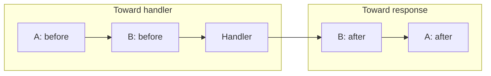

# Core concepts

`@nextrush/core` gives you three pieces: an **application** instance (middleware + routes + plugins), a **context** (`ctx`) per request, and **middleware** composition with `await next()`.

For request lifecycle detail, see [Request lifecycle](https://0xtanzim.github.io/nextRush/docs/concepts/request-lifecycle) on the docs site.

---

## Application

`createApp()` returns an `Application`: register middleware, mount routers, attach plugins, set a global error handler, then start listening.

```typescript
import { createApp, listen } from 'nextrush';

const app = createApp({
  env: 'production',
  proxy: false,
  logger: undefined,
});
```

### Register middleware

```typescript
app.use(async (ctx, next) => {
  ctx.state.startedAt = Date.now();
  await next();
});

// Then packages such as @nextrush/cors, @nextrush/helmet, @nextrush/body-parser — see Middleware wiki page
```

### Mount routers

```typescript
const users = createRouter();
users.get('/', listUsers);

app.route('/api/users', users);
```

### Plugins

```typescript
app.plugin(loggerPlugin({ level: 'info' }));
await app.plugin(databasePlugin({ uri: process.env.DATABASE_URL! }));
```

### Errors

```typescript
import { ValidationError } from '@nextrush/errors';

app.setErrorHandler((error, ctx) => {
  if (error instanceof ValidationError) {
    ctx.status = 400;
    ctx.json({ error: error.message });
    return;
  }
  ctx.status = 500;
  ctx.json({ error: 'Internal Server Error' });
});
```

### Lifecycle

After `listen()` resolves, configuration is frozen: no more `use()`, `route()`, or `plugin()` on that instance. Use `app.close()` for graceful shutdown (plugins tear down in reverse order).

---

## Context (`ctx`)

One object carries request fields and helpers to send a response.

**Input**

| Member | Role |
|--------|------|
| `method`, `path` | Verb and path |
| `params` | Route params (`:id`, wildcards) |
| `query` | Query string |
| `body` | Parsed body (after body-parser middleware) |
| `headers` | Raw header map |
| `get(name)` | Single header (case-insensitive) |
| `state` | Mutable bag for middleware |

**Output**

| Method / field | Role |
|----------------|------|
| `status` | HTTP status |
| `json(data)`, `send()`, `html()` | Body helpers |
| `redirect(url, code?)` | Redirect |
| `set(name, value)` | Response header |

**Chain**

| API | Role |
|-----|------|
| `await ctx.next()` | Enter the rest of the stack |
| `(ctx, next) => …` | Same as `await next()` |

---

## Middleware execution

Middleware runs in an **onion**: code before `next()` runs outward-to-in; code after `next()` runs on the way back.



Short-circuit by **not** calling `next()` after you set status and body (for example auth failure).

Share data with `ctx.state` so downstream middleware and handlers see the same object.

---

## Plugins

A **plugin** implements `Plugin`: usually `install(app)` registers middleware or hooks.

```typescript
import type { Plugin, Application } from 'nextrush';

const myPlugin: Plugin = {
  name: 'my-plugin',
  install(app: Application) {
    app.use(/* … */);
  },
};

app.plugin(myPlugin);
```

**`PluginWithHooks`** adds optional `extendContext`, `onRequest`, `onResponse`, `onError`, and `destroy` for instrumentation or cleanup.

Use `app.hasPlugin('name')` / `app.getPlugin('name')` when another plugin needs to detect optional peers.

---

## Where to read next

- [Middleware](Middleware) — packaged middleware and ordering
- [Routing](Routing) — router API
- [Plugins concept](https://0xtanzim.github.io/nextRush/docs/concepts/plugins) — docs site
