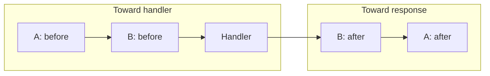

# Core concepts

`@nextrush/core` gives you three pieces: an **application** instance (middleware
+ routes + extensions), a **context** (`ctx`) per request, and **middleware**
composition with `await next()`.

For request lifecycle detail, see [Request lifecycle](https://0xtanzim.github.io/nextRush/docs/concepts/request-lifecycle) on the docs site.

---

## Application

`createApp()` returns an `Application`: register middleware, mount routers,
extend with long-lived services, set a global error handler, then start
listening.

```typescript
import { createApp, listen } from 'nextrush';

const app = createApp({
  env: 'production',
  proxy: false,
  logger: undefined,
});
```

### Register middleware

```typescript
app.use(async (ctx, next) => {
  ctx.state.startedAt = Date.now();
  await next();
});

// Then packages such as @nextrush/cors, @nextrush/helmet, @nextrush/body-parser — see Middleware wiki page
```

### Mount routers

```typescript
const users = createRouter();
users.get('/', listUsers);

app.route('/api/users', users);
```

### Extend (rare — long-lived services)

```typescript
import { events } from '@nextrush/events';

app.extend(events());
await app.ready(); // adapters call this automatically before start()

app.events.emit('server:started', {});
```

Most features are middleware, not extensions — see
**[Extending NextRush](Plugins)** for the full taxonomy (Middleware / Registrar
/ Extension) before reaching for `app.extend()`.

### Errors

```typescript
import { ValidationError } from '@nextrush/errors';

app.setErrorHandler((error, ctx) => {
  if (error instanceof ValidationError) {
    ctx.status = 400;
    ctx.json({ error: error.message });
    return;
  }
  ctx.status = 500;
  ctx.json({ error: 'Internal Server Error' });
});
```

### Lifecycle

`app.ready()` boots the application: it runs every registered extension's
`setup()` once, in registration order, then mounts the app-owned router last.
Adapters call `ready()` automatically before `start()`. After `ready()`
resolves, configuration is frozen: no more `use()`, `route()`, or `extend()` on
that instance. Use `app.close()` for graceful shutdown (extensions tear down in
reverse order).

---

## Context (`ctx`)

One object carries request fields and helpers to send a response.

**Input**

| Member | Role |
|--------|------|
| `method`, `path` | Verb and path |
| `params` | Route params (`:id`, wildcards) |
| `query` | Query string |
| `body` | Parsed body (after body-parser middleware) |
| `headers` | Raw header map |
| `get(name)` | Single header (case-insensitive) |
| `state` | Mutable bag for middleware |

**Output**

| Method / field | Role |
|----------------|------|
| `status` | HTTP status |
| `json(data)`, `send()`, `html()` | Body helpers |
| `redirect(url, code?)` | Redirect |
| `set(name, value)` | Response header |

**Chain**

| API | Role |
|-----|------|
| `await ctx.next()` | Enter the rest of the stack |
| `(ctx, next) => …` | Same as `await next()` |

---

## Middleware execution

Middleware runs in an **onion**: code before `next()` runs outward-to-in; code after `next()` runs on the way back.


```mermaid
flowchart LR
  subgraph inbound["Toward handler"]
    M1["A: before"]
    M2["B: before"]
    H["Handler"]
  end
  subgraph outbound["Toward response"]
    M2b["B: after"]
    M1b["A: after"]
  end
  M1 --> M2 --> H
  H --> M2b --> M1b
```

Short-circuit by **not** calling `next()` after you set status and body (for example auth failure).

Share data with `ctx.state` so downstream middleware and handlers see the same object.

---

## Extensions (rare, framework-author-only)

An **Extension** attaches long-lived state to the app — an event bus, a
database pool — and needs async boot or teardown. Register with
`app.extend()`; `setup()` runs at `app.ready()`.

```typescript
import type { Extension } from '@nextrush/types';

export function myExtension(): Extension {
  return {
    name: 'my-extension',
    setup(ctx) {
      ctx.decorate('myThing', someValue);
    },
    destroy() {
      /* cleanup on app.close() */
    },
  };
}
```

There is no public `app.decorate()` — only `ctx.decorate()` inside `setup()`.
Use `app.hasDecorator(name)` to check whether a name is already taken.

Most extensibility needs are covered by plain middleware (`app.use()`) or a
registrar function (a plain import + call, e.g. `registerControllers`). See
**[Extending NextRush](Plugins)** for the full taxonomy.

---

## Where to read next

- [Middleware](Middleware) — packaged middleware and ordering
- [Routing](Routing) — router API
- [Extending NextRush](Plugins) — the Middleware / Registrar / Extension taxonomy
