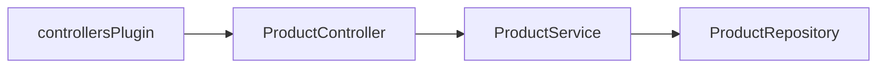

# Dependency injection

`@nextrush/di` wraps [tsyringe](https://github.com/microsoft/tsyringe) with NextRush decorators and clearer resolution errors.

API reference: [DI package](https://0xtanzim.github.io/nextRush/docs/api-reference/di/di).

---

## Setup

```bash
pnpm add @nextrush/di
```

First line of your entry module:

```typescript
import 'reflect-metadata';
```

```json
{
  "compilerOptions": {
    "experimentalDecorators": true,
    "emitDecoratorMetadata": true
  }
}
```

---

## Registration decorators

### `@Service()` / `@Repository()`

Both register a class with the container; `@Repository()` signals data-layer intent only.

```typescript
import { Service, Repository } from '@nextrush/di';

@Service()
class UserService {
  async findAll() {
    return [{ id: 1, name: 'Alice' }];
  }
}

@Repository()
class UserRepository {
  async findById(id: string) {
    return { id, name: 'Alice' };
  }
}
```

### Scopes

| Scope | Behavior |
|-------|----------|
| `singleton` | One shared instance (default) |
| `transient` | New instance each resolve |

```typescript
@Service({ scope: 'transient' })
class PerRequestLogger {}
```

---

## Constructor injection

Works when `emitDecoratorMetadata` can see concrete classes:

```typescript
@Service()
class UserService {
  constructor(private repo: UserRepository) {}

  getUsers() {
    return this.repo.findAll();
  }
}
```

---

## `@inject()` for tokens

Use when binding interfaces or symbols:

```typescript
import { inject } from '@nextrush/di';

@Service()
class AppService {
  constructor(@inject('Logger') private logger: Logger) {}
}
```

---

## `@Optional()`

```typescript
import { Optional } from '@nextrush/di';

@Service()
class NotificationService {
  constructor(@Optional() private email?: EmailClient) {}

  notify(msg: string) {
    this.email?.send(msg);
  }
}
```

---

## Container operations

```typescript
import { container, createContainer } from '@nextrush/di';

const svc = container.resolve(UserService);

container.register('CONFIG', { useValue: { apiKey: 'abc' } });
container.register('Logger', { useClass: ConsoleLogger });

const child = createContainer();
child.register('ScopedService', { useClass: ScopedService });
```

---

## Resolution failures

| Error | Typical cause |
|-------|----------------|
| `MissingDependencyError` | Class not registered |
| `CircularDependencyError` | Circular ctor graph |
| `DependencyResolutionError` | Resolution aborted |
| `TypeInferenceError` | Missing or incomplete decorator metadata |
| `InvalidProviderError` | Bad manual registration |
| `ContainerDisposedError` | Resolve after dispose |

---

## With controllers

`controllersPlugin` resolves `@Controller` classes from the same container:

```typescript
import 'reflect-metadata';
import { createApp, listen } from 'nextrush';
import { Service, Repository } from '@nextrush/di';
import { Controller, Get, controllersPlugin } from '@nextrush/controllers';

@Repository()
class ProductRepository {
  findAll() {
    return [{ id: 1 }];
  }
}

@Service()
class ProductService {
  constructor(private repo: ProductRepository) {}
  getAll() {
    return this.repo.findAll();
  }
}

@Controller('/products')
class ProductController {
  constructor(private service: ProductService) {}

  @Get()
  list() {
    return this.service.getAll();
  }
}

const app = createApp();
app.plugin(controllersPlugin({ root: './src' }));
listen(app, 3000);
```



See also [Controllers and Decorators](Controllers-and-Decorators).
