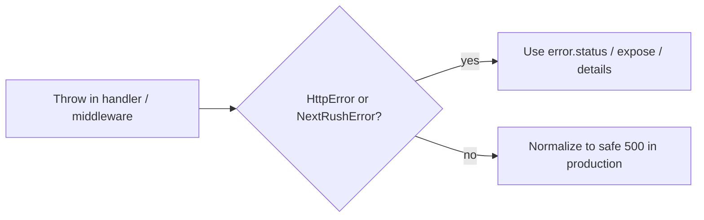

# Error handling

`@nextrush/errors` (re-exported from `nextrush`) defines `HttpError` and subclasses for common status codes, plus helpers and middleware for consistent JSON responses.

Concept page: [Error handling guide](https://0xtanzim.github.io/nextRush/docs/guides/error-handling).

---

## Model



**4xx** errors default `expose: true` so the message can reach the client when appropriate. **5xx** errors default `expose: false` so internals stay server-side unless you override deliberately.

---

## Throw from routes

```typescript
import { NotFoundError, BadRequestError } from 'nextrush';

router.get('/users/:id', async (ctx) => {
  const user = await db.findUser(ctx.params.id);
  if (!user) throw new NotFoundError('User not found');
  ctx.json(user);
});

router.post('/users', async (ctx) => {
  const { name, email } = ctx.body as { name?: string; email?: string };
  if (!name || !email) {
    throw new BadRequestError('name and email are required');
  }
  ctx.status = 201;
  ctx.json(await db.createUser({ name, email }));
});
```

---

## Options on `HttpError`

```typescript
throw new BadRequestError('Validation failed', {
  code: 'VALIDATION_ERROR',
  expose: true,
  details: { field: 'email', reason: 'invalid format' },
  cause: originalError,
});
```

---

## Factories

```typescript
import {
  notFound,
  badRequest,
  unauthorized,
  forbidden,
  createError,
  isHttpError,
} from 'nextrush';

throw notFound('User not found');
throw badRequest('Invalid input');
throw createError(418, "I'm a teapot");

if (isHttpError(err)) {
  // feed err.status / err.message to your logger
}
```

Avoid logging secrets in production; prefer structured logs behind your logger interface.

---

## Validation errors

```typescript
import { ValidationError } from '@nextrush/errors';

throw new ValidationError('Input validation failed', {
  issues: [
    { field: 'email', message: 'Invalid email format' },
    { field: 'age', message: 'Must be a number' },
  ],
});
```

Specialized subclasses include `RequiredFieldError`, `TypeMismatchError`, `PatternError`, `InvalidEmailError`, `InvalidUrlError`, and others—see package exports.

---

## Global handler

```typescript
import { ValidationError } from '@nextrush/errors';
import { UnauthorizedError } from 'nextrush';

app.setErrorHandler((error, ctx) => {
  if (error instanceof ValidationError) {
    ctx.status = 400;
    ctx.json({ error: error.message, details: error.details });
    return;
  }
  if (error instanceof UnauthorizedError) {
    ctx.status = 401;
    ctx.json({ error: 'Please log in' });
    return;
  }
  ctx.status = 500;
  ctx.json({ error: 'Something went wrong' });
});
```

### Middleware helper

```typescript
import { errorHandler } from 'nextrush';

app.use(
  errorHandler({
    includeStack: process.env.NODE_ENV !== 'production',
    handlers: new Map([[ValidationError, (err, ctx) => {
      ctx.status = 422;
      ctx.json({ errors: err.details });
    }]]),
  }),
);
```

---

## 404 after routing

```typescript
import { notFoundHandler } from 'nextrush';

app.route('/api', router);
app.use(notFoundHandler('The requested resource was not found'));
```

---

## Properties on `HttpError`

| Field | Meaning |
|-------|---------|
| `status` | HTTP status |
| `message` | Human-readable message |
| `code` | Optional machine code |
| `expose` | Send message to client |
| `details` | Arbitrary structured payload |
| `cause` | Wrapped error |

Full class list matches HTTP semantics (400–451, 500–511); source of truth is `packages/errors`.
