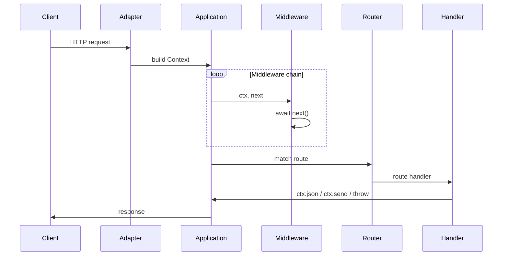
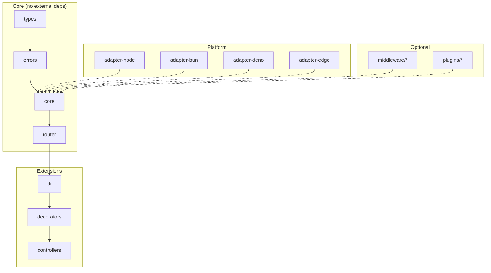

# NextRush

TypeScript-first HTTP stack built around a small core, optional packages you install only when needed, and a single **context** (`ctx`) for request input and response output. Published line: **v3** (`3.0.x` on npm).

**Full documentation** (search, guides, API reference): **[Documentation site](https://0xtanzim.github.io/nextRush/docs)**.

This wiki is a GitHub-native companion: short guides and tables for people browsing the repo. Deep dives and signatures live on the docs site.

---

## What runs when a request hits the server



Adapters (`@nextrush/adapter-*`) translate platform APIs into this pipeline; core stays free of Node-, Bun-, or Deno-specific calls.

---

## What you get

| Topic | Detail |
|-------|--------|
| Core footprint | No runtime npm deps in core/router/types/errors/adapters/middleware (exceptions: `reflect-metadata` + DI stack only where documented). |
| Composition | Koa-style async middleware with `await next()`. |
| Routing | Segment trie in `@nextrush/router`: practical path matching with a fast path for static routes. |
| Styles | Functional routes (`createRouter`) and class controllers (`@Controller` + plugins) in the same app. |
| Runtimes | Node.js (default meta package), Bun, Deno, Edge via separate adapters. |

---

## Benchmark snapshot

From `apps/benchmark` on sample hardware (see repo for methodology). Two tools available: **wrk** (C-based, primary) and **autocannon** (Node.js, fallback). Reproduce with `pnpm benchmark` inside `apps/benchmark`.

### wrk

| Framework       | Hello World | Route Params | POST JSON | Middleware Stack |
| --------------- | ----------- | ------------ | --------- | ---------------- |
| Raw Node.js     | 35,863      | 33,326       | 25,116    | 30,738           |
| Fastify         | 35,592      | 32,407       | 18,799    | 27,968           |
| **NextRush v3** | **31,311**  | **29,688**   | **18,460**| **32,377**       |
| Hono            | 26,438      | 26,586       | 10,826    | 22,179           |
| Koa             | 23,350      | 21,890       | 14,954    | 20,972           |
| Express         | 17,784      | 17,598       | 12,947    | 17,356           |

### autocannon

| Framework       | Hello World | Route Params | POST JSON | Middleware Stack |
| --------------- | ----------- | ------------ | --------- | ---------------- |
| Raw Node.js     | 36,903      | 33,936       | 24,936    | 31,471           |
| Fastify         | 34,063      | 31,095       | 18,532    | 28,744           |
| **NextRush v3** | **31,733**  | **29,534**   | **19,192**| **32,220**       |
| Hono            | 28,209      | 25,966       | 10,798    | 22,258           |
| Koa             | 23,845      | 22,421       | 15,323    | 21,125           |
| Express         | 19,496      | 18,209       | 13,063    | 17,352           |

Numbers shift with CPU and Node version; treat these as directional, not guarantees.

---

## Minimal examples

### Functional routes

```typescript
import { createApp, createRouter, listen } from 'nextrush';

const app = createApp();
const router = createRouter();

router.get('/', (ctx) => {
  ctx.json({ message: 'Hello NextRush!' });
});

router.get('/users/:id', (ctx) => {
  ctx.json({ id: ctx.params.id });
});

app.route('/', router);
listen(app, 3000);
```

### Class controllers

```typescript
import 'reflect-metadata';
import { createApp, listen } from 'nextrush';
import { Controller, Get, Param, Service, controllersPlugin } from '@nextrush/controllers';

@Service()
class UserService {
  findAll() {
    return [{ id: 1, name: 'Alice' }];
  }
}

@Controller('/users')
class UserController {
  constructor(private users: UserService) {}

  @Get()
  findAll() {
    return this.users.findAll();
  }

  @Get('/:id')
  findOne(@Param('id') id: string) {
    return { id };
  }
}

const app = createApp();
app.plugin(controllersPlugin({ root: './src' }));
listen(app, 3000);
```

---

## Wiki map

| Page | Use it for |
|------|------------|
| **Core** | |
| [Getting Started](Getting-Started) | Install, scaffold, first server |
| [Architecture](Architecture) | Monorepo structure, dependency rules, design constraints |
| [Core Concepts](Core-Concepts) | Application, Context API, middleware, plugins |
| **Routing & Patterns** | |
| [Routing](Routing) | Router API, parameters, mounting, composition |
| [Controllers and Decorators](Controllers-and-Decorators) | Class-based routes, guards, DI integration |
| [Dependency Injection](Dependency-Injection) | Service registration, scopes, container, resolution |
| **Operations** | |
| [Middleware](Middleware) | Built-in packages, stack ordering, custom middleware |
| [Error Handling](Error-Handling) | HTTP error hierarchy, handlers, factory functions |
| [Plugins](Plugins) | Plugin interface, lifecycle hooks, built-in plugins |
| **Under the hood** | |
| [Request Lifecycle](Request-Lifecycle) | How requests flow through the system, timing breakdown |
| [Adapters](Adapters) | Runtime adapters (Node, Bun, Deno, Edge), platform abstraction |
| [Performance](Performance) | Benchmarks, optimization strategies, production checklist |
| [Testing](Testing) | Test patterns, mocking, coverage targets |
| **Reference** | |
| [Packages](Packages) | Package index and export reference |
| [Contributing](Contributing) | Development setup, conventions, PR process |
| [Changelog](Changelog) | Release history and upgrade notes |

---

## Architecture at a glance



Imports flow downward; nothing below imports from above. Each layer stays focused.

---

## Links

- **[GitHub](https://github.com/0xTanzim/nextRush)** — source, issues
- **[npm — nextrush](https://www.npmjs.com/package/nextrush)** — install
- **[Documentation site](https://0xtanzim.github.io/nextRush/docs)** — API reference, guides
- **[MIT License](https://github.com/0xTanzim/nextRush/blob/main/LICENSE)**
