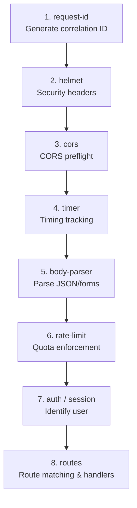

# Middleware

Middleware is `async (ctx, next) => void`. Call `await next()` to continue; skip `next()` after you send a response to stop the chain.

Full middleware guide: [Middleware concept](https://0xtanzim.github.io/nextRush/docs/concepts/middleware).

---

## Custom middleware

```typescript
import type { Middleware } from 'nextrush';

const requestTimer: Middleware = async (ctx, next) => {
  const start = Date.now();
  await next();
  ctx.set('X-Response-Duration-ms', String(Date.now() - start));
};

app.use(requestTimer);
```

### Stop the chain

```typescript
const requireAuth: Middleware = async (ctx, next) => {
  if (!ctx.get('authorization')) {
    ctx.status = 401;
    ctx.json({ error: 'Unauthorized' });
    return;
  }
  await next();
};
```

### Shared state

```typescript
const tenantMiddleware: Middleware = async (ctx, next) => {
  ctx.state.tenantId = ctx.get('x-tenant-id') ?? 'default';
  await next();
};
```

---

## Suggested stack order

Later middleware wraps earlier middleware. Suggested sequence by concern:



Security middleware (helmet, auth) runs before parsers to catch issues early. Parsers before rate-limit to charge quota fairly.

---

## Packages

Install each package you need; none ship inside `nextrush` except what you add yourself.

### `@nextrush/body-parser`

```typescript
import { json, urlencoded, text, raw, bodyParser } from '@nextrush/body-parser';

app.use(bodyParser());
app.use(json({ limit: '10mb', strict: true }));
```

### `@nextrush/cors`

```typescript
import { cors, strictCors, devCors, simpleCors } from '@nextrush/cors';

app.use(cors({ origin: ['https://app.example.com'], credentials: true }));
app.use(strictCors());
app.use(devCors());
```

### `@nextrush/helmet`

```typescript
import { helmet, apiHelmet } from '@nextrush/helmet';

app.use(helmet());
app.use(apiHelmet());
```

### `@nextrush/csrf`

Requires a stable secret key (environment).

```typescript
import { csrf } from '@nextrush/csrf';

app.use(csrf({ secret: process.env.CSRF_SECRET! }));
```

### `@nextrush/rate-limit`

```typescript
import { rateLimit } from '@nextrush/rate-limit';

app.use(rateLimit());
app.use(rateLimit({ max: 1000, window: '15m', algorithm: 'sliding-window' }));
```

### `@nextrush/cookies`

```typescript
import { cookies } from '@nextrush/cookies';

app.use(cookies());
```

### `@nextrush/compression`

```typescript
import { compression } from '@nextrush/compression';

app.use(compression({ level: 9, threshold: 512 }));
```

### `@nextrush/multipart`

```typescript
import { multipart, MemoryStorage, DiskStorage } from '@nextrush/multipart';

app.use(multipart({ storage: new MemoryStorage({ maxFileSize: 5 * 1024 * 1024 }) }));
```

### `@nextrush/request-id`

```typescript
import { requestId } from '@nextrush/request-id';

app.use(requestId());
```

### `@nextrush/timer`

```typescript
import { timer } from '@nextrush/timer';

app.use(timer());
```

---

## Errors from `@nextrush/errors`

```typescript
import { errorHandler, notFoundHandler } from 'nextrush';

app.use(errorHandler());
app.route('/api', router);
app.use(notFoundHandler());
```

`setErrorHandler` on `Application` is the alternative if you want full control without the default middleware.

---

## API reference

- [Middleware index](https://0xtanzim.github.io/nextRush/docs/api-reference/middleware)
