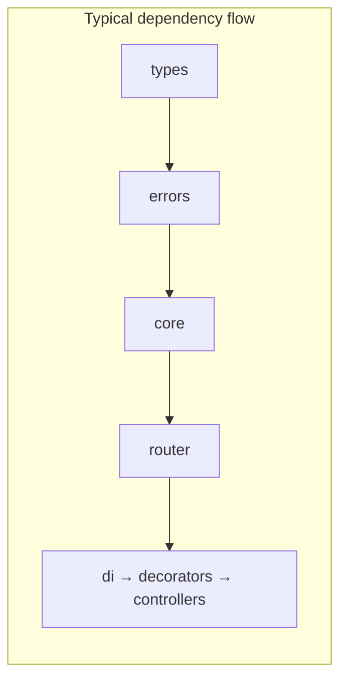

# Packages

Indexes every publishable area of the monorepo. Each package README under `packages/` lists exports and constraints; API signatures live on the **[documentation site](https://0xtanzim.github.io/nextRush/docs)**.

---

## Meta package: `nextrush`

Install: `pnpm add nextrush`

Re-exports **`@nextrush/core`**, **`@nextrush/router`**, **`@nextrush/adapter-node`**, **`@nextrush/errors`**, **`@nextrush/types`**.

```typescript
import { createApp, createRouter, listen } from 'nextrush';
import { NotFoundError, errorHandler } from 'nextrush';
import type { Context, Middleware, Plugin } from 'nextrush';
```

Class-based API (decorators, controllers plugin):

```typescript
import {
  Controller,
  Get,
  Service,
  controllersPlugin,
} from '@nextrush/controllers';
```

Or use the **`nextrush/class`** export:

```typescript
import { Controller, Get, Service, controllersPlugin } from 'nextrush/class';
```

---

## Core stack (usually via `nextrush`)

| Package | Role |
|---------|------|
| `@nextrush/types` | Shared interfaces: `Context`, `Middleware`, `Plugin`, HTTP helpers |
| `@nextrush/errors` | `HttpError` subclasses, factories, `errorHandler`, `notFoundHandler` |
| `@nextrush/core` | `createApp`, `compose`, plugin registration |
| `@nextrush/router` | `createRouter`, trie-backed matching |
| `@nextrush/runtime` | Runtime detection helpers |

Typical imports:

```typescript
import type { Context, Middleware, Plugin } from '@nextrush/types';
import { createApp, compose } from '@nextrush/core';
import { createRouter } from '@nextrush/router';
```

---

## Adapters

| Package | Target |
|---------|--------|
| `@nextrush/adapter-node` | Node.js (included through `nextrush`) |
| `@nextrush/adapter-bun` | Bun |
| `@nextrush/adapter-deno` | Deno |
| `@nextrush/adapter-edge` | Workers-style runtimes (`fetch`) |

```typescript
import { listen } from '@nextrush/adapter-node';
import { toFetchHandler } from '@nextrush/adapter-edge';

const handler = toFetchHandler(app);
export default { fetch: handler };
```

---

## Middleware (install per feature)

| Package | Purpose |
|---------|---------|
| `@nextrush/body-parser` | JSON, urlencoded, text, raw |
| `@nextrush/cors` | CORS with presets (`strictCors`, `devCors`, …) |
| `@nextrush/helmet` | Security headers |
| `@nextrush/csrf` | Double-submit cookie CSRF |
| `@nextrush/rate-limit` | Token bucket, sliding/fixed windows |
| `@nextrush/cookies` | Parse and set cookies |
| `@nextrush/compression` | gzip / deflate / brotli |
| `@nextrush/multipart` | File uploads |
| `@nextrush/request-id` | Correlation IDs |
| `@nextrush/timer` | Timing headers |

See [Middleware](Middleware) on this wiki for patterns and ordering.

---

## Plugins (application features)

| Package | Purpose |
|---------|---------|
| `@nextrush/controllers` | Controller discovery + route binding |
| `@nextrush/di` | DI container (tsyringe wrapper) |
| `@nextrush/decorators` | Route and param decorators |
| `@nextrush/logger` | Structured logging |
| `@nextrush/static` | Static files |
| `@nextrush/template` | Template engines |
| `@nextrush/websocket` | WebSocket integration |
| `@nextrush/events` | Typed app events |

---

## Developer tools

| Package | Purpose |
|---------|---------|
| `@nextrush/dev` | `nextrush dev`, `nextrush build`, generators |
| `create-nextrush` | `pnpm create nextrush` scaffolder |

```bash
pnpm add -D @nextrush/dev
nextrush dev
nextrush generate controller user
```

---

## Dependency overview



Adapters and middleware attach at the **edges** of your app: they import from lower packages only. The [Architecture](Architecture) wiki page spells out the rule in more detail.

---

## API reference on the docs site

- [Core](https://0xtanzim.github.io/nextRush/docs/api-reference/core/core)
- [Router](https://0xtanzim.github.io/nextRush/docs/api-reference/core/router)
- [Middleware index](https://0xtanzim.github.io/nextRush/docs/api-reference/middleware)
- [Plugins index](https://0xtanzim.github.io/nextRush/docs/api-reference/plugins)
- [Adapters](https://0xtanzim.github.io/nextRush/docs/api-reference/adapters)
