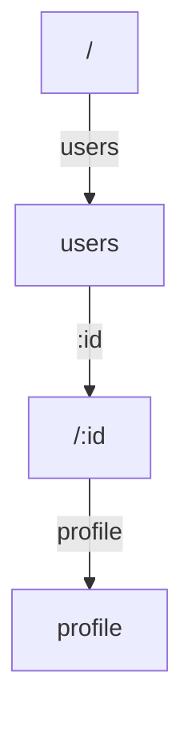
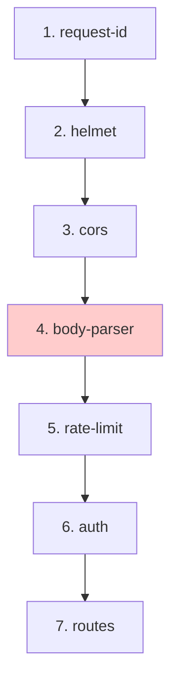

# Performance

Framework targets 30,000+ requests per second (v3 benchmarks). Achieving and maintaining that speed requires careful design.

---

## Design targets

| Metric | Target | Why |
|--------|--------|-----|
| Core bundle | <3KB | Startup time, memory footprint |
| Hello World RPS | 30,000+ | Baseline throughput |
| Middleware overhead | <1% | Keep payload size competitive |
| Router lookup | O(k) where k = path segments | Worst-case predictable |
| Static route fast path | O(1) | Common case optimized |

---

## Benchmark results

**Test setup:** Intel i5-8300H, Node.js v25.9.0. Two tools: **wrk** (C-based, process-isolated) and **autocannon** (Node.js, automatic fallback). 10s duration, 64 connections, no pipelining.

### wrk

| Framework       | Hello World | Route Params | POST JSON | Middleware Stack |
| --------------- | ----------- | ------------ | --------- | ---------------- |
| Raw Node.js     | 35,863      | 33,326       | 25,116    | 30,738           |
| Fastify         | 35,592      | 32,407       | 18,799    | 27,968           |
| **NextRush v3** | **31,311**  | **29,688**   | **18,460**| **32,377**       |
| Hono            | 26,438      | 26,586       | 10,826    | 22,179           |
| Koa             | 23,350      | 21,890       | 14,954    | 20,972           |
| Express         | 17,784      | 17,598       | 12,947    | 17,356           |

### autocannon

| Framework       | Hello World | Route Params | POST JSON | Middleware Stack |
| --------------- | ----------- | ------------ | --------- | ---------------- |
| Raw Node.js     | 36,903      | 33,936       | 24,936    | 31,471           |
| Fastify         | 34,063      | 31,095       | 18,532    | 28,744           |
| **NextRush v3** | **31,733**  | **29,534**   | **19,192**| **32,220**       |
| Hono            | 28,209      | 25,966       | 10,798    | 22,258           |
| Koa             | 23,845      | 22,421       | 15,323    | 21,125           |
| Express         | 19,496      | 18,209       | 13,063    | 17,352           |

NextRush leads on middleware-stack throughput and is competitive across all scenarios.

---

## Architectural optimizations

### 1. No closures in middleware loops

Middleware are registered once and called many times. Avoid capturing request-specific data at registration time.

```typescript
// ✅ Good: closure captures nothing per-request
const requestId: Middleware = async (ctx, next) => {
  ctx.state.id = crypto.randomUUID();
  await next();
};

// ❌ Bad: closure on db instance (wasteful if called per-request)
const db = openConnection();
const handler = (ctx) => {
  // db.query(ctx.path)
};
```

### 2. Trie routing reduces worst-case

Router uses a segment trie (`/users/123/profile` = 3 segments, O(3) lookup). No regex patterns, no deep trees.



### 3. Middleware composed once, called N times

`compose()` in core builds the middleware chain at startup, not per-request:

```typescript
// Happens once
const composed = compose([middleware1, middleware2, middleware3]);

// Happens per-request
await composed(ctx);
```

### 4. No unnecessary allocations

- Reuse context objects where possible.
- Defer JSON parsing to body-parser middleware (only parse if needed).
- Stream large responses instead of buffering.

---

## Middleware ordering (performance impact)



Heavy middleware (body-parser) after lightweight ones (headers). Validation before business logic.

---

## Memory profiling

Use Node's built-in tools:

```bash
node --prof app.js
node --prof-process isolate-*.log > profile.txt
```

Watch for:
- Unbounded array/object growth
- Event listeners without cleanup
- Timers that never fire

---

## Response streaming for large bodies

Instead of `ctx.json(largeArray)` which buffers everything:

```typescript
import { pipeline } from 'node:stream/promises';
import { createReadStream } from 'node:fs';

router.get('/large-file', async (ctx) => {
  ctx.set('Content-Type', 'application/octet-stream');
  await pipeline(
    createReadStream('/path/to/file'),
    ctx.res,
  );
});
```

---

## Benchmarking your app

```bash
# Local testing
cd apps/benchmark
pnpm install
pnpm benchmark

# Or with autocannon
npx autocannon -c 64 -d 10s http://localhost:3000/
```

Track RPS across framework versions. Regressions are often in middleware or database queries, not the router.

---

## Production checklist

- [ ] No `console.log` in hot paths — use structured logging middleware
- [ ] Body size limits set (`body-parser`)
- [ ] Rate limiting enabled
- [ ] Compression middleware active
- [ ] Error handler doesn't leak stack traces
- [ ] Database connection pooling configured
- [ ] Request timeouts set
- [ ] Memory limits observed (garbage collection tuning)

---

## Further reading

- [Node.js performance docs](https://nodejs.org/en/docs/guides/nodejs-performance-best-practices/)
- `apps/benchmark/` in the repo for repeatable tests
