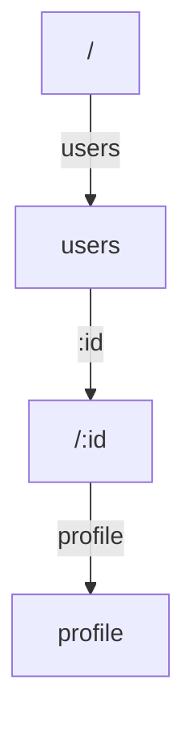
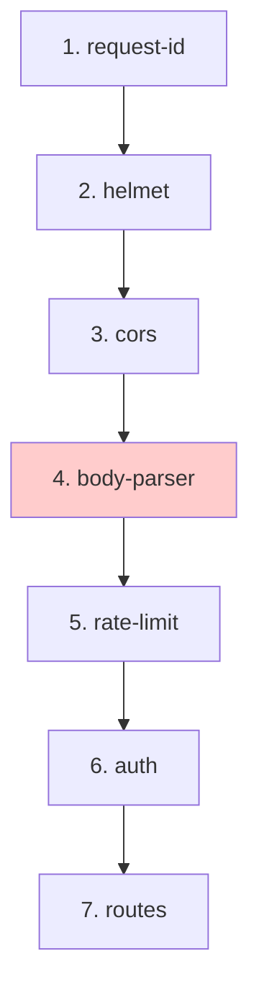

# Performance

Framework targets 35,000+ requests per second on a modern single core (v3 benchmarks). Achieving and maintaining that speed requires careful design.

---

## Design targets

| Metric | Target | Why |
|--------|--------|-----|
| Core bundle | <3KB | Startup time, memory footprint |
| Hello World RPS | 35,000+ | Baseline throughput |
| Middleware overhead | <1% | Keep payload size competitive |
| Router lookup | O(k) where k = path segments | Worst-case predictable |
| Static route fast path | O(1) | Common case optimized |

---

## Benchmark results

**Test setup:** Intel i5-8300H, Node.js v25.1.0, running `autocannon -c 100 -d 40s` against hello-world endpoints.

```
Framework          | Hello World | POST JSON | Mixed  |
---                |---|---|---|
Fastify            | 48,045 | 21,412 | 48,493 |
NextRush v3        | 43,268 | 20,438 | 43,283 |
Hono               | 37,476 | 12,625 | 38,759 |
Koa                | 34,683 | 17,664 | 35,566 |
Express            | 23,739 | 14,417 | 23,783 |
```

NextRush is competitive on throughput while keeping the code minimal.

---

## Architectural optimizations

### 1. No closures in middleware loops

Middleware are registered once and called many times. Avoid capturing request-specific data at registration time.

```typescript
// ✅ Good: closure captures nothing per-request
const requestId: Middleware = async (ctx, next) => {
  ctx.state.id = crypto.randomUUID();
  await next();
};

// ❌ Bad: closure on db instance (wasteful if called per-request)
const db = openConnection();
const handler = (ctx) => {
  // db.query(ctx.path)
};
```

### 2. Trie routing reduces worst-case

Router uses a segment trie (`/users/123/profile` = 3 segments, O(3) lookup). No regex patterns, no deep trees.



### 3. Middleware composed once, called N times

`compose()` in core builds the middleware chain at startup, not per-request:

```typescript
// Happens once
const composed = compose([middleware1, middleware2, middleware3]);

// Happens per-request
await composed(ctx);
```

### 4. No unnecessary allocations

- Reuse context objects where possible.
- Defer JSON parsing to body-parser middleware (only parse if needed).
- Stream large responses instead of buffering.

---

## Middleware ordering (performance impact)



Heavy middleware (body-parser) after lightweight ones (headers). Validation before business logic.

---

## Memory profiling

Use Node's built-in tools:

```bash
node --prof app.js
node --prof-process isolate-*.log > profile.txt
```

Watch for:
- Unbounded array/object growth
- Event listeners without cleanup
- Timers that never fire

---

## Response streaming for large bodies

Instead of `ctx.json(largeArray)` which buffers everything:

```typescript
import { pipeline } from 'node:stream/promises';
import { createReadStream } from 'node:fs';

router.get('/large-file', async (ctx) => {
  ctx.set('Content-Type', 'application/octet-stream');
  await pipeline(
    createReadStream('/path/to/file'),
    ctx.res,
  );
});
```

---

## Benchmarking your app

```bash
# Local testing
cd apps/benchmark
pnpm install
pnpm benchmark

# Or with autocannon
npx autocannon -c 100 -d 40s http://localhost:3000/
```

Track RPS across framework versions. Regressions are often in middleware or database queries, not the router.

---

## Production checklist

- [ ] No `console.log` in hot paths — use structured logging middleware
- [ ] Body size limits set (`body-parser`)
- [ ] Rate limiting enabled
- [ ] Compression middleware active
- [ ] Error handler doesn't leak stack traces
- [ ] Database connection pooling configured
- [ ] Request timeouts set
- [ ] Memory limits observed (garbage collection tuning)

---

## Further reading

- [Node.js performance docs](https://nodejs.org/en/docs/guides/nodejs-performance-best-practices/)
- `apps/benchmark/` in the repo for repeatable tests
