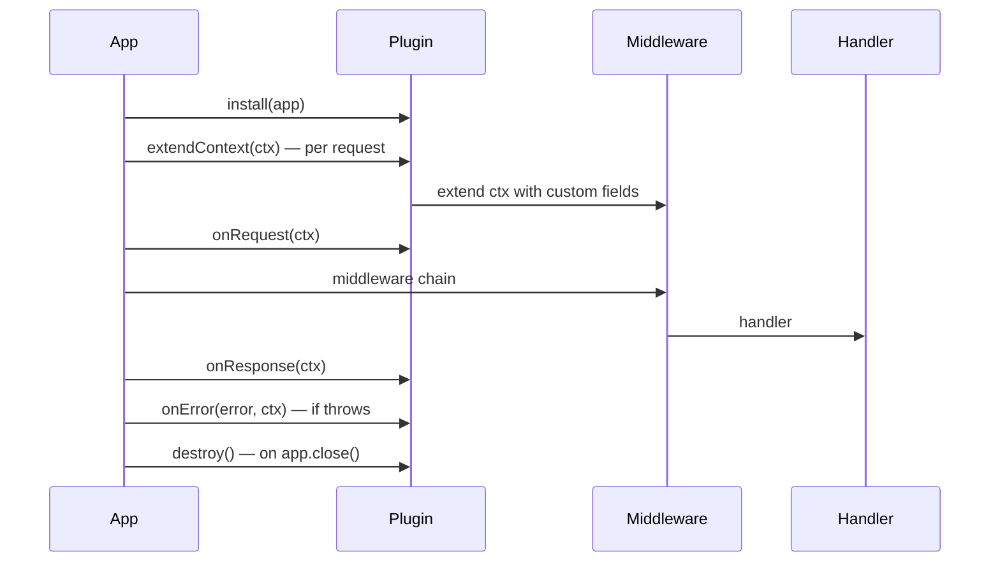
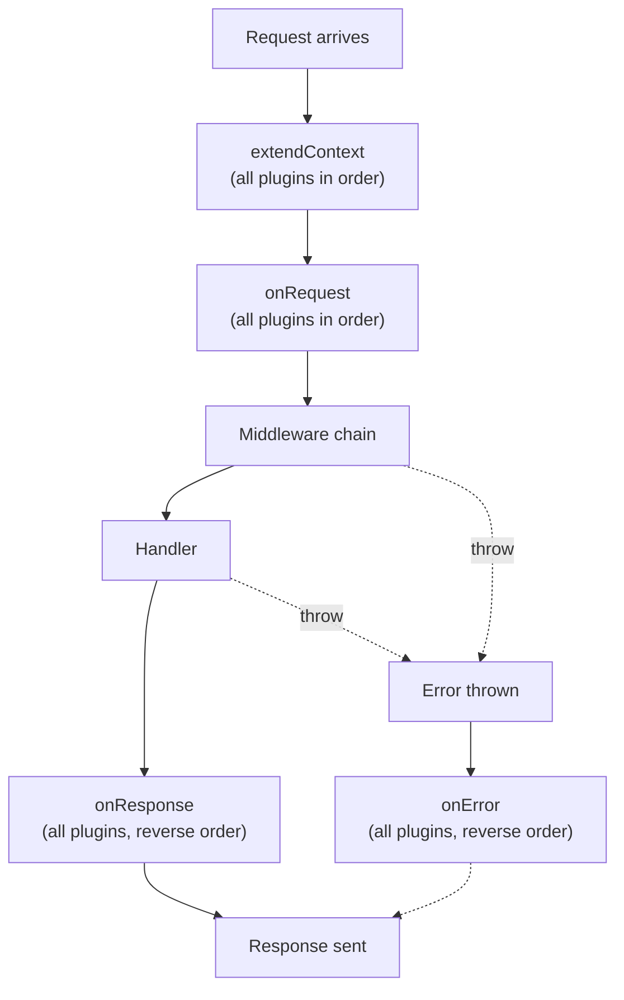

# Plugins

Plugins extend the application without changing core. They implement a lifecycle interface and hook into key moments: after app initialization, before/after request handling, and on errors.

---

## Plugin interface

```typescript
import type { Plugin, Application, Context } from 'nextrush';

const myPlugin: Plugin = {
  name: 'my-plugin',
  install(app: Application) {
    // runs once during app setup
    app.use(/* middleware */);
  },
};

app.plugin(myPlugin);
```

---

## Full lifecycle: `PluginWithHooks`



```typescript
import type { PluginWithHooks, Context } from 'nextrush';

const telemetryPlugin: PluginWithHooks = {
  name: 'telemetry',

  install(app) {
    // global middleware
    app.use(async (ctx, next) => {
      await next();
    });
  },

  extendContext(ctx: Context) {
    // add fields to every context
    ctx.state.traceId = crypto.randomUUID();
  },

  async onRequest(ctx: Context) {
    // before middleware chain
    console.log('request started', ctx.path);
  },

  async onResponse(ctx: Context) {
    // after middleware chain completes
    console.log('response status', ctx.status);
  },

  async onError(error: Error, ctx: Context) {
    // error in middleware or handler
    console.error('error caught', error.message);
  },

  destroy() {
    // cleanup when app.close() is called
  },
};

app.plugin(telemetryPlugin);
```

---

## Hook execution order



---

## Check for plugin presence

```typescript
if (app.hasPlugin('my-plugin')) {
  const plugin = app.getPlugin('my-plugin');
}
```

Use this when plugins need to integrate with optional peers (for example a logger plugin that auto-integrates with a database plugin if present).

---

## Built-in plugins

See the **[Packages](Packages)** page and **[plugins section](https://0xtanzim.github.io/nextRush/docs/api-reference/plugins)** on the docs site for the full list: controllers, logger, static files, WebSocket, template engines, events.

---

## Plugin errors

Errors thrown during `install`, hook execution, or `destroy` propagate and must be handled by the caller. No automatic recovery.

```typescript
try {
  await app.plugin(databasePlugin({ uri: '...' }));
} catch (error) {
  console.error('Plugin initialization failed:', error);
  process.exit(1);
}
```
