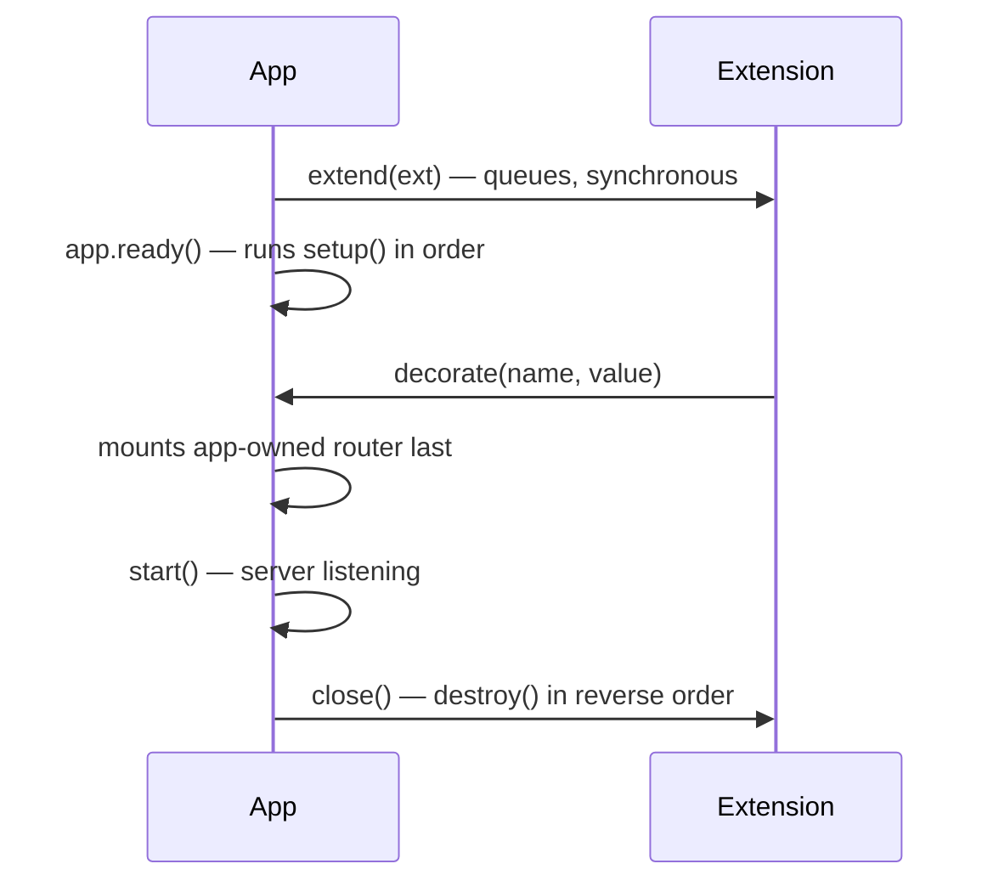

# Extending NextRush

NextRush has no `Plugin` interface and no `app.plugin()`. Every way of extending
an application falls into one of three kinds, and they are deliberately unequal
in weight: **Middleware** covers almost everything, **Registrar** covers wiring
functions, and **Extension** is a rare, advanced mechanism for framework-level
infrastructure.

---

## The three kinds

| Kind | Idiom | Frequency | Examples |
|------|-------|-----------|----------|
| Middleware | `app.use(fn())` | ~99% of application code | cors, helmet, body-parser, logger, static, rate-limit, compression, openapi, template |
| Registrar | direct import + function call (`await` if async) | ~1% — wiring functions | `registerControllers(app, opts)`, `createWebSocket()` |
| Extension | `app.extend(ext)` + `await app.ready()` | rare — framework/runtime infrastructure | `events()` |

Reach for Middleware first. Only use a Registrar when a feature needs a one-time
setup call that isn't itself part of the request pipeline. Extensions exist for
long-lived services that must attach state to the app, run async boot logic, and
tear down on shutdown — most applications never need to write one.

---

## Middleware

The default. Any package that processes requests is middleware: register it with
`app.use()`.

```typescript
import { createApp, listen } from 'nextrush';
import { cors } from '@nextrush/cors';
import { helmet } from '@nextrush/helmet';
import { openapi } from '@nextrush/openapi';

const app = createApp();

app.use(helmet());
app.use(cors());
app.use(openapi({ router: app.router!, info: { title: 'API', version: '1.0.0' } }));

listen(app, 8080);
```

See the **[Middleware](Middleware)** page for ordering rules and the full package
list.

---

## Registrar

A registrar is a plain function you import and call directly — no special
application method. Some registrars are async and must be awaited before the
server starts.

`registerControllers` is the controllers registrar: it reads `app.router` and
`app.container`, discovers `@Controller` classes, and registers their routes.

```typescript
import 'reflect-metadata';
import { createApp, listen } from 'nextrush';
import { Controller, Get, Service, registerControllers } from 'nextrush/class';

@Service()
class UserService {
  findAll() {
    return [{ id: 1, name: 'Alice' }];
  }
}

@Controller('/users')
class UserController {
  constructor(private users: UserService) {}

  @Get()
  findAll() {
    return this.users.findAll();
  }
}

const app = createApp();
await registerControllers(app, { root: './src' }); // must be awaited before serve()
await listen(app, 8080);
```

`registerControllers` throws if `app` has no router — create it with `createApp()`
from `nextrush` (batteries-included) or pass `createApp({ router })` explicitly.

`createWebSocket()` from `@nextrush/websocket` is also a registrar-style factory:
call it, then register its upgrade handler as middleware.

```typescript
import { createWebSocket } from '@nextrush/websocket';

const wss = createWebSocket();
app.use(wss.upgrade());
```

---

## Extension

Extensions are for long-lived services — an event bus, a database pool, a
websocket attach — that need to decorate the app with state, run async setup,
and clean up on shutdown. Register with `app.extend()`, which queues the
extension; `setup()` runs later, at `app.ready()`, in registration order.

```typescript
import { createApp, listen } from 'nextrush';
import { events } from '@nextrush/events';

const app = createApp();

app.extend(events());
await listen(app, 8080); // adapters call app.ready() for you

app.events.emit('server:started', {});
```

If you call `app.ready()` yourself (outside an adapter), do it before serving
traffic:

```typescript
app.extend(events());
await app.ready();
app.events.emit('server:started', {});
```

After `ready()` resolves, the app configuration is frozen — `use()`, `route()`,
and `extend()` all throw if called again.

### Writing an Extension

```typescript
import type { Extension } from '@nextrush/types';

export function myExtension(): Extension {
  return {
    name: 'my-extension',
    needs: [], // optional: other extension names that must register first
    setup(ctx) {
      // ctx: { app, logger, env, name, container?, decorate }
      ctx.decorate('myThing', someValue); // throws on name collision
      ctx.app.use(someMiddleware);
    },
    destroy() {
      // cleanup, runs in reverse registration order at app.close()
    },
  };
}
```

Give consumers a typed surface by augmenting `Application`:

```typescript
declare module '@nextrush/core' {
  interface Application {
    myThing: Foo;
  }
}
```

There is no public `app.decorate()` — only `ctx.decorate()` inside `setup()`.
Use `app.hasDecorator(name)` for a read-only check of whether a name is already
taken.

`needs` declares extensions that must already be registered before this one;
`app.ready()` asserts the order and throws if a dependency is missing. There is
no auto-sorting — registration order is the order.

---

## Lifecycle


```mermaid
sequenceDiagram
  participant App
  participant Ext as Extension
  App->>Ext: extend(ext) — queues, synchronous
  App->>App: app.ready() — runs setup() in order
  Ext->>App: decorate(name, value)
  App->>App: mounts app-owned router last
  App->>App: start() — server listening
  App->>Ext: close() — destroy() in reverse order
```

- `app.extend(ext)` is synchronous and chainable; it only queues the extension.
- `await app.ready()` runs every queued extension's `setup()`, in registration
  order, then mounts the app-owned router last so extension-registered
  middleware runs before routes. Adapters call `ready()` automatically before
  `start()`.
- `await app.close()` runs `destroy()` on every extension with one, in reverse
  registration order, using `Promise.allSettled` — one failing `destroy()` never
  strands the others.

---

## Errors

Errors thrown during `setup()`, `destroy()`, or a registrar call propagate and
must be handled by the caller. There is no automatic recovery.

```typescript
try {
  await registerControllers(app, { root: './src' });
} catch (error) {
  console.error('Controller registration failed:', error);
  process.exit(1);
}
```

---

## Built-in packages

See the **[Packages](Packages)** page for the full list of middleware,
registrars, and the one built-in Extension (`@nextrush/events`).

## Where to read next

- [Core Concepts](Core-Concepts) — Application, Context, middleware composition
- [Controllers and Decorators](Controllers-and-Decorators) — the controllers registrar in depth
- [Packages](Packages) — every package and how it's consumed
