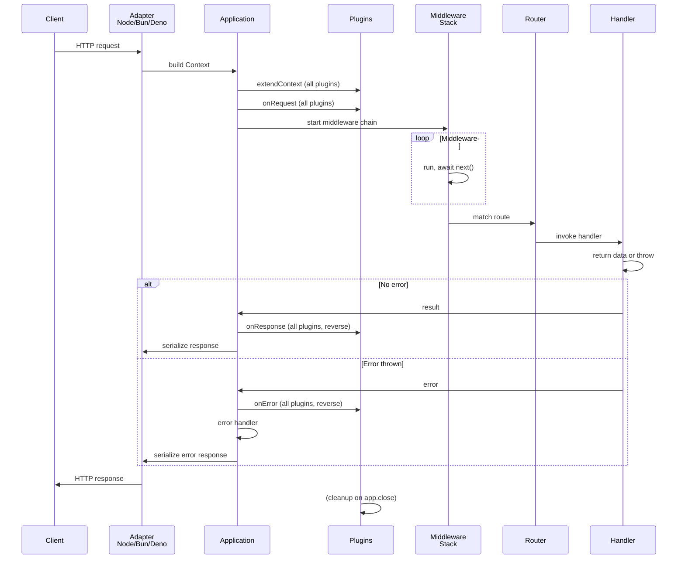
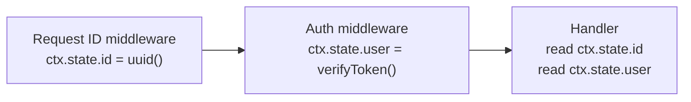
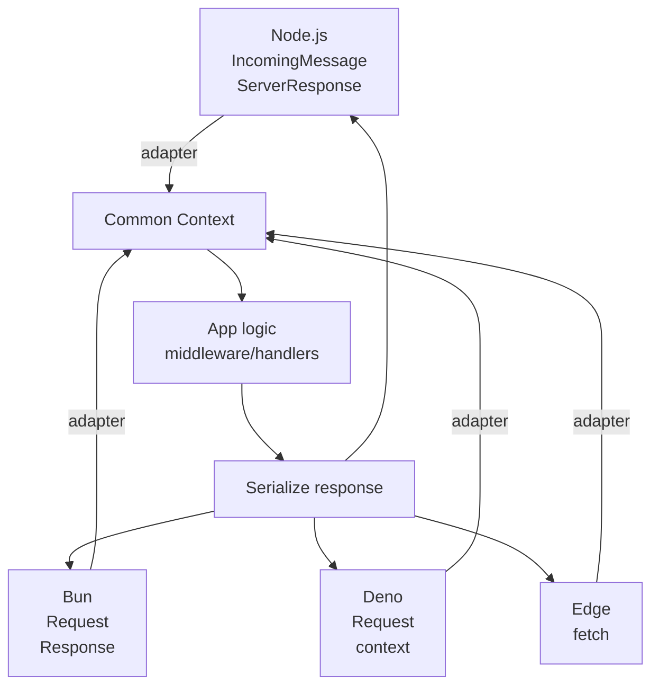

# Request lifecycle

How a request flows through NextRush from entry point to response, showing where plugins and middleware run.

---

## Complete flow

---

## Timing breakdown

| Stage | Time | Responsibility |
|-------|------|-----------------|
| **Adapter creates Context** | < 1ms | Platform → normalized context |
| **extendContext hooks** | < 1ms | Plugins add custom fields |
| **onRequest hooks** | < 1ms | Plugins observe/mutate pre-chain |
| **Middleware chain** | 1–100ms | Auth, parsing, logging, validation |
| **Route matching** | < 0.1ms | Router lookup (trie) |
| **Handler** | 5–5000ms | Business logic, DB calls, etc. |
| **onResponse / onError** | < 1ms | Plugins observe/cleanup |
| **Serialize & send** | < 1ms | Platform adapts, sends wire bytes |

Handler execution dominates; middleware contributes when parsing large bodies or calling external services.

---

## Error propagation

Errors from middleware or handlers bubble up, skipping remaining middleware:

If middleware throws before calling `next()`, downstream never runs. If middleware throws in cleanup (after `next()`), it still propagates.

---

## State sharing

`ctx.state` is the pass-through for middleware ↔ middleware and middleware ↔ handler:

Never rely on closure or global state; **use** `ctx.state`.

---

## Multi-runtime adaptation

Each platform (Node, Bun, Deno, Edge) has an adapter that translates HTTP into this common pipeline. Core application code stays platform-agnostic:

You choose the adapter at entry (`listen`, `serve`, `toFetchHandler`); the rest of your code works unchanged.

---

## Performance considerations

- **Middleware order matters** — security/auth before body parsing before routes.
- **Short middleware** — defer heavy work to handlers; middleware runs on every request.
- **Avoid closures in hot paths** — declare middleware outside request loop.
- **Use streaming** for large responses — don't buffer in `ctx.json()`.

See the docs **[Performance](https://0xtanzim.github.io/nextRush/docs/performance)** section for tuning strategies.
