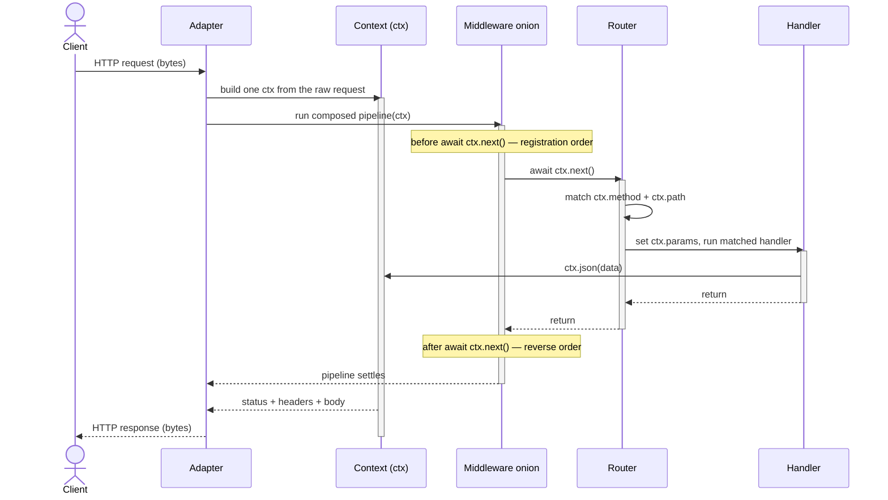

# Request Lifecycle

A request arrives as bytes on a socket and leaves as bytes on a socket. Everything your application does happens between those two moments. If that space is a mystery — why is `ctx.body` empty, why did auth not run — every bug becomes a hunt through unfamiliar territory. Learn the path once and you always know where to look.

## The whole journey


```mermaid
sequenceDiagram
    actor Client
    participant Adapter
    participant ctx as Context (ctx)
    participant MW as Middleware onion
    participant Router
    participant Handler
    Client->>Adapter: HTTP request (bytes)
    Adapter->>ctx: build one ctx from the raw request
    activate ctx
    Adapter->>MW: run composed pipeline(ctx)
    activate MW
    Note over MW: before await ctx.next() — registration order
    MW->>Router: await ctx.next()
    activate Router
    Router->>Router: match ctx.method + ctx.path
    Router->>Handler: set ctx.params, run matched handler
    activate Handler
    Handler->>ctx: ctx.json(data)
    Handler-->>Router: return
    deactivate Handler
    Router-->>MW: return
    deactivate Router
    Note over MW: after await ctx.next() — reverse order
    MW-->>Adapter: pipeline settles
    deactivate MW
    ctx-->>Adapter: status + headers + body
    Adapter-->>Client: HTTP response (bytes)
    deactivate ctx
```

One request travels **inward through a stack of layers to reach your handler, then back out through the same layers in reverse**. The adapter is the doorway on both sides. Between the doorways sits the middleware onion — and the router is its innermost layer, the one that finally chooses and runs your handler.

## The five stages, with timings

For a `GET /users/42` on a server at `localhost:8080`:

1. **Adapter builds the context** (~0–1 ms after the socket accepts the connection). The platform hands the adapter a native request; it constructs one `ctx`, parsing method, path, query, headers, and client IP up front. *Your code sees the same `ctx` on every runtime — the adapter's job differs, the object does not.* See [Adapters](Adapters).

2. **The composed pipeline runs** (~1 ms). `createApp` folded every registered middleware into one function with `compose()` at startup — the same function serves every request. Each layer runs its "before" code, calls `await ctx.next()`, and — after everything downstream settles — runs its "after" code. That inversion is the [onion model](Middleware).

3. **The router matches, as the innermost middleware** (~2 ms). When you register routes, the app-owned router is mounted *last*, so it sees a fully assembled `ctx`. Static routes resolve with an O(1) lookup; dynamic ones walk the [segment trie](Routing) in O(k) per path segment. On a match it sets `ctx.params` and runs your handler; on a miss it sets `ctx.status = 404` and calls `next()`, letting a later `notFoundHandler()` (or the adapter fallback) answer.

4. **The handler produces the response** (~3 ms). It reads `ctx.params` / `ctx.body` and sends through `ctx.json()`, `ctx.send()`, or `ctx.html()`. It writes through `ctx`; it never returns a `Response` object. NextRush picks `Content-Type`, sets `Content-Length`, and suppresses the body for `HEAD`/`204`/`304`.

5. **The adapter writes the response** (~3–4 ms). After the onion unwinds, the adapter serializes `ctx` back into a native response. If nothing in the pipeline responded, it sends a fallback: `{ "error": "Not Found" }` for a 404, otherwise an empty body with the current `ctx.status`.

## What this means in practice

```ts
import { createApp, createRouter, listen } from 'nextrush';

const app = createApp();

// Outermost layer: runs first on the way in, last on the way out.
app.use(async (ctx) => {
  const start = Date.now();
  await ctx.next();                                       // hand control down the pipeline
  ctx.set('X-Response-Time', `${Date.now() - start}ms`);  // runs after the handler responds
});

const router = createRouter();
router.get('/users/:id', (ctx) => {
  ctx.json({ id: ctx.params.id }); // the handler, reached last, builds the response
});

app.route('/', router);
await listen(app, 8080);
```

The timing header is set *after* `await ctx.next()` — possible only because the middleware wraps everything downstream and finishes last. Trace it by logging on both sides:

```ts
app.use(async (ctx) => {
  console.log(`→ ${ctx.method} ${ctx.path}`); // in: before next()
  await ctx.next();                            // in: router matches, handler runs
  console.log(`← ${ctx.status}`);              // out: response built, after next()
});
// GET /hello logs: → GET /hello   then   ← 200
```

## Errors land in one boundary

A throw at any stage skips the rest and lands in one place — the `try/catch` wrapped around the whole pipeline:

```ts
import { createApp, createRouter, listen, NotFoundError } from 'nextrush';

const app = createApp();
const router = createRouter();

router.get('/users/:id', (ctx) => {
  throw new NotFoundError(`No user ${ctx.params.id}`);
});

app.route('/', router);
await listen(app, 8080);
```

There is a single error path: your custom handler if you set one, otherwise the built-in handler mapping the error to a safe response. In production that means a generic body — internal paths and stack traces never reach the client. See [Error-Handling](Error-Handling).

## Putting a concern in the right stage

Where a concern belongs follows directly from where it needs to run:

- **Empty `ctx.body`?** The body is parsed by a body-parser middleware, which must run *before* the handler. No parser registered means `ctx.body` is `undefined`.
- **A guard that never fires?** A security layer only guards what runs inside it. Registered after the router, it sits outside the handler entirely — a silent security hole.
- **A header that "won't set"?** Setting a header after the response was already sent is too late — check whether an earlier stage responded first.
- **A generic 500 in production?** The error boundary caught a throw. Look at the stage that threw, not the response.

**Rules of thumb:** put cross-cutting work in [middleware](Middleware) (before your routes), route-specific work in the handler, and response shaping for failures in the [error boundary](Error-Handling). For how this pipeline is built and dispatched under the hood, see [Architecture](Architecture).
