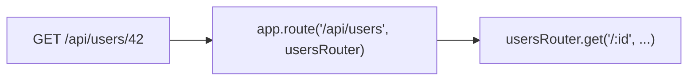

# Routing

`@nextrush/router` implements a segment-based trie: work grows with path depth, and static routes get a dedicated fast path. Full API: [Router](https://0xtanzim.github.io/nextRush/docs/api-reference/core/router).

---

## Create a router

```typescript
import { createRouter } from 'nextrush';

const router = createRouter({
  prefix: '/api',
  caseSensitive: false,
  strict: false,
});
```

---

## HTTP verbs

```typescript
router.get('/users', (ctx) => ctx.json([]));
router.post('/users', (ctx) => ctx.json({ created: true }));
router.put('/users/:id', (ctx) => ctx.json({ updated: ctx.params.id }));
router.patch('/users/:id', (ctx) => ctx.json({ patched: ctx.params.id }));
router.delete('/users/:id', (ctx) => {
  ctx.status = 204;
});
router.head('/users', (ctx) => {
  ctx.status = 200;
});
router.options('/users', (ctx) => {
  ctx.status = 200;
});
router.all('/health', (ctx) => ctx.json({ status: 'ok' }));
router.route('GET', '/users', (ctx) => ctx.json([]));
```

---

## Parameters and wildcards

```typescript
router.get('/users/:id', (ctx) => {
  ctx.json({ id: ctx.params.id });
});

router.get('/orgs/:orgId/repos/:repoId', (ctx) => {
  const { orgId, repoId } = ctx.params;
  ctx.json({ orgId, repoId });
});

router.get('/files/*', (ctx) => {
  ctx.json({ path: ctx.params['*'] });
});
```

---

## Inline middleware

Handlers can be preceded by middleware run only on that route:

```typescript
const auth = async (ctx, next) => {
  if (!ctx.get('authorization')) {
    ctx.status = 401;
    ctx.json({ error: 'Unauthorized' });
    return;
  }
  await next();
};

router.get('/protected', auth, (ctx) => {
  ctx.json({ data: 'ok' });
});
```

---

## Redirects

```typescript
router.redirect('/old-path', '/new-path');
router.redirect('/temp', '/destination', 302);
router.redirect('/users/:id', '/profiles/:id');
```

---

## Mounting routers on the app

`app.route(prefix, router)` strips the prefix before the router matches, so nested routers declare paths relative to their mount point.



```typescript
const users = createRouter();
users.get('/', (ctx) => ctx.json([]));
users.get('/:id', (ctx) => ctx.json({ id: ctx.params.id }));

const posts = createRouter();
posts.get('/', (ctx) => ctx.json([]));

const app = createApp();
app.route('/api/users', users);
app.route('/api/posts', posts);
listen(app, 3000);
```

Alternative: `app.use(router.routes())` wires the router as middleware without the same prefix handling — prefer `app.route()` when you want prefix stripping.

---

## Options

| Option | Default | Meaning |
|--------|---------|---------|
| `prefix` | `''` | Prepended to every route on this router |
| `caseSensitive` | `false` | Match path case |
| `strict` | `false` | Trailing slash significance |

---

## Query string

Always on `ctx.query`, independent of routing:

```typescript
router.get('/search', (ctx) => {
  const q = ctx.query.q as string | undefined;
  const page = ctx.query.page ?? '1';
  ctx.json({ q, page: Number(page) });
});
```

---

## Conflicts

Registering the same method + path twice throws at startup:

```text
Route conflict: GET /users is already registered
```

---

## Concepts on the docs site

- [Routing concept](https://0xtanzim.github.io/nextRush/docs/concepts/routing)
- [Custom middleware](https://0xtanzim.github.io/nextRush/docs/guides/custom-middleware)
